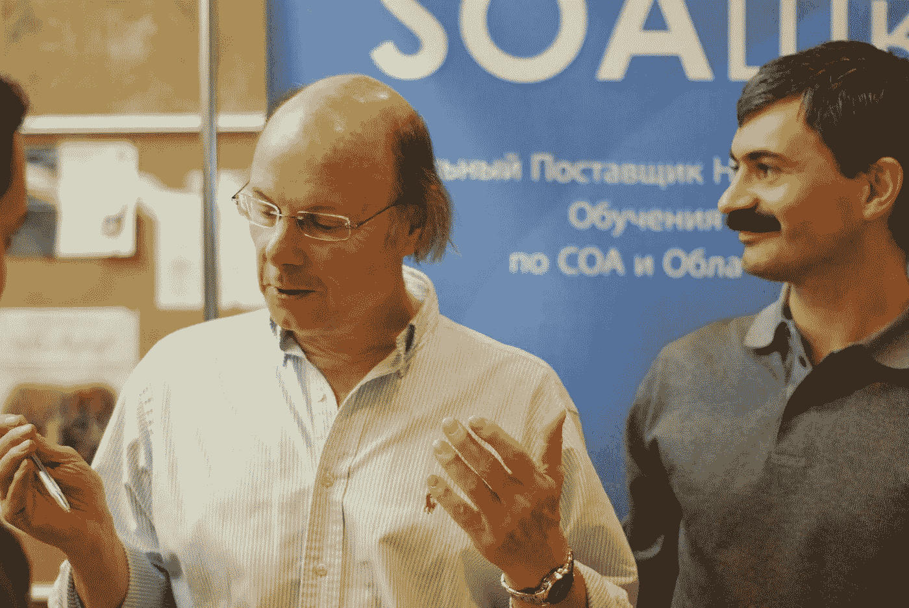

# 比雅尼·斯特劳斯特鲁普谈漂亮的代码是什么样的

> 原文：<https://blog.devgenius.io/bjarne-stroustrup-on-what-beautifully-written-code-looks-like-c68adb53c740?source=collection_archive---------0----------------------->

## C++的创始人关于你必须了解的软件工艺

通过[维基共享资源](https://commons.wikimedia.org/wiki/File:Bjarne-stroustrup.jpg)

对于那些不熟悉比雅尼·斯特劳斯特鲁普天才的人来说，他是 C++的创始人，c++是一种将面向对象概念应用于 C 编程语言的方法。我认为这就是建立他在软件工程领域的权威和影响力所需要说的一切，所以无论他要说什么，我相信我们都会从密切关注它中受益。

** *文章基础下篇链接采访***

在最近[对著名人工智能研究科学家和播客 Lex Fridman 的采访](https://www.youtube.com/watch?v=uTxRF5ag27A&ab_channel=LexFridman)中，Bjarne 简要回顾了是什么让代码看起来漂亮和制作精良。

他所说的可以直接应用于你的编程方式，以及你应该如何像大师级的艺术家或雕塑家对待他们的艺术一样，在精神上对待软件的工艺。

# 理解优美代码的框架

程序员不明白的是，用一种编程语言你能做什么和你应该做什么之间有着天文数字的差别。

仅仅因为你能以一种蛮力的方式完成一个编程任务，并不意味着那种方法就是你应该采用的方法。

存在着其他高智商和有影响力的程序员设定的规则，作为好代码看起来像什么的基础。这些规则中的许多可以在著名的编程书籍中找到，例如 Robert C. Martin 的[*Clean Code:A Handbook of Agile Software craftness*](https://www.amazon.com/Clean-Code-Handbook-Software-Craftsmanship/dp/0132350882/ref=sr_1_1?crid=MPLIVGD3IVSO&dchild=1&keywords=clean+code+a+handbook+of+agile+software+craftsmanship&qid=1599253265&sprefix=Clean+code+%2Caps%2C266&sr=8-1)——对于任何初露头角的程序员来说，这都是立即提高代码整洁度的好地方。我也在我以前写的文章中回顾了这些规则，比如下面这些。

 [## 效率极低的程序员的 9 个习惯

### 要成为一名伟大的程序员，你必须首先明白什么不该做

medium.com](https://medium.com/better-programming/the-9-habits-of-highly-ineffective-programmers-b6bd817617b0)  [## 你的代码应该读起来像一本书

### 这让所有相关人员的生活变得更加轻松

medium.com](https://medium.com/better-programming/your-code-should-read-like-a-book-873b27f71fe5) 

Bjarne 提到，这些规则对于编写良好的代码来说是必不可少的，但并不是编写漂亮代码的决定性因素。好代码的框架和规则所完成的是提供一种方法，使你的代码可读，可伸缩，并且不容易出错。

这些规则回答了一个好的程序员在最基本的层面上做什么的问题，即你应该在哪里以及如何使用一门语言。

正如他所说，**你可以遵循雕刻大理石的所有规则，但这并不意味着如果你遵循所有这些规则，你就能创作出与米开朗基罗等人相媲美的杰作。**

至少你有工具可以帮助你达到目的，只要让自己意识到这些工具，并有效地、深思熟虑地使用它们，也许你会给自己带来达到目的所需的优势。

# 通往天才级软件工艺的道路

你必须明白，为了开发出非常清晰、易懂、优化和受欢迎的东西，你必须付出很多努力。

编写干净的代码不是一件容易的事情，因为它需要你在你的方法中非常深思熟虑和有意识，老实说，当你编写代码和努力实现困难的设计概念时，你可能会意识到你还没有完全达到专业或干净的程度。

这没关系。真正成长到可以编写漂亮代码的地步需要时间。

Bjarne 建议，你能做的是有意地、积极地追求代码的工艺。

想想看，历史上最著名的艺术家和音乐家都是高超的工匠。**他们可以很好地利用他们的工具有效地表达他们的想法。**

不管你有什么工具可以支配，或者你有什么样的经验，如果你不能有效地利用这些，那么你可能不会产生你希望的结果。

问题是，漂亮的代码不是你可以凭一时冲动或有意生成的。是的，你可以朝着这个目标努力，并采取措施为你写的东西提供优秀代码的品质，但是这还不够。

你认为列奥纳多·达芬奇开始画《最后的晚餐》和《蒙娜丽莎》会被认为是反映他的创作天才的杰作吗？

不，Bjarne 说真正好的代码需要的是**创造性灵感的火花。这是一个顿悟的时刻，它将通过一种虚幻的心流状态来驱动代码的制作。**

# 记住，凌乱比美丽更容易辨认

不要因为你可能写不出人类见过的最漂亮的代码而气馁，但是你能做的是满怀热情地朝着那个目标前进，希望有一天你能实现那个神话般的理想。

识别又丑又臭的代码比识别美丽的代码要容易得多，这应该会吓到你。这应该会吓到你，因为你不想在别人审查你的代码时显得无能或缺乏实际努力。它应该让你感到害怕，因为看着它表明你可能创造了一些经不起时间考验的东西，或者为潜在的错误发出警报。

**丑陋很容易被识别，因为混乱中总有一些共同点**、**而不是美丽。**

Bjarne 说，漂亮的代码更难识别，因为它的美丽源于创新和独特的工艺，你必须努力思考才能欣赏和看到它。美是可识别的独一无二的，并且缺乏使坏代码变坏的一致性。美在于巧妙的思想和艺术。

话虽如此，做个匠人吧。做一个艺术家。目标是干净、周到地编码。作为一名程序员，你的目标应该是创建在它所提供的解决方案中完全独一无二的代码。以其简单的方法解决复杂问题的代码。架构如此完美的代码会让工匠和那些与代码结果交互的人充满感激。