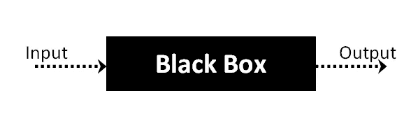

# 黑箱测试

> 原文：<https://blog.devgenius.io/black-box-testing-93373a6ec6f3?source=collection_archive---------3----------------------->

**黑盒测试**是[软件测试](https://en.wikipedia.org/wiki/Software_testing)的一种方法，它检查应用程序的功能，而不检查其内部结构或工作方式。这种测试方法实际上可以应用于软件测试的各个层面:[单元](https://medium.com/dev-genius/unit-testing-11d96f9420a8)、[集成](https://medium.com/dev-genius/integration-testing-61647c75b1ec)、[系统](https://en.wikipedia.org/wiki/System_testing)和[验收](https://medium.com/dev-genius/user-acceptance-testing-764165e36f7a)。它有时被称为基于规范的测试。

**黑盒测试**是一种软件测试方法，在不了解内部代码结构、实现细节和内部路径的情况下测试软件应用的功能。黑盒测试主要关注软件应用程序的输入和输出，它完全基于软件需求和规范。它也被称为行为测试。

上面的黑盒可以是你想要测试的任何软件系统。比如 Windows 这样的操作系统，Google 这样的网站，Oracle 这样的数据库，甚至你自己定制的应用。在黑盒测试中，你可以通过关注输入和输出来测试这些应用程序，而不需要知道它们的内部代码实现。

# 如何做黑盒测试

以下是执行任何类型的黑盒测试的一般步骤。

首先，检查系统的要求和规格。

*   测试人员选择有效的输入(肯定的测试场景)来检查 SUT 是否正确地处理它们。此外，选择一些无效输入(负测试场景)来验证 SUT 能够检测到它们。
*   测试仪确定所有这些输入的预期输出。
*   软件测试人员用选择的输入构建测试用例。
*   测试用例被执行。
*   软件测试人员将实际输出与预期输出进行比较。
*   修复并重新测试任何缺陷。

# 黑盒测试的类型

黑盒测试可以应用于三种主要类型的测试:功能测试、非功能测试和回归测试。

## 功能测试

黑盒测试可以测试被测软件的特定功能或特性。例如，检查可以使用正确的用户凭证登录，而不能使用错误的凭证登录。

功能测试可以关注软件最关键的方面(冒烟测试/健全性测试)，关注关键组件之间的集成(集成测试)，或者关注整个系统(系统测试)。

## 非功能测试

除了特性和功能之外，黑盒测试还可以检查软件的其他方面。非功能性测试不检查软件是否能执行一个特定的动作，而是检查它如何执行这个动作。

黑盒测试可以发现软件是否:

*   易于用户使用和理解
*   预期或峰值负载下的性能
*   与相关设备、屏幕尺寸、浏览器或操作系统兼容
*   暴露于安全漏洞或常见的安全威胁

## 回归测试

黑盒测试可以用来检查一个新版本的软件从一个版本到下一个版本是否表现出退化或者功能退化。回归测试可以应用于软件的功能方面(例如，一个特定的特性在新版本中不再像预期的那样工作)，或者非功能方面(例如，一个执行得很好的操作在新版本中非常慢)。

# 测试程序

一般来说，不需要应用程序代码、内部结构和编程知识的具体知识。测试人员知道软件应该做什么，但是不知道 T2 是如何做的。例如，测试人员知道一个特定的输入返回一个确定的、不变的输出，但是不知道*软件最初是如何产生输出的。*

# 详细阐述

这种方法如此命名是因为软件程序，在测试人员的眼里，就像一个黑匣子；看不见里面的东西。此方法尝试查找以下类别的错误:

*   功能不正确或缺失
*   接口错误
*   数据结构或外部数据库访问中的错误
*   行为或性能错误
*   初始化和终止错误

# 测试案例

测试用例是围绕规范和需求构建的，即应用程序应该做什么。测试用例通常来源于软件的外部描述，包括规格、需求和设计参数。虽然所使用的测试本质上主要是*功能性*，但是也可以使用*非功能性*测试。测试设计者选择有效和无效的输入，并确定正确的输出，通常借助于[测试预言](https://en.wikipedia.org/wiki/Test_oracle)或已知良好的先前结果，而不了解测试对象的内部结构。

# 黑盒测试技术

## 等价划分

测试人员可以将可能的输入划分成组或“分区”，并且只测试每组中的一个示例输入。例如，如果一个系统需要用户的出生日期，并为 18 岁以下的所有用户提供相同的响应，而为 18 岁以上的用户提供不同的响应，那么测试人员只需检查“18 岁以下”组中的一个出生日期和“18 岁以上”组中的一个日期就足够了。

## 边界值分析

测试人员可以识别出一个系统在一个特定的边界值附近有一个特殊的响应。例如，特定字段可能只接受 0 到 99 之间的值。测试人员可以关注边界值(-1、0、99 和 100)，看看系统是否正确地接受和拒绝输入。

## 决策表测试

许多系统基于一组条件提供输出。然后，测试人员可以识别条件组合的“规则”，识别每个规则的结果，并为每个规则设计一个测试用例。

例如，健康保险公司可能会根据被保险人的年龄(40 岁以下或 40 岁以上)以及是否吸烟提供不同的保费。这会生成一个包含四个规则和最多四个结果的决策表—下面是一个包含三个可能结果的示例。

# 优势

*   测试是从用户的角度进行的，有助于暴露规格中的差异。
*   测试人员不需要知道编程语言或者软件是如何实现的。
*   测试可以由一个独立于开发人员的机构进行，允许客观的观点和避免开发人员的偏见。
*   一旦规范完成，就可以设计测试用例。

# 不足之处

*   只有少量可能的输入可以被测试，并且许多程序路径将不被测试。
*   没有清晰的规范，测试用例将很难设计，这是许多项目的情况。
*   如果软件设计者/开发者已经运行了测试用例，那么测试可能是多余的。
*   想知道为什么占卜者在预言事件时会闭上眼睛吗？黑盒测试几乎也是如此。

黑盒测试与白盒测试形成对比。阅读黑盒测试和白盒测试的区别。

# 黑盒测试和软件开发生命周期(SDLC)

黑盒测试有其自己的生命周期，称为软件测试生命周期( [STLC](https://www.guru99.com/software-testing-life-cycle.html) )，它与软件工程的软件开发生命周期的每个阶段相关。

*   **需求** —这是 SDLC 的初始阶段，在这个阶段，需求被收集。软件测试人员也参与这个阶段。
*   **测试计划&分析** — [确定适用于项目的测试类型](https://medium.com/@stackedqa/to-put-it-in-the-best-way-possible-from-reading-the-concept-of-the-testing-which-is-manual-496aaeb8a39b)。创建[测试计划](https://medium.com/dev-genius/what-is-test-plan-a99bc81b2ee4)，确定可能的项目风险及其缓解措施。
*   **设计** —在这个阶段，测试用例/脚本是在软件需求文档的基础上创建的
*   **测试执行**——在这个阶段，执行准备好的测试用例。如果有的话，错误被修复并重新测试。

# 砍

在[渗透测试](https://en.wikipedia.org/wiki/Penetration_test)中，黑盒测试指的是一种[道德黑客](https://en.wikipedia.org/wiki/White_hat_(computer_security))不知道系统被攻击的方法。黑盒渗透测试的目标是模拟外部黑客或网络战攻击。

对于刚刚推出新网站或新应用程序的公司，我们为您提供了优惠。如果您不确定您的网站/移动应用程序是否安全无故障，我们可以为您提供免费的基础设施测试审计。

所以你可以知道你的应用程序是否让你的潜在客户感到沮丧。要申请免费审计，请前往 [StackedQA 网站](https://www.stackedqa.com/)或发送电子邮件至 [StackedQA](http://stackedqa@gmail.com/) 并填写您的主题为“免费测试审计”

在社交媒体上关注我们:

[脸书](https://www.facebook.com/StackedQA)，[推特](https://twitter.com/stackedqa)， [Instagram](https://instagram.com/stackedqa) ，&Linkedin