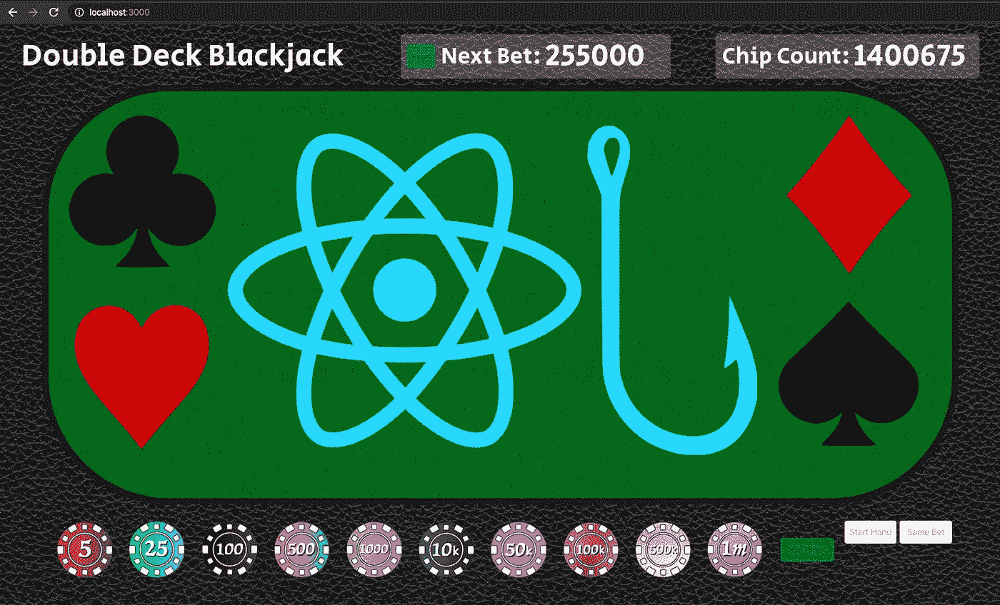
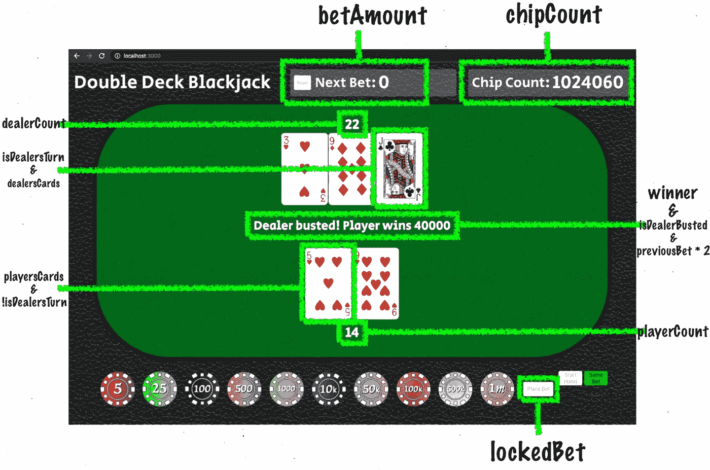
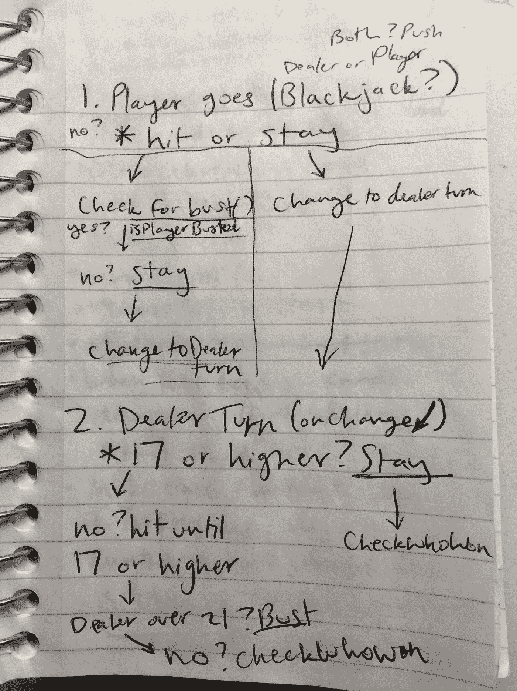

# 21 点游戏逻辑基础——用 React 挂钩构建

> 原文：<https://blog.devgenius.io/blackjack-game-logic-basics-built-with-react-hooks-8e7e41fbbb87?source=collection_archive---------1----------------------->



在我决定转行到科技行业并成为一名软件工程师之前，我在一家赌场做了几年的桌上游戏经销商。我学习了所有主要的游戏，包括骰子、轮盘、二十一点、百家乐，也学习了“嘉年华”风格的游戏。

自然，我觉得这将是一个很好的练习，通过如何开发一个 21 点游戏。这篇文章将会分解一些需要的游戏逻辑，但不会深入任何关于样式的细节。我最熟悉 React，最近开始在我的状态管理和生命周期方法类型事件中使用钩子，所以我用它来构建我的应用程序。

在我们开始之前，对于那些不太了解 21 点的人，这里有一个游戏进展的解释:

*—面牌以 10 计值，号牌以其号码计值，a 可计值为 1 或 11。*

1.  玩家和发牌者都收到两张牌，发牌者保留一张面朝下的牌，直到轮到他/她。
2.  庄家检查黑杰克，这是一张与任何 10 点(21 点)的牌配对的 a。如果庄家有 21 点，玩家立即失去他们的赌注，除非他们也有 21 点。如果玩家有 21 点，而庄家没有，赌注的支付比例是 3 比 2，也就是说，是原始赌注的 1.5 倍。(如果庄家亮出王牌，赌场里还有一种叫做 21 点保险的东西，但我没有把它包括在我的应用程序里)
3.  如果没有 21 点，现在轮到玩家了，他们可以选择击打、停留或加倍。击中，意思是在他们的手上加一张牌，停留，意思是保持他们当前的分数，加倍，意思是在原始赌注加倍后只拿一张牌。实际的 21 点游戏也允许玩家拆分成对的牌，比如两张 8，但是我还没有添加这个功能。
4.  玩家的目标是获得 21 分，尽管在某些情况下，最好保持在一个较低的数字，不要冒“破产”(超过 21 分)的风险，因为庄家也有机会破产，这使玩家也赢了。
5.  如果玩家没有破产，而是留了下来，庄家会露出他们面朝下的牌，并在必要时抽牌，直到他们获得 17 分或更高的分数(大多数赌场在他们有所谓的“软 17”时会让他们的庄家击中，这意味着他们手中有一张仍然可以被估价为 1 或 11 的 a，我的应用程序保留在所有 17 分上)。
6.  如果庄家数超过 21，他/她立即支付给每个还有一手牌的玩家，但如果庄家没有破产，他/她将玩家数与庄家数进行比较，并相应地支付或接受赌注。
7.  玩家在失败后获得奖金/下一注，循环再次开始。

差不多就是这样——尽可能短，尽可能接近 21 分而不超过，希望庄家要么得分比你低，要么破产。

直入主题，我认为开始的一个好方法是创建一个数组，将每张扑克牌作为一个字符串，并将其设置为一个变量。

```
const deckOfCards = [
  "A of Hearts", "2 of Hearts", "3 of Hearts", 
  "4 of Hearts", "5 of Hearts", "6 of Hearts", 
  "7 of Hearts", "8 of Hearts", "9 of Hearts",
  "10 of Hearts", "J of Hearts", "Q of Hearts",
  "K of Hearts",
  "A of Clubs", "2 of Clubs", "3 of Clubs",
  "4 of Clubs", "5 of Clubs", "6 of Clubs", 
  "7 of Clubs", "8 of Clubs", "9 of Clubs", 
  "10 of Clubs", "J of Clubs", "Q of Clubs",
  "K of Clubs", 
  "A of Diamonds", "2 of Diamonds", "3 of Diamonds", 
  "4 of Diamonds", "5 of Diamonds", "6 of Diamonds", 
  "7 of Diamonds", "8 of Diamonds", "9 of Diamonds", 
  "10 of Diamonds", "J of Diamonds", "Q of Diamonds", 
  "K of Diamonds", 
  "A of Spades", "2 of Spades", "3 of Spades", 
  "4 of Spades","5 of Spades", "6 of Spades", 
  "7 of Spades", "8 of Spades", "9 of Spades", 
  "10 of Spades", "J of Spades", "Q of Spades", 
  "K of Spades"
]
```

我使用 regex 查找字符串开头的字母或数字，并确定 cards 值，并使用 switch 语句来确定哪个图像应该用于哪个卡。

接下来，我把它做成两副牌，用我导入的‘lodash’洗牌函数洗牌，在这里找到了。

```
const twoDecks = [...deckOfCards, ...deckOfCards]const shuffledDoubleDeck = shuffle(twoDecks)
```

现在我有了一个由两副牌组成的混洗阵列，下一步是在一手牌开始时将混洗的牌设置为状态变量。下面是我在应用程序中使用的所有状态，请记住，我的 21 点应用程序允许玩家下注，然后击中，翻倍或停留，但为了简单起见，目前不包括分裂的能力。当某些事件发生和条件满足时，许多逻辑在于改变这些状态变量，但是稍后会有更多关于这一点以及如何使用`useEffect`钩子的内容。要了解更多关于 React 钩子的知识，你可以在这里访问文档。

```
const [randomizedDecks, setRandomizedDecks] = useState([])
const [chipCount, setChipCount] = useState(1000)
const [betAmount, setBetAmount] = useState(0)
const [lockedBet, setLockedBet] = useState(0)
const [previousBet, setPreviousBet] = useState(0)
const [dealersCards, setDealersCards] = useState([])
const [dealerCount, setDealerCount] = useState(0)
const [playersCards, setPlayersCards] = useState([])
const [playerCount, setPlayerCount] = useState(0)
const [isBlackjack, setIsBlackJack] = useState(false)
const [isPlayerBusted, setIsPlayerBusted] = useState(false)
const [didDouble, setDidDouble] = useState(false)
const [isDealersTurn, setIsDealersTurn] = useState(false)
const [isDealerBusted, setIsDealerBusted] = useState(false)
const [isHandComplete, setIsHandComplete] = useState(true)
const [winner, setWinner] = useState("")
```

对于那些只想快速复习一下`useState`钩子的人来说，析构变量的左边有两个部分；第一部分是变量名，我们将调用它来检索我们的当前状态，第二部分是一个函数，它允许我们将状态设置为一个新值(惯例是使用变量名并添加前缀“set-”)。在右边，我们调用`useState`钩子，并传递给它一个我们选择的参数，它将成为默认值。

现在，我将简要回顾每一行状态，并概述它在应用程序中的用法(我试图尽可能按顺序排列):

> `const [randomizedDecks, setRandomizedDecks] = useState([])`
> 这是每手新牌开始时洗牌后的一副“牌”存放的地方。
> 
> `const [chipCount, setChipCount] = useState(1000)`
> 玩家的运行筹码总数，默认设置为 1000，我觉得这是一个合适的起始金额。
> 
> `const [betAmount, setBetAmount] = useState(0)`
> 
> `const [lockedBet, setLockedBet] = useState(0)`
> 当玩家点击“下注”按钮时，会将`lockedBet`的金额放在桌上，这手牌现在可以开始了。
> 
> `const [previousBet, setPreviousBet] = useState(0)`
> 一旦这手牌开始，`lockedBet`就变成了`previousBet`，它允许我创建一个“相同下注”按钮，让玩家可以毫不费力地开始下一手牌，下注金额完全相同。
> 
> `const [dealersCards, setDealersCards] = useState([])`
> 一个包含所有庄家牌的数组，最初从两张开始，如前所述，其中一张牌面朝下。
> 
> `const [dealerCount, setDealerCount] = useState(0)`
> 与`dealersCards`相关的分数，在逻辑中很多地方用来决定谁是赢家，如果有的话。
> 
> 包含所有玩家牌的数组，从两张开始。
> 
> `const [playerCount, setPlayerCount] = useState(0)`
> 与`playersCards`相关的分数，在逻辑中很多地方用来决定谁是赢家，如果有的话。
> 
> `const [isBlackjack, setIsBlackJack] = useState(false)`
> 存储一个布尔值，记录是否发生了 21 点。与`winner`状态结合使用，确定哪手牌是 21 点。
> 
> `const [isPlayerBusted, setIsPlayerBusted] = useState(false)`
> 如果没有 21 点，我们将存储这个布尔值，以跟踪玩家是否在击中时被终结。
> 
> `const [didDouble, setDidDouble] = useState(false)`
> 
> 这个布尔值通知我们的应用程序该轮到谁了。在玩家停留或加倍时，我们调用此函数将`isDealersTurn`设置为`true`，表示不再轮到玩家，然后庄家根据需要抽牌。
> 
> `const [isDealerBusted, setIsDealerBusted] = useState(false)`
> 如果庄家得分超过 21，那么我们将`isDealerBusted`设置为`true`以表示庄家输了，最终触发支付序列。
> 
> `const [isHandComplete, setIsHandComplete] = useState(true)`
> 一个通用的总括，如果一个获胜的事件发生，例如，21 点，或破坏，我们将这个布尔值翻转到`true`，这样我们就可以用它来知道我们应该显示哪些元素，以及何时显示。

我不会遍历所有的逻辑，因为我在这里链接了 Github 库,供任何想要查看它的人使用(有点乱，但它是有效的！)，但是我想至少展示一个我使用过的`useEffect`钩子的例子，因为它们对于基于特定的状态变化使某些事件发生是必不可少的——我将在下面更详细地解释。

首先，让我们来看看我现在拥有的一个工作版本，看看一些不同的状态是如何影响应用程序的。我制作这个图表是为了帮助更好地理解每个状态是如何被使用的，但是并没有突出显示所有用来制作它的状态。这是一手牌完成后您可能会看到的屏幕:



`useEffect`挂钩的使用非常类似于`componentDidMount`或`componentDidUpdate`生命周期方法，在很多情况下，我将它用作事件链。下面是一个我可能使用的空 useEffect 钩子的例子:

```
useEffect(() => {
  // logic and conditions go here
}, [dealerCount]) 
```

注意我是如何在数组中使用`dealerCount`作为第二个参数的？我把它放在一个数组中，因为如果我们愿意，我们可以把一个以上的状态放进去。通过把`dealerCount`放在那里，我是说当`dealerCount`状态改变时，我想运行一些我指定的代码。一个因和“果”。

这是直接取自我的应用程序的完整示例:

```
useEffect(() => { if(dealerCount > 21) {
    setIsDealerBusted(true)
    setWinner("player")
    setIsHandComplete(true)
  } if(dealerCount >= 17 && dealerCount < 22 && isDealersTurn) {
    if(dealerCount > playerCount) {
      setWinner("dealer")
      setIsHandComplete(true)
    } if(dealerCount < playerCount && !isPlayerBusted) {
      setWinner("player")
      setIsHandComplete(true)
    } if(dealerCount === playerCount && !isPlayerBusted) {
      setWinner("push")
      setIsHandComplete(true)
    }
  } if(dealerCount < 17 && isDealersTurn && !isPlayerBusted) {
    setTimeout(() => {
      dealerHitAgain()
    }, 500);
  }
}, [dealerCount])
```

我认为这读起来很容易，因为州名被完全写了出来！我个人不像其他人那样介意更长的变量名，因为这有助于我理解逻辑，并回到几个月前编写的代码，轻松地从我停止的地方继续。

这个`useEffect`通过设置其他变量的状态启动了另一个事件链，这些变量在我用来控制游戏流程的其他`useEffect`钩子中指定。

举个例子，如果`dealerCount`小于`17`，并且它`isDealersTurn`*玩家还没有被终结，我用了一个`setTimeout`函数来延迟`dealerHitAgain()`辅助函数，你猜对了，这个函数是给庄家的手增加一张牌，因此，“庄家又打了”。*

*那么这有什么用呢？因为它增加了一张卡，`dealerCount`也再次改变，我们又回到了同一个`useEffect`里面。除了这一次，庄家的分数到了`23`，这符合不同的条件，并将`isDealerBusted`设置为`true`，同时将赢家设置为`“player”`，将`isHandComplete`设置为`true`，因为这手牌正式结束，庄家被终结，玩家获胜。*

*既然玩家已经赢了，那么当设置了`winner`时，我创建的`useEffect`就生效了。这个链条还在继续，有许多条件要求制造 21 点，并且创建这个应用程序的很多工作都是反复试验，看看什么会以什么方式运行(开始时扯头发)。然而，最终，修修补补是不可取的，我认为是我在这个记事本上写的东西帮助我的大脑将所有这些联系在一起:*

**

*我知道有点潦草的笔迹！*

*一旦我有了一个明确的攻击计划，创造了所有必要的状态，并一点一点地遵循我的计划，一切都变得更加顺利。如果事情以我没有预料到的方式进行，因为我有一个更有条理的方法，我能够更快地解决问题，用我的逻辑解决任何问题。*

*这是我过去 4 天工作的高潮！*

**请在设置上选择高清！SD 是默认的，至少对我来说是这样，但它并不公平！**

*高滚子状态，上了 18800，不算太差！*

*有趣的是，一点额外的计划能让你走这么远。我希望这篇文章对你有价值，并帮助你了解更多关于 21 点逻辑或 21 点的一般知识，并且理想情况下，你也了解了如何使用 React Hooks 构建这样的应用程序。感谢您的宝贵时间，祝您黑客生涯愉快！*