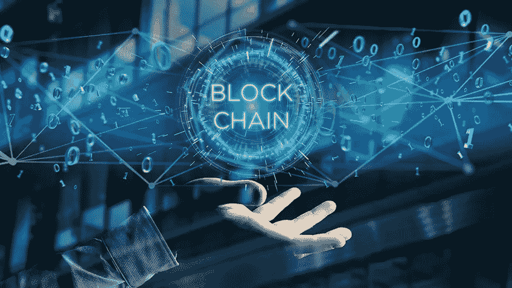

# 区块链:推动全球价值

> 原文：<https://blog.devgenius.io/blockchain-driving-values-around-the-world-1ce598419e29?source=collection_archive---------39----------------------->

用最简单的话来说，区块链可以被描述为一种保存交易记录的[数据结构](http://entradasoft.com/blogs/blockchain-driving-values-around-the-world)，同时确保安全性、透明度和[去中心化](http://entradasoft.com/blogs/blockchain-driving-values-around-the-world)。你也可以把它想象成一条链或以块的形式存储的记录，它们不受任何单一权威机构的控制。

区块链是中本聪在 2008 年提出的技术概念。在 Satoshi 之前，Stuart Haber 和 W.Scott Stornetta 在 1991 年描述了它。为了确保比特币交易的透明度，人们发现了这项技术。中本聪开发了比特币，这是一种加密货币。所有加密货币的工作原理都是区块链。

全文:[http://entradasoft . com/blogs/区块链-驾驶-价值观-环游世界](http://entradasoft.com/blogs/blockchain-driving-values-around-the-world)

在区块链，没有中心体。它基于点对点技术工作。所有通过区块链连接的机构都独立工作。他们不需要向任何人汇报。它就像一个账本，向所有成员提供数据访问。因此，它提供了 100%的透明度。

区块链中没有管理真实性的中央机构[。区块链最棒的地方是没人能破解这个。因为有数十万台计算机组成的网络，这些计算机相互连接。如果一个人在任何一台计算机上做了更改，它会自动反映在其链的所有计算机上。这导致了完全透明。全公司的数据由公司全体员工平等共享。这整个区块链依赖于一种技术或实践，在这种技术或实践中，双方的协议以这样一种方式得到保证，即任何其他人都不能侵入或改变/变更。](http://entradasoft.com/blogs/blockchain-driving-values-around-the-world)

如果有人想要添加任何信息，那么他/她不能在现有的块中添加信息，而是必须创建新的块。

每个积木都有一个代码，将它与另一个积木连接起来。以便信息流变得稳定。要添加新的块，必须复制前一个块的代码。代码非常独特，非常冗长。而且很难记忆。由于代码的难度，区块链能够维护区块链的[隐私。](http://entradasoft.com/blogs/blockchain-driving-values-around-the-world)

在区块链，数据存储在多台计算机上。因此，很难改变它。如果有人想修改数据。那么这个人需要 50%以上的人确认。如果 50%的人确认了这一改变，那么它将在所有系统中自动改变。这就是在一台区块链中连接的所有计算机中共享数据的方式。

现在，让我们来看看区块链在各个领域的应用。

**银行业:**区块链提供了安全转移数字资产的方式。

**房地产:**区块链可以处理产权交易，促进交易，甚至通过节省买家的时间和金钱来获得房产。

**法律服务:**区块链可以通过智能合同扰乱法律实践。这些是用代码写的具有法律约束力的合同，因此它们可以完全按照预期执行。

**在线投票:**区块链公司正在探索投票系统数字化的潜力。这将消除黑客通过加密区块链操纵网上投票的恐惧，并创造一个透明和安全的连接。

**股票交易:**纳斯达克证券交易所宣布，它将考虑把区块链作为一种记录交易和数据的手段。如果这个系统成功，它可能会在世界各地的交易所复制。

**食品生产:**通过跟踪从农场到购物中心的食品，简化了我们生产食品的方式。

**航空公司:**为了加快乘客的身份识别和处理速度，它可以减少排队时间，护照可以存储在账本上。

**个人识别**:可以将 ID 上的所有来源合并成一个开放的来源和安全记录。这将减少文件被盗和丢失，同时保护个人的隐私权。

**音乐权利:**区块链被用于改善数字流媒体时代制片人和音乐人的权利，因为每当一首歌曲在网上播放时，分类账可以促进艺术质量的即时传播。

*   医疗保健行业:它正在探索区块链在数据交换方面的潜力，以提高透明度和患者隐私。

阅读更多:[http://entradasoft . com/blogs/区块链-驾驶-价值观-环游世界](http://entradasoft.com/blogs/blockchain-driving-values-around-the-world)