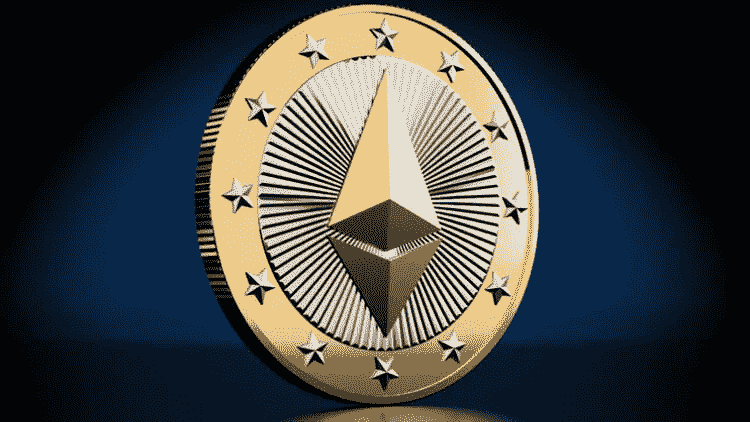
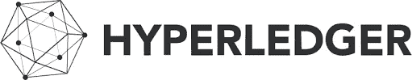

# 金融中的区块链(第三章)

> 原文：<https://blog.devgenius.io/blockchain-in-finance-chapter-iii-ac2c8b1f976e?source=collection_archive---------11----------------------->

***区块链在金融中的延续。它涉及金融科技(fintech)。***

自从金融科技(fintech)出现以来，它已经席卷了商业和我们生活的方方面面。这变得如此狂热，以至于现在银行正在竭尽全力创造最好的金融科技应用。在本章中，我们将讨论金融科技的区块链应用。

**什么是金融科技？**

Fintech 可以被描述为一种旨在改善和自动化向消费者提供和使用金融服务的技术。他们用软件和算法让用户的生活变得更轻松。

**区块链如何革新金融科技**

因为区块链首先被用来创造金融产品，金融技术也加入了增强自身的狂潮。尽管金融科技领域的区块链尚未成熟，但初创公司和公司已经推出了基于区块链的平台和应用，包括供应链金融平台、贸易融资、银行和其他可用的会计软件。更有甚者，一些银行投资区块链的初创企业，并开设部门以保持发展。他们中的一些人甚至会收购初创公司，以获得市场优势。但它们大多不被银行收购，它们通常出售自己的服务。此外，一些平台吸引注意力开发区块链产品。

**区块链开发金融科技产品的热门平台**

## 以太坊

它以开发分散金融、硬币和 DAOs 等金融产品而闻名。随着为特定目的设计的证券和市场的令牌化，它变得越来越流行。因此，以太坊在金融技术中变得流行，并且今天仍然流行。

## 超级分类帐

另一个流行的开发区块链应用的金融科技平台。尤其是支付系统、忠诚度应用和供应链管理。更重要的是，它们变得像以太坊一样多才多艺，拥有一个完全私有的节点网络，可以相互交流。因此，它在大多数公司中很受欢迎。

## 科尔达

类似于 hyperledger，它被称为开发应用程序的分布式分类帐技术。尤其是在区块链的融资应用上。因为它在金融行业的开发人员中很受欢迎。此外，大多数合规性要求都是在基于 Corda 的应用上完成的，这些应用已经发展成为最主要的应用。

*根据您的观点，哪些用例适合金融行业？在下面的评论区分享你的想法。*