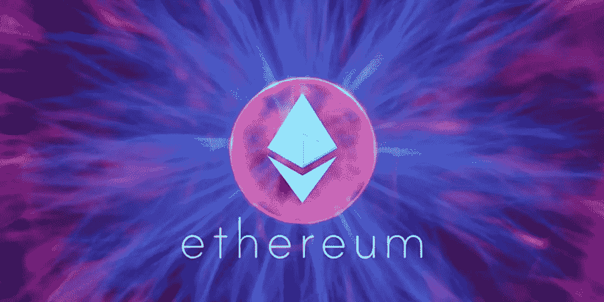

# 金融中的区块链(第五章)

> 原文：<https://blog.devgenius.io/blockchain-in-finance-chapter-v-1d0162ed7f2d?source=collection_archive---------5----------------------->

***我们事先提到了代币。现在代币在金融中的应用。***

以太坊平台的第一个结果是在金融领域实现了代币。在这一章中，我们将深入研究代币在金融中的应用。

## 安全令牌产品(sto)

在金融市场上，企业可以通过贷款、首次公开募股或两者结合的方式来增加收入。在提到 STO 是什么意思之前，我们先来了解一下 IPO 是如何运作的，以理解 s to 背后的逻辑:

第一，某公司要发行股票；他们去投资银行(或任何同等的银行)。然后，他们决定发行股票的数量和在交易所购买股票的固定价格。第三，银行会收取操作费用，如果一些实体认为有利可图，他们会购买这些股票。最后，股票已经在交易所上市，可以出售给其他人。在最后阶段，人们通过中介相互购买这些证券。

当我们将 IPO 的逻辑应用到 sto 时，公司可以在不需要金融中介的情况下完成这一过程。相反，他们会方便地使用 hyperledger 或以太坊开发他们的证券。在以太坊中，有不可替代的令牌标准(hyperledger 没有任何令牌标准)。此外，公司可以自己生成证券，直接在金融市场上市，或者联系开发证券的公司，在某些交易所上市。因为金融中介不会介入，他们节省了成本，增加了收入。

## 增加收入的替代方法

当内容制作者通过他们的地址增加收入时，他们必须忍受 2.5-3%的费用，这取决于他们决定的交易和支付网络。因此他们不能接受某些金额的付款。所以，制片人不会得到他们作品的全部价值。但是有了加密钱包地址，根据网络状况，任何金额都可以用少量费用发送出去。制作人只需要公开他们的钱包地址就可以接受捐赠或付款。更重要的是，政治内容制作者不必担心他们的银行账户会因为不同的原因而被冻结。

*根据你的观点，哪些用例适合金融？在下面的评论区分享你的想法。*