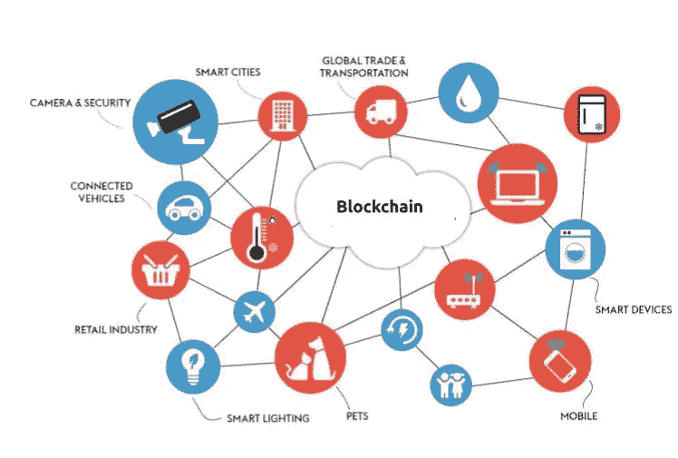
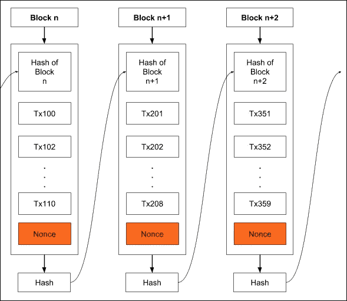
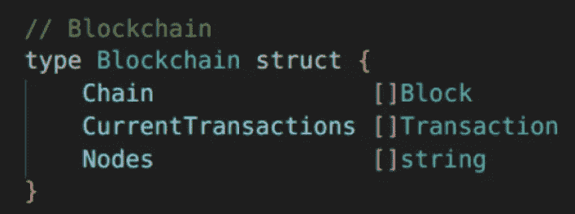
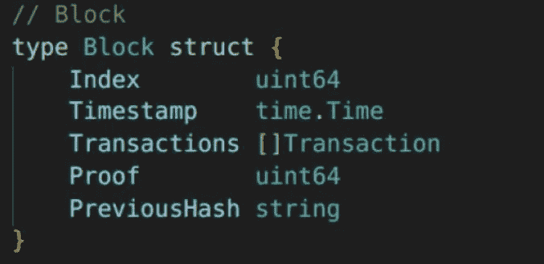
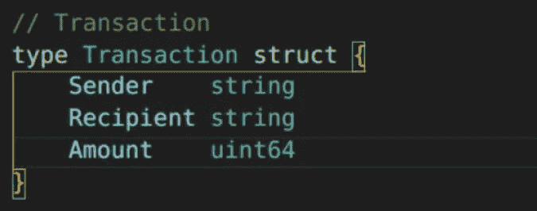
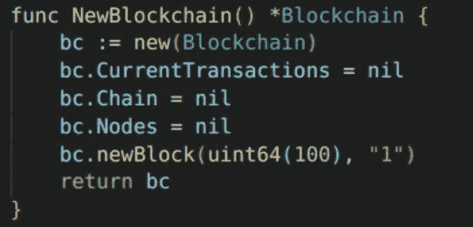

# 使用 Docker 的 Golang 中的区块链

> 原文：<https://blog.devgenius.io/blockchain-in-golang-using-docker-f610178a449b?source=collection_archive---------2----------------------->

T 他的文章将向你介绍 Golang，并帮助你理解如何使用 Go 构建一个区块链。这本 Golang 基础将会给你一个很好的语言入门。本文将关注 Golang 以及 Docker 的安装。在本文的后半部分，我将讨论如何使用 Go with Docker 构建一个区块链。

我的 Github 库的链接是[https://Github . com/divija 16/block chain-in-Golang-using-Docker](https://github.com/divija-swetha/Blockchain-in-Golang-using-Docker)

# Golang 基础:

## Golang 是什么？

Go(也称为 Golang)是 Google 开发的一种开源编程语言。它是一种静态类型的编译语言。Go 支持并发编程，也就是说，它允许同时运行多个进程。这是通过使用通道、goroutines 等实现的。Go 语言有垃圾收集功能，它进行内存管理并允许函数的延迟执行。它还支持网络和多核计算。你可以在[golang.org](http://golang.org)的操场上运行你的第一个代码，不需要任何设置。

## 下载并安装 Golang:

你可以从官方文档[这里](https://go.dev/doc/install)下载并安装 Go。

确保设置了`PATH`环境变量。

如果你使用的是 Ubuntu，安装 Go 的步骤可以在[这里](https://golangdocs.com/install-go-linux)找到。

## 安装 Docker:

你可以从[这里](https://docs.docker.com/get-docker/)安装 Docker 的官方文档。

如果你和我一样用的是 Ubuntu 20.04，安装的步骤是[这里是](https://www.digitalocean.com/community/tutorials/how-to-install-and-use-docker-on-ubuntu-20-04)。

# 区块链

如果你正在阅读这篇文章，你可能知道区块链在各种应用中的影响。随着区块链的新应用不断增加，这里有几个改变游戏规则的区块链的主要应用。

加密货币是区块链潜力最常被引用的例子，但区块链正吸引着金融以外应用的注意力。区块链正在帮助所有行业的组织降低成本和提高绩效，同时为他们的公司创造更大的价值，因为它提高了跟踪与可持续发展和道德采购相关的复杂变量的安全性和可见性。

区块链的核心技术是分散式分类账，记录和保护多方共享的交易数据。比特币、以太坊和 Dogecoin [等加密货币利用区块链](https://www.nerdwallet.com/article/investing/cryptocurrency-7-things-to-know)在理论上允许无限和匿名的各方进行交易，而不需要中介。

# 区块链应用

在供应链管理中，重点是允许一定数量的已知方彼此直接进行交易，同时提高安全性，确保合同合规性并降低成本。取代硬币，供应链区块链“令牌化”各种与交易相关的数据，为采购订单、库存单位、提单等创建唯一且易于验证的标识符。供应链利用智能合同。智能合同使组织能够自动处理大量交易。

> 亚马逊网络服务(AWS)为供应链提供了一个[区块链:为供应链提供跟踪和追溯](https://aws.amazon.com/blockchain/blockchain-for-supply-chain-track-and-trace/)
> 
> [IBM 区块链为供应链提供平台](https://www.ibm.com/blockchain/supply-chain)。
> 
> 沃尔玛已经在使用区块链解决供应链管理问题。[沃尔玛在区块链推出“世界上最大的”货运和支付网络](https://www.computerworld.com/article/3454336/walmart-launches-world-s-largest-blockchain-based-freight-and-payment-network.html)

区块链物联网的应用

将区块链与物联网(IoT)技术(如实时温度传感器)相结合，沃尔玛可以为自动开票、发货细节等创建智能合同。如果运输过程中出现错误，或者在任何时间点发现食品污染，可以通过自动区块链即时追溯事件。通过整合区块链和物联网解决方案，沃尔玛的发票解决时间从 7 天大幅缩短至 2.2 秒。

继续阅读[在 IIoT 中扩展区块链有多有用？](https://medium.com/@divijaswetha/how-useful-is-scaling-blockchain-in-iiot-6cb8e4c3b051)

# 了解区块链

区块链由通过*哈希*相互连接的信息块组成，哈希是从输入数据生成的加密固定输出。由于每个块都通过散列相互引用，所以不可能在不彻底改变链的其余部分的情况下改变链的任何部分。这给区块链带来了安全和透明的好处。

一个基本框架是包括每个区块过去交易的所有记录。让我们看看下面的图表。我们有三个模块来创建一个区块链。第一块是创世块。由于前面没有任何内容，因此前面的哈希字段为空。我们仍然使用时间戳属性和初始事务作为哈希算法的输入。这个算法会吐出一大串数字和字母，代表 genesis 块的哈希值。我们使用块 n 的散列作为块 n+1 先前散列的值。接下来，我们将时间戳、交易列表和之前的哈希值作为哈希算法的输入。该算法将给我们一个新的散列值来表示块 n+1。我们继续重复这个过程，验证块的有效性以及存储区块链的能力。[截至 2022 年 3 月，比特币的区块链约为 394 GB](https://www.blockchain.com/charts/blocks-size)。

# 在 Go 中构建区块链

首先，我们通过定义与地址相关的块来创建区块链，定义用于添加新事务的事务函数，然后定义节点，该节点是一个字符串，因为它存储每个节点的地址。

接下来我们定义一个模块**。** Go 使得创建自定义类型变得容易，我们可以用下面的代码定义`Block`类型。这里的`Block`结构有四个字段来匹配上面的图表。块有其块索引、表示何时将块添加到链中的时间戳、必须包含在该块中的事务、工作证明解决方案以及先前的块散列。

类似地，交易功能具有发送者地址串、接收者地址串和必须从发送者地址转移到接收者地址的金额。

下一步是创建 Go 版本的构造函数来创建和添加新的块。该函数的输入将采用一个字符串数组来表示事务，并采用一个字节数组来表示先前生成的块的先前哈希值。最初，对于一个 genesis 块，这些值被设置为 null。下一个函数是我们接下来要实现的 NewBlockchain()。在这个函数中，我们基本上只是将所有的输入混合到一个称为 input 的单字节数组中。然后，我们对事务进行循环，并将每个单独的事务追加到输入数据块中。

为了创建新的块，我们将前一个块的哈希值连同其相应的事务历史一起传递给`newBlock()`。如果你想在一个地方看到整个节目，可以在 [Github](https://github.com/divija-swetha/Blockchain-in-Golang-using-Docker) 上找到。

这是一个简单的实现，但是这些是创建你自己的区块链的基础！如果您要更改任何一个块中的一条信息，那么您将获得完全不同的哈希值。这就是区块链的神奇原理！

如果您想将代码用于一个应用程序，还有许多额外的工作要做。该计划的下一步将包括验证我们的区块链以及实际创建和验证交易的机制。然而，随着区块链技术继续在全球范围内寻找新的使用案例，基本原理保持不变。

## 参考资料:

1.  Simplilearn 的 Youtube 教程:[https://www.youtube.com/watch?v=Cn5vrUDYtyc](https://www.youtube.com/watch?v=Cn5vrUDYtyc)
2.  亚马逊网络服务:[https://AWS . Amazon . com/区块链/区块链-供应链跟踪与追踪/](https://aws.amazon.com/blockchain/blockchain-for-supply-chain-track-and-trace/)
3.  供应链中的区块链:[https://www . Forbes . com/sites/Forbes tech Council/2021/11/08/区块链供应链/？sh=351b3a344e1a](https://www.forbes.com/sites/forbestechcouncil/2021/11/08/blockchain-in-supply-chain/?sh=351b3a344e1a)
4.  IIoT 中缩放区块链有多大用处？:[https://divijaswetha . medium . com/how-useful-is-scaling-区块链-in-iiot-6cb8e4c3b051](https://divijaswetha.medium.com/how-useful-is-scaling-blockchain-in-iiot-6cb8e4c3b051)