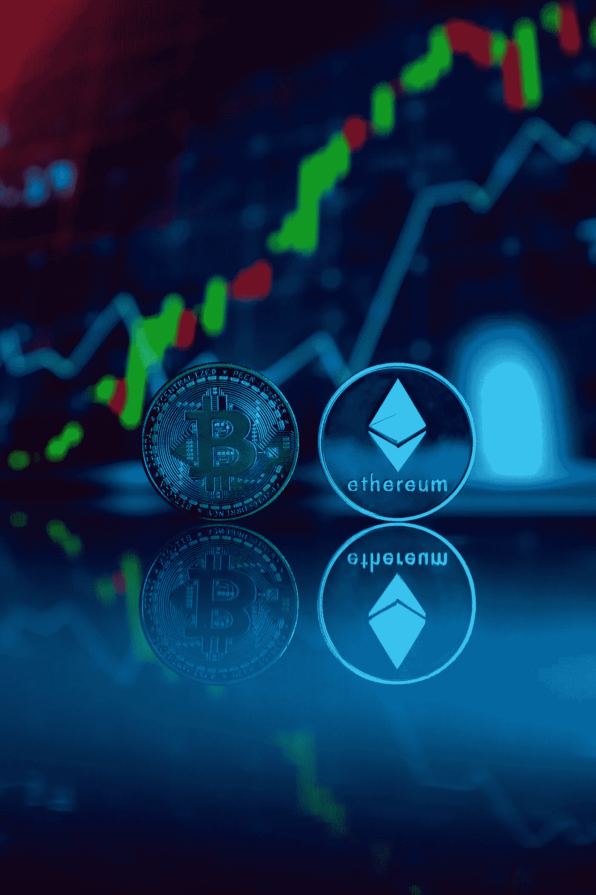

# 区块链:千里之行，始于足下。

> 原文：<https://blog.devgenius.io/blockchain-the-journey-of-thousand-miles-begins-with-a-first-step-9e72395de573?source=collection_archive---------11----------------------->

区块链技术一直让我着迷，我的好奇心在 2020 年达到顶峰，当时我有机会作为自由职业者参与区块链的一个项目。作为该领域的新人，我的任务是重新设计一个分散式应用程序(DApp)的前端用户界面(UI)。这个项目向我介绍了智能合约、令牌和 web3 等概念，并激发了我追求区块链开发人员职业的兴趣。

当时，我对所有的新术语和概念有点不知所措，我花了一些时间才完全理解以太坊区块链是如何工作的，以及智能合约的潜在应用。然而，我了解得越多，就越相信区块链技术有能力彻底改变我们做生意和相互交往的方式。

在接下来的一年里，我从事另一个区块链项目，在那里我开发了不可替代令牌(NFT)。虽然我不是艺术家，但我能用自己写的脚本生成超过 3000 张 NFT 图片和元数据。这一经历坚定了我成为区块链开发人员的愿望，并激励我投资于我的教育和技能。

为了准备这一职业转变，我专注于学习软件开发，包括编写脚本、构建 web 应用程序和使用 DevOps。我甚至通过 Udemy 和 AWS 参加了 DevOps 的多门课程。虽然我喜欢这个学习旅程的技术方面，但我很快意识到我更喜欢独立地编写自己的代码和解决问题，而不是管理和拖放元素。

因此，我决定专注于软件开发和区块链开发，上周我部署了我的第一个区块链应用程序——一个待办事项列表。虽然这看起来像是一个简单的项目，但它标志着我作为区块链开发者的旅程的开始。

在接下来的三个月里，我计划继续沉浸式地学习区块链和以太坊，目标是以区块链开发者的身份获得我的第一份工作。在这个角色中，我希望编写自己的智能契约，并构建连接到这些契约的 DApps。我相信这项技术有可能彻底改变我们做生意的方式，我很高兴成为这个不断发展的行业的一员。

区块链技术吸引我的一个原因是它的分散性。与通常由单个实体控制的传统系统不同，区块链技术是分散的，分布在计算机网络中。这意味着没有中心故障点，并且使用加密技术保护交易。

区块链技术另一个吸引人的方面是它的透明性。所有的交易都记录在公共账上，这意味着任何人都可以看到特定资产或合同的历史。这种透明性有助于建立信任，并确保交易的安全性和准确性。

除了其分散和透明的性质，区块链技术还具有简化流程和降低成本的潜力。例如，智能合同可以自动化某些任务，消除对中介的需求，从而节省时间和金钱。

随着我继续了解区块链技术并与之合作，我很高兴看到它将如何塑造未来。我相信它有潜力改变广泛的行业，从金融和医疗保健到房地产和供应链管理。我相信，在接下来的三个月内，我将获得作为区块链开发人员的第一份工作，在那里我将有机会编写自己的智能合同，并构建与这些合同相关的 DApps。我会让你们了解我的最新进展，并鼓励你们跟随我走上这条激动人心、充满活力的职业道路。

如果你喜欢这篇文章，请给它一两个掌声，如果你有任何问题或疑问，请在下面的评论中留下。