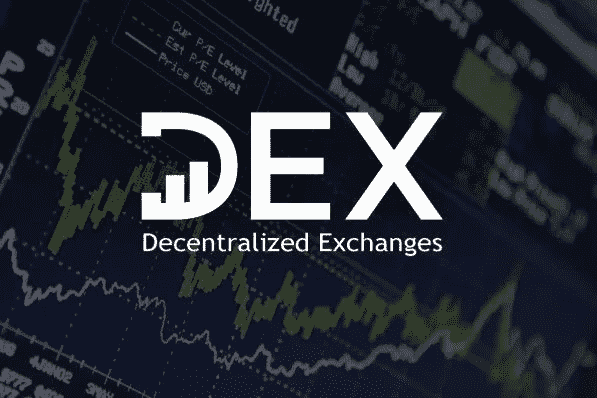

# 金融中的区块链用例(第二部分)

> 原文：<https://blog.devgenius.io/blockchain-use-cases-in-finance-chapter-ii-4bdfbdd58d40?source=collection_archive---------5----------------------->

***续自金融第一部分区块链继续涉及更广泛的概念。让我们更深入地了解金融领域的区块链用例。***

## 供应链金融

供应链金融(SCF)是一个发生许多低效率和问题的地方。现在，区块链科技同时革新了供应链金融和贸易金融。首先，区块链通过允许参与者跟踪彼此的进展，实现了网络的透明度。其次，区块链通过创建最低限度的文书要求，加快了整个过程。最后，他们不再需要中间人(如果双方同意，他们可以)。因此，基于区块链的供应链金融平台使整个过程自动化，更快，更安全，更透明。

## 自动支付

股息支付、首次月度支付或任何其他支付必须每年进行，并且都必须记录在案？区块链凭借其自动化支付系统产品占领了这一领域。他们向某些实体付款，并用专门的产品即时记录。更重要的是，它使整个过程透明，任何人都可以看到。或者至少对某些人是这样，这取决于协议。

## 戴科

分散自主初始硬币发行(DAICOs)是 DAO 和 ico 的组合。这是某种由分散的自治组织管理的硬币。简单地说，它的管理依赖于智能合约上的书面代码。虽然名声不好，但它取得了巨大的成功，人们仍然在购买这些产品。他们彻底改变了金融行业。

## 首次 DeFi 发行

另一种金融产品是没有中央实体参与的。就像在 ICOs 中一样，一个团队、一份白皮书和适当的营销和业务开发会让人们购买他们的产品，而不需要创造一个优秀的产品。它变得如此狂热，以至于现在人们可以通过交易所轻松地用他们的钱进行投资。

## 分散交易所

这是一种交换，执行团队不存在决策。相反，分散的实体决定交易所的功能会发生什么。随着它的成功，现在他们在全球范围内有了一些知名度和可靠性。

## 分散的市场

区块链最著名的成果之一是分散市场的出现。因为信任和透明度可能会成为一个问题，当涉及到其他市场时，预测和未来市场的投资者比率会很低。现在，收益的概率将被计算出来，给出最佳答案的人将得到奖励。现在，一切都是由写在网络上的智能合同来完成的。

根据您的观点，哪些用例适合融资？在下面的评论区分享你的想法。