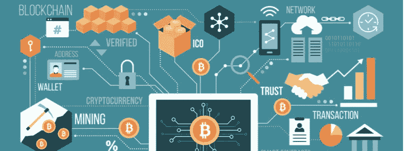
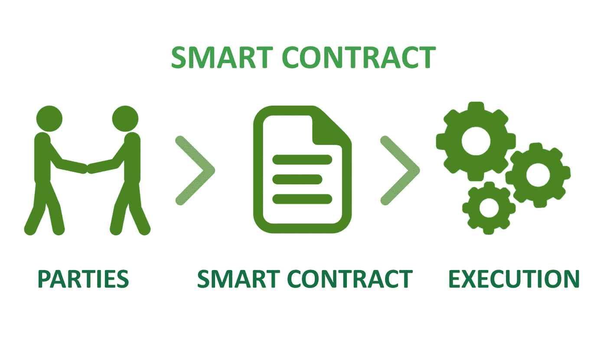
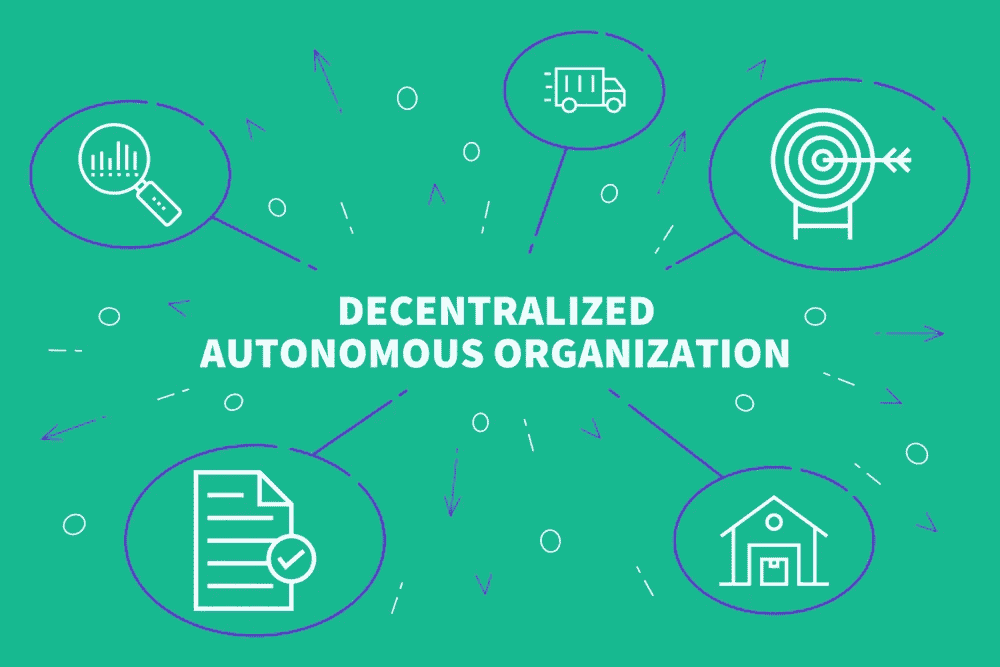
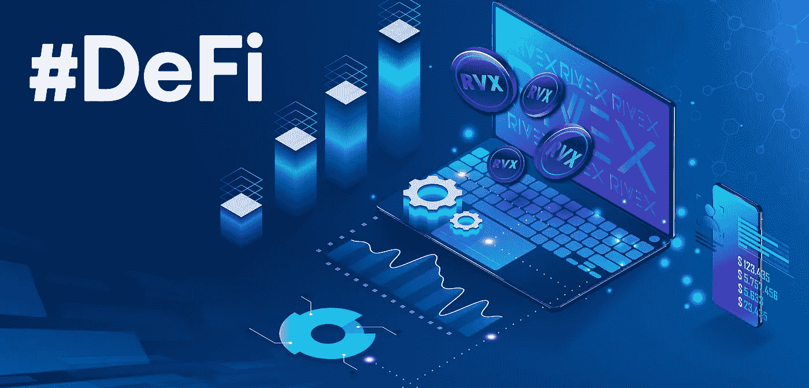

# 金融领域的区块链用例(第一章)

> 原文：<https://blog.devgenius.io/blockchain-use-cases-in-finance-part-i-da54fb98932b?source=collection_archive---------7----------------------->

***我演示作业的一部分。它们还包括货币工具。***

自比特币推出以来，区块链已经永远改变了金融业。自 2009 年首次实施以来，区块链影响了更多的部门。在这里，我们将讨论金融中的区块链用例。

**那么区块链是什么？**

简而言之，区块链是一个数字化的地方，记录不能被篡改、黑客攻击或删除。它尽可能以最安全的方式保存数据。最近，区块链一般分为私人、公共、财团和联邦区块链。

我们知道什么是区块链，那么它在金融中的应用呢？

## 加密货币

加密货币是由代码创造的**货币。一般来说，政府方面没有参与。根据其结构，如果你用全新的区块链创造一种全新的加密货币，人们可能会达成共识，其供应量可能会受到限制，区块大小和每分钟的交易量可能会通过编写代码来决定。**

## ICOs

自 2009 年比特币推出以来，首次公开募股(ico)在加密货币领域变得非常流行，由于监管规定，加密货币不可能进行首次公开募股(IPO)。因此，另一种融资方式诞生了。它变得如此受欢迎，以至于越来越多的公司正在制造比以往任何时候都多的 ico 来产生替代收入来源。你只需要一个产品、一个网站和一份技术文档就可以开始了。其余的可以由公共事务、营销和业务开发团队来处理。

## 智能合同

由于它是由尼克·萨伯的《智能合约:数字市场的构建模块》一书创造的，它的全部含义是由以太坊赋予生命的。要定义智能合约:让我们考虑一下自动售货机。如果你输入正确的号码和支付正确的价格，自动售货机会给你一份快餐。智能合约也是如此。它们根据代码中编写的条件执行命令。现在，自推出以来，它已被用于更多的行业。

## 道斯

分散自治组织(Dao)是达成共识的机器算法。这是一家没有人做决定的银行。而是一切由代码决定。它是成功的，直到黑客利用了代码中的一个错误。尽管它已被修复，但它的坏名声导致以太坊社区严格测试所有合同。过了一段时间，在这个领域出现了更多成功的产品，许多人估计它可以在城市中使用。

## 挑战

与传统金融不同，它的行政部门不是由股东选择的。相反，执行分支由类似 DAO 中的代码组成。自其出现以来，它允许许多人在没有高合规要求的情况下在金融市场中进行互动。现在，它有太多的产品，有些在不同的领域取得了成功。现在，专家估计这个领域将成为分散金融的未来。

## 代币

代币是对区块链上的特定事物提出要求的资产。它已经被用于许多不同的领域。尽管这个短语是随着以太坊的推出而出现的，但它却以今天所知的更多形式出现。现在，它们甚至在世界各地的主要股票交易所上市。

根据您的观点，哪些用例适合融资？在下面的评论区分享你的想法。