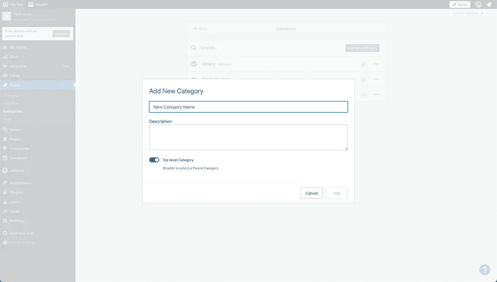
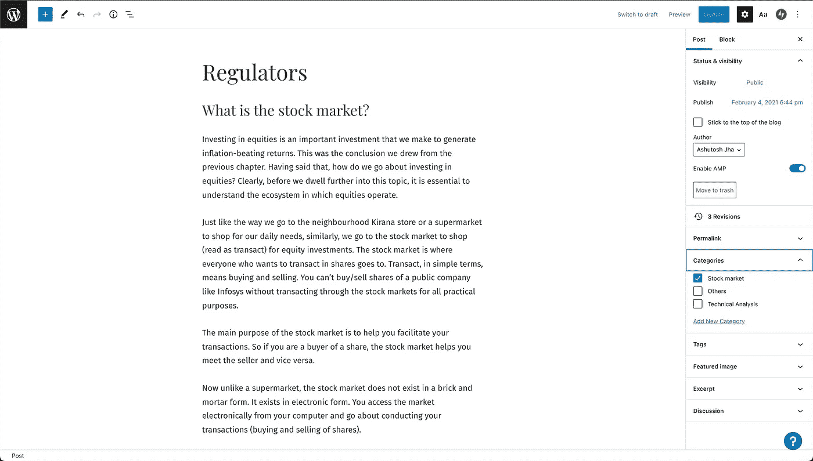
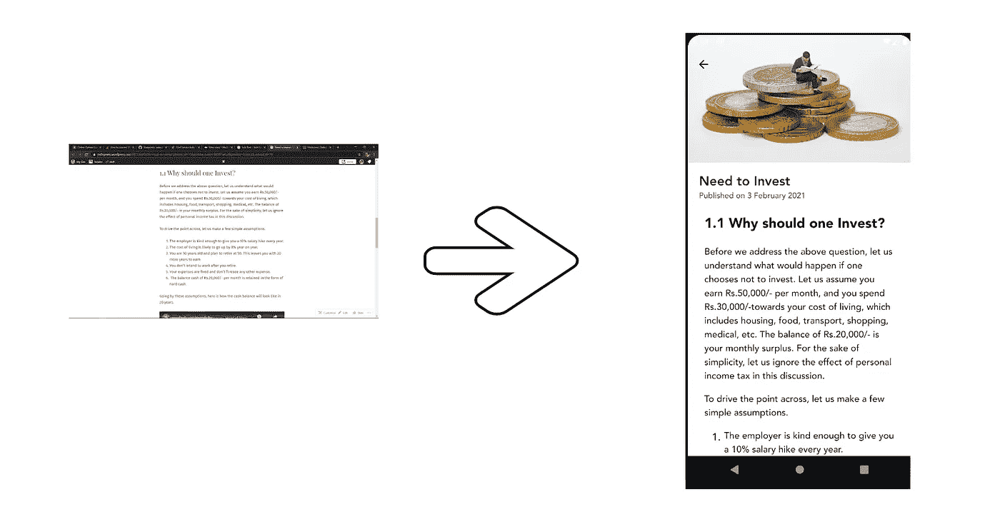

# 博客-在船上！

> 原文：<https://blog.devgenius.io/blogs-on-board-daa45b5a5c4f?source=collection_archive---------7----------------------->

作为一名博客作者，你有没有想过如何跨平台发布你的内容？是的，你没听错。您可以在原生平台上使用您的内容，例如移动设备、web 应用、桌面设备或任何您希望使用原生视图的地方( ***不再渲染 Web 视图*** *)。*

安内特·lūsiņa 在 [Unsplash](https://unsplash.com?utm_source=medium&utm_medium=referral) 上拍摄的照片

现在让我们来研究一下解决办法。

# **内容管理系统**

CMS 是一种工具，可以让你以最简单的方式策划、创建、管理和交付你的内容。对于我们的解决方案，我们将使用 **Wordpress** 作为 CMS。

Wordpress 提供了一个平台来创建漂亮的网站和功能强大的博客网站，博主们会发现它很容易使用。要了解更多关于如何在 wordpress 上创建博客文章的信息，请参考这个视频。

为了更好地理解我们如何管理我们的内容，让我们假设 CMS 是一本书。一本书会有不同的章节。一章会有不同的主题。一个主题会包含你的内容。

图书-> CMS

章节->类别

话题->帖子

现在我们要遵循上面的层次结构。我假设你已经在你的 wordpress 管理门户上准备好了博客(帖子)。如果没有，检查左侧面板->文章->添加新的。在这里创建你的博客并保存它。您可以在博客正文中嵌入图像、视频和其他内容。

第二步是创建章节。检查左侧面板->文章->类别->添加新类别。命名类别并添加一些描述。如果你想添加你的类别的缩略图，你可以在描述中添加图片链接并使用它。和我们跟踪的一样。

第三步是用章节来映射博客。地图吧，去你的博客->查看右上方的选项->点击设置图标。在文章选项卡中，您可以看到一个**和*类别的选项。*** 在这里你可以指定博客中的一个或多个章节。

# **你的博客转到 JSON**

现在下一步是将你的博客内容转换成 JSON，它可以很容易地嵌入到任何原生平台中。下面是 URL 的格式，它将为我们提供 JSON 包中的博客文章数据。这是供公众使用的开放 API。您可以使用 GET request 来获取您的博客站点上的所有帖子。如果你已经对你的博客进行了分类，你也可以按类别获取数据。比方说，你想获取以医疗保健为类别的博客。你可以传递你的 wordpress 控制台上可用的类别 id。

现在，您可以使用这个 JSON 在您的移动应用程序或任何您想要的应用程序中呈现它。

你们都赶上了。感谢阅读。随意评论。

在推特、 [Github](https://github.com/ashujhaji) 、 [LinkedIn](https://www.linkedin.com/in/ashujhaji/) 上加入我👐