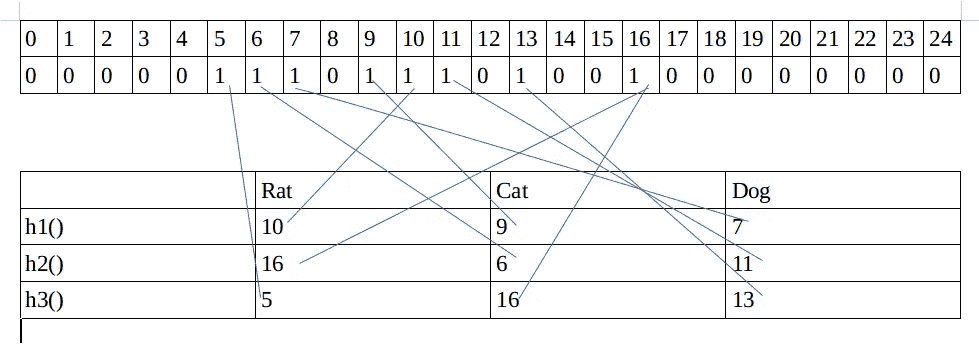

# 布隆过滤器数据结构

> 原文：<https://blog.devgenius.io/bloom-filter-data-structure-df7d9da78eec?source=collection_archive---------14----------------------->

> 一个布隆过滤器是一个概率数据结构，它快速且高效地判断一个元素是否出现在集合中。

由[卡洛斯·穆扎](https://unsplash.com/@kmuza?utm_source=medium&utm_medium=referral)在 [Unsplash](https://unsplash.com?utm_source=medium&utm_medium=referral) 上拍摄的照片

这种效率的代价是 Bloom filter 是一种概率数据结构:它告诉我们元素要么肯定不在集合中，要么可能在集合中。

布隆过滤器的基本数据结构是位数组。
这里有一个小例子，我们将用来演示:

上面是 25 位的位数组。
现在假设我们的哈希函数是 h1、h2 和 h3
元素是 Rat、Cat、Dog

上表显示了每个哈希函数处理后元素的值。

> 它是如何工作的？

对于每个元素，我们将它传递给哈希函数，比如说，
Dog 被传递给 h1，给出 7，我们在比特数组中设置编号为 7 的索引。
Dog 被传递给 h2，给出 11，我们在位数组中设置编号为 11 的索引。
Dog 被传递给 h3，给出 13，我们在位数组中设置编号为 13 的索引。
对其他元件执行相同的操作，并继续设置位数组…

现在，当我们需要检查该元素是否存在时，我们将该元素传递给那些哈希函数，并检查位数组中的索引是否已设置。
这就是我们如何知道元素是否存在于系统中。

> 为什么是概率性的？

S uppose 对于元素 God，
h1 哈希函数返回 10，
h2 哈希函数返回 6，
h3 哈希函数返回 13，那么 Bloom filter 将返回 true，表明它存在于我们的系统中。这就是为什么我们说元素不存在是 100%确定的，但元素存在是概率性的。

> 我们将引用具有 k 个散列、过滤器中的 m 个比特以及已经插入的 n 个元素的布隆过滤器。

**哈希函数**

布隆过滤器中使用的散列函数应该是独立且均匀分布的。他们也应该尽可能快。

足够独立的快速、简单的散列的例子包括 brumb、fnv 散列系列和 HashMix。

我应该把我的 Bloom 滤镜做多大？

布隆过滤器的一个很好的特性是你可以修改过滤器的误报率。过滤器越大，误报越少，过滤器越小，误报越多。
您的误报率大约为(1-e-kn/m)k，因此您可以插入 n 个您希望插入的元素，并尝试不同的 k 和 m 值来配置您的滤波器。

我应该使用多少个散列函数？

你的散列函数越多，你的 bloom filter 就越慢，它就越快填满。但是，如果数量太少，您可能会遭受太多的假阳性。因为在创建过滤器时必须选择 k，所以您必须大概知道 n 应该在什么范围内。一旦你有了这个，你仍然需要选择一个潜在的 m(位数)和 k(散列函数的个数)。

这似乎是一个困难的优化问题，但幸运的是，给定一个 m 和一个 n，我们有一个函数来选择 k 的最优值:(m/n)ln(2)

因此，为了选择布隆过滤器的大小，我们:
-选择 n 的值
-选择 m 的值
-计算 k 的最佳值
-计算我们选择的 n、m 和 k 的值的误差率

如果不能接受，返回步骤 2，改变 m；否则我们就完了。

**布鲁姆滤镜的速度和空间效率如何？**

给定具有 m 位和 k 个散列函数的布隆过滤器，插入和成员测试都是 O(k)。也就是说，每当您想要向集合添加元素或检查集合成员资格时，您只需要通过 k 个散列函数运行元素，并将其添加到集合或检查那些位。

空间优势比较难总结；同样，这取决于你愿意容忍的错误率。它还取决于待插入元素的潜在范围；如果非常有限，确定性位向量可以做得更好。如果您甚至不能大概估计要插入的元素数量，那么使用哈希表或可伸缩的 Bloom 过滤器可能会更好。

**应用**

布隆过滤器在软件工程中有大量的应用。

*   Medium 在 medium 博客推荐中使用 bloom filter 来检查用户之前是否已经阅读过这篇文章。
*   Google Bigtable、Apache HBase 和 Apache Cassandra 以及 Postgresql 使用 bloom filters 来*减少对不存在的行或列的磁盘查找*。避免代价高昂的磁盘查找大大提高了数据库查询操作的性能。
*   内容交付网络提供商 Akamai 使用 Bloom filter 来避免缓存用户仅请求一次的 web 对象(也称为“**一击不中的奇迹**”)。使用 Bloom filter 来检测对 web 对象的第二次请求，并仅在其第二次请求时缓存该对象，可以防止一击即中的奇迹进入磁盘缓存，从而显著减少磁盘工作负载并提高磁盘缓存命中率。
*   谷歌 Chrome 浏览器曾经使用布隆过滤器来识别恶意网址。首先根据本地 Bloom 过滤器检查任何 URL，并且只有当 Bloom 过滤器返回肯定结果时，才执行对 URL 的全面检查(并且如果也返回肯定结果，则用户会发出警告)

布隆过滤器的一些现有实现是

*   布谷鸟过滤器是布鲁姆过滤器的另一种变体。Cuckoo 过滤器支持动态添加和删除项目，同时实现比 Bloom 过滤器更高的性能。法尔汉有一个很好的关于布谷鸟和布鲁姆过滤器区别的[博客](https://medium.com/techlog/cuckoo-filter-vs-bloom-filter-from-a-gophers-perspective-94d5e6c53299)。

**参考文献**

 [## 布隆过滤器示例

### Bloom filter 是一种数据结构，旨在快速高效地告诉您某个元素是否存在…

llimllib.github.io](https://llimllib.github.io/bloomfilter-tutorial/#:~:text=A%20Bloom%20filter%20is%20a,may%20be%20in%20the%20set.)  [## 计数布隆过滤器

### 计数型 Bloom filter 是 Bloom filter 的一种广义数据结构，用于测试一个计数型 Bloom filter 的计数是否…

en.wikipedia.org](https://en.wikipedia.org/wiki/Counting_Bloom_filter#:~:text=A%20Counting%20Bloom%20filter%20is,sequence%20of%20elements%20is%20given.)