# 基于蓝牙 LE 的 LCD messenger:使用蓝牙和 STM32 从网络浏览器向 LCD 显示器发送消息

> 原文：<https://blog.devgenius.io/bluetooth-le-based-lcd-messenger-using-stm32-and-bleuio-76e240367e55?source=collection_archive---------17----------------------->

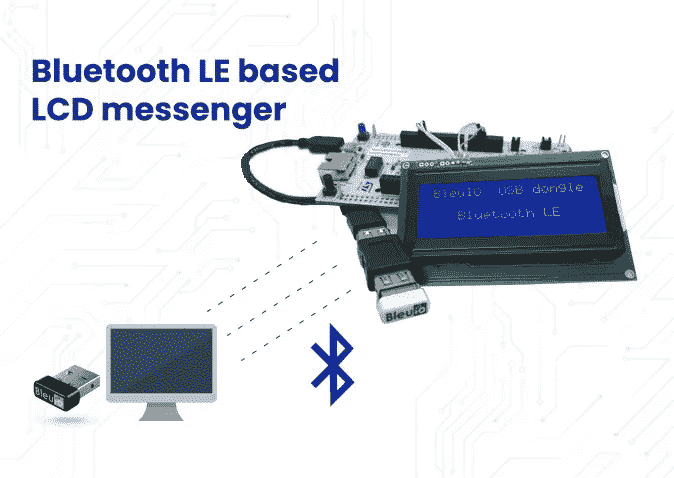

这个项目的目的是使用网络浏览器或智能手机通过蓝牙向连接到 STM32 板的 LCD 显示器发送消息。

# 1.介绍

该项目基于 STM 32 Nucleo-144 T1，使用 BleuIO 控制 T2 液晶显示器 T3。

对于这个项目，我们需要两个 BleuIO USB 加密狗，一个连接到 Nucleo 板，另一个连接到计算机，运行 web 脚本。
当 BleuIO 加密狗连接到 Nucleo boards USB 端口时，STM32 将识别它并直接开始广告。这允许计算机端口上的加密狗与 web 脚本连接。

通过电脑上的 web 脚本，我们可以使用 BleuIO 将消息发送到与 STM32 相连的 LCD 屏幕上。

在本例中，我们使用了一个带 STM32H743ZI MCU 的 STM32 Nucleo-144 开发板(STM 32h 743 zi micro mbed-Enabled Development Nucleo-144 series ARM Cortex-M7 MCU 32 位嵌入式评估板)。该开发板有一个 USB 主机，我们可以通过它连接 BleuIO 加密狗。

如果您想使用另一种设置，您必须确保它支持 USB 主机，并注意 GPIO 设置可能会有所不同，可能需要在中重新配置。国际奥委会文件。

# 我们需要什么

*   两个蓝色加密狗([https://www.bleuio.com/](https://www.bleuio.com/))
*   带有带 USB 端口的 STM32 微控制器的电路板。(使用 Nucleo-144 开发板:NUCLEO-H743ZI2 来开发本示例。([https://www.st.com/en/evaluation-tools/nucleo-h743zi.html](https://www.st.com/en/evaluation-tools/nucleo-h743zi.html))
    要将加密狗连接到 Nucleo 板，可以使用带有 USB A 母到母适配器的“USB A 到 Micro USB B”电缆。)

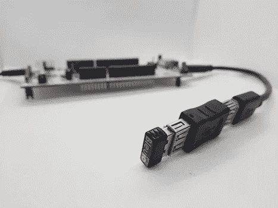

*   STM 32 库贝德([https://www.st.com/en/development-tools/stm32cubeide.html](https://www.st.com/en/development-tools/stm32cubeide.html))
*   液晶显示模块—NHD-0420 d3z-NSW-BBW-V3([https://www . digikey . com/en/products/detail/new haven-Display-intl/NHD-0420 d3z-NSW-BBW-V3/2626390？s = n 4 igtcbcdaihiakaibaadafjgpbmawinamodqkaqheqgq 4 GC 6 avka](https://www.digikey.com/en/products/detail/newhaven-display-intl/NHD-0420D3Z-NSW-BBW-V3/2626390?s=N4IgTCBcDaIHIAkAiBaADAFjGpBmAWinAMoDqKAQheQGq4gC6AvkA)

# 关于代码

Github 提供了项目源代码。

[https://github . com/smart-sensor-devices-ab/STM 32 _ bleuio _ LCD . git](https://github.com/smart-sensor-devices-ab/stm32_bleuio_lcd.git)

要么克隆这个项目，要么将其下载为 zip 文件并解压缩到您的 STM32CubeIDE 工作空间中。

如果您将项目下载为 zip 文件，您需要将项目文件夹从“stm32_bleuio_lcd-master”重命名为“stm32_bleuio_lcd”

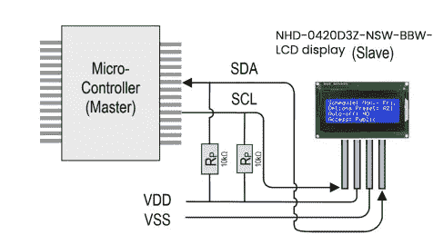

将 SDA 连接到 Nucleo 板上的 PF0，将 SCL 连接到 PF1。

然后在 STM32Cube ioc 文件中设置 I2C2，如下所示。(确保根据 LCD 显示要求，将 I2C 速度频率更改为 50 KHz。)

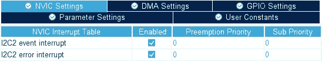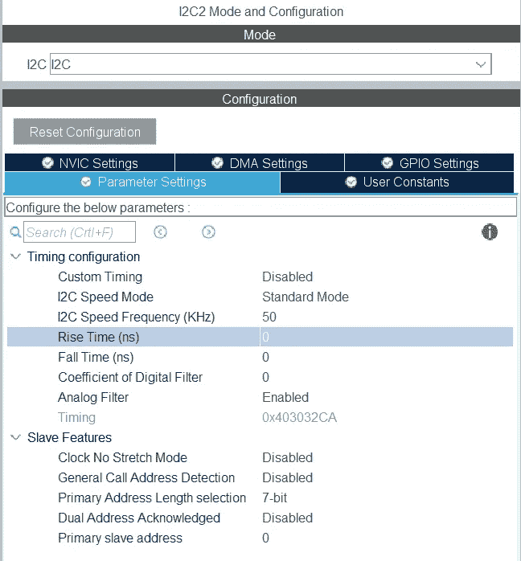

在 USB_HOST\usb_host.c 中的 USBH_CDC_ReceiveCallback 函数中，我们将 CDC_RX_Buffer 复制到一个名为 dongle_response 的外部变量中，该变量可从 main.c 文件中访问。

```
void USBH_CDC_ReceiveCallback(USBH_HandleTypeDef *phost)
{
  	if(phost == &hUsbHostFS)
  	{
  		// Handles the data recived from the USB CDC host, here just printing it out to UART
  		rx_size = USBH_CDC_GetLastReceivedDataSize(phost);
		HAL_UART_Transmit(&huart3, CDC_RX_Buffer, rx_size, HAL_MAX_DELAY); // Copy buffer to external dongle_response buffer
		strcpy((char *)dongle_response, (char *)CDC_RX_Buffer); // Reset buffer and restart the callback function to receive more data
		memset(CDC_RX_Buffer,0,RX_BUFF_SIZE);
		USBH_CDC_Receive(phost, CDC_RX_Buffer, RX_BUFF_SIZE);
  	} return;
}
```

在 main.c 中，我们创建了一个简单的解释器，这样我们就可以对从加密狗接收到的数据做出反应。

```
void dongle_interpreter(uint8_t * input)
{ if(strlen((char *)input) != 0)
	{
		if(strstr((char *)input, "\r\nADVERTISING...") != NULL)
		{
			isAdvertising = true;
		}
		if(strstr((char *)input, "\r\nADVERTISING STOPPED") != NULL)
		{
			isAdvertising = false;
		}
		if(strstr((char *)input, "\r\nCONNECTED") != NULL)
		{
			isConnected = true;
			HAL_GPIO_WritePin(GPIOE, GPIO_PIN_1, GPIO_PIN_SET);
		}
		if(strstr((char *)input, "\r\nDISCONNECTED") != NULL)
		{
			isConnected = false;
			HAL_GPIO_WritePin(GPIOE, GPIO_PIN_1, GPIO_PIN_RESET);
		}  if(strstr((char *)input, "L=0") != NULL)
		{ isLightBulbOn = false;
			//HAL_GPIO_WritePin(Lightbulb_GPIO_Port, Lightbulb_Pin, GPIO_PIN_RESET);
			lcd_clear(); writeToDongle((uint8_t*)DONGLE_SEND_LIGHT_OFF); uart_buf_len = sprintf(uart_tx_buf, "\r\nClear screen\r\n");
			HAL_UART_Transmit(&huart3, (uint8_t *)uart_tx_buf, uart_buf_len, HAL_MAX_DELAY);
		} if(strstr((char *)input, "L=1") != NULL)
		{
				isLightBulbOn = true;
				writeToDongle((uint8_t*)DONGLE_SEND_LIGHT_ON);  lcd_clear(); lcd_write(input); } }
	memset(&dongle_response, 0, RSP_SIZE);
}
```

我们将解释器函数放在主循环中。

```
/* Infinite loop */
  /* USER CODE BEGIN WHILE */
  while (1)
  {
    /* USER CODE END WHILE */
    MX_USB_HOST_Process(); /* USER CODE BEGIN 3 */
    // Simple handler for uart input
    handleUartInput(uartStatus); // Inteprets the dongle data
    dongle_interpreter(dongle_response); // Starts advertising as soon as the Dongle is ready.
	if(!isAdvertising && !isConnected && isBleuIOReady)
	{
		HAL_Delay(200);
		writeToDongle((uint8_t*)DONGLE_CMD_AT_ADVSTART);
		isAdvertising = true;
	}
  }
  /* USER CODE END 3 */
```

# 使用示例项目

# 作为现有项目导入

从 STM32CubeIDE 中选择文件>导入…

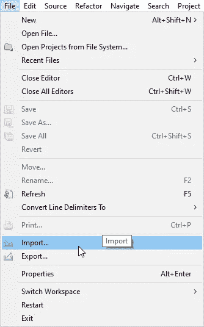

然后选择常规>将现有项目放入工作区，然后单击“下一步>”

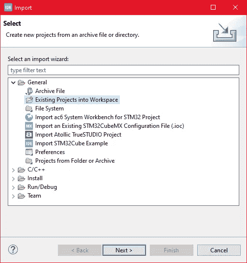

确保您已经在“选择根目录:”中选择了您的工作空间

您应该看到项目“stm32_bleuio_SHT85_example”，选中它并单击“Finish”。

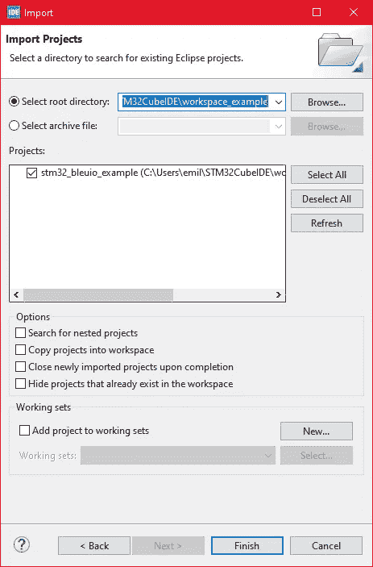

# 运行示例

将代码上传到 STM32 并运行示例。连接到 STM32 的 USB 加密狗将自动开始广告。

# 从网络浏览器向 LCD 屏幕发送消息

将 BleuIO 加密狗连接到电脑。运行 web 脚本以连接 STM32 上的另一个 BleuIO 加密狗。现在你可以向液晶显示屏发送信息了。

为了让这个脚本工作，我们需要

*   [BleuIO USB 加密狗](https://www.bleuio.com/)连接到电脑。
*   [BleuIO javascript 库](https://www.npmjs.com/package/bleuio)
*   Chrome 78 或更高版本，并且需要启用 chrome://flags 中的**# enable-experimental-we B- platform-features**标志
*   卷筒纸捆扎机— ( [包裹 js](https://parceljs.org/) )

创建一个名为 index.html 的简单 Html 文件，它将作为脚本的前端。这个 Html 文件包含一些按钮，帮助连接和读取来自连接到 stm32 的远程加密狗的广告数据。

```
<!DOCTYPE html>
<html lang="en">
  <head>
    <meta charset="UTF-8" />
    <meta http-equiv="X-UA-Compatible" content="IE=edge" />
    <meta name="viewport" content="width=device-width, initial-scale=1.0" />
    <link
      href="https://cdn.jsdelivr.net/npm/bootstrap@5.1.3/dist/css/bootstrap.min.css"
      rel="stylesheet"
      integrity="sha384-1BmE4kWBq78iYhFldvKuhfTAU6auU8tT94WrHftjDbrCEXSU1oBoqyl2QvZ6jIW3"
      crossorigin="anonymous"
    />
    <title>Send message to STM32 LCD display using Bluetooth LE</title>
  </head>
  <body class="mt-5">
    <div class="container mt-5">
      <h1 class="mb-5">Send message to STM32 LCD display using Bluetooth LE</h1>
      <button class="btn btn-success" id="connect">Connect</button>
      <div class="row">
        <div class="col-md-4">
          <form method="post" id="sendMsgForm" name="sendMsgForm">
            <div class="mb-3">
              <label for="msgToSend" class="form-label">Your Message</label>
              <input
                type="text"
                class="form-control"
                name="msgToSend"
                id="msgToSend"
                required
                maxlength="60"
              />
            </div> <button type="submit" class="btn btn-primary">Submit</button>
          </form>
        </div>
      </div> <br />
      <button class="btn btn-danger" id="clearScreen" disabled>
        Clear screen
      </button>
    </div> <script src="script.js"></script>
  </body>
</html>
```

创建一个名为 script.js 的 js 文件，并将其包含在 Html 文件的底部。这个 js 文件使用 BleuIO js 库来编写 AT 命令并与其他加密狗通信。

```
import * as my_dongle from 'bleuio'
const dongleToConnect='[0]40:48:FD:E5:2F:17'
document.getElementById('connect').addEventListener('click', function(){
  my_dongle.at_connect()
  document.getElementById("clearScreen").disabled=false;
  document.getElementById("connect").disabled=true;
  document.getElementById("sendMsgForm").hidden=false;
})document.getElementById("sendMsgForm").addEventListener("submit", function(event){
    event.preventDefault()
    console.log('here') my_dongle.ati().then((data)=>{
        //make central if not
        if(JSON.stringify(data).includes("Peripheral")){
            console.log('peripheral')
            my_dongle.at_central().then((x)=>{
                console.log('central now')
            })
        }        
    })
    .then(()=>{
        // connect to dongle
        my_dongle.at_getconn().then((y)=>{
            if(JSON.stringify(y).includes(dongleToConnect)){
                console.log('already connected')
            }else{
                my_dongle.at_gapconnect(dongleToConnect).then(()=>{
                    console.log('connected successfully')
                })
            }
        })
        .then(()=>{
            var theVal = "L=1 " + document.getElementById('msgToSend').value;
            console.log('Message Send 1 '+theVal)
            // send command to show data
            my_dongle.at_spssend(theVal).then(()=>{
                console.log('Message Send '+theVal)
            })
        })

    })
  });document.getElementById('clearScreen').addEventListener('click', function(){
    my_dongle.ati().then((data)=>{
        //make central if not
        if(JSON.stringify(data).includes("Peripheral")){
            console.log('peripheral')
            my_dongle.at_central().then((x)=>{
                console.log('central now')
            })
        }
    })
    .then(()=>{
        // connect to dongle
        my_dongle.at_getconn().then((y)=>{
            if(JSON.stringify(y).includes(dongleToConnect)){
                console.log('already connected')
            }else{
                my_dongle.at_gapconnect(dongleToConnect).then(()=>{
                    console.log('connected successfully')
                })
            }
        })
        .then(()=>{
            // send command to clear the screen
            my_dongle.at_spssend('L=0').then(()=>{
                console.log('Screen Cleared')
            })
        })

    })
})
```

该脚本有一个连接到计算机 COM 端口的按钮。有一个文本字段，你可以在那里写你的信息。您的信息将显示在连接到 STM32 板的 LCD 屏幕上。

要连接到 STM32 上的 BleuIO 加密狗，请确保 STM32 已通电且已连接了 BleuIO 加密狗。

# 获取 MAC 地址

按照步骤获取连接到 STM32 的加密狗的 MAC 地址

```
- Open this site https://bleuio.com/web_terminal.html and click connect to dongle.
- Select the appropriate port to connect.
- Once it says connected, type ATI. This will show dongle information and current status.
- If the dongle is on peripheral role, set it to central by typing AT+CENTRAL
- Now do a gap scan by typing AT+GAPSCAN
- Once you see your dongle on the list ,stop the scan by pressing control+c
- Copy the ID and paste it into the script (script.js) line #2
```

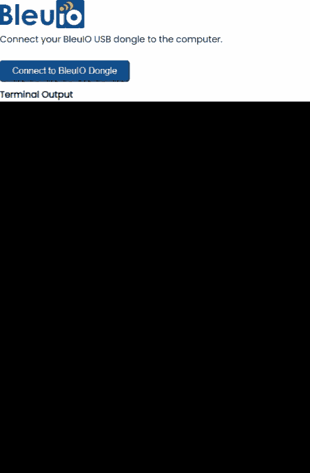

# 运行 web 脚本

你需要一个网络捆扎机。可以使用 [parcel.js](https://parceljs.org/)

一旦安装了包 js，转到 web 脚本的根目录并键入**" package index . html "**。这将启动您的开发环境。

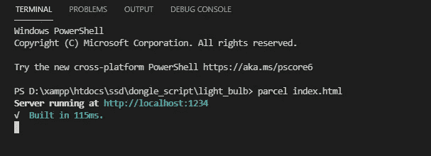

在浏览器上打开脚本。对于这个例子，我们打开了 [http://localhost:1234](http://localhost:1234)

您可以轻松地连接到加密狗，并将您的信息发送到 LCD 屏幕。响应将显示在浏览器控制台屏幕上。

web 脚本如下所示

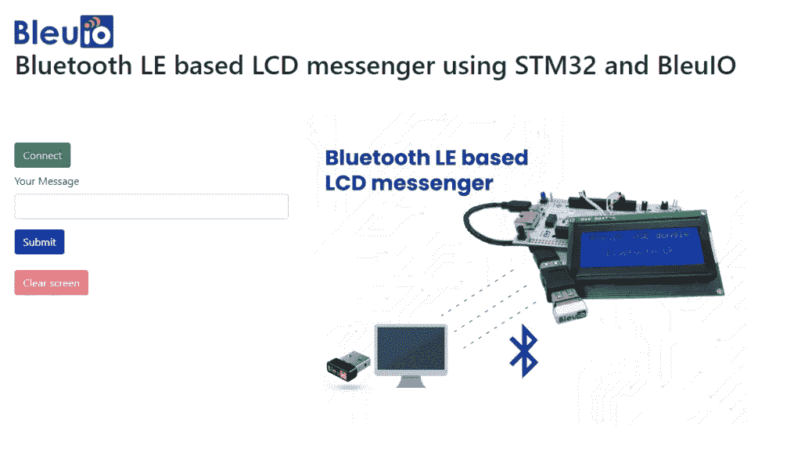

# 输出

该信息将显示在 LCD 屏幕上。

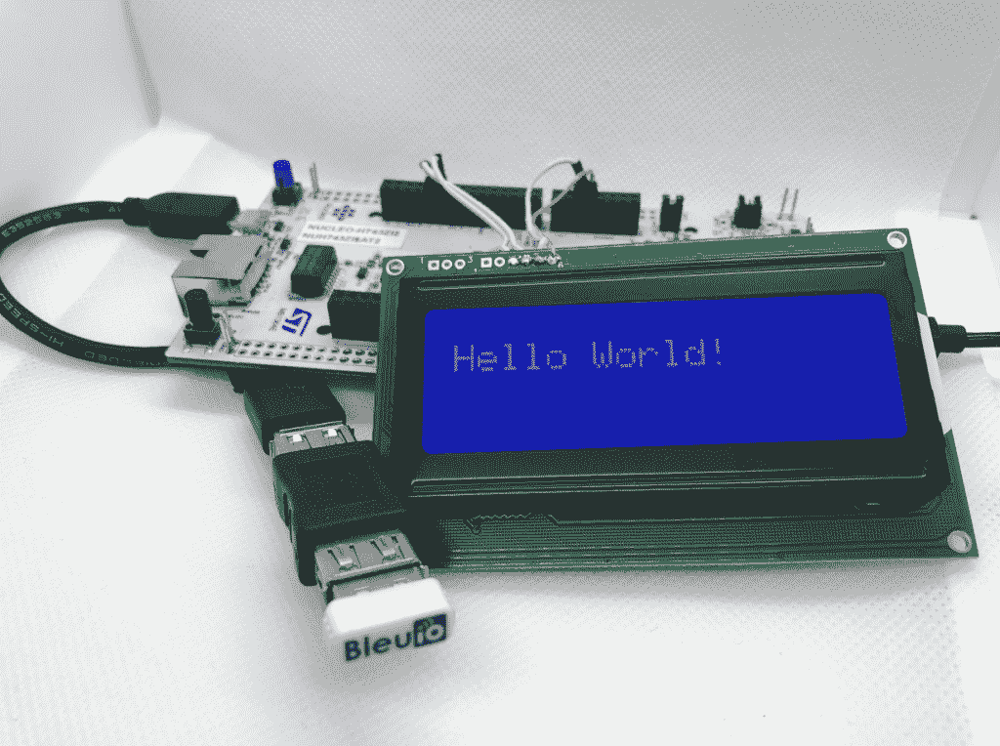

# 工作项目视频