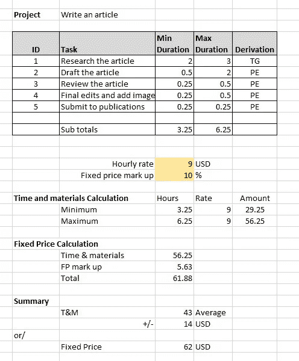

# 在大约 3.4 分钟内虚张声势你的估计

> 原文：<https://blog.devgenius.io/bluff-your-estimate-in-roughly-3-4-minutes-c2961364b0a3?source=collection_archive---------5----------------------->

## 关于如何准确猜测的大致指南

## 如何像专业人士一样估算！

[斯科特·格雷厄姆](https://unsplash.com/@homajob?utm_source=medium&utm_medium=referral)在 [Unsplash](https://unsplash.com?utm_source=medium&utm_medium=referral) 上拍照

> 估计=一个近似的计算

# 规则 1——用数学方法计算结果

这意味着有一些数据，并应用一个公式来计算答案。理想情况下，在 Excel 电子表格中做这件事，不仅看起来专业，而且允许你模拟不同的场景。模拟不同的场景意味着你对某些事情胡乱猜测，并检查结果是否太不可思议。

# 规则 2 —定义 5 条以上的数据

数据越多越好。当你把这些数据整合到你的公式中时，它看起来会更令人印象深刻。这可以是将项目分成至少 5 个阶段，分配给 5 个或更多的人，或者描述步骤和活动。

# 规则 3——记录你是如何得出这些数字的

对于每个数字，例如完成一项任务需要多长时间，添加一个快速注释或代码，说明您是如何得出该数字的。这不仅使它看起来科学、合理、健壮，因此当人们质疑它时，它是可以辩护的。一些好的代码是:

*   PE——以前类似任务的经验，建造一个 2 床房子的时间，编写 5 个屏幕的移动应用程序的时间。
*   EX——新任务的外推，但基于类似的较小/较简单的先前任务。在建造了一个 2 床的房子之后，是时候建造一个 3 床的房子了。是时候建立一个 7 页的移动应用程序了，之前已经建立了一个 5 屏的应用程序。
*   他-启发式，一些标准和简单任务的数字数据，然后可以扩展。例如，砌一块砖的时间，写一个函数的时间。
*   TG——一个人的总猜测。
*   GG —分组猜测，将多人的猜测输入到电子表格中，然后取平均值。
*   规划扑克，类似于集体猜测，但有一些讨论、辩论和修改猜测，直到你达成一致。

# 规则 4——不要精确

对于每个数字，请描述其模糊程度。例如，将其表示为一个范围，例如，从 3 到 5 的小时率，1 分钟到 4 分钟的砌砖时间。或者给它一个准确度的指示，例如高、中、低(稍后将这些词与百分比相关联)，或者只显示百分比。例如 10%的不确定性、5%的估计精度、4%的误差容限。

# 现在是什么样子…

文章作者图片

# 别虚张声势了

以上四个步骤很容易遵循，也是一种增加足够细节来欺骗你的方法。事实上，你现在已经有了足够的细节、细目和估计，你不是在虚张声势。**干得好！**

这可能看起来又快又简单，但是您现在有了一个估计:

*   结构化的
*   有一个细节层次
*   可追溯到关键值
*   以某种方式表达结果，以显示其中存在不确定性
*   可以编辑和调整，以添加或删除项目，修改估计和工作的项目，可能能够满足每个人的期望和假设。

# 进一步阅读

 [## 如何不传达一个估计！

### 敏捷评估及其导致的混乱

blog.devgenius.io](/how-not-to-communicate-an-estimate-fef77d5b40aa)  [## 从评估中阻止团队争论的 4 种方法

### 偶然地，你自己看起来不错，会让团队中的其他人看起来很差

blog.devgenius.io](/4-ways-to-stop-team-disputes-from-estimates-23eacf6e85b3) 

# 关于作者的更多信息

Greg 是一名经验丰富的软件专业人士，也是[**outsource . dev**](https://outsource.dev/)**，**的首席技术官，他曾在多家公司工作过，现在热衷于帮助他人在软件开发、管理和外包方面取得成功。

如果你喜欢这篇文章，那么请**鼓掌**和**跟随**我。