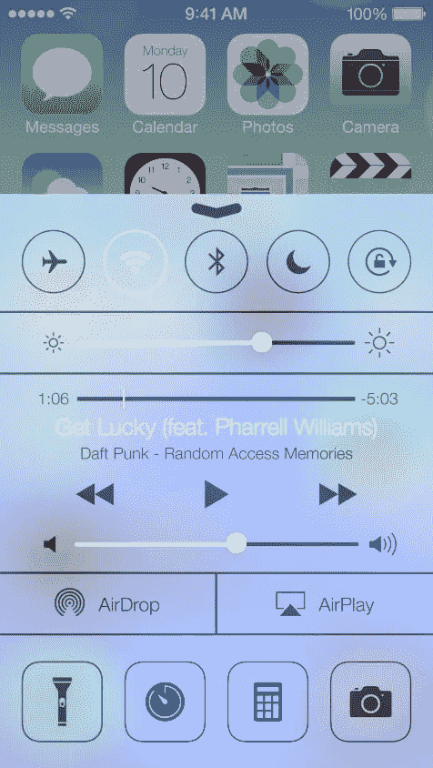
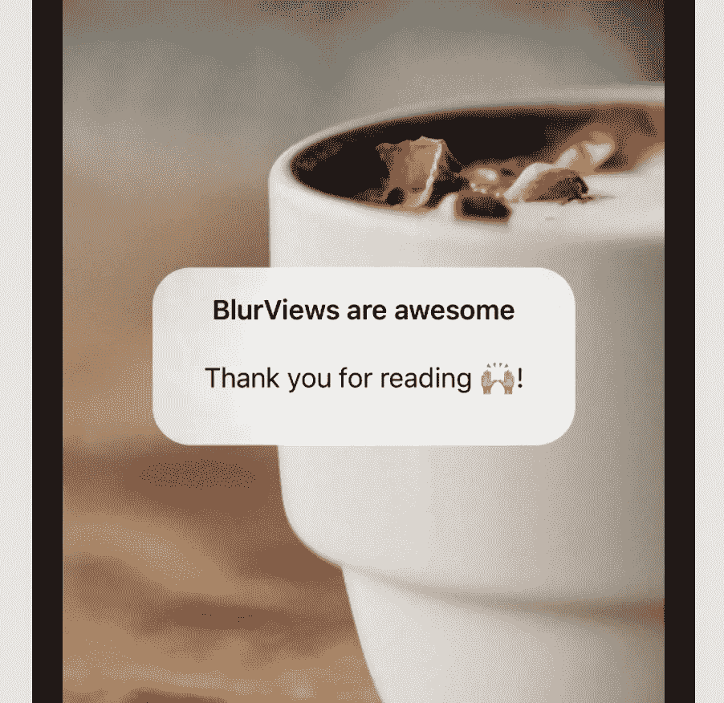

# SwiftUI 中的模糊效果

> 原文：<https://blog.devgenius.io/blur-effect-with-vibrancy-in-swiftui-bada837fdf50?source=collection_archive---------6----------------------->

如果你接触智能手机的时间够长，你可能还记得 iOS 7。这是对 iPhone 的一次巨大更新，不仅带来了新的特性和功能，还带来了全新的设计。iOS 的这次更新不亚于对操作系统的外观和感觉的一次全面革新。

更有趣的变化之一是半透明工具栏和背景的出现，如控制中心。那种“模糊”的“毛玻璃”背景效果，这种背景足够透明，可以分辨出背后有什么东西。看起来真好😍



iOS 7 上的控制中心

现在有一种非常简单的方法通过`UIVisualEffectView`来实现模糊效果。

您可以马上看出这来自于`UIKit`,这意味着可能需要一些调整才能在 SwiftUI 中使用它。

我们开始吧！

# 创建模糊视图

当我们需要 SwiftUI 中的`UIKit`组件时，我们通常求助于`UIViewRepresentable`协议。这个协议的目的是让我们将 SwiftUI 状态和生命周期事件翻译成`UIKit`。例如，在 SwiftUI 视图中，当它们的状态改变时，它们经常被销毁和重新创建，而在`UIKit`中，UIView 通常被保存和更新。

让我们从创建一个实现`UIViewRepresentable`协议的`BlurView`开始。

## 设置`UIViewRepresentable`

这里的两个重要方法是`makeUIView`和`updateUIView`，前者在视图需要初始化时被调用，后者在 SwiftUI 检测到变化并要求`BlurView`更新其布局、位置等时被调用。

这里，我们还将指定我们将要使用的`UIKit`视图的类型，即`UIVisualEffectView`

## 创建 UIVisualEffectView

`UIVisualEffectView`是一个帮助我们创造视觉效果的物体。在我们的例子中，我们的目标是创建一个模糊效果，由`UIBlurEffect`表示:

```
UIVisualEffectView(effect: UIBlurEffect(style: .systemMaterial))
```

模糊效果有几种风格，如`UIBlurEffect.Style`枚举所描述的。在上面的截图中，我使用`systemMaterial`作为默认值。

现在`BlurView`看起来是这样的:

你可能会问为什么我们需要在视图更新时重新应用模糊效果？答案就在 UIKit 内部，模糊效果考虑了整个视图层次。例如，由于模糊效果创造了透明感，每当我们的模糊视图下的内容改变时，就需要重新应用模糊。

截至目前，模糊风格被硬编码为`.systemMaterial`。如果我们可以在布局中使用`BlurView`时选择模糊效果样式，那就太好了。

为此，我将创建一个初始化器，它接收要用作参数的特定样式:

# 来测试一下吧！

这是一大段代码，但是让我们看看它是什么样子的。

我们创建的`BlurView`现在可以用作不同组件的背景视图。大概是这样的:

```
VStack(spacing: 6) {
  Text("BlurViews are awesome")
}
.background(BlurView())
```

普通白色背景上的模糊效果不会很有趣，所以我打算用纯色填充下面的视图，这样我们就可以看到这种效果了。


内容视图预览。swift

*   我使用 ZStack 来排序视图的内容——背景颜色，然后在它上面使用包含一些文本的 VStack。
*   BlurView 作为 VStack 的背景应用。

如果我们使用图片作为背景而不是纯色，效果会更好:

