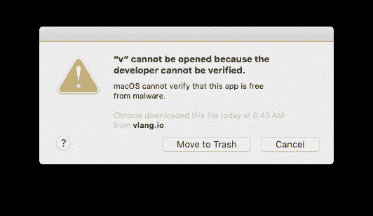
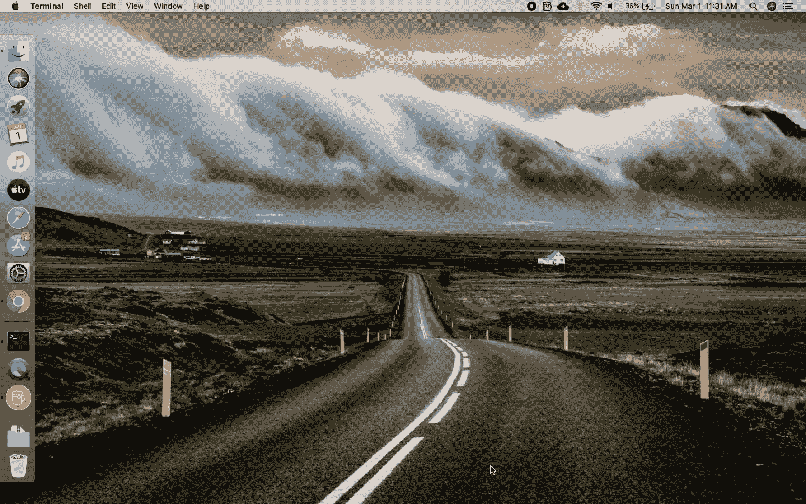
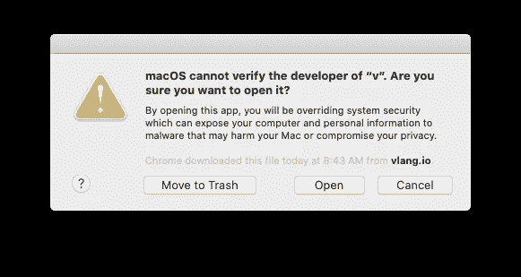
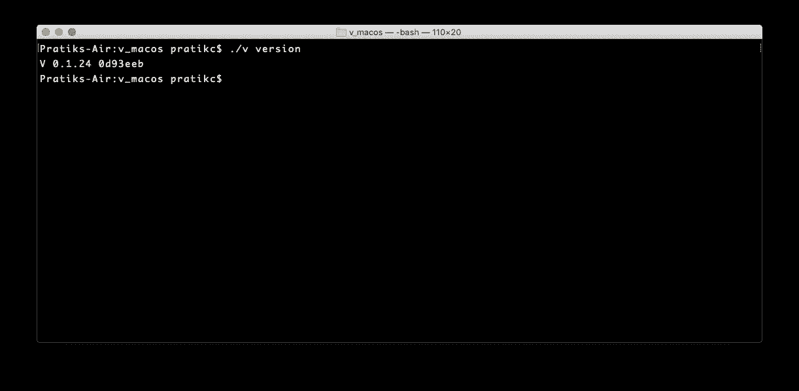
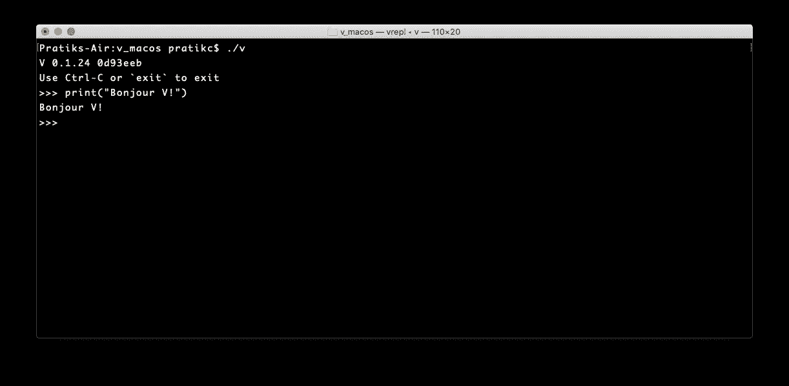

# 你好！

> 原文：<https://blog.devgenius.io/bonjour-v-75bac9ee7599?source=collection_archive---------1----------------------->

## 让我们来认识一下编程组的新成员


照片由[屋大维丹](https://unsplash.com/@octadan?utm_source=medium&utm_medium=referral)在 [Unsplash](https://unsplash.com?utm_source=medium&utm_medium=referral)

> [V 是一种全新的编程语言](https://vlang.io/)，在编程社区掀起了不小的波澜。

几个月前，当我阅读这篇文章时，我偶然发现了它。

虽然 V 在本文写作时仍处于初级阶段(在 [SO](https://stackoverflow.com/) 上关于它的问题只有 [***六个***](https://stackoverflow.com/questions/tagged/vlang)*)，但它正在受到欢迎(它在 GitHub 上有大约 [**15.9K** 星星](https://github.com/vlang/v/stargazers))。*

*它也正在积极开发中(正如最近在其 [GitHub repo](https://github.com/vlang/v) 中提交的内容所证明的)。*

*所以，我想，为什么不试一试。毕竟，做一个早期采用者有什么坏处，对吗？*

*所以，让我们开始吧！*

# *第一步。在本地机器上安装 V*

> *你可以用预建的二进制安装 V(比如[这个](https://github.com/vlang/v/releases/latest/download/v_macos.zip)，也可以直接[编译](https://github.com/vlang/v#installing-v-from-source)它的[源代码](https://github.com/vlang/v)。*

*由于我使用的是运行[m*acOS Catalina*](https://www.apple.com/in/macos/catalina/)*(版本 10.15.3)* 的 *MacBook Air (13 英寸，2007 年)，所以我下载了[这个用于 macOS 的](https://github.com/vlang/v/releases/latest/download/v_macos.zip)预建二进制文件。**

*我提取了它的内容，启动了 [*macOS 终端*](https://support.apple.com/en-in/guide/terminal/welcome/mac) *。*然后，我导航到提取预构建二进制文件的目录，并在终端中启动以下命令:*

```
*./v version*
```

*它应该显示 V 的当前版本，如下所示:*

```
*V 0.1.24 0d93eeb*
```

*但是，屏幕上弹出了以下提示:*

**

*[https://support.apple.com/en-us/HT202491](https://support.apple.com/en-us/HT202491)*

*你看，macOS 阻止了没有经过 [*公证*](https://developer.apple.com/documentation/xcode/notarizing_macos_software_before_distribution) *的应用程序的执行(意思是，苹果无法验证应用程序的来源，因此，无法保证应用程序没有恶意)。**

*那么，我们现在做什么？放弃？*

*绝对不行！*

*有一个变通办法:我们可以告诉 macOS 为这种*未注册的*应用程序破例，方法是导航到*系统首选项>安全性&隐私*并点击“无论如何都允许”按钮。看一看下面的 gif 图，你会有更好的想法:*

**

*既然我们已经告诉了保镖😀)让客人进来，我们应该可以开始聚会了吧？(通过终端运行 V，没有任何问题)*

*但是没有！😯事情不是这样的。当我们再次在终端上执行`./v version`时，会弹出以下屏幕:*

**

*macOS 再次阻止应用程序的执行，但这一次，有一个“打开”按钮，让用户能够“运行”应用程序。*

*这是我们不久前遇到的同一个弹出窗口，但这一次，macOS 为我们提供了“打开”按钮。让我们点击它，看看会发生什么:*

**

*v 在终端上打印它的版本号。*

*只要我们单击“Open”,`./v version`命令就会执行并在终端上打印输出。*

# *第二步。开始用 V 写代码*

> *现在 V 的编译器已经在我们的本地机器上运行了，我们可以开始用 V 写程序了。*

*但是等等！难道我们不需要一个像 [*VSCode*](https://code.visualstudio.com/) *，*那样的花哨的 IDE，以及它所有优雅的主题和插件吗😄(开个玩笑，这是我最喜欢的 IDE。)*

*不，至少还没有！*

*v 提供了一个[*【REPL】*](https://en.wikipedia.org/wiki/Read%E2%80%93eval%E2%80%93print_loop)*接口，让你不用在硬盘上创建任何文件就可以随意使用这种语言。**

**所以，按照[*Hello World Tradition*](https://en.wikipedia.org/wiki/%22Hello,_World!%22_program)*的规定，让我们用 V:***

```
***print("Bonjour V!")***
```

***按下键盘上的“回车”键，让魔法开始吧！***

******

***传统的“你好，世界”节目，或者在这种情况下“Bonjour V！”使用 V 的 REPL 接口编写的程序***

***瞧啊。成功了！***

***就这样，伙计们！***

***请继续关注更多关于 V 编程的故事。***

***再见，程序爱好者们！***