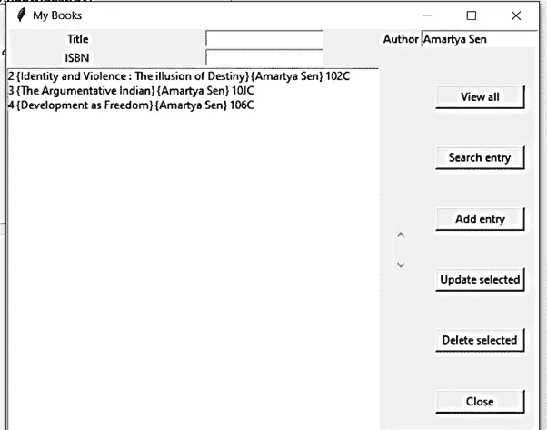

# 图书管理系统，使用 Python 中的 Tkinter 和 SQLite3 实现简单的用户界面和数据库创建

> 原文：<https://blog.devgenius.io/book-management-system-with-simple-ui-and-database-creation-using-tkinter-and-sqlite3-in-python-923b1ce0af8d?source=collection_archive---------2----------------------->

## 创建和管理你的书籍的小型数据库。

卡斯帕·卡米尔·鲁宾在 [Unsplash](https://unsplash.com?utm_source=medium&utm_medium=referral) 上的照片

# 介绍

迷你项目“图书管理系统”是一个管理图书详细信息的示例项目。该项目旨在使用 Python 语言开发一个图书管理系统，使组织能够维护其图书图书馆。

该项目演示了使用 Python 的 Tkinter 图形库创建系统的图形用户界面。

该应用程序使用基本的 Python 函数在屏幕上生成菜单选项、标题框、输入消息框、列表和打印文本。

为了从用户处获取信息并基于所选择的命令选项对该信息执行各种任务，已经创建了各种函数。

应用程序使用元组数据结构来显示对数据执行的所有操作的结果。

# 问题陈述

我们使用图书管理系统构建了一个数据库。这个数据库包含关于书籍的详细信息:书名、作者和发行号(不能更改)。
管理系统为用户或组织成员提供对存储在数据库中的数据执行基本的操作数据库/SQL 操作。

1.  **添加条目** —执行插入操作，将新的行或元组添加到数据库内的关系中。这个元组将由用户给出的条目组成，包括书名、作者和发行号。
    **SQL →("插入到账面值(NULL，,?,?)“，(书名，作者，isbn，)**
2.  **查看全部** —执行从表格中搜索*的操作。它显示表中出现的所有行。
    **SQL→(" SELECT * FROM book ")**
3.  **搜索条目** —给定图书名称和作者姓名的特定值，它搜索并显示具有这些值的所有条目。
    **SQL→(" SELECT * FROM book WHERE title =？还是作者=？”，(标题，作者，)**
4.  **更新** —给定一个新的行值，这个 SQL 操作将更新表中的值。
    **SQL →“更新图书集标题=？，作者=？其中 id=？"，(标题，作者，id，)**
5.  **删除** —根据所选行的索引值，删除从表格中选择的行。
    **SQL →("从 id=？"的书中删除？"，(id，)**

# 程序要求和模块

1.  **SQLite3 模块**:提供符合 DB-API 2.0 规范的 SQL 接口。您不需要单独安装该模块，因为默认情况下，Python 2.5 . x 版及以后的版本附带了该模块。
2.  **Tkinter** : tkinter 是 Python 中最常用的 GUI 方法。它是 Python 附带的 Tk GUI 工具包的标准 Python 接口。带有 tkinter 的 Python 输出了创建 GUI 应用程序的最快和最简单的方法。
3.  **Label()** :短文本显示区
4.  **Button()** :实现“push”按钮。
5.  Window() :这是我们显示所有输出的空间。窗口是带有标题和边框的顶层框架。框架的大小包括为边框指定的任何区域。

添加条目

查看全部

基于作者输入的搜索条目

更新选定的值

删除选定内容(最后一行为空)

— — — — — — — — — — — — — — — — — — — — — — — — — — — — — —

图书管理系统的源代码可以从 Github 资源库获得:

 [## srinidhi 14 vaddy/Book-Management-System-with-Database-and-Simple-UI-using-Tkinter-and-SQLite3-in-Py…

### 迷你项目“图书管理系统”是一个管理图书详细信息的示例项目。该项目旨在开发…

github.com](https://github.com/srinidhi14vaddy/Book-Management-System-with-Database-and-Simple-UI---using-Tkinter-and-SQLite3-in-Python) 

欢迎所有建议、意见和反馈！如果认为有价值，请鼓掌奖励！