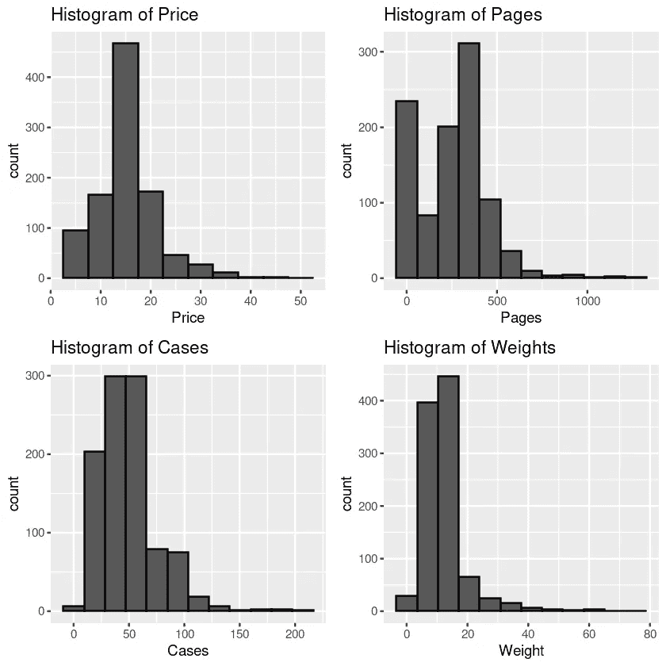
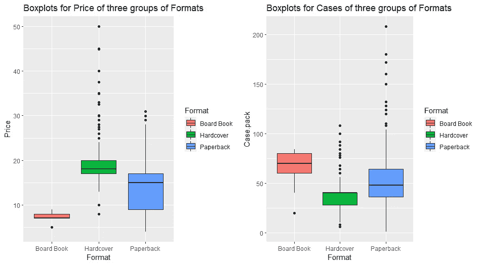
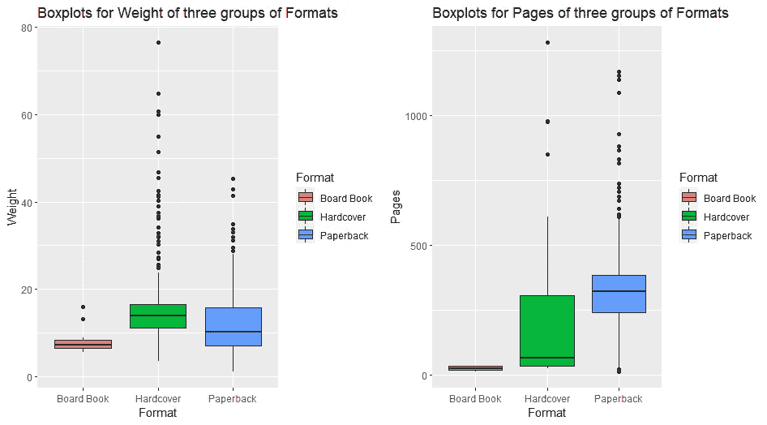
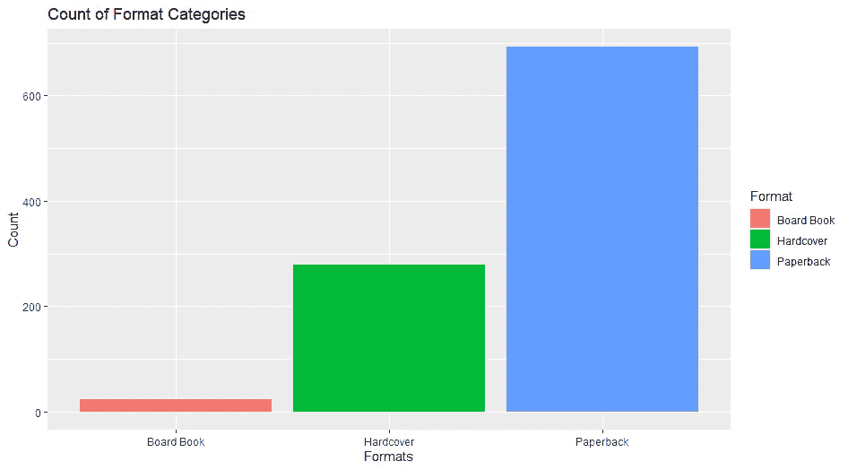
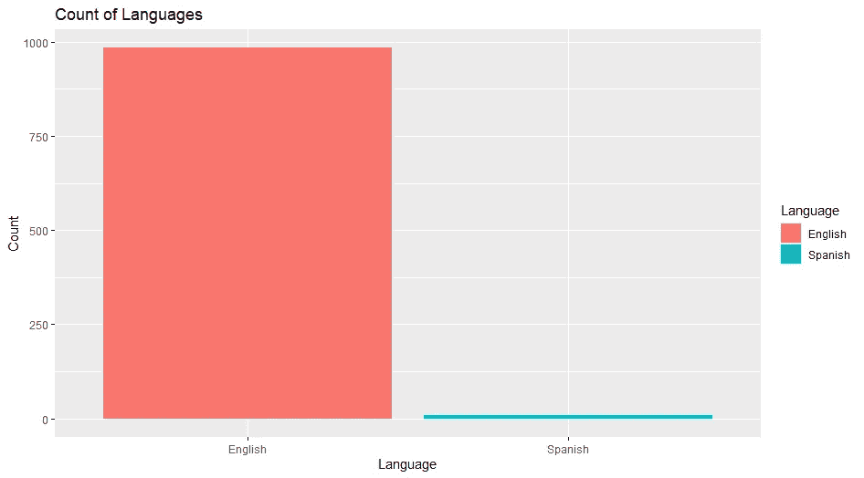
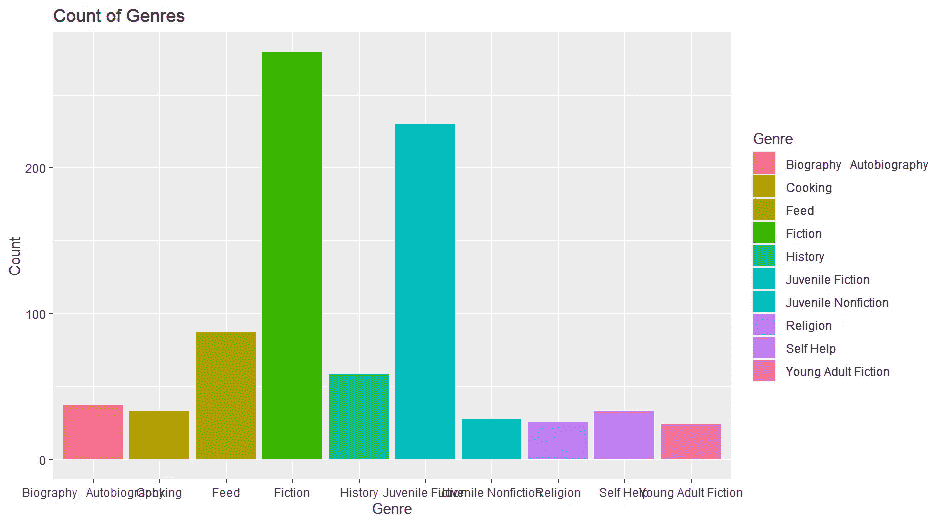
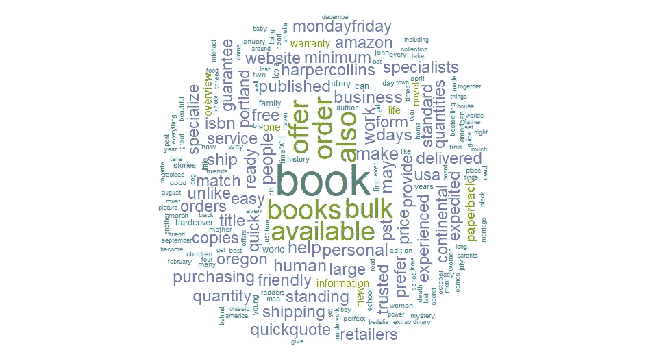
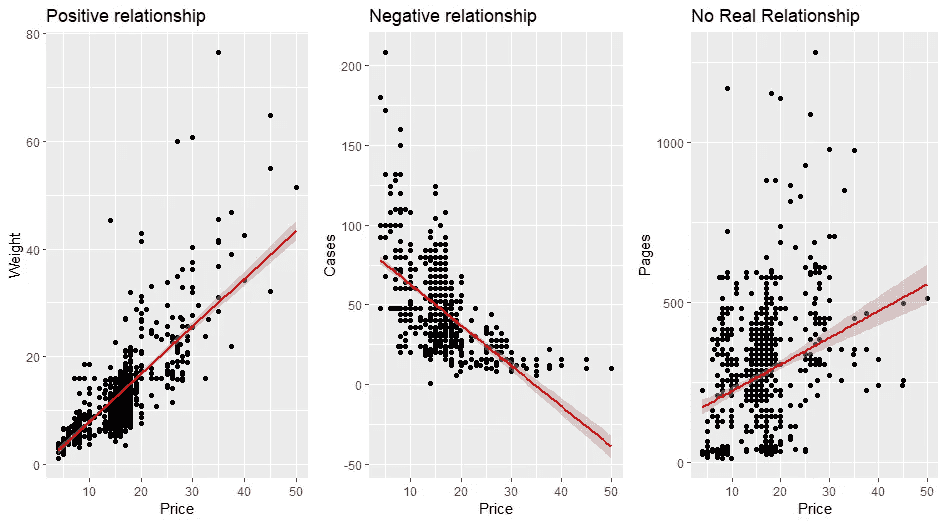
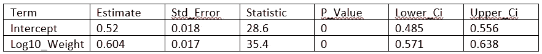
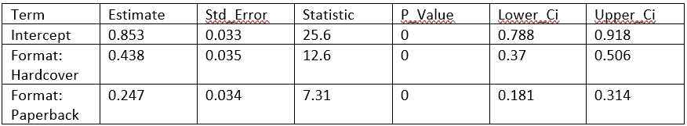

# 书店数据集已分析

> 原文：<https://blog.devgenius.io/book-store-data-set-analyzed-7dab42be264f?source=collection_archive---------7----------------------->

Extra:使用 R 分析一个书店数据集。

[书店](https://web.facebook.com/61666748487/photos/10159285755268488/)

# 介绍

我再次在 Kaggle 上滚动，因为我决定找到一个有趣的数据集来改进我的数据清理、探索性分析和预测性分析。几分钟后，我发现了大规模书店数据集，并认为尝试使用这个数据集会很有趣。

# 讨论的主要问题

*   数字变量(价格、页数、重量和案例)的分布情况如何？
*   数值变量按格式的分布是怎样的？
*   格式的频率是多少？
*   按语言分类的书籍出现频率是多少？
*   有多少流派被认可？
*   出版书籍的年份
*   按语言和格式统计图书数量
*   图书描述的文本挖掘分析
*   价格和其他数值变量有什么关系？
*   用基本回归预测带有数字和分类解释变量的图书价格
*   基本模型评估和选择

# 数据源和工具

# 数据源

## 数据来源于哪里？

可以通过以下网址访问这些数据:【https://www.kaggle.com/yamqwe/bulk-bookstore-dataset 

## 是怎么收集的？

数据由 crawlfeeds.com 的[通过网络搜集。](http://crawlfeeds.com/)

## 数据集的大小是多少？

数据集包含 1000 个观察值(书籍)。

## 数据集中变量的数量和类型是什么？

数据集中有 20 个变量。变量包括与图书描述、出版商、价格、重量和格式相关的定量和分类数据。

# 使用的工具

*   r 编程

以防有更多的技术用户阅读这篇文章，并对分析的源代码感兴趣。请随意通过我的 Kaggle 笔记本访问代码:[https://www . ka ggle . com/selvynallotey/bulk-book store-EDA-basic-regression](https://www.kaggle.com/selvynallotey/bulk-bookstore-eda-basic-regression)

# 数据清理和转换

我设计了两个新变量来帮助我分析这个数据集。其中包括:

*   类型
*   发布日期

数据的清理也包含在我上面提到的 Kaggle 笔记本链接中。

# 探索性分析结果

## 数字变量(价格、页数、重量和案例)的分布情况如何？

图 1.1

从直方图来看，根据变量的大多数数据似乎是正偏的，代表一个相当不对称的数据集。除此之外，大多数书的价格大约在 7 美元到 20 美元之间。大多数书的页数在 250 页到 500 页之间。

图 1.2

就数据集中的价格而言，纸板书和硬封面样本的尺寸与纸质版相比要小一些。似乎也有一些与价格的纸质背盒图相关的左偏，除此之外，精装盒图也比其他考虑价格的格式显示出更多的异常值。(参见图 1.2)

图 1.3

这些是按格式排列的数值变量的剩余箱线图。重量变量在精装格式中显示了大量的异常值。不同格式的中间值彼此差异很大，该图也突出了不同格式的传播。(参见图 1.3)

图 1.4

平装本书籍占据了书店的主导地位，反映了 600 多本储存的书籍，而精装本书籍位居第二。我认为书店已经选择集中销售更多的平装本书籍，因为它们比精装书或纸板书便宜得多，所以他们可以销售大量的书籍，而不一定优化精装书的价格。(参见图 1.4)

图 1.5

根据数据集，只发现了两种独特的书籍语言。这些语言包括英语和西班牙语，英语书籍几乎构成了整个数据集，而西班牙语书籍似乎微不足道。(参见图 1.5)

图 1.6

流派变量是我从面包屑变量设计的一个变量。在设计了这个变量之后，总共有 47 个流派。然而，我决定对其进行切片，以显示数据集中最具代表性的 10 个流派。小说和少年小说位居第一和第二，占了数据集中可用书籍的一半以上。可以肯定地说，这家书店非常迎合中学生的口味。(参见图 1.6)

# 文本挖掘分析

图 1.7

数据集中还提供了原始描述变量，我试图对其进行清理，以消除变量列中的所有 html 标记。我没有尝试去做的是删除主导单词云的普通单词，这些单词不会提供关于书中大多数故事的主题或故事线的任何见解。所以本质上，大部分的关键词都是关于所有书籍的销售，而不一定是它们的故事。我将尝试在以后的新版本代码中消除这一点，以便使用文本挖掘提供更有洞察力的分析。

# 变量之间的关系

对我来说，试图发现变量之间的一些关系是很重要的。我决定测试价格和其他数字变量之间的线性关系，因为这似乎是对书店老板有用的唯一相关分析。

图 1.8

绘制重量与价格、案例与价格、页数与价格的散点图。唯一与价格没有实际关系的变量是页数，因为它显示了 0.28 的相关性。然而，病例与价格显示了负的中度关系，传达了-0.61 的相关性。最后，重量与价格显示出非常强的正相关关系，相关系数为 0.73。正关系图显示了与直线的良好和紧密拟合，这证实了皮尔逊相关性是衡量变量重量和价格之间关系强度的合适方法。

# 用基本回归预测带有数字和分类解释变量的图书价格

使用 R 中的[modeldive](https://moderndive.com/)包，我能够构建一个非常基本的回归模型，尝试使用重量作为解释变量来预测图书的价格。

表 1.1

重量变量是右偏的，所以我决定对我的线性回归模型使用 log10(重量),以获得一个更加对称的变量，并通过将它转换为 log10(价格)对价格进行同样的操作。

模型 1: lm(log10(价格)~ log10(重量))

## 解释

该表显示，每增加一个单位的重量，书的价格就会增加 0.604 英镑。

因此，表 1.1 中的回归线方程如下:

Log10 _ Price _ hat = 0.52+0.604 * Log10 _ Weight

截距 0.52 是那些权重为 0 的书籍的平均价格，但是这实际上没有实际的解释，因为权重为 0 实际上意味着什么。

此外，我还决定使用格式变量作为分类解释变量来创建一个不同的模型。

表 1.2

模型 2: lm(log10_Price ~ Format)

## 解释

*   截距对应于 0.853 的纸板书的平均 log10_Price。
*   格式:精装书对应于具有硬封面格式的书籍，值为+0.438 是相对于纸板书的平均 log10_Price 之间的差。本质上，精装书的平均 log10_Price 是 0.853 + 0.438 = 1.291。
*   格式:平装对应于平装格式的书籍，值为+0.247 是相对于纸板书籍的平均 log10_Price 之间的差值。本质上，精装书的平均 log10_Price 是 0.853 + 0.247 = 1.1。

# 基本模型评估和选择

最后，为了评估模型，我使用残差平方和和 r 平方来比较模型并做出选择。

我在我的分析的 R 源代码中运行这些评估，这些源代码在 [Kaggle](https://www.kaggle.com/selvynallotey/bulk-bookstore-eda-basic-regression) 上公开。

## 残差平方和(模型 1)

模型 1 的残差平方和的结果是 15.8。

## 残差平方和(模型 2)

模型 2 的残差平方和的结果是 26.3。

## r 平方(模型 1)

模型 1 的 R 平方结果为 0.558。

## r 平方(模型 2)

模型 2 的 R 平方结果为 0.262。

## 型号选择

根据残差平方和评估，第一个模型更适合预测，因为它具有较低的残差平方和。

最后，基于计算的 R 平方值，模型 1 比模型 2 说明了更高的变化，因为它说明了超过 50%的变化。

# 结论

小说类型是数据集中最受欢迎的书籍类型。很可能你可以根据书的重量来预测书的价格。