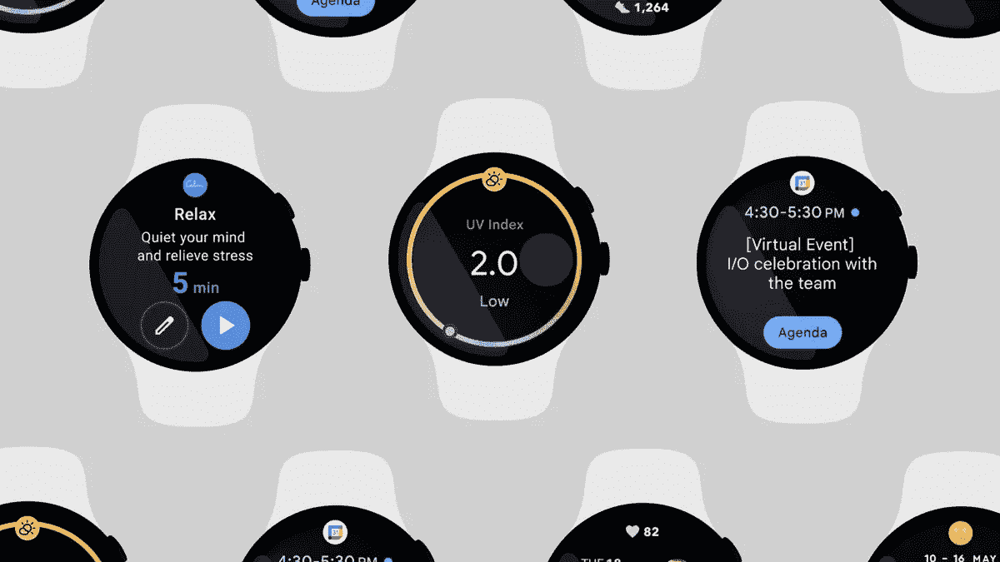

# 提升我的可穿戴设备或如何从手表向智能手机发送/接收数据

> 原文：<https://blog.devgenius.io/boost-my-wearable-or-how-to-send-receive-data-from-watch-to-smartphone-83655e57e429?source=collection_archive---------0----------------------->

# 介绍

所以，正如你已经知道的…

是的，说“正如你已经知道的，可穿戴设备已经在几年前来到我们身边”是很明显的，但是我还没有为我的故事开头发明任何好的“开头”。但是，是的，你们中的一些人(甚至可能是大多数人)目前正在使用 alien Wear OS 设备或那些正常的设备，这些设备来自三星。

简单的用户，他们还没有进入开发阶段，至少现在还没有，甚至不要去猜测，在操作系统方面有什么不同。

当你的一些父母来的时候，会问这样的问题:“嘿，给我做一个应用程序，当行星游行来的时候，独角兽会把彩虹糖果送到我们的房子里。没有吗？可恶，你是程序员！”

多讨厌啊！

我开始解释，有 X 个问题与 Y 个情况密切相关，而 Z 则积极地不允许这样做。

# 开始穿吧！



哦，等等，我忘了说，那个代码是写在**科特林**上的，一定要……知道**科特林**，使用**科特林**，做一个**科特林**，不要在复制/粘贴**科特林**代码时混淆:)

有一次……吃午饭时，我在纠结这样一个问题:我如何将数据发送到可穿戴设备，并把动作传回我的智能手机，它已经与智能手机配对了。是的，我已经找到了一些解决方案，这让我可以开始这项任务。

*~对于那些还不熟悉可穿戴应用的人来说，这篇文章下面有一个创建 Wear OS 项目的链接。*

因此，主要的事情是创建一个基本的 Android 应用程序和 Wear OS 应用程序，将它们绑定在一起。要点是在不丢失任何数据的情况下将数据发送到可穿戴设备。其实很简单:

```
val dataClient = Wearable.getDataClient(context)
val putDataMapRequest = PutDataMapRequest.create(path)
val dataMap = putDataMapRequest.dataMap
dataMap.putString(key, message)
val putDataRequest = putDataMapRequest.asPutDataRequest().setUrgent()
val putDataTask = dataClient.putDataItem(putDataRequest)
putDataTask.addOnCompleteListener { task -> Log.e(“HANDHELD”, “Save & prepare data to wearable -onComplete
    listener-”) if (task.result != null) {
        val dataMapItem =            DataMapItem.fromDataItem(task.result!!).dataMap
    }}
```

那么这部分代码是做什么的呢？

初始化**数据客户端**，我们能够使用*数据地图*-映射变量将密钥和消息放入地图中，以发送到能够从目的地点获取该数据的可穿戴设备，用于任何天知道的原因/解决方案。

我们的数据映射将由 **putDataMapRequest** 作为*数据请求*用 **setUrgent()** 函数处理，这意味着数据将被立即发送并且没有延迟(因为这通常发生在**非紧急数据项**中)。
然后，我们用 **addOnCompleteListener** 创建任务 **putDataTask** 来检查数据发送是否有效。此外，我们可以检查我们的**数据图**是否包含我们计划发送给 Wearable 的数据。

**注意！**所有这些代码处理任何你喜欢的类，你应该在 Android 应用程序中创建(添加到清单等)。).更多与 Wear OS 相关的代码将在下一篇文章中披露，致力于 Wear OS 的使用。


还有什么？我们需要在 Wear OS 应用程序中接收这些数据。

在穿戴端的任何类中，实现 **DataClient。OnDataChangedListener** 并覆盖 **onDataChanged()** 类:

```
override fun onDataChanged(p0: DataEventBuffer) {
     for (event in p0) {
           if (event.getType() == DataEvent.TYPE_CHANGED) {
                 val item = event.getDataItem()
                 val uri = item.getUri()
                 val path = uri.getPath()
                 val nodeId = item.getUri().getAuthority()
                 val dataItem = DataMapItem.fromDataItem(item)
                 val dataMap = (dataItem as DataMapItem).dataMapif (dataMap.getString("message_key") != null) {
     if (dataMap.getString("message_key") == "hello_world") { finish()
     }else if (dataMap.getString("message_key") == "goodbye_world") {
     finish()
}else{
     finish()
}
}
}
}
}
```

使用起来也很简单。我们覆盖了 **onDataChanged()** 函数来检查事件是否发生在我们的可穿戴设备上及其类型，初始化与我们的 *dataItem* 相关的所有变量，从 Android 应用程序映射。

最后，通过 *'message_key'* 检查我们的 **dataMap.getString()** 是否包含声明的字符串值:它是 *"hello_world"* 还是 *"goodbye_world"* ，以 finish()结束我们的 for 循环。

想象一下，你需要从 Android 应用程序向 Wearable 发送你的步数、公里数、消息、到达你的手持应用程序的通知等。使用这个简单的方法，有很多想法可以发送到你的可穿戴设备上。

我之所以决定写这篇文章，是因为我要浏览几乎所有的代码行，来描述从哪里发送的内容以及发送到哪里的内容。对那些人来说，有时需要再读一遍才能明白。当然，这个教程在 developer.android.com 网站上也有介绍。尽管如此，我还是决定指向特定的地方，让读者和我的订阅者更喜欢它。希望你喜欢这篇小文章，如果你有任何问题，请在下面的评论中留下，我会尽我所能回答。祝你周末工作愉快！

原文链接，与 War OS 实现相关:[https://developer . Android . com/training/wearables/get-started/creating](https://developer.android.com/training/wearables/get-started/creating)