# 借助 SkyWalking 的新跟踪指标关联功能，快速推进根本原因分析

> 原文：<https://blog.devgenius.io/boost-root-cause-analysis-quickly-with-skywalkings-new-trace-metrics-association-feature-64c1f4cf0691?source=collection_archive---------17----------------------->

SkyWalking 9.3.0 引入了新的功能，可以帮助您快速可视化跟踪和相应指标之间的联系。

由**吴声**

现代分布式应用程序工作的可观测性对于理解它们在各种条件下的行为以及在出现问题时进行故障排除和解决问题是至关重要的。踪迹、度量和日志被认为是可观测性栈的基本部分。踪迹是分布式系统执行的足迹，同时，度量用时间线中的数字来度量系统性能。本质上，他们从两个维度来衡量绩效。能够快速可视化跟踪和相应度量之间的联系使得快速诊断哪些过程流与潜在的病理行为相关成为可能。这个强大的新功能现在[在天行者 9.3.0](https://skywalking.apache.org/events/release-apache-skywalking-apm-9.3.0/) 中可用。

天行项目从追踪开始，从 2018 年开始专注于 100%基于采样的度量和拓扑分析。当用户面对时间序列指标的异常趋势时，如折线图上的峰值，或直方图显示 p95 和 p99 之间的较大差距，直接的问题是，为什么会发生这种情况？SkyWalking 的最新功能之一，**轨迹度量协会**，使得回答这个问题和解决根本原因变得更加容易。

# 指标是如何产生的？

天行道提供了三种计算指标的方法:

1.  从跟踪跨度构建的度量，取决于跨度的层、种类和标签。
2.  从日志中提取的指标—一种基于关键字和标签的指标提取。
3.  来自成熟和主流度量/计量系统的度量报告，如 OpenTelemetry、Prometheus 和 Zabbix。

跟踪跟踪应用程序服务之间的请求过程。大多数生成流量和性能相关指标的系统还会生成跟踪数据，这些数据要么来自服务器端基于跟踪的聚合，要么来自客户端 SDK。

# 使用天行道降低跟踪索引的传统成本

跟踪数据和可视化对于开发人员和操作人员来说都是重要的故障排除工具，因为它们在定位问题边界方面非常有用。但是，因为传统上很难找到度量和轨迹之间的关联，团队已经向跨度中添加了越来越多的标签，并通过各种组合进行搜索。这种增加仪器和搜索的趋势要求增加基础设施投资来支持这种搜索。SkyWalking 的指标和追踪关联功能有助于降低索引和搜索这些数据的成本。

# 查找相关的跟踪

当寻找度量和跟踪之间的关联时，我们处理的度量的种类决定了它们与跟踪的关系。让我们回顾一下标准的请求*比率、错误和持续时间(红色)*指标，看看它是如何工作的。

# 成功率指标

成功率由返回代码、RPC 响应代码或进程异常决定。当成功率降低时，在这个服务或 pod 的痕迹中寻找错误是寻找线索的第一个地方。

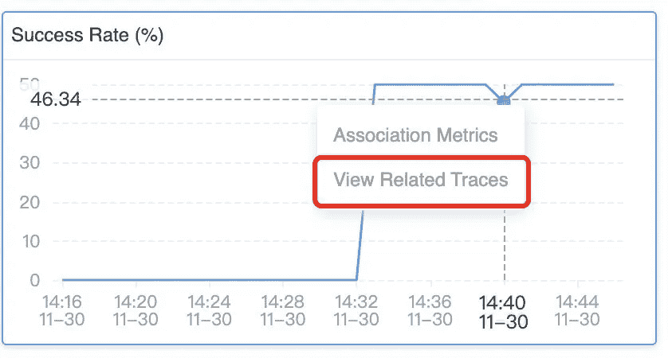

*图 1:SkyWalking 9 . 3 . 0 仪表盘上的成功率图表，可以选择查看特定时间的相关跟踪。*

从成功率的峰值向下钻取，SkyWalking 列出了在这一特定分钟内收集的所有跟踪及其错误状态(图 2):

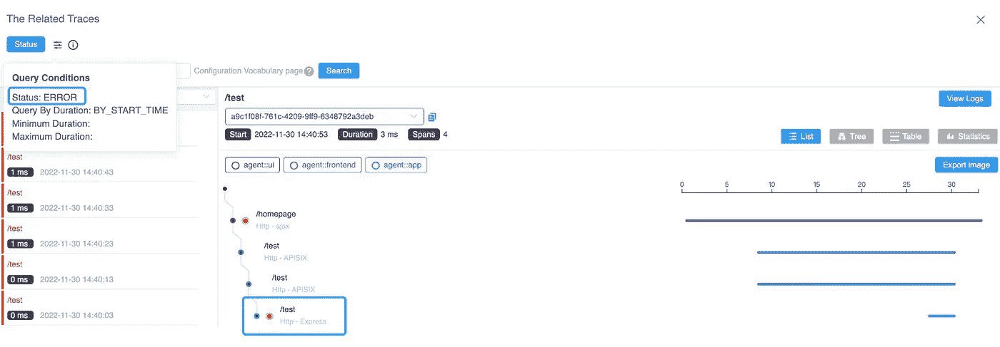

*图 2: SkyWalking 显示了带有错误状态的相关踪迹。*

对 */test* 的请求可以从跟踪中定位，span 的标签指示 HTTP 请求的 404 响应代码。

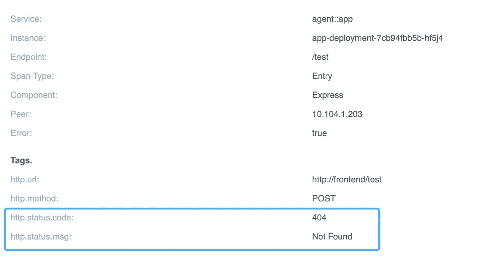

*图 3:对*[*http://frontend/test*](http://frontend/test)*的请求的详细视图，显示 URI 不存在。*

通过查看跟踪数据，很明显成功率的下降是由对不存在的 URI 的请求引起的。

# 平均响应时间

平均响应时间度量提供了服务性能的概述。当平均响应时间不稳定时，这通常意味着系统面临严重的性能影响。

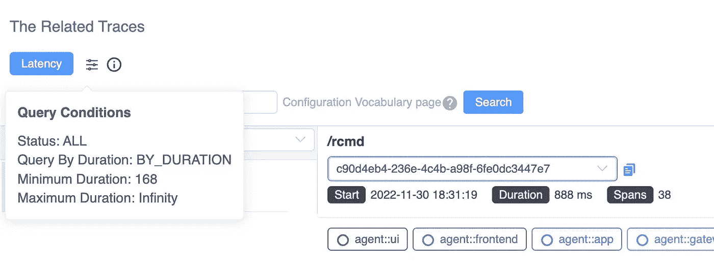

*图 4: SkyWalking 用于搜索相关跟踪的查询 UI，显示了超过特定持续时间阈值的请求的跟踪。*

当您从这个指标向下钻取时，这个查询条件(图 4)将揭示这个特定分钟内最慢的服务跟踪。请注意，至少 168 毫秒被自动添加为条件，以避免扫描数据库中的大量行。

# Apdex

AP dex——应用程序性能指数——是根据设定的阈值来衡量响应时间的指标。它测量满意的响应时间与不满意的响应时间的比率(图 5)。响应时间是从资产请求到完成交付返回给请求者的时间。

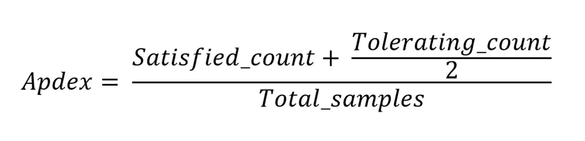

*图 Apdex 公式*

用户定义响应时间容许阈值 *T* 。在 *T* 或更短时间内处理的所有响应都令用户满意。

例如，如果 *T* 是 1.2 秒，而一个响应在 0.5 秒内完成，那么用户是满意的。所有大于 1.2 秒的响应都令用户不满意。超过 4.8 秒的响应会让用户感到沮丧。

当 Apdex 分值降低时，我们需要从两个角度寻找相关痕迹:慢速痕迹和错误状态痕迹。SkyWalking 新的相关跟踪功能提供了一种直接从 Apdex 图中快速查看二者的方法(图 6)。

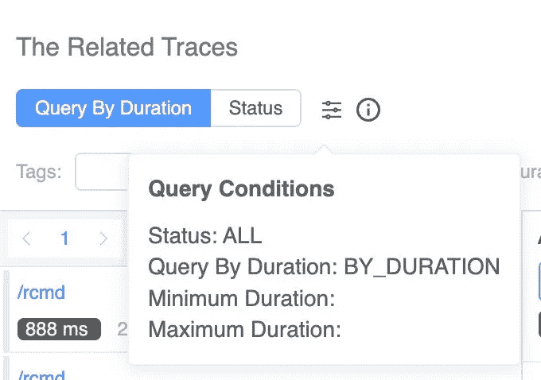

*图 6:显示来自 Apdex 图的慢速跟踪和错误状态跟踪*

# 服务响应时间

百分比指标百分比图(图 7)提供了 p50、p75、p90、p95 和 p99 延迟等级，用于衡量服务性能的长尾问题。

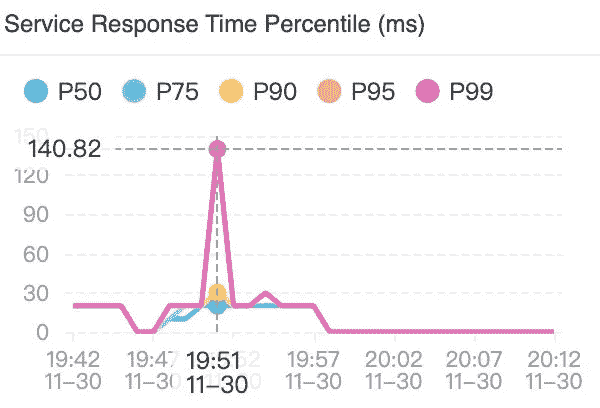

*图 7:服务响应时间百分比图有助于突出服务性能的长尾问题。*

这个百分比图显示了一个典型的长尾问题。P99 的延迟比 P95 慢四倍。当我们使用这种关联时，我们会看到延迟在 P95 — P99 和 P99 —无穷大之间的轨迹。

导致这种长尾现象的请求的踪迹会自动从那里列出来。

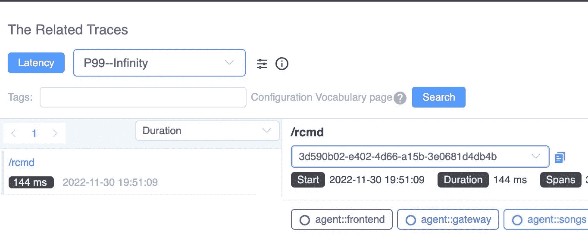

*图 8:基于延迟搜索踪迹的查询参数。*

# 是否有更多可用的关联？

SkyWalking 提供的不仅仅是踪迹和度量之间的关联，它还可以帮助您找到可能的因果关系，避免大海捞针。

目前，SkyWalking 9.3.0 提供了另外两个关联:**度量到度量**关联和**事件到度量**关联。

# 度量到度量的关联

仪表板上有几十个指标，这对于全面了解应用程序行为非常有用。在典型的性能问题中，多个指标的峰值同时受到影响。但是，尝试关联所有这些图中的峰值可能会很困难…

现在，在 SkyWalking 9.3.0 中，当您单击一个图形的峰值时，弹出框会让您看到相关的指标。

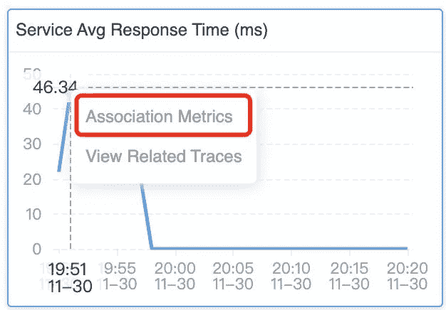

*图 9: SkyWalking 查看相关指标的选项。*

当您选择该选项时，所有关联的度量图将在所有关联的图中显示轴指针(垂直虚线),如图 10 所示。这使得不同图表中的峰值更容易相互关联。通常，这些相关的峰值具有相同的根本原因。

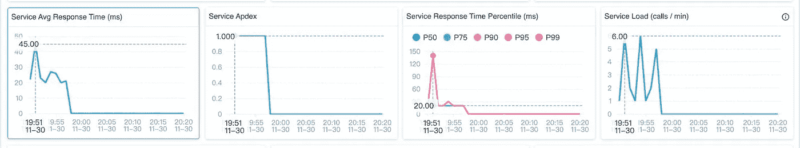

*图 10:轴指针(垂直虚线)显示了多个指标图的峰值之间的关联。*

# 事件与指标的关联

SkyWalking 提供了事件概念来关联受基础设施影响的可能服务性能，例如甚至来自 k8s 的新部署。或者，异常已被警报或集成 AIOps 引擎检测到。

事件与指标的关联也是自动的，它可以覆盖指标图上事件的时间范围(蓝色区域)。如果事件的面积和峰值相匹配，则该事件很可能覆盖了这一异常。

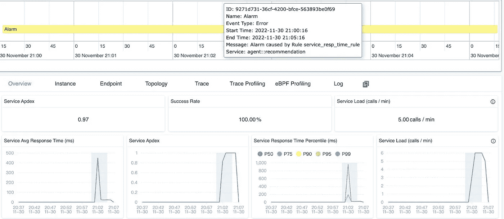

*图 11: SkyWalking 的事件到度量关联视图。*

# 空中行走使寻找根本原因变得更容易、更快

SkyWalking 现在可以很容易地找到度量、事件和跟踪之间的关联，最终可以快速确定根本原因并修复问题。我们在本文中讨论的关联在 SkyWalking 9.3.0 版本中是现成可用的。

*图 12:只需点击圆点即可查看相关的跟踪和指标关联。*

单击任何指标图上的点，如果该指标有逻辑映射跟踪，您将看到一个*视图相关跟踪*项目弹出。

# 结论

在这篇博客中，我们看了一下新添加的度量和跟踪之间的关联特性。有了这种新的可视化技术，现在可以更容易地找到关键痕迹来确定问题的根本原因。高空行走的关联甚至可以更深。从度量到跟踪的关联并不是诊断系统瓶颈的终点。在下一篇文章中，我们将介绍一个 eBPF 支持的跟踪增强，您将能够从网络概要中看到与跟踪范围相关的 HTTP 请求和响应细节。敬请关注。