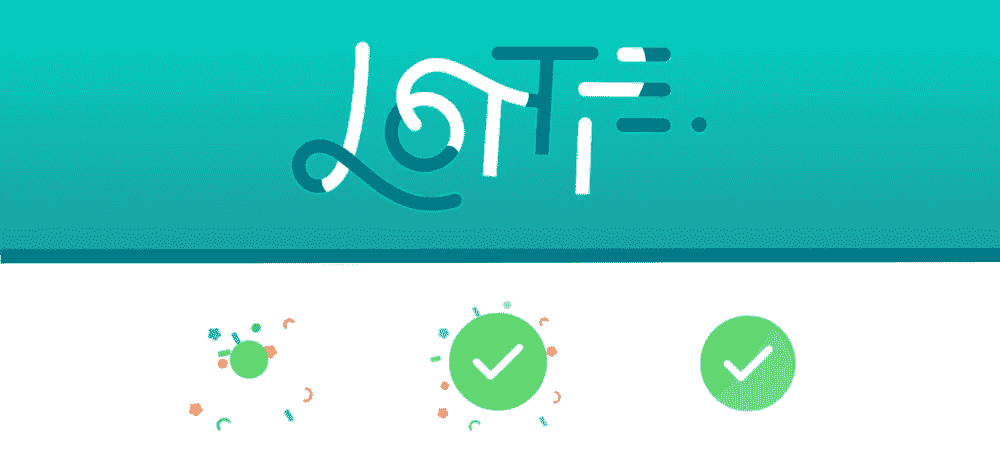
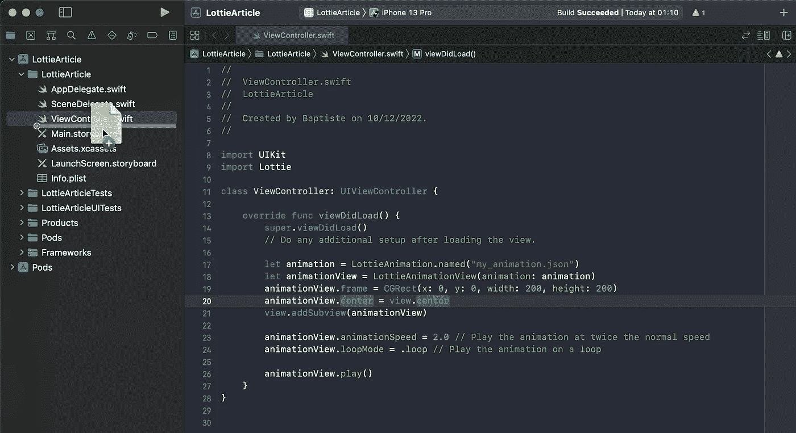
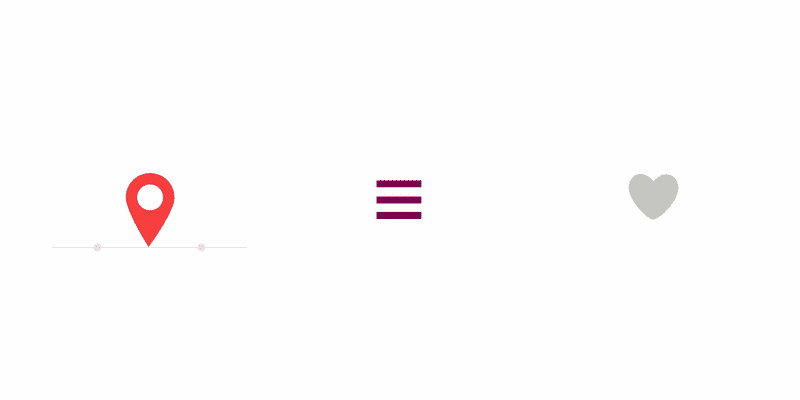
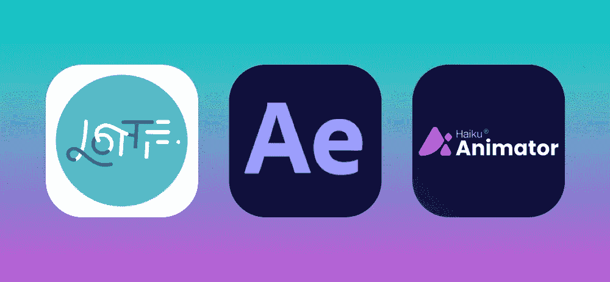
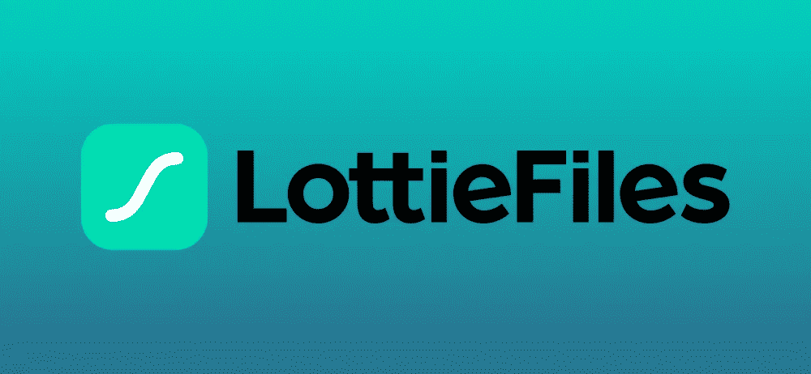

# 使用 Lottie Animations 和 Swift 提升您的应用程序的用户体验

> 原文：<https://blog.devgenius.io/boost-your-apps-user-experience-with-lottie-animations-and-swift-1f2b9572a74?source=collection_archive---------4----------------------->

## 快速编程

## 轻松将动态动画添加到 iOS 应用程序的 5 个步骤。



**释放洛蒂动画的力量，增强你的应用程序的用户体验。**

Lottie 是一个流行的开源工具，用于创建可以轻松集成到 iOS 应用程序中的动画。使用 Lottie，您可以在应用程序中添加高质量的动画，而不必依赖大量的视频或图像文件。这不仅使动画更加轻量级和高效，而且还允许它们直接在应用程序中编辑和定制。

**以下是将洛蒂的高质量动画整合到你的 iOS 应用中的 5 个步骤。**

# 1.将 Lottie 框架添加到您的 iOS 应用程序项目中

要在 Swift 应用中使用 Lottie，您首先需要将 Lottie 框架添加到您的项目中。这可以通过将下面一行添加到项目的 Podfile 来完成:

```
pod 'lottie-ios'
```

Lottie 框架添加到项目后，可以使用以下语句将其导入到您的 Swift 代码中:

```
import Lottie
```

不要忘记将 Lottie json 文件导入到您的项目中。您可以通过拖放到您的项目文件中来完成此操作。



# 2.创建一个 Lottie 视图来显示动画

导入 Lottie 框架后，您可以创建一个`LOTAnimationView`类的实例，并使用它来显示 Lottie 动画。

例如，下面的代码创建一个动画视图，加载一个名为“my_animation.json”的动画文件，并将其添加到视图层次结构中。

```
let animation = LottieAnimation.named("my_animation")
let animationView = LottieAnimationView(animation: animation)
animationView.frame = CGRect(x: 0, y: 0, width: 200, height: 200)
animationView.center = view.center
view.addSubview(animationView)
```

然后可以通过调用动画视图上的`play`方法来播放动画:

```
animationView.play()
```

就是这样！您现在已经将洛蒂动画整合到您的应用程序中。在下一步中，我们将了解如何自定义动画行为并使其适应您的应用环境。



洛蒂动画示例— [洛蒂 GitHub](https://github.com/airbnb/lottie-ios)

# 3.自定义您的动画行为

一旦 Lottie 动画被整合到 iOS 应用程序中，它就可以很容易地进行定制，以满足应用程序的特定需求。定制 Lottie 动画的方法有很多，包括调整其属性和行为，以及添加定制的交互和动画。

例如，动画的速度、循环行为和其他属性可以通过动画视图的属性轻松调整。以下示例显示了如何更改动画的回放速度和循环行为:

```
animationView.animationSpeed = 2.0 // Play the animation at twice the normal speed
animationView.loopMode = .loop // Play the animation on a loop
```

# 4.创建自己的洛蒂动画文件

除了使用预先制作的 Lottie 动画，您还可以使用 Lottie 动画编辑器创建自己的动画。这是一个强大的工具，允许每个人设计和导出洛蒂动画，可以很容易地合并到一个 iOS 应用程序中。

这里有两种方法来创建你自己的洛蒂动画:

## 使用 LottieFiles 基于网络的动画编辑器

LottieFiles 提供了一个基于网络的动画编辑器，允许开发人员使用简单、直观的界面创建 Lottie 动画。该编辑器包括一系列用于创建和编辑动画的工具，包括形状层、矢量路径等。一旦动画完成，它可以导出为 Lottie JSON 文件，并整合到 iOS 应用程序中。

## 使用 Lottie for Adobe After Effects 插件

如果你已经熟悉 Adobe After Effects，Lottie 提供了一个插件，允许动画直接从 After Effects 导出为 Lottie 文件。通过这种方式，你可以使用你的后效技能来创建复杂而精致的洛蒂动画。导出的 Lottie 文件可以轻松地整合到您的 iOS 应用程序中。

总的来说，有很多选择来创建洛蒂动画，并将其整合到 iOS 应用程序中。无论你喜欢使用基于网络的编辑器，Adobe After Effects 的插件，还是像 Haiku Animator 这样的软件，Lottie 都提供了一系列工具，可以轻松创建和导出高质量的动画。



# 5.在线查找现有的洛蒂动画

除了创建自己的动画，还有许多在线资源，在那里你可以找到大量现成可用的 Lottie 动画。

寻找洛蒂动画的一个流行网站是 LottieFiles，它提供了大量免费和优质的洛蒂动画。这些动画涵盖了广泛的类别，包括用户界面、加载指示器、过渡等等。

Lottie 动画的另一个很好的资源是 Lottie GitHub 页面，它收集了 Lottie 社区共享的开源动画。这是一个很好的地方，可以找到其他设计师创作的动画，并且可以在任何项目中免费使用。



# **重述**

Lottie 是一个强大的工具，可以为 iOS 应用程序添加引人入胜的动态动画。Lottie 与 Swift 的集成可以轻松地将高质量的动画添加到 iOS 应用程序中。无论你是想使用预先制作的动画，还是想创建自己的动画，Lottie 都提供了一系列选项，通过高质量的动画来增强应用程序的用户体验。

**这里简单回顾一下将洛蒂动画添加到你的 iOS 应用程序的 5 个步骤:**

1.  **将 Lottie 框架添加到你的 iOS 应用项目中**
2.  **创建一个 Lottie 视图来显示动画**
3.  **定制您的动画行为**
4.  **创建自己的洛蒂动画文件**
5.  **在线查找现有洛蒂动画**

# 您可能也会喜欢这些文章:

[](https://bootcamp.uxdesign.cc/how-to-create-snowflakes-animations-for-your-ios-app-cf02981b9413) [## 如何为你的 iOS 应用程序创建雪花动画

### 用 UIKit 和 CoreAnimation 添加动画雪花粒子的 4 个步骤。

bootcamp.uxdesign.cc](https://bootcamp.uxdesign.cc/how-to-create-snowflakes-animations-for-your-ios-app-cf02981b9413) [](/how-to-animate-your-images-in-swift-ios-swift-guide-64de30ea616b) [## 如何在 Swift——iOS Swift 指南中制作图像动画

### 使用 UIImage 和 UIImageView 创建动画图像的 5 个步骤

blog.devgenius.io](/how-to-animate-your-images-in-swift-ios-swift-guide-64de30ea616b) [](/how-to-use-sf-symbols-in-your-ios-app-ios-swift-guide-2e81ade5f69e) [## 如何在您的 iOS 应用程序中使用 SF 符号——iOS Swift 指南

### SF Symbols 4:超过 4000 个高质量图标，旨在与您的应用程序无缝集成

blog.devgenius.io](/how-to-use-sf-symbols-in-your-ios-app-ios-swift-guide-2e81ade5f69e)