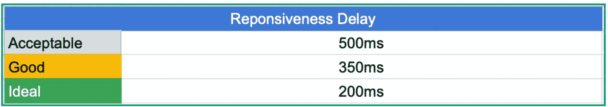

# 提升您的 Web 应用程序的性能

> 原文：<https://blog.devgenius.io/boost-your-web-apps-performance-4c73b3a43b77?source=collection_archive---------25----------------------->

如今，越来越多的软件产品由于其无与伦比的优势:免安装、免升级和无处不在，正从桌面原生应用过渡到 web 应用。最著名的例子包括 Gmail、iCloud 和 FB Messenger。

然而，随着开发人员加入更多的功能，web 应用程序很难摆脱臃肿的大小和增加的加载时间等问题。一旦这些问题积累起来，它将逐渐从用户的情绪得分反映到顶线参与度指标(如 DAP)。

我花了将近一年的时间来提高脸书广告管理器的性能，这可能是 ReactJS 有史以来最大的应用程序。在这次旅程中，我发现以下 4 点对最终结果起着关键作用。在这篇笔记中，我将揭开前半部分:

*   找到正确的成功标准
*   通过预算系统限制初始包装尺寸
*   利用先进技术减少渲染时间
*   持续保持和提高绩效

由 [Kolleen Gladden](https://unsplash.com/@rockthechaos?utm_source=medium&utm_medium=referral) 在 [Unsplash](https://unsplash.com?utm_source=medium&utm_medium=referral) 上拍摄的照片

# #1 找到北极星

这可能是修复任何性能问题的最关键的一步。通常，一个业余团队会以平均加载速度为目标，比如“平均 4 秒完成整个网站的加载”。这对于一个简单的 web 应用程序可能有用，但对于 FB 规模的应用程序来说，这将是一场灾难:

1.  它没有考虑到一些连接性非常差的长尾用户和较低端的设备。
2.  “加载整个站点”是动态的，不切实际的。当人们在修复性能的时候，新的特性每天都在发布。加载性能可能会不断被新代码阻碍。

为了解决这个问题，我建议将指标目标定义为:

> **80%的目标用户启用了所有核心交互，响应延迟为<500 毫秒。**

该定义明确了:

*   仅限于“核心交互”，如在选项卡间导航、滚动、编辑文本等..
*   关注 P80 目标用户，这样团队就可以通过其他难以改变的因素看到进展，比如网络基础设施
*   考虑到响应性，流体相互作用与快速加载一样重要

一旦我们设定了目标，不要忘记与更广泛的受众分享，以便达成一致并让所有合作伙伴团队负起责任。

# #2 所有资源的预算

如上所述，初始的应用程序包大小在现实世界中从来不是一个常数。许多团队希望每天添加新功能，并在登录页面上推广它们。因此，即使保持最初的封装尺寸也是一项“不可能完成的任务”，更不用说缩小它了。

在这种情况下，在主要资源上实施预算是防止衰退和消除 cruft 累积的唯一解决方案。

## 可视化预算并启用警报

在我们砍掉文件之前，让我们构建:

*   一个可视化文件大小及其与预算差异的工具。这应该作为交流的基本原则。
*   集成到所有代码提交审查工具中并配置为“提交阻止级别”的自动“预算超出警报”

所以没有人可以未经许可偷偷进入初始文件包，我们可以系统地阻止包大小回归。

## 每个产品的预算

准备好工具后，下一步是计算总预算并在产品间分配。

可以很容易地计算出理想的总包装尺寸。网上有各种各样的公式，其中一个快捷键是:(**loading _ time _ goal * avg _ network _ speed)**。

有了这个数字后，为核心文件留出一些空间，以保持应用程序的启动和导航交互。然后在初始化阶段需要呈现的不同产品之间分配剩余的内容。

请记住，每个产品应该只保留在初始包中呈现的最少代码。一旦被用户使用，大部分“特性代码”仍然应该是引导加载的。

## 超出 JS 规模的预算

初始包装尺寸只是预算系统的应用之一。一旦它在公司运行并被广泛接受，我们应该探索为以下关键资源建立预算:

*   JS CPU
*   数据提取延迟
*   其他资源(图片..)尺寸

# #3 减少渲染时间

在我们尽一切努力来精简初始包之后，长时间的渲染可能是阻止我们获得最终改进的最后一个瓶颈。渲染时间是本地 JS/CSS 处理的结果，有几个因素对此有影响:

1.  硬件性能，如 CPU、内存
2.  浏览器 Javascript 引擎的性能
3.  代码是如何实现的，比如使用 ReactJS 或其他框架

以上所有因素中，我们对第 3 个因素(switch framework ~=重写整个 app)的控制力有限，对其他因素无能为力。那么，如果我们的目标用户使用中低端设备，如何确保他们也获得类似的高性能呢？

> 答案是“**前置器**”。

“Prerender”是一个概念，web 应用程序在服务器端生成初始页面的 HTML 代码，并将其直接推送到客户端。由于我们跳过了处理 JS/CSS 包，并且在浏览器中呈现 HTML 的速度很快，“Prerender”可以显著提高初始页面的“感知加载速度”。用户可以立即在屏幕上看到主要特性的静态 UI，而客户端则专注于下载 JS 代码来实现交互。

网上有几种不同的开源“Prerender”框架。你可以根据你的应用程序的技术堆栈，选择或构建你自己的内部应用程序。

在其他人添加功能时维护性能

# #4 保持进步

提高性能是一场持久战。敌人不仅包括遗留代码和废弃的框架，还包括每天新提交引入的回归。

为了帮助我们的工程师守住前线，我们需要创建一套工具来帮助我们快速找到并消除任何回归。具体来说，我们需要:

1.  显示初始装载的每一步的装载时间的仪表板
2.  报告回归和可疑提交的警报系统
3.  一个标签/任务工具，要求每个回归所有者输入影响、根本原因以及最重要的预防措施。
4.  一个正式的评审过程，让每个回归所有者对修复和预防负责。

上面提到的构建工具和过程与其他工程工作一样重要，因为它系统地消除了回归的可能性，一次一个。一旦我们有了这些，工程师们再也不会因为反复的回归而沮丧了。