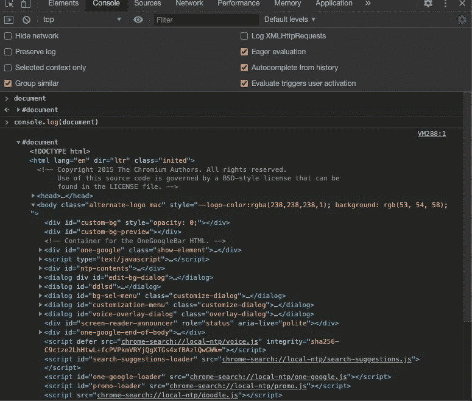
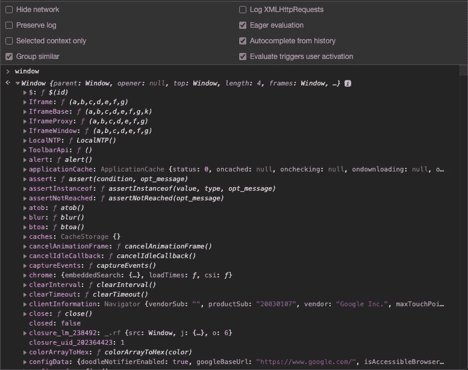

# 训练营之旅:了解 DOM

> 原文：<https://blog.devgenius.io/bootcamp-journey-learning-about-the-dom-a79fa239f7d5?source=collection_archive---------54----------------------->

## 我对 DOM API 的了解


照片由 [Unsplash](https://unsplash.com?utm_source=medium&utm_medium=referral) 上的 [Clément H](https://unsplash.com/@clemhlrdt?utm_source=medium&utm_medium=referral) 拍摄

一个月前，我报名参加了一个在线训练营，成为一名全栈 Javascript 开发人员。目前，我在前端部分，后端部分在后面。我不得不承认，在进入下一个话题之前，有很多事情我希望能够深入了解。其中之一就是 DOM。

# DOM 的基础知识

DOM 代表“文档对象模型”,顾名思义，它是一个表示网页结构的对象。(一个网页是一个文档)通常，它看起来像这样→



您在网页上经常看到的主要元素有

```
<head></head>, <body></body>, <div></div> <section></section>  <p></p>
```

还有更多。这些元素以某种方式构建了您的 DOM。您可以使用`style`属性设置所选元素的样式，并指定一个 CSS 属性，在我的例子中是`backgroundColor` →


但是最常见的做法是通过类名或 id 来访问这些元素，您可以使用一个名为`getElementByClassName`或`getElementById`的方法来实现这一点，该方法基于您赋予元素的实际类名。总之，有大量的方法和属性可以与 DOM 一起工作，所有这些都是 DOM API 的一部分，这意味着这些方法和属性是为您操作文档(网页)而提供的。

# 窗口对象

窗口对象是一个全局变量对象，它包含对 DOM 的访问。从字面上看，它包含了所有的东西，有很多方法和属性，你可以在窗口对象上调用。这可以用 Javascript 来操作。



你会经常看到的一些常见的方法和属性是`alert(), console.log(), localStorage, setTimeout(), clearInterval()`等等。您可以在 [MDN 站点](https://developer.mozilla.org/en-US/docs/Web/API/Window)上找到更多的方法和属性

我想得到一个大概的想法，这就是为什么我没有太深入。这是我得到的大画面。我很高兴我没有等到太晚才深入这个话题，因为它非常重要。

我希望这对其他人有所帮助: )请继续关注更多👍

尽情享受吧！

~ ***爱活着，活着要代号***