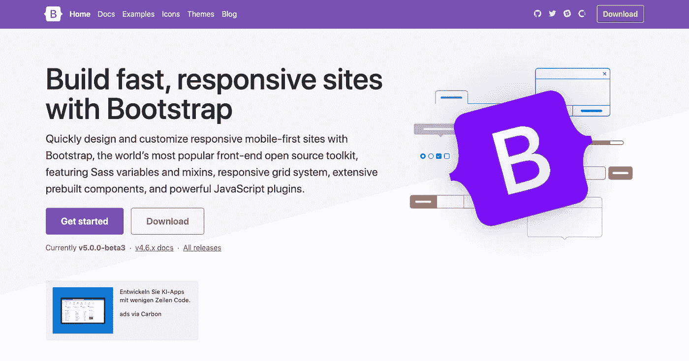
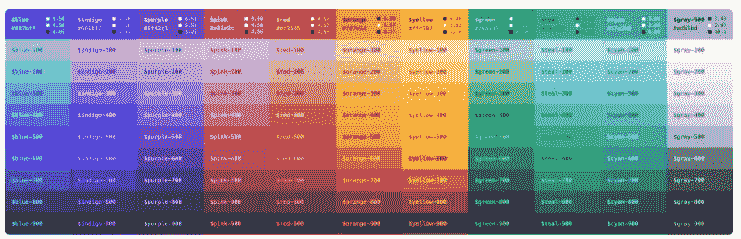
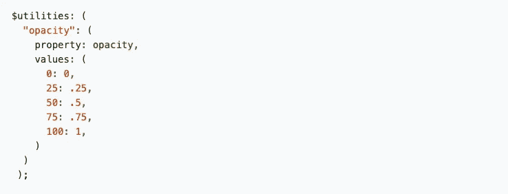
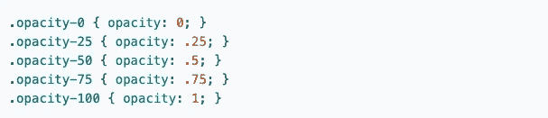
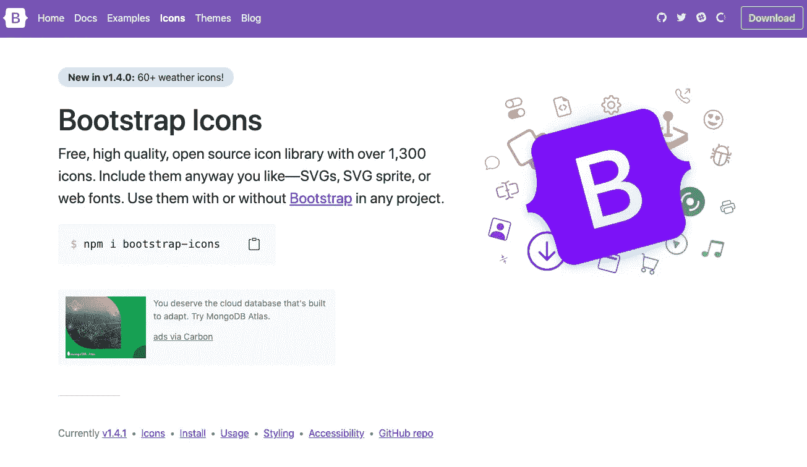

# Bootstrap 4 与 Bootstrap 5—Bootstrap 5 有什么新功能？

> 原文：<https://blog.devgenius.io/bootstrap-4-vs-5-whatll-be-new-in-bootstrap-5-5fb2522aad6?source=collection_archive---------1----------------------->

潘卡杰·帕特尔在 [Unsplash](https://unsplash.com?utm_source=medium&utm_medium=referral) 上的照片

Bootstrap 5 即将推出重大变化，目前，beta 版本 3 已经发布，在这篇文章中，我将解释 Bootstrap 5 将带来的一些重要变化。

在我们开始之前，对于可能还不知道的人，让我们先谈谈什么是 Bootstrap。

## 什么是自举？

Bootstrap 是一个流行的 CSS 框架，用于开发响应迅速且移动友好的网站。

[自举官网](https://getbootstrap.com/)

如果你不想自己编写每一个 CSS 规则，或者你在响应式设计上有困难，那么你可以在你的项目中使用 Bootstrap。

*   Bootstrap 完全免费使用
*   具有用于响应式设计的内置类(列、行)
*   提供可重用的 CSS 类，从按钮到表单和许多其他东西
*   当前的稳定版本是 Bootstrap 4

那么 Bootstrap 5 会有什么不同呢？

让我想想…

# 不再支持 JQuery & IE

Bootstrap 5 的第一个也是最大的新闻之一将是移除它对 JQuery 的依赖。依赖于 JQuery 的引导会导致一些问题，例如:

*   同时在更大的框架中一起使用它(比如 Angular)
*   显著增加引导的大小

所以在 Bootstrap 5 中，将不再有任何 JQuery 依赖性。此外，他们还决定放弃对 Internet Explorer 的支持，这样 Bootstrap 就可以使用 IE 不支持的自定义属性。

顺便问一下，现在谁还在用 IE 呢？:)

# 轻松定制

使用 Bootstrap 的一个问题是定制困难。重写或扩展 Bootstrap 类很难，所以很多人甚至没有接触过它。

最终，所有用 bootstrap 构建的网站都很容易被识别出来，因为它们看起来都非常相似。

因此，Bootstrap 5 将为我们定制 Bootstrap 类提供更大的灵活性，这也是他们提供扩展调色板的原因:

他们还将为更多的引导类和组件提供定制属性。

# 实用程序 API

Bootstrap 5 的另一个新特性是实用程序 API。

示例引导实用程序

在 Bootstrap 5 中，您将能够使用 Sass 语法创建自己的实用程序，或者更改已经提供的实用程序。

在上面的例子中，这个工具是为 CSS 不透明度属性创建的。

如果你想定义一个名为“不透明度-100”的类，并指定 1 为一个值，但后来你想为“不透明度-50”创建另一个值，那么你需要创建多个 CSS 类。

现在，您可以为“不透明度”属性创建一个单独的工具，并为多个值和类赋值，而不是创建两个或多个单独的类，如下例所示:

# 新图标库

Bootstrap 5 的另一个新特点是它的图标库。在 Bootstrap 5 之前，我们需要使用其他来源的图标，如 font-awesome，但现在有了 Bootstrap 5，您将能够使用 Bootstrap 自己的图标库中的图标。

# RTL(从右到左)选项

Bootstrap 5 带来的另一个新特性是支持 RTL(从右到左)。

正如你所知，世界上有些语言，如阿拉伯语等，是从右向左书写的，所以现在有了 Bootstrap 的这个功能，你也可以开发支持从右向左书写的语言的网站。

# 装置

正如我之前提到的，你可以通过这个链接安装并试用 Bootstrap [的测试版，但是如果你打算在更大的项目中使用 Bootstrap，我建议你等到他们发布稳定版，我相信很快就会有了。](https://getbootstrap.com/docs/5.0/getting-started/download/)

或者，要在您的项目中使用 Bootstrap，您可以包含 CDN 链接，或者您可以使用 npm 或 yarn 直接下载它并立即开始使用。

这些是 Bootstrap 5 将带来的一些最重要的变化。

如果你有兴趣学习更多关于 Web 开发的知识，别忘了订阅[我的简讯](https://bit.ly/2KXEBsv)。

感谢您的阅读！