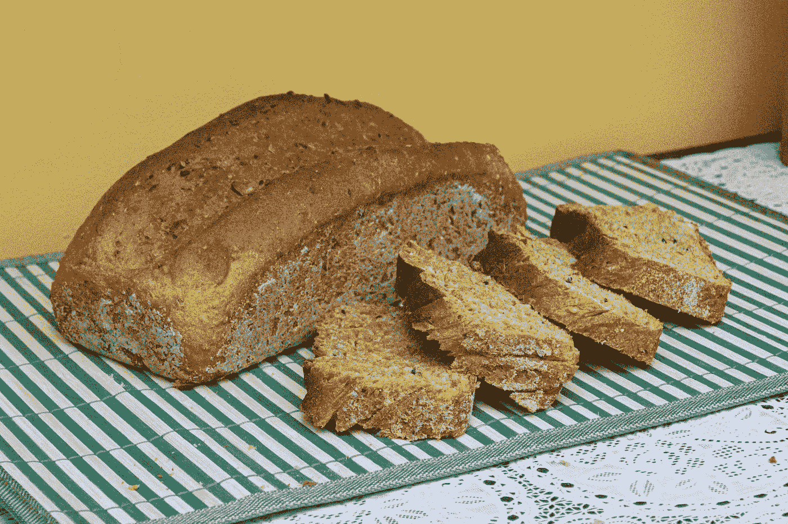

# 引导程序 5 —按钮

> 原文：<https://blog.devgenius.io/bootstrap-5-buttons-1966af312bb5?source=collection_archive---------11----------------------->



约纳斯·卡卡罗托在 [Unsplash](https://unsplash.com?utm_source=medium&utm_medium=referral) 上拍摄的照片

写这篇文章时，Bootstrap 5 处于 alpha 状态，可能会更改。

Bootstrap 是任何 JavaScript 应用程序的流行 UI 库。

在本文中，我们将看看如何用 Bootstrap 5 添加按钮。

# 小跟班

我们可以用 Bootstrap 5 添加按钮。

它们有各种各样的风格。

例如，我们可以写:

```
<button type="button" class="btn btn-primary">button</button>
<button type="button" class="btn btn-secondary">button</button>
<button type="button" class="btn btn-success">button</button>
<button type="button" class="btn btn-danger">button</button>
<button type="button" class="btn btn-warning">button</button>
<button type="button" class="btn btn-info">button</button>
<button type="button" class="btn btn-light">button</button>
<button type="button" class="btn btn-dark">button</button>
<button type="button" class="btn btn-link">link</button>
```

然后我们得到各种颜色的按钮。

`btn-link`将按钮设计成链接。

# 禁用文字环绕

我们可以添加`.text-nowrap`类来禁用文本换行。

# 按钮标签

`.btn`类应该应用于按钮元素，但是我们也可以在`a`和`input`元素上使用它们。

例如，我们可以写:

```
<a class="btn btn-primary" href="#" role="button">link</a>
<button class="btn btn-primary" type="submit">button</button>
<input class="btn btn-primary" type="button" value="Input">
<input class="btn btn-primary" type="submit" value="Submit">
<input class="btn btn-primary" type="reset" value="Reset">
```

我们向`a`和`input`元素添加`.btn`类，就像我们处理按钮一样。

# 大纲按钮

按钮在轮廓样式中也可用。

例如，我们可以写:

```
<button type="button" class="btn btn-outline-primary">button</button>
<button type="button" class="btn btn-outline-secondary">button</button>
<button type="button" class="btn btn-outline-success">button</button>
<button type="button" class="btn btn-outline-danger">button</button>
<button type="button" class="btn btn-outline-warning">button</button>
<button type="button" class="btn btn-outline-info">button</button>
<button type="button" class="btn btn-outline-light">button</button>
<button type="button" class="btn btn-outline-dark">button</button>
```

我们有`btn-outline`类来添加大纲。

# 大小

`.btn-lg`和`.btn-sm`类让我们分别制作大按钮和小按钮。

为了使用它们，我们写:

```
<button type="button" class="btn btn-primary btn-lg">large button</button>
```

把它做大。

我们写道:

```
<button type="button" class="btn btn-primary btn-sm">small  button</button>
```

让它变小。

# 禁用状态

我们可以用`disabled`属性禁用按钮。

例如，我们可以写:

```
<button type="button" class="btn btn-lg btn-primary" disabled>disabled button</button>
```

我们只需将属性添加到按钮上。

`a`标签不支持`disabled`属性，但是我们可以使用`.disabled`类使它在视觉上看起来被禁用了。

`pointer-events`也将被设置为`none`，这样当我们点击链接时，它不会做任何事情。

# 切换状态

我们可以制作可以切换的按钮。

例如，我们可以写:

```
<button type="button" class="btn btn-primary" data-toggle="button" autocomplete="off">Toggle button</button><button type="button" class="btn btn-primary active" data-toggle="button" autocomplete="off">Active toggle button</button><button type="button" class="btn btn-primary" disabled data-toggle="button" autocomplete="off">Disabled toggle button</button>
```

我们添加了`data-toggle`属性使其可切换。

现在，当我们点击它们时，我们将看到效果。

当它打开时会变暗，当它关闭时会变亮。

# 方法

我们可以用按钮构造函数创建一个按钮实例。

例如，我们可以写:

```
<button class="btn btn-primary">button</button>
```

在我们的 HTML 文件中，并且:

```
const button = document.querySelector('button')
const bsButton = new bootstrap.Button(button)
```

在我们的 JavaScript 文件中使用`bootstrap.Button`构造函数创建一个引导按钮。

按钮有`toggle`方法让我们切换它。

所以我们可以写:

```
button.toggle()
```

来打开和关闭它。


费尔南多·阿吉拉尔在 [Unsplash](https://unsplash.com?utm_source=medium&utm_medium=referral) 上的照片

# 结论

Bootstrap 5 附带了各种用于设计按钮样式的类。

此外，我们可以让 toggleable 具有一些属性。