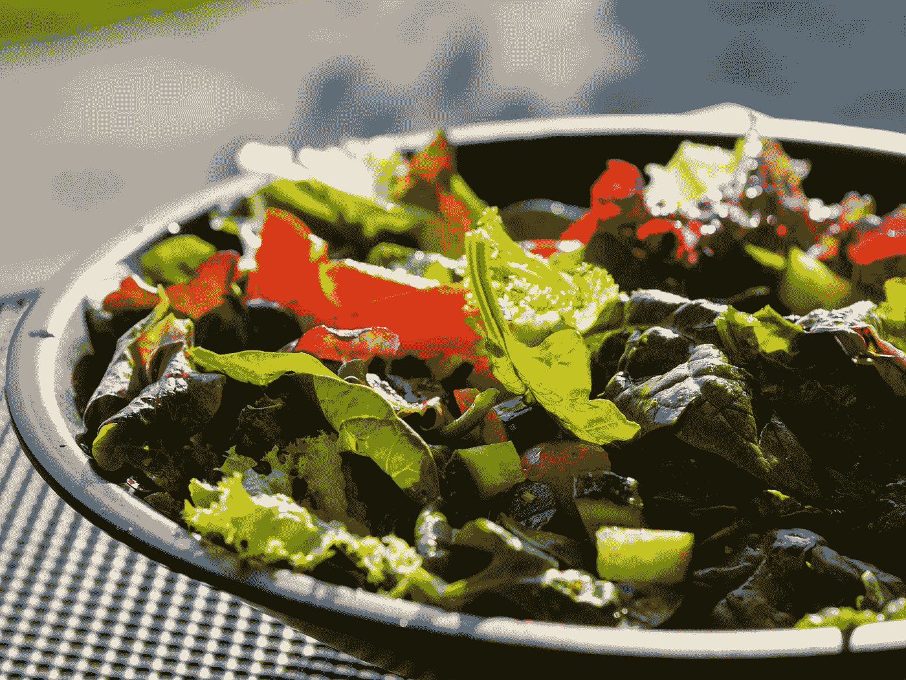

# 引导程序 5 —卡片图像和颜色

> 原文：<https://blog.devgenius.io/bootstrap-5-card-images-and-colors-e88402dd3d1e?source=collection_archive---------7----------------------->


图片由 [Ella Olsson](https://unsplash.com/@ellaolsson?utm_source=medium&utm_medium=referral) 在 [Unsplash](https://unsplash.com?utm_source=medium&utm_medium=referral) 上拍摄

**写这篇文章时，Bootstrap 5 处于 alpha 状态，可能会发生变化。**

Bootstrap 是任何 JavaScript 应用程序的流行 UI 库。

在本文中，我们将了解如何使用 Bootstrap 5 添加卡片图像和颜色。

# 形象

我们可以在卡片内容的上方或下方添加图像。

例如，我们可以写:

```
<div class="card mb-3">
  
  <div class="card-body">
    <h5 class="card-title">Card title</h5>
    <p class="card-text">Lorem ipsum dolor sit amet, consectetur adipiscing elit.</p>
    <p class="card-text"><small class="text-muted">Last updated 3 mins ago</small></p>
  </div>
</div>
```

我们需要`.card-img-top`将图像放在卡片的顶部，并使其与卡片的边缘齐平。

同样，我们可以在底部写下卡片图像:

```
<div class="card mb-3">
  <div class="card-body">
    <h5 class="card-title">Card title</h5>
    <p class="card-text">Lorem ipsum dolor sit amet, consectetur adipiscing elit.</p>
    <p class="card-text"><small class="text-muted">Last updated 3 mins ago</small></p>
  </div>
  
</div>
```

`.card-img-bottom`做的事情和`.card-img-top`类似，但是如果图像在文本下面，它也能工作。

# 图像叠加

可以添加图像作为卡片的背景。

例如，我们可以写:

```
<div class="card mb-3">
  <div class="card-img-overlay">
    <h5 class="card-title">Card title</h5>
    <p class="card-text">Lorem ipsum dolor sit amet, consectetur adipiscing elit.</p>
    <p class="card-text"><small class="text-muted">Last updated 3 mins ago</small></p>
  </div>
  
</div>
```

我们有`.card-img-overlay`类来将文本放在图像上。

# 水平的

图像可以与文本并排。

例如，我们可以写:

```
<div class="card mb-3">
  <div class="row g-0">
    <div class="col-md-4">
      
    </div>
    <div class="col-md-8">
      <div class="card-body">
        <h5 class="card-title">Card title</h5>
        <p class="card-text">Lorem ipsum dolor sit amet, consectetur adipiscing elit. </p>
      </div>
    </div>
  </div>
</div>
```

将图像添加到文本的左侧。

`.col-md-4`和`.col-md-8`将 div 并排放置。

# 卡片样式

卡片可以有不同的风格。

我们可以用`bg-*`类改变背景颜色。

例如，我们可以写:

```
<div class="card text-white bg-primary mb-3">
  <div class="card-header">Header</div>
  <div class="card-body">
    <h5 class="card-title">Primary card title</h5>
    <p class="card-text">Lorem ipsum dolor sit amet, consectetur adipiscing elit. </p>
  </div>
</div><div class="card text-white bg-secondary mb-3">
  <div class="card-header">Header</div>
  <div class="card-body">
    <h5 class="card-title">Secondary card title</h5>
    <p class="card-text">Lorem ipsum dolor sit amet, consectetur adipiscing elit. </p>
  </div>
</div><div class="card text-white bg-success mb-3">
  <div class="card-header">Header</div>
  <div class="card-body">
    <h5 class="card-title">Success card title</h5>
    <p class="card-text">Lorem ipsum dolor sit amet, consectetur adipiscing elit. </p>
  </div>
</div><div class="card text-white bg-danger mb-3">
  <div class="card-header">Header</div>
  <div class="card-body">
    <h5 class="card-title">Danger card title</h5>
    <p class="card-text">Lorem ipsum dolor sit amet, consectetur adipiscing elit.</p>
  </div>
</div><div class="card bg-warning mb-3">
  <div class="card-header">Header</div>
  <div class="card-body">
    <h5 class="card-title">Warning card title</h5>
    <p class="card-text">Lorem ipsum dolor sit amet, consectetur adipiscing elit. </p>
  </div>
</div><div class="card text-body  bg-info mb-3">
  <div class="card-header">Header</div>
  <div class="card-body">
    <h5 class="card-title">Info card title</h5>
    <p class="card-text">Lorem ipsum dolor sit amet, consectetur adipiscing elit. .</p>
  </div>
</div><div class="card bg-light mb-3">
  <div class="card-header">Header</div>
  <div class="card-body">
    <h5 class="card-title">Light card title</h5>
    <p class="card-text">Lorem ipsum dolor sit amet, consectetur adipiscing elit. .</p>
  </div>
</div><div class="card text-white bg-dark mb-3">
  <div class="card-header">Header</div>
  <div class="card-body">
    <h5 class="card-title">Dark card title</h5>
    <p class="card-text">Lorem ipsum dolor sit amet, consectetur adipiscing elit. </p>
  </div>
</div>
```

添加`bg-*`来改变背景。

# 边境

Bootstrap 5 还提供了`border-*`类来添加轮廓样式。

例如，我们可以写:

```
<div class="card border-primary mb-3">
  <div class="card-header">Header</div>
  <div class="card-body text-primary">
    <h5 class="card-title">Primary card title</h5>
    <p class="card-text">Lorem ipsum dolor sit amet, consectetur adipiscing elit. .</p>
  </div>
</div><div class="card border-secondary mb-3">
  <div class="card-header">Header</div>
  <div class="card-body text-secondary">
    <h5 class="card-title">Secondary card title</h5>
    <p class="card-text">Lorem ipsum dolor sit amet, consectetur adipiscing elit. .</p>
  </div>
</div><div class="card border-success mb-3">
  <div class="card-header">Header</div>
  <div class="card-body text-success">
    <h5 class="card-title">Success card title</h5>
    <p class="card-text">Some quick example text to build on the card title and make up the bulk of the card's content.</p>
  </div>
</div><div class="card border-danger mb-3">
  <div class="card-header">Header</div>
  <div class="card-body text-danger">
    <h5 class="card-title">Danger card title</h5>
    <p class="card-text">Lorem ipsum dolor sit amet, consectetur adipiscing elit. </p>
  </div>
</div><div class="card border-warning mb-3">
  <div class="card-header">Header</div>
  <div class="card-body">
    <h5 class="card-title">Warning card title</h5>
    <p class="card-text">Lorem ipsum dolor sit amet, consectetur adipiscing elit. .</p>
  </div>
</div><div class="card border-info mb-3">
  <div class="card-header">Header</div>
  <div class="card-body">
    <h5 class="card-title">Info card title</h5>
    <p class="card-text">Lorem ipsum dolor sit amet, consectetur adipiscing elit. </p>
  </div>
</div><div class="card border-light mb-3">
  <div class="card-header">Header</div>
  <div class="card-body">
    <h5 class="card-title">Light card title</h5>
    <p class="card-text">Lorem ipsum dolor sit amet, consectetur adipiscing elit. </p>
  </div>
</div><div class="card border-dark mb-3">
  <div class="card-header">Header</div>
  <div class="card-body text-dark">
    <h5 class="card-title">Dark card title</h5>
    <p class="card-text">Lorem ipsum dolor sit amet, consectetur adipiscing elit. </p>
  </div>
</div>
```

添加带有轮廓样式而不是背景色的卡片。



Jonathan Ybema 在 [Unsplash](https://unsplash.com?utm_source=medium&utm_medium=referral) 上拍摄的照片

# 结论

我们可以在卡片中添加背景颜色和边框。

图像也可以以不同的方式定位。