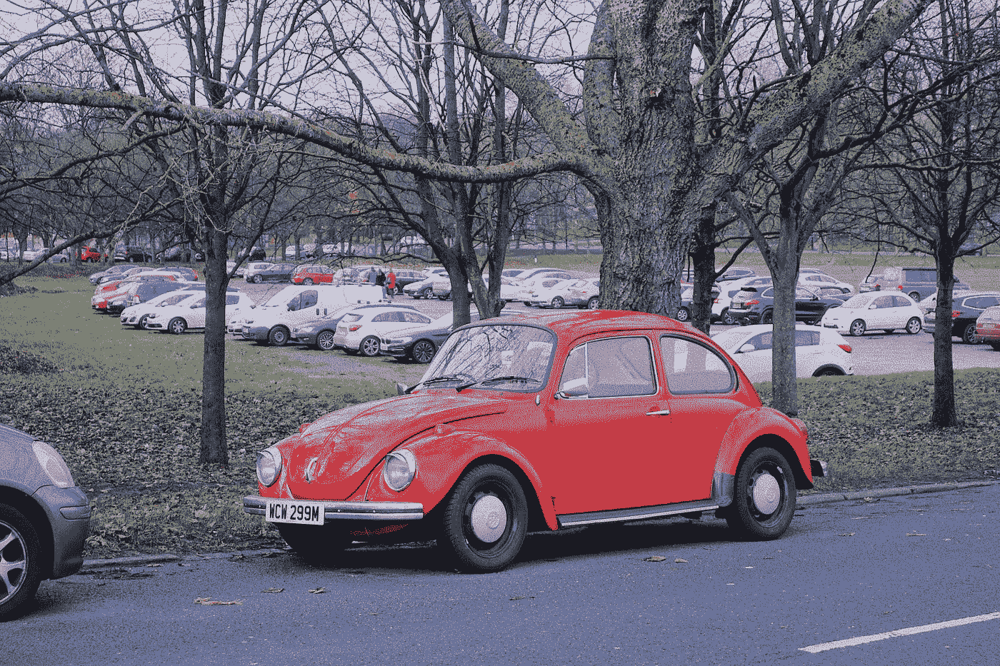
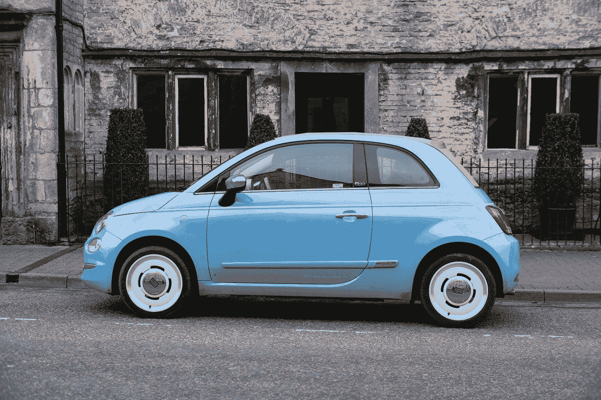

# 引导程序 5 —卡尺寸和对齐

> 原文：<https://blog.devgenius.io/bootstrap-5-card-sizing-and-alignment-991cfd6b98c6?source=collection_archive---------18----------------------->



[鲍里斯·岳](https://unsplash.com/@ybs9641?utm_source=medium&utm_medium=referral)在 [Unsplash](https://unsplash.com?utm_source=medium&utm_medium=referral) 上的照片

**写这篇文章时，Bootstrap 5 处于 alpha 状态，可能会更改。**

Bootstrap 是任何 JavaScript 应用程序的流行 UI 库。

在本文中，我们将了解如何使用 Bootstrap 5 定制卡片。

# 胶料

我们可以用列类改变卡片的宽度。

例如，我们可以写:

```
<div class="row">
  <div class="col-sm-6">
    <div class="card">
      <div class="card-body">
        <h5 class="card-title">title</h5>
        <p class="card-text">Lorem ipsum dolor sit amet, consectetur adipiscing elit. </p>
        <a href="#" class="btn btn-primary">Go somewhere</a>
      </div>
    </div>
  </div> <div class="col-sm-6">
    <div class="card">
      <div class="card-body">
        <h5 class="card-title">title</h5>
        <p class="card-text">Lorem ipsum dolor sit amet, consectetur adipiscing elit.</p>
        <a href="#" class="btn btn-primary">Go somewhere</a>
      </div>
    </div>
  </div>
</div>
```

我们有 2 个带`col-sm-6`类的卡片，如果遇到`sm`断点，它们将占据视窗宽度的一半或更宽。

# 使用实用程序

此外，我们可以使用实用程序类来改变卡片的宽度。

例如，我们可以写:

```
<div class="card w-75">
  <div class="card-body">
    <h5 class="card-title">Card title</h5>
    <p class="card-text">Lorem ipsum dolor sit amet, consectetur adipiscing elit.</p>
    <a href="#" class="btn btn-primary">Button</a>
  </div>
</div>
```

使卡片成为屏幕宽度的 75%。

`w-75`是使它如此的阶级。

# 使用自定义 CSS

要改变大小，我们也可以使用自定义 CSS。

例如，我们可以写:

```
<div class="card" style="width: 20rem;">
  <div class="card-body">
    <h5 class="card-title">title</h5>
    <p class="card-text">Lorem ipsum dolor sit amet, consectetur adipiscing elit.</p>
    <a href="#" class="btn btn-primary">Go somewhere</a>
  </div>
</div>
```

使卡片的宽度为 20rem。

# 文本对齐

文本的对齐方式可以改变。

例如，我们可以写:

```
<div class="card text-center" style="width: 20rem;">
  <div class="card-body">
    <h5 class="card-title">title</h5>
    <p class="card-text">Lorem ipsum dolor sit amet, consectetur adipiscing elit.</p>
    <a href="#" class="btn btn-primary">Go somewhere</a>
  </div>
</div>
```

用`.text-center`类使文本居中。

我们也可以使用`.text-right`类来右对齐文本:

```
<div class="card text-right" style="width: 20rem;">
  <div class="card-body">
    <h5 class="card-title">title</h5>
    <p class="card-text">Lorem ipsum dolor sit amet, consectetur adipiscing elit.</p>
    <a href="#" class="btn btn-primary">Go somewhere</a>
  </div>
</div>
```

# 航行

我们可以在卡片的顶部添加导航。

例如，我们可以写:

```
<div class="card text-center">
  <div class="card-header">
    <ul class="nav nav-tabs card-header-tabs">
      <li class="nav-item">
        <a class="nav-link active" href="#">Active</a>
      </li>
      <li class="nav-item">
        <a class="nav-link" href="#">Link</a>
      </li>
      <li class="nav-item">
        <a class="nav-link disabled" href="#" tabindex="-1">Disabled</a>
      </li>
    </ul>
  </div>
  <div class="card-body">
    <h5 class="card-title">title</h5>
    <p class="card-text">Lorem ipsum dolor sit amet, consectetur adipiscing elit.</p>
    <a href="#" class="btn btn-primary">Go somewhere</a>
  </div>
</div>
```

我们添加了一个应用了`nav`类的`ul`。

我们有`li`类和`nav-item`类。

现在我们在页面顶部有了一个导航栏，显示为一个选项卡。

`.card-header-tab`和`.nav-tabs`使链接显示为选项卡。

导航被添加到卡片标题中以显示在顶部。

我们可以用`.card-header-pills`类将链接显示为药丸。

例如，我们可以写:

```
<div class="card text-center">
  <div class="card-header">
    <ul class="nav nav-pills card-header-pills">
      <li class="nav-item">
        <a class="nav-link active" href="#">Active</a>
      </li>
      <li class="nav-item">
        <a class="nav-link" href="#">Link</a>
      </li>
      <li class="nav-item">
        <a class="nav-link disabled" href="#" tabindex="-1">Disabled</a>
      </li>
    </ul>
  </div>
  <div class="card-body">
    <h5 class="card-title">title</h5>
    <p class="card-text">Lorem ipsum dolor sit amet, consectetur adipiscing elit.</p>
    <a href="#" class="btn btn-primary">Go somewhere</a>
  </div>
</div>
```

将链接显示为选项卡。

# 形象

我们可以在卡片里添加图像。

例如，我们可以写:

```
<div class="card mb-3">
  
  <div class="card-body">
    <h5 class="card-title">Card title</h5>
    <p class="card-text">Lorem ipsum dolor sit amet, consectetur adipiscing elit.</p>
    <p class="card-text"><small class="text-muted">Last updated 3 mins ago</small></p>
  </div>
</div>
```

图像被添加到正文的上方。

我们用`.card-img-top`类使它与边缘齐平。



奥利·伍德曼在 [Unsplash](https://unsplash.com?utm_source=medium&utm_medium=referral) 上拍摄的照片

# 结论

我们可以用内置的类或者 CSS 来改变大小。

此外，我们可以在卡片上添加导航和图像。