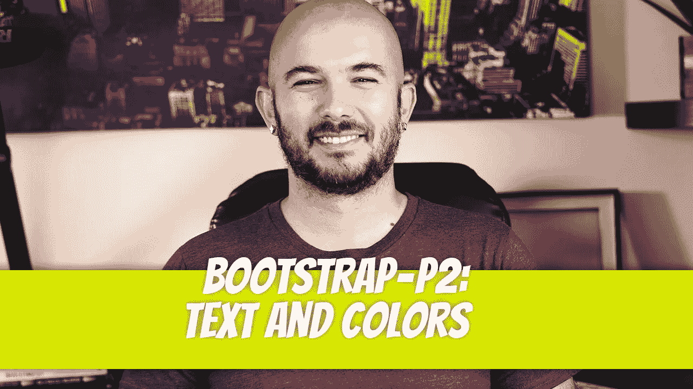
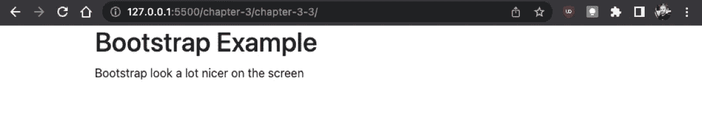
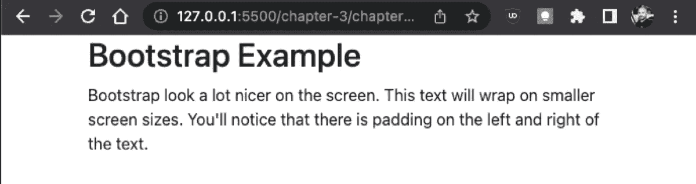
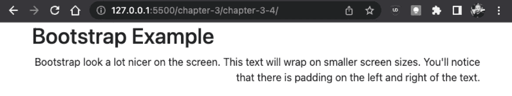
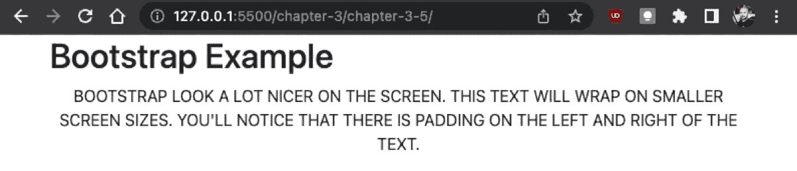
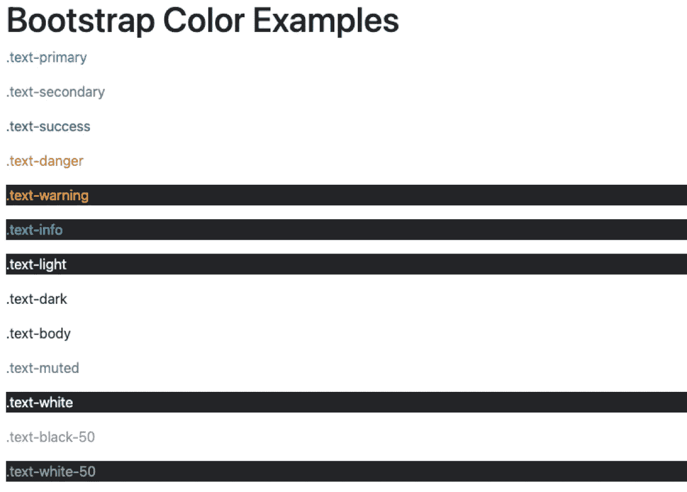
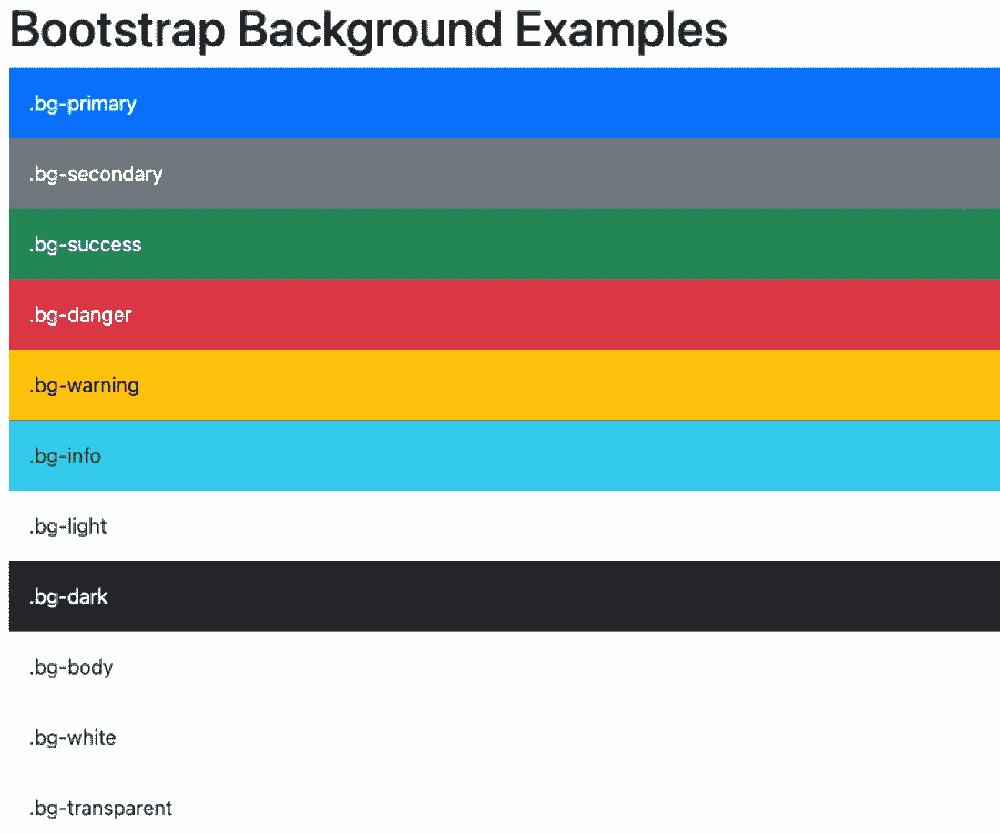
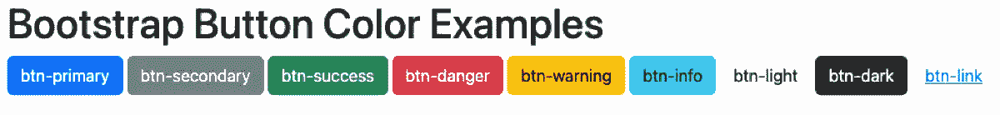
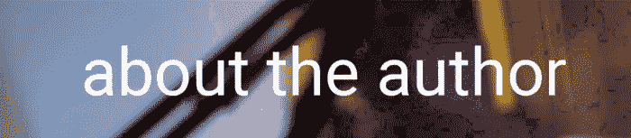

# 自举——P2:文本和颜色

> 原文：<https://blog.devgenius.io/bootstrap-p2-text-and-colors-5fc92f19ac95?source=collection_archive---------11----------------------->



在我们进入 bootstrap 的中级特性之前，我们将首先探索一些您可能会接触到的基本风格。为了使用 bootstrap 使您的站点具有响应性，您必须包含容器样式。

[](https://dinocajic.medium.com/bootstrap-p1-introduction-and-installation-5ef17c230a39) [## 自举— P1:介绍和安装

### Bootstrap 是一个 CSS 框架，用来帮助完成某些重复性的 CSS 任务。例如，每个网站…

dinocajic.medium.com](https://dinocajic.medium.com/bootstrap-p1-introduction-and-installation-5ef17c230a39) 

```
<!doctype html><html lang="en"><head> <meta charset="utf-8"> <meta name="viewport" content="width=device-width, initial-scale=1"> <title>Text and Colors</title> <link href="https://cdn.jsdelivr.net/npm/bootstrap@5.2.1/dist/css/bootstrap.min.css" rel="stylesheet" integrity="sha384-iYQeCzEYFbKjA/T2uDLTpkwGzCiq6soy8tYaI1GyVh/UjpbCx/TYkiZhlZB6+fzT" crossorigin="anonymous"></head><body> <div class="container"> <h1>Bootstrap Example</h1> <p>Bootstrap look a lot nicer on the screen</p> </div> <script src="https://cdn.jsdelivr.net/npm/bootstrap@5.2.1/dist/js/bootstrap.bundle.min.js" integrity="sha384-u1OknCvxWvY5kfmNBILK2hRnQC3Pr17a+RTT6rIHI7NnikvbZlHgTPOOmMi466C8" crossorigin="anonymous"> </script></body></html>
```



在浏览器中打开页面将显示引导样式的文本。您会注意到文本居中，填充出现在文本的左侧和右侧。



# 引导文本

Bootstrap 使用设备的默认字体，这有助于最小化整个 CSS 文件的大小。这也意味着你网站上的字体在 Windows、Mac、Linux 等平台上会有所不同。您可以在自己的自定义 CSS 文件中指定字体，但是可以与 Bootstrap 一起使用。

我们将只讨论几个与文本相关的引导样式。第一个是文本对齐样式。文本对齐允许您将文本向左、居中或向右对齐。

*   `text-start`
*   `text-center`
*   `text-end`

您将使用 class 属性向标记中添加引导样式。让我们将文本结束样式添加到前面的示例中。

```
<p class="text-end"> Bootstrap look a lot nicer on the screen. This text will wrap on smaller screen sizes. You'll notice that there is padding on the left and right of the text.</p>
```



您也可以根据屏幕大小以不同方式对齐文本。在较小的设备上，您可能希望文本靠左对齐；在中等大小的设备上，您可能希望文本居中对齐；在较大的设备上，您可能希望文本靠右对齐。您可以通过以下方式实现这一点:

*   `text-sm-start`
*   `text-md-start`
*   `text-lg-start`
*   text-XL-开始
*   …
*   `text-sm-center`
*   …
*   `text-sm-end`

您还可以使用以下属性转换文本:

*   `text-lowercase`
*   `text-uppercase`
*   `text-capitalize`

我们将文本大写样式添加到我们的标记中，以查看视觉转换。就像将多个常规 CSS 类添加到您的标记中一样，我们也可以通过用空格分隔每个类来添加多个引导类。

```
<p class="text-center text-uppercase"> Bootstrap look a lot nicer on the screen. This text will wrap on smaller screen sizes. You'll notice that there is padding on the left and right of the text.</p>
```



这些风格中最好的部分是它们是不言自明的。这就是为什么我没有在本节中对大多数风格提供明确的解释。可以将其他几种样式应用于字体以改变其外观，例如:

*   `fw-bold`
*   `fw-bolder`
*   `fw-semibold`
*   `fw-normal`
*   `fw-light`
*   `fw-lighter`
*   `fst-italic`
*   `fst-normal`

这些风格不应该取代你的整体网站结构。例如，仅仅因为你可以使段落中的文本看起来像标题，并不意味着你应该这样做。

# 文本颜色

Bootstrap 团队已经创建了一些默认颜色供您使用。这些包括:

*   `text-primary`
*   `text-secondary`
*   `text-success`
*   `text-danger`
*   `text-warning`
*   `text-info`
*   `text-light`
*   `text-dark`
*   `text-body`
*   `text-muted`
*   `text-white`
*   `text-black-50`
*   `text-white-50`

每当我创建应用程序时，我都尽量使用下面的颜色。我很少开始变得“有创意”并试图改变默认颜色。让我们来看看它们的运行情况。

```
<p class="text-primary">.text-primary</p><p class="text-secondary">.text-secondary</p><p class="text-success">.text-success</p><p class="text-danger">.text-danger</p><p class="text-warning bg-dark">.text-warning</p><p class="text-info bg-dark">.text-info</p><p class="text-light bg-dark">.text-light</p><p class="text-dark">.text-dark</p><p class="text-body">.text-body</p><p class="text-muted">.text-muted</p><p class="text-white bg-dark">.text-white</p><p class="text-black-50">.text-black-50</p><p class="text-white-50 bg-dark”>.text-white-50</p>
```



# 背景颜色

上面的例子也让我们进入了下一个类别:背景颜色。它们与文本颜色相同，但它们以`bg`开始，而不是`text-`。

*   `bg-primary`
*   `bg-secondary`
*   `bg-success`
*   `bg-danger`
*   `bg-warning`
*   `bg-info`
*   …

为了更清楚地看到这些颜色，我们将为每个 div 容器添加一个 p-3 样式，这只是一个填充。

```
<div class="p-3 bg-primary text-white">.bg-primary</div><div class="p-3 bg-secondary text-white">.bg-secondary</div><div class="p-3 bg-success text-white">.bg-success</div><div class="p-3 bg-danger text-white">.bg-danger</div><div class="p-3 bg-warning text-dark">.bg-warning</div><div class="p-3 bg-info text-dark">.bg-info</div><div class="p-3 bg-light text-dark">.bg-light</div><div class="p-3 bg-dark text-white">.bg-dark</div><div class="p-3 bg-body text-dark">.bg-body</div><div class="p-3 bg-white text-dark">.bg-white</div><div class="p-3 bg-transparent text-dark">.bg-transparent</div>
```



# 按钮颜色

颜色也可以应用于按钮。同样，类似的命名约定用于应用特定的按钮样式。

*   `btn-primary`
*   `btn-secondary`
*   `btn-success`
*   …

```
<button type="button" class="btn btn-primary">btn-primary</button><button type="button" class="btn btn-secondary”> btn-secondary</button><button type="button" class="btn btn-success">btn-success</button><button type="button" class="btn btn-danger">btn-danger</button><button type="button" class="btn btn-warning">btn-warning</button><button type="button" class="btn btn-info">btn-info</button><button type="button" class="btn btn-light">btn-light</button><button type="button" class="btn btn-dark">btn-dark</button><button type="button" class="btn btn-link">btn-link</button>
```



迪诺·卡伊奇目前是 [LSBio(生命周期生物科学公司)](https://www.lsbio.com/)、[绝对抗体](https://absoluteantibody.com/)、 [Kerafast](https://www.kerafast.com/) 、[珠穆朗玛生物](https://everestbiotech.com/)、[北欧 MUbio](https://www.nordicmubio.com/) 和 [Exalpha](https://www.exalpha.com/) 的 IT 主管。他还担任我的自动系统的首席执行官。他有十多年的软件工程经验。他拥有计算机科学学士学位，辅修生物学。他的背景包括创建企业级电子商务应用程序、执行基于研究的软件开发，以及通过写作促进知识的传播。

你可以在 [LinkedIn](https://www.linkedin.com/in/dinocajic/) 上联系他，在 [Instagram](https://instagram.com/think.dino) 上关注他，或者[订阅他的媒体出版物](https://dinocajic.medium.com/subscribe)。

[*阅读迪诺·卡吉克(以及媒体上成千上万其他作家)的每一个故事。你的会员费直接支持迪诺·卡吉克和你阅读的其他作家。你也可以在媒体上看到所有的故事。*](https://dinocajic.medium.com/membership)