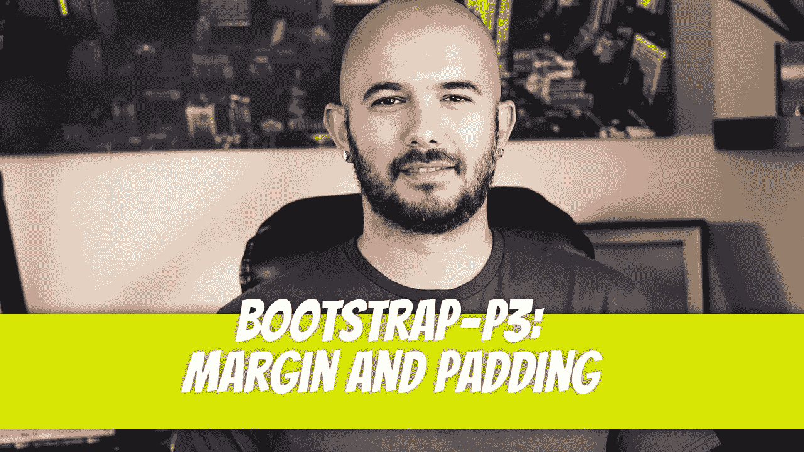
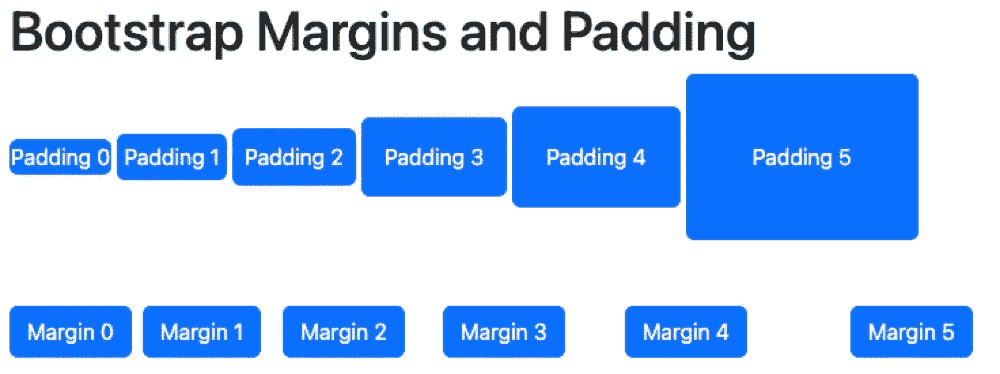

# 自举— P3:边距和填充

> 原文：<https://blog.devgenius.io/bootstrap-p3-margin-and-padding-20b30193385e?source=collection_archive---------8----------------------->



使用 Bootstrap 可以轻松实现边距和填充。您的大多数填充和边距需求都可以通过这些引导属性来完成。填充由 6 个不同的类实现，每个类都以`p-`开始。同样，保证金类以`m-`开头。

填充类包括:`p-0`、`p-1`、`p-2`、`p-3`、`p-4`、`p-5`。为边距定义了以下类别:`m-0`、`m-1`、`m-2`、`m-3`、`m-4`和`m-5`。让我们来看看每一个。

```
<div> <button class="btn btn-primary p-0">Padding 0</button> <button class="btn btn-primary p-1">Padding 1</button> <button class="btn btn-primary p-2">Padding 2</button> <button class="btn btn-primary p-3">Padding 3</button> <button class="btn btn-primary p-4">Padding 4</button> <button class="btn btn-primary p-5">Padding 5</button></div><div> <button class="btn btn-primary m-0">Margin 0</button> <button class="btn btn-primary m-1">Margin 1</button> <button class="btn btn-primary m-2">Margin 2</button> <button class="btn btn-primary m-3">Margin 3</button> <button class="btn btn-primary m-4">Margin 4</button> <button class="btn btn-primary m-5">Margin 5</button></div>
```



像文本对齐一样，不同的边距和填充可以应用于不同的屏幕分辨率。一些例子包括:

*   `p-sm-3`
*   `p-md-5`
*   `m-lg-1`
*   `m-xl-4`

就像固有的 CSS 属性一样，bootstrap 也使填充和边距方向可用，比如 padding-left，`pl-`后跟大小或断点。例子包括:

*   `pl-3`:3 的左填充
*   `pr-5`:右填充 5
*   `pt-2`:顶部填充 2
*   `pb-md-1`:中底填充+1 的显示
*   `py-4`:上下填充 4
*   `px-0`:左右填充为 0
*   等等。

边距遵循几乎相同的模式，但不是以 p 开头，而是以 m 开头，比如`mb-3`(底部边距 3)。

*   `ml-3`:左边距 3
*   `mr-5`:右边距 5
*   `mt-2`:上边距 2
*   `mb-md-1`:中+1 显示的下页边距
*   `my-4`:上下页边距为 4
*   `mx-0`:左右边距为 0
*   等等。


迪诺·卡伊奇目前是 [LSBio(生命周期生物科学公司)](https://www.lsbio.com/)、[绝对抗体](https://absoluteantibody.com/)、 [Kerafast](https://www.kerafast.com/) 、[珠穆朗玛生物](https://everestbiotech.com/)、[北欧 MUbio](https://www.nordicmubio.com/) 和 [Exalpha](https://www.exalpha.com/) 的 IT 主管。他还担任我的自动系统的首席执行官。他有十多年的软件工程经验。他拥有计算机科学学士学位，辅修生物学。他的背景包括创建企业级电子商务应用程序、执行基于研究的软件开发，以及通过写作促进知识的传播。

你可以在 [LinkedIn](https://www.linkedin.com/in/dinocajic/) 上联系他，在 [Instagram](https://instagram.com/think.dino) 上关注他，或者[订阅他的媒体出版物](https://dinocajic.medium.com/subscribe)。

[*阅读迪诺·卡吉克(以及媒体上成千上万其他作家)的每一个故事。你的会员费直接支持迪诺·卡吉克和你阅读的其他作家。你也可以在媒体上看到所有的故事。*](https://dinocajic.medium.com/membership)