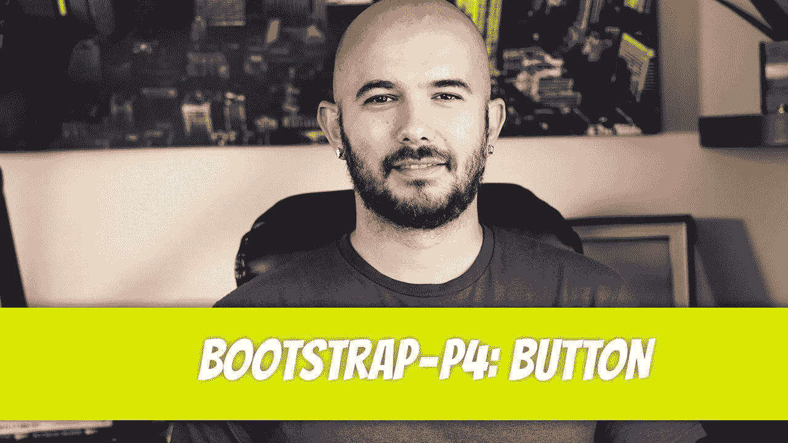
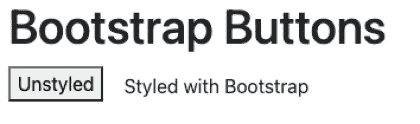
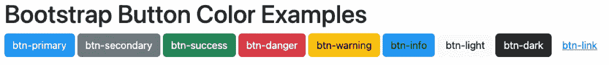
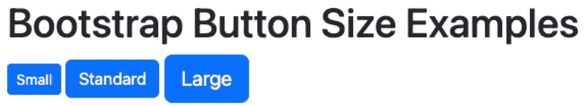
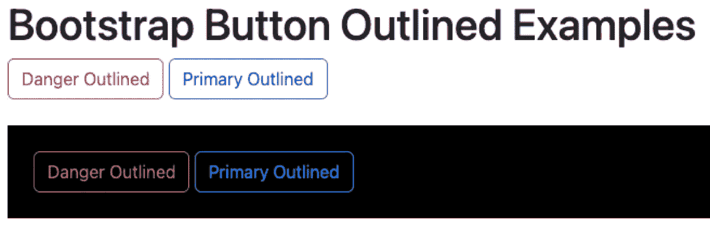
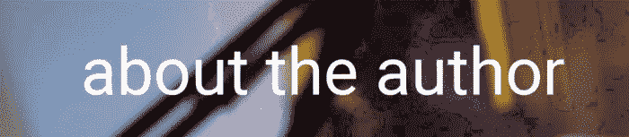

# 自举— P4:按钮

> 原文：<https://blog.devgenius.io/bootstrap-p4-buttons-44ae70417a67?source=collection_archive---------20----------------------->



自举使按钮变得容易。Bootstrap 的团队将猜测从按钮设计中剔除，创造了一套看起来很现代的风格。我很少偏离默认的引导设计。在我们的上一篇文章中，我们简要地看了一下按钮。我们将在这一节中进一步讨论细节。

[](/bootstrap-p3-margin-and-padding-20b30193385e) [## 自举— P3:边距和填充

### 使用 Bootstrap 可以轻松实现边距和填充。您的大多数填充和边距需求都可以通过这些引导程序来完成…

blog.devgenius.io](/bootstrap-p3-margin-and-padding-20b30193385e) 

为了开始使用 bootstrap 的按钮样式，必须将`btn`类应用于每个按钮。让我们看看默认按钮样式和 bootstrap 版本之间的变化。

```
<button>Unstyled</button><button class="btn">Styled with Bootstrap</button>
```



当`btn`类应用于按钮时，样式化的按钮在屏幕上显示为文本。样式化的按钮也比默认样式有更多的填充。

按钮的大小可以通过应用`btn-lg`和`btn-sm`样式来改变。请注意，`btn`类必须保持不变。额外的类继承了`btn`类的行为。

正如上一篇文章中所讨论的，某些按钮颜色是在 bootstrap 中为特定场景预定义的。让我们再来看看它们。

```
<button type="button" class="btn btn-primary">btn-primary</button><button type="button" class="btn btn-secondary”> btn-secondary</button><button type="button" class="btn btn-success">btn-success</button><button type="button" class="btn btn-danger">btn-danger</button><button type="button" class="btn btn-warning">btn-warning</button><button type="button" class="btn btn-info">btn-info</button><button type="button" class="btn btn-light">btn-light</button><button type="button" class="btn btn-dark">btn-dark</button><button type="button" class="btn btn-link">btn-link</button>
```



按钮的大小可以通过应用`btn-lg`和`btn-sm`样式来改变。注意`btn`级必须保持在原位。额外的类继承了`btn`类的行为。

```
<div> <button type="button" class="btn btn-primary btn-sm”> Small </button> <button type="button" class="btn btn-primary”> Standard </button> <button type="button" class="btn btn-primary btn-lg”> Large </button></div>
```



按钮也可以用 outline 类来勾勒。按钮将是透明的，只有边框和文本以特定的颜色显示。

```
<div> <button type="button" class="btn btn-outline-danger”> Danger Outlined </button> <button type="button" class="btn btn-outline-primary”> Primary Outlined </button></div><div class="mt-4 p-4 bg-black"> <button type="button" class="btn btn-outline-danger”> Danger Outlined </button> <button type="button" class="btn btn-outline-primary”> Primary Outlined </button></div>
```



迪诺·卡伊奇目前是 [LSBio(生命周期生物科学公司)](https://www.lsbio.com/)、[绝对抗体](https://absoluteantibody.com/)、 [Kerafast](https://www.kerafast.com/) 、[珠穆朗玛生物](https://everestbiotech.com/)、[北欧 MUbio](https://www.nordicmubio.com/) 和 [Exalpha](https://www.exalpha.com/) 的 IT 主管。他还担任我的自动系统的首席执行官。他有十多年的软件工程经验。他拥有计算机科学学士学位，辅修生物学。他的背景包括创建企业级电子商务应用程序、执行基于研究的软件开发，以及通过写作促进知识的传播。

你可以在 [LinkedIn](https://www.linkedin.com/in/dinocajic/) 上联系他，在 [Instagram](https://instagram.com/think.dino) 上关注他，或者[订阅他的媒体出版物](https://dinocajic.medium.com/subscribe)。

[*阅读迪诺·卡吉克(以及媒体上成千上万其他作家)的每一个故事。你的会员费直接支持迪诺·卡吉克和你阅读的其他作家。你也可以在媒体上看到所有的故事。*](https://dinocajic.medium.com/membership)