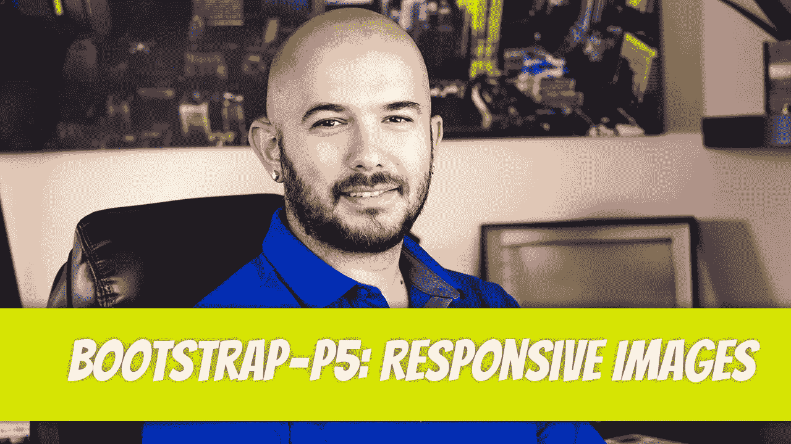
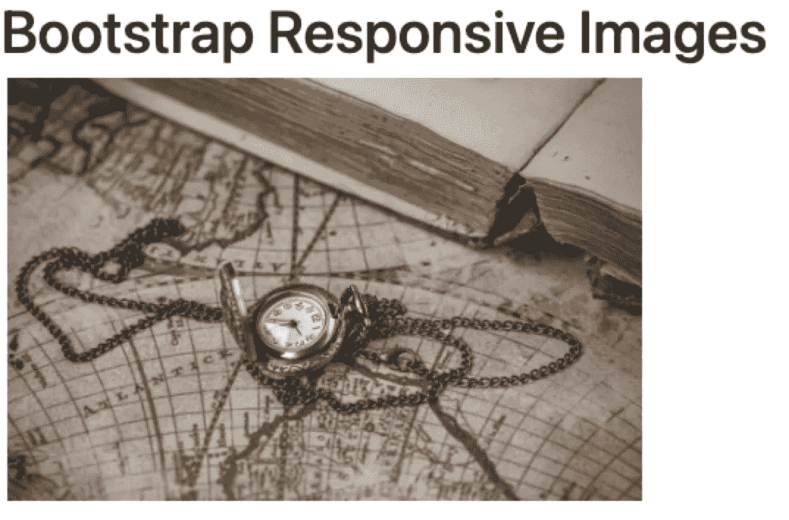
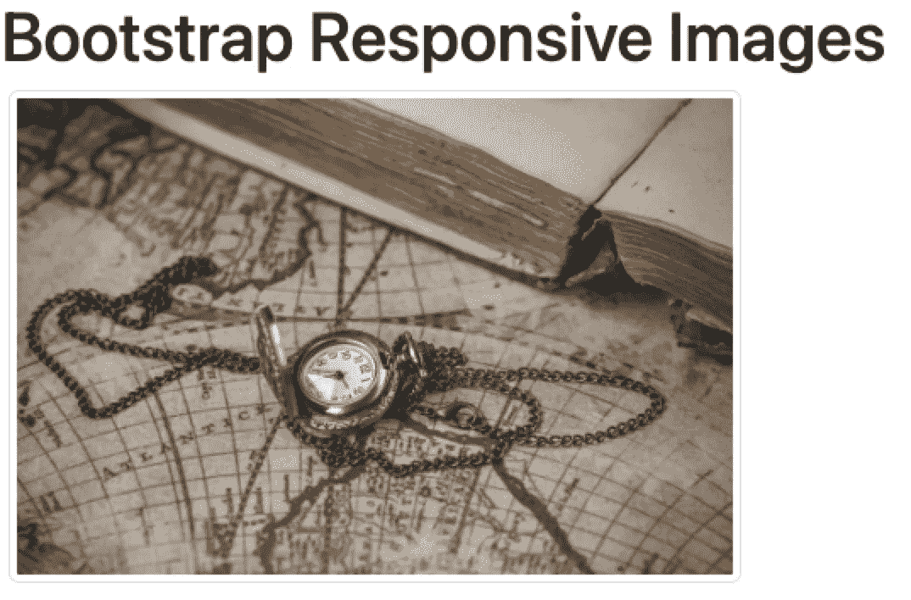
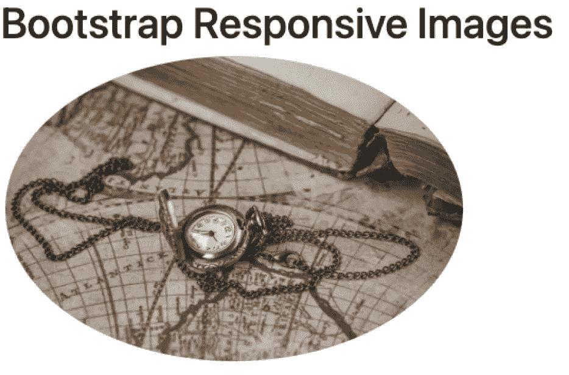
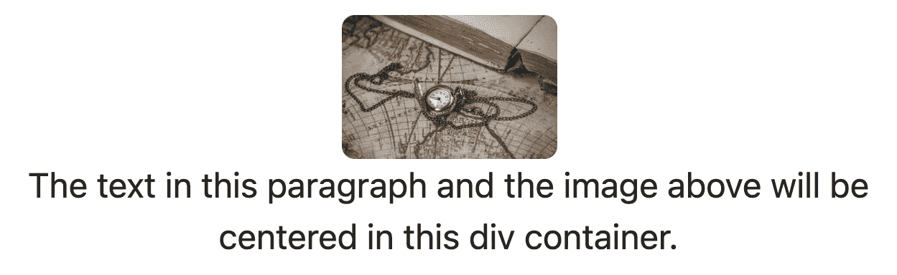

# 自举— P5:响应图像

> 原文：<https://blog.devgenius.io/bootstrap-p5-responsive-images-d58113f1142c?source=collection_archive---------11----------------------->



图像响应性是网站响应性的重中之重。Bootstrap 有一个简单的类叫做`img-fluid`。`img-fluid`样式将图像宽度设置为容器的宽度，并使高度成比例。

[](/bootstrap-p4-buttons-44ae70417a67) [## 自举— P4:按钮

### 自举使按钮变得简单。Bootstrap 的团队已经消除了按钮设计中的猜测，并且…

blog.devgenius.io](/bootstrap-p4-buttons-44ae70417a67) 

```
<div class="col-4 m-1"> </div>
```



在上面的例子中，我们向外部容器添加了一个`col-4`类。目前，我们只知道有 12 列可以使用，我们已经将`div`容器设置为占用 4 列，或者大约占页面的 1/3。我们稍后将讨论列。图像类被设置为`img-fluid`。这确保了图像在每个屏幕分辨率下都占据 100%的容器。

你可能遇到的另一个类是`img-thumbnail`类。虽然它不会将你的图像调整为缩略图，但它会在其周围添加 1 像素的边框。

```
<div class="col-4 m-1"> </div>
```



在之前关于 CSS 的文章中，我们也做了一个圆润的形象。通过将类`rounded-circle`添加到`img`类属性，我们可以轻松地用 Bootstrap 完成同样的事情。

```
<div class="col-4 m-1"> </div>
```



其他圆形边框引导程序类包括:

*   `rounded`
*   `rounded-top`
*   `rounded-end`
*   `rounded-bottom`
*   `rounded-start`
*   `rounded-circle`
*   `rounded-pill`

最后，为了使一个图像在容器内居中，您将使用`text-center`类。因为默认情况下图像被设置为 display: `inline`，所以`text-center`类将对其进行处理。`text-center`属性应用于容器，而不是图像标签本身。

```
<div class="col-4 m-1 text-center“>  <p> The text in this paragraph and the image above will be centered in this div container. </p></div>
```

在这个例子中，我们向`div`容器添加了文本中心类。由于图像相当大，我们还添加了一个内嵌样式来减小它的大小。这样做只是为了容易看到效果。



迪诺·卡伊奇目前是 [LSBio(生命周期生物科学公司)](https://www.lsbio.com/)、[绝对抗体](https://absoluteantibody.com/)、 [Kerafast](https://www.kerafast.com/) 、[珠穆朗玛生物](https://everestbiotech.com/)、[北欧 MUbio](https://www.nordicmubio.com/) 和 [Exalpha](https://www.exalpha.com/) 的 IT 主管。他还担任我的自动系统的首席执行官。他有十多年的软件工程经验。他拥有计算机科学学士学位，辅修生物学。他的背景包括创建企业级电子商务应用程序、执行基于研究的软件开发，以及通过写作促进知识的传播。

你可以在 [LinkedIn](https://www.linkedin.com/in/dinocajic/) 上联系他，在 [Instagram](https://instagram.com/think.dino) 上关注他，或者[订阅他的媒体出版物](https://dinocajic.medium.com/subscribe)。

[*阅读迪诺·卡吉克(以及媒体上成千上万其他作家)的每一个故事。你的会员费直接支持迪诺·卡吉克和你阅读的其他作家。你也可以在媒体上看到所有的故事。*](https://dinocajic.medium.com/membership)