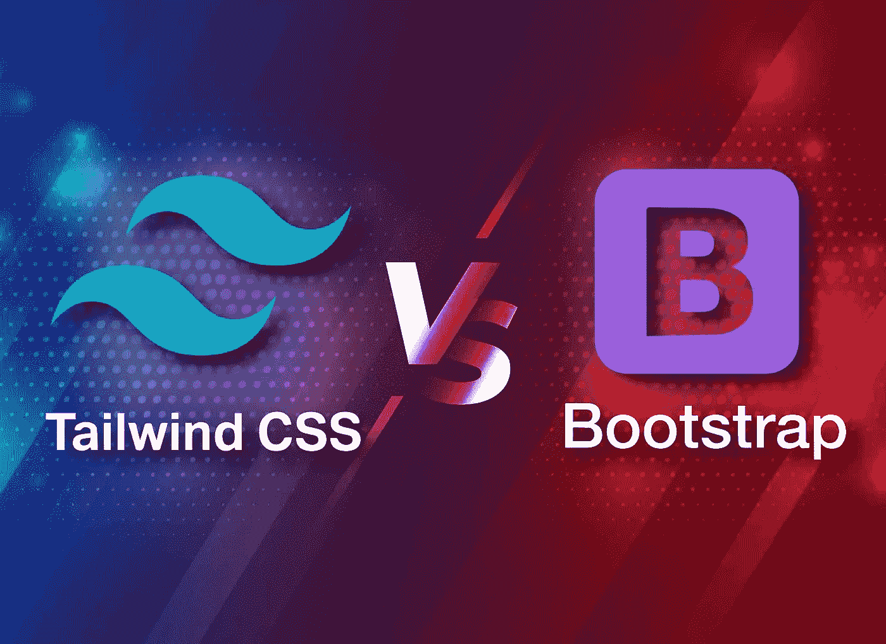
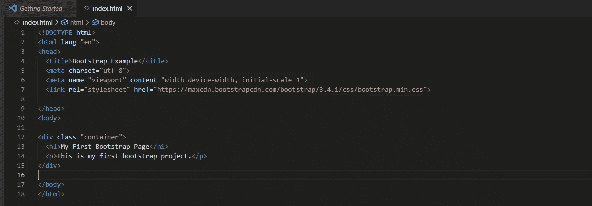
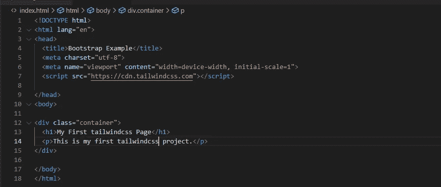
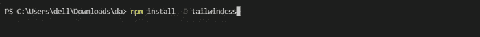
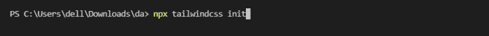
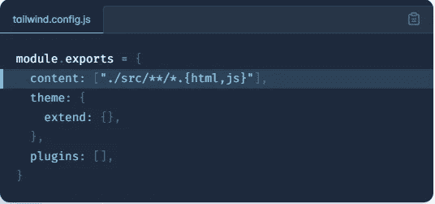
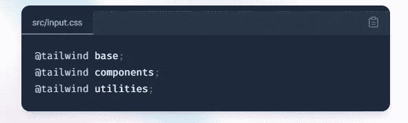

# 自举 vs 顺风 CSS

> 原文：<https://blog.devgenius.io/bootstrap-vs-tailwind-css-1b9d29c44a84?source=collection_archive---------2----------------------->

# 引导历史

Bootstrap 由 Twitter 的 Mark Otto 和 Jacob Thornton 开发，并于 2011 年 8 月在 GitHub 上作为开源产品发布。

# 引导程序

Bootstrap 是一个开放的框架，用于设计更高、更快、更简单的响应性网站。这是 miles，一个初学者喜欢的、最流行的开放供应框架，包括 HTML、CSS 和 JavaScript。Bootstrap 可用于创建任何服务器端生成的网络程序，如 Java、PHP 等。它的响应布局允许像手机、药物和计算机这样的结构。Bootstrap 整合了基于 CSS 和 JavaScript 的布局模板，用于排版、官僚主义、按钮、导航、图标和不同的界面添加剂。它远远基于面向项目的 CSS。Bootstrap 有助于快速设计和增加网站模板。

# **什么是响应式网页设计？**

响应式网页设计是关于创建网站，自动调整自己，在所有设备上看起来都很好，从小型手机到大型桌面。

# **如何使用**

<link rel="”stylesheet”" href="”https://maxcdn.bootstrapcdn.com/bootstrap/3.4.1/css/bootstrap.min.css&quot;">

**查看结果**

**输出**

# 顺风历史

Tailwind CSS 最初由 Adam Wathan 开发，第一个版本于 2017 年 11 月 1 日发布

# 顺风 CSS

Tailwind CSS 基本上是一个实用优先的 CSS 框架，用于快速构建定制用户界面。它是一个高度可定制的低级 CSS 框架，为您提供了构建定制设计所需的所有构件，而没有任何您必须努力克服的恼人的固执己见的风格。

# **如何使用**

使用顺风 CSS 有两种方法，

# **使用 CDN**

使用 Play CDN 在浏览器中直接尝试 Tailwind，无需任何构建步骤。Play CDN 仅设计用于开发目的，并不是生产的最佳选择。

# **利用 NPM**

从头开始使用 Tailwind CSS 最简单、最快速的方法是使用 Tailwind CLI 工具。

## 安装顺风 CSS

通过 npm 安装`tailwindcss`，并创建您的`tailwind.config.js`文件。

## 配置您的模板路径

在`tailwind.config.js`文件中添加所有模板文件的路径。

## 将顺风指令添加到 CSS 中

将 Tailwind 的每个层的`@tailwind`指令添加到主 CSS 文件中。

## 启动顺风 CLI 构建过程

运行 CLI 工具扫描模板文件中的类并构建 CSS。

## 开始在你的 HTML 中使用顺风

将编译好的 CSS 文件添加到`<head>`中，开始使用 Tailwind 的工具类来设计你的内容。

# **比较顺风和自举**

# **顺风社**

1.  Tailwind 提供了预先设计好的小部件，可以通过快速的 UI 开发从头开始构建一个站点。
2.  Tailwind CSS 使用一组实用程序类来创建一个简洁的 UI，具有更大的灵活性和独特性。
3.  使用 Tailwind CSS 创建的网站更具可定制性。
4.  Tailwind CSS 相对较新，就其社区而言仍有很大的增长空间，但是，它正在与日俱增，与它相关的用户、引用、工具和网站的数量也在增加。
5.  Tailwind CSS 只需要基本的样式表文件，这相当于 27kb，使它变得更轻。
6.  BlaBlaCar、Exyplis 和 Bazzite 使用 Tailwind CSS。

# **自举**

1.  Bootstrap 附带了一组预先设计好的响应性、移动优先的组件，这些组件拥有明确的 UI 工具包。
2.  使用 Bootstrap 创建的站点遵循通用模式，使它们看起来完全相同。
3.  用 Bootstraps 创建的网站以其响应速度和完美的设计而闻名，但外观都很普通和相似。
4.  自举效率高，节省大量时间。它已经存在了九年多，是最流行的 CSS 框架，它有一个庞大的开发者社区、论坛、工具等等。
5.  Bootstrap 有四个文件，需要包含在您的项目中才能获得 CSS 框架的全部好处。这些文件的总大小为 308.25kb，包括 jQuery、Popper.js、Bootstrap JS 和主引导 CSS 文件。
6.  Spotify、Twitter 和 Lyft 是使用 Bootstrap 的一些著名公司。