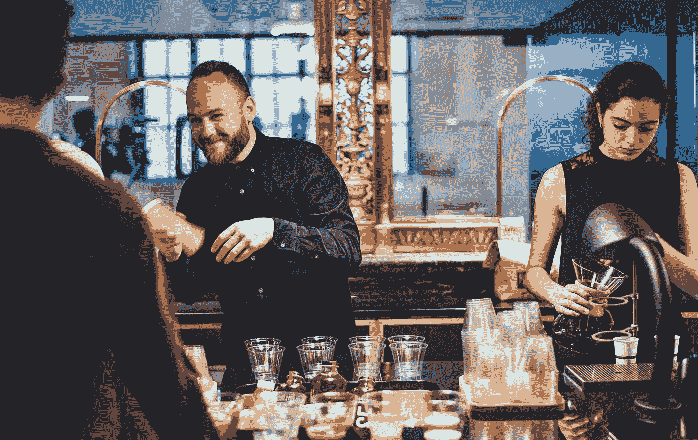
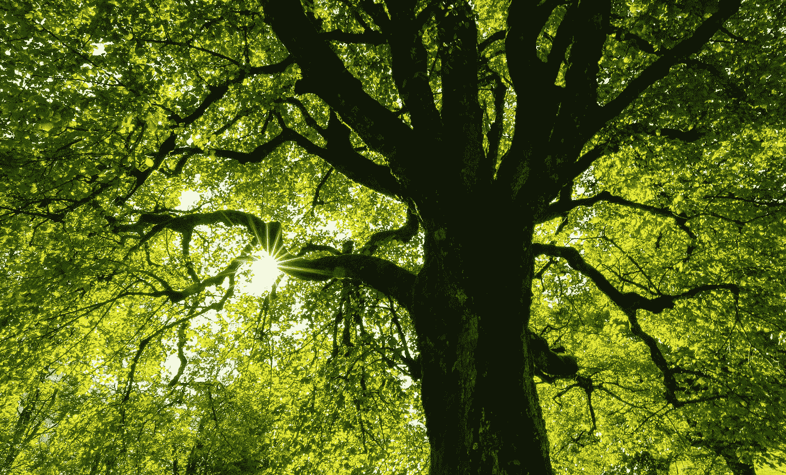

# BootstrapVue —自定义进度条和侧栏

> 原文：<https://blog.devgenius.io/bootstrapvue-customizing-progress-bars-and-sidebars-267d2a40f311?source=collection_archive---------21----------------------->



[船员](https://unsplash.com/@crew?utm_source=medium&utm_medium=referral)在 [Unsplash](https://unsplash.com?utm_source=medium&utm_medium=referral) 上拍照

为了制作好看的 Vue 应用，我们需要设计组件的样式。

为了使我们的生活更容易，我们可以使用内置样式的组件。

我们看看如何自定义进度条和添加侧边栏。

# 宽度和高度

我们可以按照自己喜欢的方式改变`b-progress`组件的宽度。

例如，我们可以写:

```
<template>
  <div id="app">
    <b-progress :value="value" class="w-50 mb-2"></b-progress>
  </div>
</template><script>
export default {
  data() {
    return {      
      value: 75
    };
  }
};
</script>
```

让它填满半个屏幕。

高度也可以改变。

例如，我们可以写:

```
<template>
  <div id="app">
    <b-progress :value="value" height="2rem"></b-progress>
  </div>
</template><script>
export default {
  data() {
    return {
      value: 75
    };
  }
};
</script>
```

我们将`height`设置为`2rem`，这样进度条会更高。

# 背景

我们可以按照自己喜欢的方式改变进度条的背景。

这可以用`variant`道具来完成。

例如，我们可以写:

```
<template>
  <div id="app">
    <b-progress :value="value" variant="success"></b-progress>
  </div>
</template><script>
export default {
  data() {
    return {
      value: 75
    };
  }
};
</script>
```

然后我们会看到一个绿色条，因为我们将`variant`设置为`'success'`。

# 条纹背景

进度条的背景可以做成条纹状。

为了使它有条纹，我们添加了`striped`道具。

例如，我们可以写:

```
<template>
  <div id="app">
    <b-progress :value="value" striped></b-progress>
  </div>
</template><script>
export default {
  data() {
    return {
      value: 75
    };
  }
};
</script>
```

现在酒吧是条纹的。

# 动画背景

进度条的背景也可以是动画。

我们只需要设置`animated`道具来完成:

```
<template>
  <div id="app">
    <b-progress :value="value" animated></b-progress>
  </div>
</template><script>
export default {
  data() {
    return {
      value: 75
    };
  }
};
</script>
```

# 补充报道

我们可以用 BootstrapVue 创建一个侧边栏。

这是从 2.10.0 开始提供的组件。

要创建一个，我们使用`b-sidebar`组件:

```
<template>
  <div id="app">
    <b-button v-b-toggle.sidebar>Toggle</b-button>
    <b-sidebar id="sidebar" title="Sidebar" shadow>
      <div class="px-3 py-2">
        <p>foo</p>
        <b-img src="http://placekitten.com/200/200" fluid thumbnail></b-img>
      </div>
    </b-sidebar>
  </div>
</template><script>
export default {};
</script>
```

我们有`v-b-toggle`指令。

`sidebar`修饰符匹配`b-sidebar`的`id`的名称，让我们打开侧边栏。

在`b-siderbar`组件上，我们设置了`title`道具，它设置了标题。

`shadow`启用阴影。

其余的内容显示在标题下面。

# 安置

摆放位置可以用道具改变。

`right`道具会把侧边栏放在右边而不是左边。

例如，我们可以写:

```
<template>
  <div id="app">
    <b-button v-b-toggle.sidebar>Toggle</b-button>
    <b-sidebar id="sidebar" title="Sidebar" right  shadow>
      <div class="px-3 py-2">
        <p>foo</p>
        <b-img src="http://placekitten.com/200/200" fluid thumbnail></b-img>
      </div>
    </b-sidebar>
  </div>
</template><script>
export default {};
</script>
```

现在侧边栏从右边打开，而不是左边。

# 风格变体

我们可以使用`bg-variant`来改变背景的样式。

`text-variant`用于改变文本的样式。

例如，我们可以写:

```
<template>
  <div id="app">
    <b-button v-b-toggle.sidebar>Toggle</b-button>
    <b-sidebar id="sidebar" title="Sidebar" bg-variant="success" text-variant="light" shadow>
      <div class="px-3 py-2">
        <p>foo</p>
        <b-img src="http://placekitten.com/200/200" fluid thumbnail></b-img>
      </div>
    </b-sidebar>
  </div>
</template><script>
export default {};
</script>
```

那么文本是白色的，因为`text-variant`是`light`。

`bg-variant`是`success`所以背景是绿色的。

# 边界

我们可以用 BootstrapVue 的 border 实用程序类添加边框。

例如，我们可以写:

```
<template>
  <div id="app">
    <b-button v-b-toggle.sidebar>Toggle</b-button>
    <b-sidebar id="sidebar" title="Sidebar" sidebar-class="border-right border-success">
      <div class="px-3 py-2">
        <p>foo</p>
        <b-img src="http://placekitten.com/200/200" fluid thumbnail></b-img>
      </div>
    </b-sidebar>
  </div>
</template><script>
export default {};
</script>
```

我们添加了`sidebar-class`道具来设置边界职业。

`border-right`向右添加边框。

`border-success`使边界变绿。



[简·侯伯](https://unsplash.com/@jan_huber?utm_source=medium&utm_medium=referral)在 [Unsplash](https://unsplash.com?utm_source=medium&utm_medium=referral) 上拍照

# 结论

进度条可以按照我们想要的方式设计。

另外，我们可以用 BootstrapVue 添加边栏。

我们可以添加内容并控制背景、边框和文本颜色。