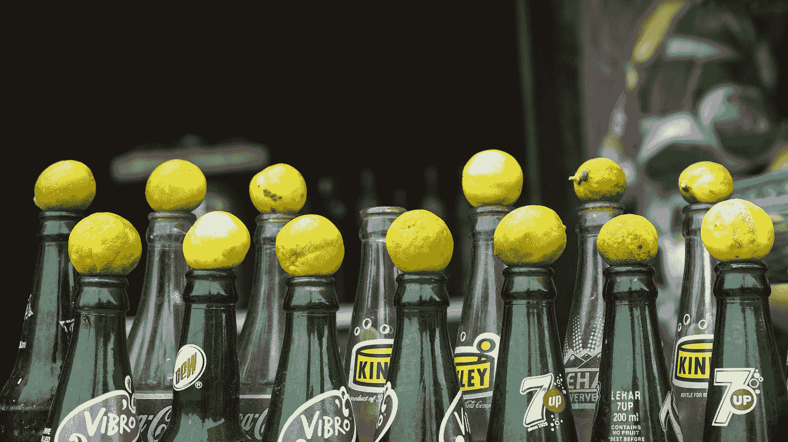

# BootstrapVue —分页导航定制和弹出窗口

> 原文：<https://blog.devgenius.io/bootstrapvue-pagination-nav-customization-and-popovers-4a02f7492425?source=collection_archive---------40----------------------->



照片由[基肖尔·拉格夫·加内什·库马尔](https://unsplash.com/@k15hore?utm_source=medium&utm_medium=referral)在 [Unsplash](https://unsplash.com?utm_source=medium&utm_medium=referral) 上拍摄

为了制作好看的 Vue 应用，我们需要设计组件的样式。

为了使我们的生活更容易，我们可以使用内置样式的组件。

我们来看看如何定制页面的分页导航链接。

此外，我们看看如何添加松饼。

# 第一个和最后一个按钮

我们可以添加`first-button`属性来总是包含第一页的按钮。

我们可以使用`last-button`道具来总是包含最后一页的按钮。

例如，我们可以写:

```
<template>
  <div>
    <b-pagination-nav v-model="currentPage" :number-of-pages="pages" base-url="#" first-number></b-pagination-nav>
  </div>
</template><script>
export default {
  data(){
    return {
      currentPage: 1,
      pages: 20
    }
  }
};
</script>
```

那么第一页将一直显示，因为`first-number`包括在内。

# 按钮大小

我们可以通过改变`size`道具来改变按钮的大小。

例如，我们可以写:

```
<template>
  <div>
    <b-pagination-nav size="sm" v-model="currentPage" :number-of-pages="pages" base-url="#" first-number></b-pagination-nav>
  </div>
</template><script>
export default {
  data(){
    return {
      currentPage: 1,
      pages: 20
    }
  }
};
</script>
```

我们将`size`属性设置为`sm`，使按钮比默认的小。

此外，我们可以将其设置为`lg`以使它们大于默认值。

# 药丸样式

`pills`道具可以用来让按钮看起来像药丸:

```
<template>
  <div>
    <b-pagination-nav
      pills
      v-model="currentPage"
      :number-of-pages="pages"
      base-url="#"
    ></b-pagination-nav>
  </div>
</template><script>
export default {
  data() {
    return {
      currentPage: 1,
      pages: 20
    };
  }
};
</script>
```

# 对齐

我们可以使用`align`道具将分页导航对齐到我们想要的位置。

例如，我们可以写:

```
<template>
  <div>
    <b-pagination-nav align="center" v-model="currentPage" :number-of-pages="pages" base-url="#"></b-pagination-nav>
  </div>
</template><script>
export default {
  data() {
    return {
      currentPage: 1,
      pages: 20
    };
  }
};
</script>
```

现在我们把分页导航放在中间。

其他值包括`'right'`来将分页导航向右对齐。

`'fill'`让导航填满屏幕宽度。

# 波普沃

我们可以使用 BootstrapVue 将 popovers 添加到我们的 Vue 应用程序中。

它为我们提供了一个工具提示。

我们可以使用`v-b-tooltip`指令来添加它。

例如，我们可以写:

```
<template>
  <div id="app" class="text-center">
    <b-button v-b-popover.hover.top="'content'" title="Title">Hover Me</b-button>
  </div>
</template><script>
export default {};
</script><style>
#app {
  margin: 200px;
}
</style>
```

我们有带`top`修饰符的`v-b-popover`组件，如果按钮上方有空间，它就在按钮上方显示弹出框。

它的价值在于内容。

`title`是 popover 的标题。

此外，我们可以使用`b-popover`来添加一个弹出窗口。

要更改标题，我们可以填充`title`槽:

```
<template>
  <div id="app" class="text-center">
    <b-button id="popover">Hover Me</b-button>
    <b-popover target="popover" triggers="hover" placement="top">
      <template v-slot:title>Title</template>
      <b>content</b>
    </b-popover>
  </div>
</template><script>
export default {};
</script><style>
#app {
  margin: 200px;
}
</style>
```

我们有`b-popover`组件。

按钮的`id`必须与`target`道具的值相匹配。

`triggers`道具指示弹出器是如何触发的。

`placement`设置为`'top'`以显示按钮上方的弹出窗口。

我们通过使用由`v-slot:title`表示的`title`槽来填充标题内容。

在`b-popover`组件中的剩余代码被填充为内容。

js 用于显示弹出窗口。

# 配置

可能的位置包括`top`、`topleft`、`topright`、`right`、`righttop`、`rightbottom`、`bottom`、`bottomleft`、`bottomright`、`left`、`lefttop`和`leftbottom`。

我们可以将这些值设置为`placement`道具的值。

# 扳机

显示弹出框的触发器可以不是悬停。

例如，我们可以将其更改为`focus`:

```
<template>
  <div id="app" class="text-center">
    <b-button
      href="#"
      tabindex="0"
      v-b-popover.focus="'content'"
      title="Title"
    >click me</b-button>
  </div>
</template><script>
export default {};
</script><style>
#app {
  margin: 200px;
}
</style>
```

现在我们只有在点击按钮时才能看到弹出框。


照片由[野田康介](https://unsplash.com/@kkk7799?utm_source=medium&utm_medium=referral)在 [Unsplash](https://unsplash.com?utm_source=medium&utm_medium=referral) 上拍摄

# 结论

我们可以随意定制导航页面的按钮。

此外，我们可以添加弹出窗口，以便在单击或悬停在某个元素上时显示某些内容。