# 使用 Jetpack 导航组件简化底部导航。

> 原文：<https://blog.devgenius.io/bottom-navigation-made-simple-using-jetpack-navigation-component-efcdbfc913be?source=collection_archive---------5----------------------->

探索导航组件| Kotlin | AndroidX

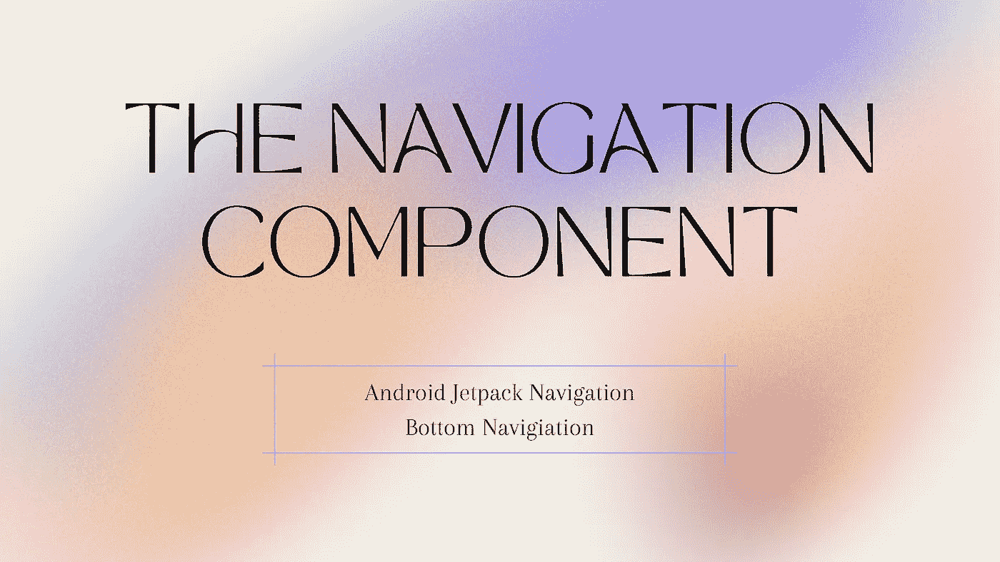

# **简介**

用片段管理导航就是处理回栈，处理片段事务，突出片段选项，迷失在中间不知道回哪里去！！

最好的解决方案是导航组件，一旦我开始使用它，我就再也回不去了。这是一次性解决所有问题的一站式解决方案。这是关于做底部导航，这将比以往任何时候都更容易和更令人愉快。

在深入研究之前，我还在 YouTube 上发布了一个关于底部导航和导航组件的视频。看一看！

# 优势

*   自动处理片段事务
*   默认情况下正确处理向上和向后
*   动画和交易的默认行为
*   深度链接作为第一类操作
*   用额外的工作实现导航 UI 模式(导航抽屉和底部导航)。
*   导航时传递参数时键入 safety

> 让我们深入研究一下代码吧！

# 1.重要的事情先来！..添加导航依赖项

将以下依赖项添加到您的应用程序的 build.gradle，以便导航组件在您的项目中支持。

```
*// Kotlin* implementation("androidx.navigation:navigation-fragment-ktx:2.4.1")
implementation("androidx.navigation:navigation-ui-ktx:2.4.1")

*// Feature module Support* implementation("androidx.navigation:navigation-dynamic-features-fragment:2.4.1")

*// Testing Navigation* androidTestImplementation("androidx.navigation:navigation-testing:2.4.1")

*// Jetpack Compose Integration* implementation("androidx.navigation:navigation-compose:2.4.1")
```

# 2.创建片段

我想创建 3 个片段和一个主要活动。主要活动将集中在底部导航和导航主机来了。

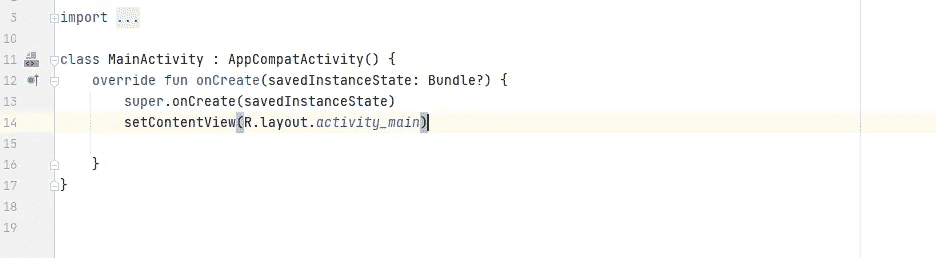

主要活动

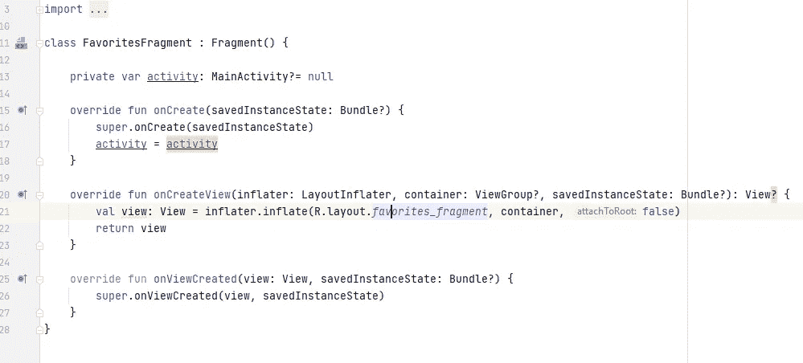

片段-1

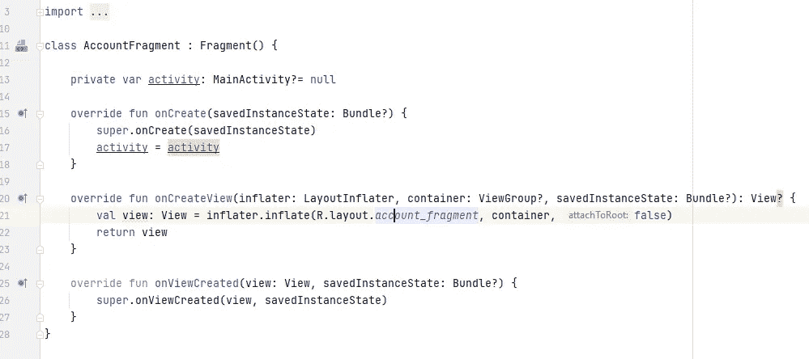

片段 2

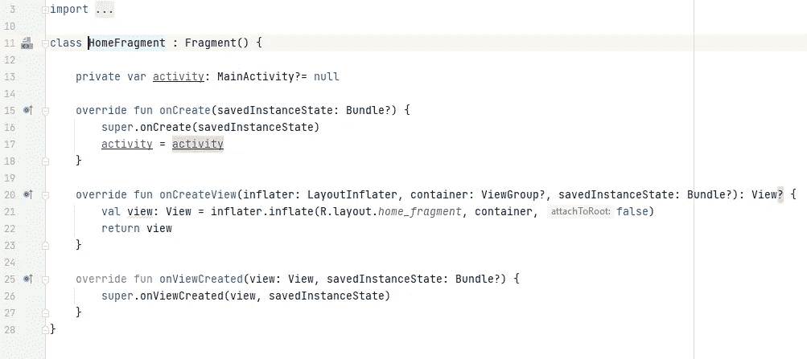

片段 3

# 3.导航图

如何创建导航图？

*   转到您的资源文件夹->右键单击
*   创建资源文件
*   给出你想要的名字
*   在资源类型中选择导航
*   单击确定

你已经准备好导航图了。

这是一个集中的空间，它显示所有的片段，过渡，他们之间的行动。Navgraph 有 2 部分的设计和代码，我们可以按照我们的意愿来设计它。

这是它的样子

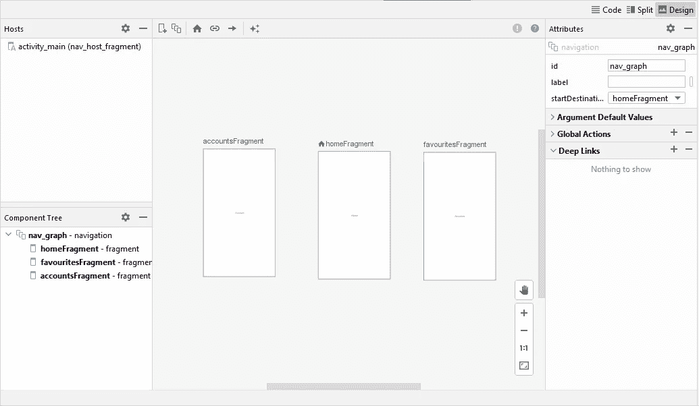

设计

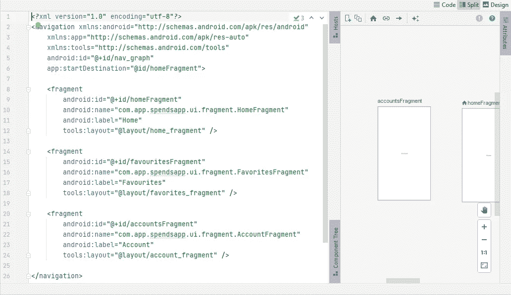

密码

# 4.设置起始目的地

用户需要在启动应用程序后到达特定的固定目的地。导航应该基于 LIFO(后进先出)堆栈。移动到一个新的目的地意味着在栈顶推出新的屏幕。起始目的地将是堆栈中的最后一个，大多数情况下是我们关闭应用程序时的最后一页。

设置堆栈目的地就像点击按钮一样简单，只需从下拉列表中选择一个片段，这将是您的应用程序的第一个屏幕。

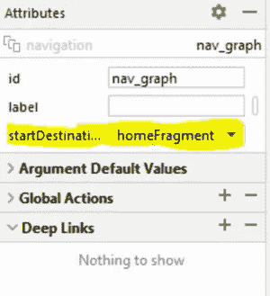

# 5.添加 NavHost 片段和底部导航

导航主机片段——导航组件中最重要的组件。它是一个空的片段，当用户在应用程序中导航时，它会被放入和取出。

底部导航—它是屏幕底部的一个视图，上面有多个按钮，单击任何按钮时，位于顶部的片段会根据所采取的操作更改 UI，底部会突出显示，以帮助用户显示屏幕。

```
*<?*xml version="1.0" encoding="utf-8"*?>* <androidx.constraintlayout.widget.ConstraintLayout xmlns:android="http://schemas.android.com/apk/res/android"
    xmlns:app="http://schemas.android.com/apk/res-auto"
    xmlns:tools="http://schemas.android.com/tools"
    android:layout_width="match_parent"
    android:layout_height="match_parent"
    tools:context=".ui.activity.MainActivity">

    <androidx.fragment.app.FragmentContainerView
        android:id="@+id/nav_host_fragment"
        android:name="androidx.navigation.fragment.NavHostFragment"
        android:layout_width="match_parent"
        android:layout_height="match_parent"
        app:layout_constraintLeft_toLeftOf="parent"
        app:layout_constraintRight_toRightOf="parent"
        app:layout_constraintTop_toTopOf="parent"
        app:layout_constraintBottom_toBottomOf="@id/bottomNavigation"
        app:defaultNavHost="true"
        android:layout_marginBottom="60dp"
        app:navGraph="@navigation/nav_graph" //the nav graph/>

    <com.google.android.material.bottomnavigation.BottomNavigationView
         android:layout_height="60dp"
        android:layout_width="match_parent"
        android:id="@+id/bottomNavigation"
        app:layout_constraintTop_toBottomOf="@id/nav_host_fragment"
        app:layout_constraintBottom_toBottomOf="parent"
        app:menu="@menu/menu_bottom_nav"// the menu file />

</androidx.constraintlayout.widget.ConstraintLayout>
```

最后，我们需要映射 navhost 图&创建一个带有底部导航选项的菜单，并将其映射到 xml。

```
*<?*xml version="1.0" encoding="utf-8"*?>* <menu xmlns:android="http://schemas.android.com/apk/res/android">
    <item
        android:id="@id/homeFragment"
        android:icon="@drawable/home"
        android:title="Home" />

    <item
        android:id="@id/favouritesFragment"
        android:icon="@drawable/home"
        android:title="Favourites" />

    <item
        android:id="@id/accountsFragment"
        android:icon="@drawable/home"
        android:title="Account" />
</menu>
```

# 6.一切就绪！..最后一步

应用程序中的导航是使用 NavController 完成的，它是一个在 NavHost 中管理应用程序导航的对象。

将 NavHost 片段& NavHost 初始化到活动。

```
class MainActivity : AppCompatActivity() {
    override fun onCreate(savedInstanceState: Bundle?) {
        super.onCreate(savedInstanceState)
        setContentView(R.layout.*activity_main*)

        val navHostFragment = *supportFragmentManager*.findFragmentById(R.id.*nav_host_fragment*) as NavHostFragment
        val navController = navHostFragment.navController
        val navView: BottomNavigationView = findViewById(R.id.*bottomNavigation*)
        navView.*setupWithNavController*(navController)

    }
}
```

现在我们可以运行应用程序并查看输出。

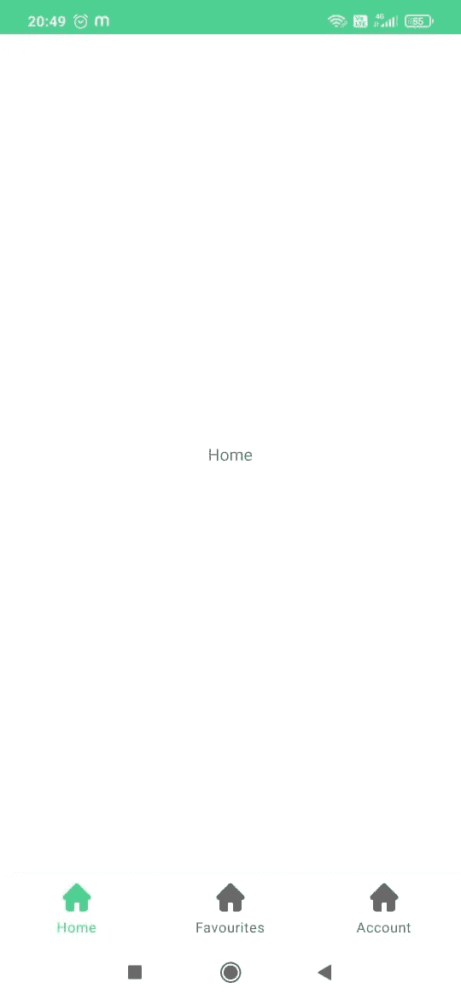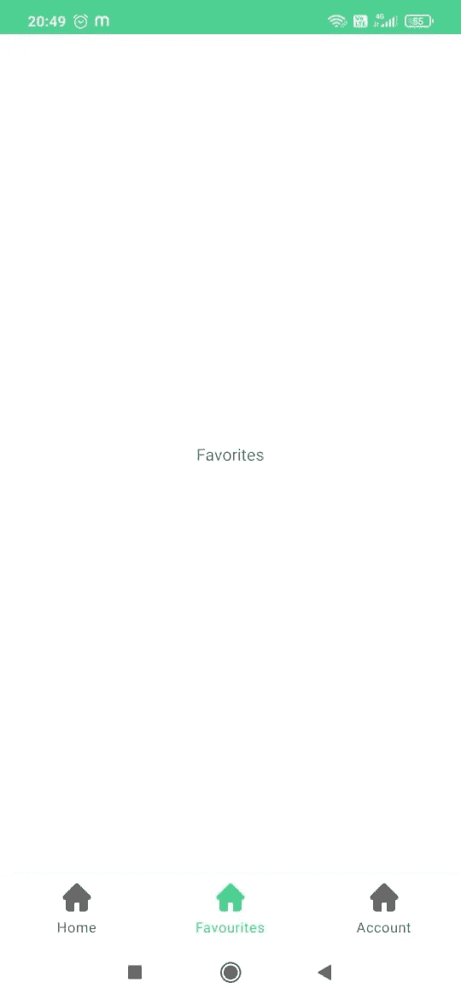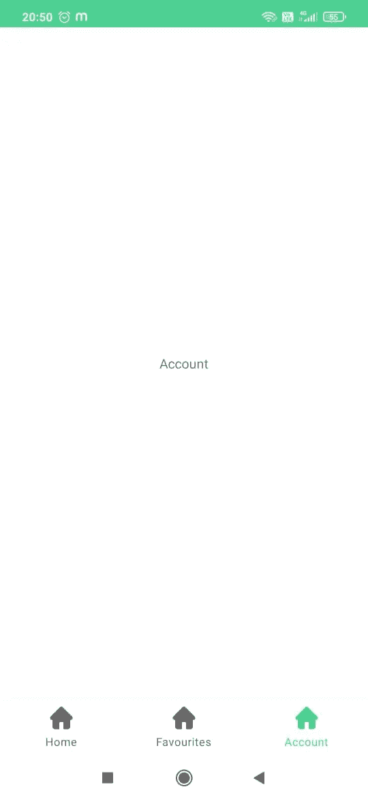

这就是关于 Jetpack 导航组件&底部导航的全部内容。

# 编码快乐！！