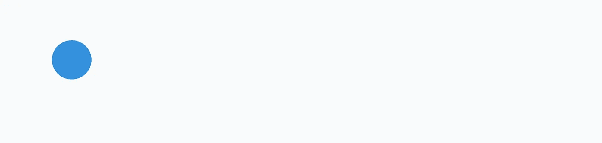

# 顺风 CSS 中的弹跳球动画

> 原文：<https://blog.devgenius.io/bouncing-ball-animation-in-tailwind-css-66565a0ddd64?source=collection_archive---------5----------------------->

众所周知，Tailwind 附带了大量的动画类，我们可以用它们来创建漂亮的动画。

## 为什么我们痴迷于顺风 CSS？

**Tailwind**[](https://tailwindcss.com/docs)****CSS 是一个实用优先的 CSS 框架，因其简单性和灵活性而在 web 开发人员中广受欢迎**。它提供了大量的实用程序类，可用于将通用样式应用于您的元素，从而可以轻松地创建自定义设计，而不必编写大量的 CSS。Tailwind CSS 是可定制的，因此您可以轻松地修改默认主题以匹配您的设计偏好，或者创建您自己的定制样式。它也是响应式的，这意味着它包括大量的实用程序类，可用于将响应式应用于您的元素。这使得在不同的屏幕尺寸和设备上创建好看的设计变得更加容易。Tailwind CSS 易于学习和使用，因此即使您是 CSS 新手，也可以快速开始使用它来创建专业外观的设计。**

****

**弹跳球**

**让我们直接创建一个简单的球弹跳动画。**

## **让我们先说明我们的要求**

1.  **我们将创建一个独立的可重用的弹跳球组件**
2.  **我们需要一个关键帧动画来显示所需的动画**
3.  **顺风类**

# **我们开始吧**

**动画是使用 React 和 Tailwind CSS 构建的。在 React 组件中，我们定义了一个`BouncingBall`组件，它使用一个类`bouncing-ball`来呈现一个`div`元素。这个类用于将弹跳动画应用到球上。**

```
import React from 'react';
import './BouncingBall.css';

const BouncingBall = () => {
  return (
    <div className="container mx-auto relative">
      <div
        className="bouncing-ball absolute bottom-0"
      ></div>
    </div>
  );
};

export default BouncingBall;
```

**它使用`bouncing-ball`类呈现一个`div`元素，并将`animationDuration`样式设置为`1s`。这告诉浏览器以 1 秒的速度播放动画。**

# **让我们添加我们的 CSS 文件。**

**创建名为 BouncingBall.css 的 CSS 文件。**

```
.bouncing-ball {
  width: 60px;
  height: 60px;
  border-radius: 50%;
  background-color: #3490dc;

  animation-name: bounce;
  animation-iteration-count: infinite;
  animation-timing-function: linear;
  animation-duration: 1s;
}
```

**它将球的宽度和高度设置为 60 像素，将边框半径设置为 50%以使球成为圆形，并将背景颜色设置为蓝色。**

**`bouncing-ball`类最重要的部分是动画属性。它将`animation-name`设置为`bounce`，这告诉浏览器使用这个类的`bounce`关键帧动画。它还将`animation-iteration-count`设置为`infinite`，告诉浏览器无限重复播放动画。最后，它将`animation-timing-function`设置为`linear`，这告诉浏览器在动画的持续时间内均匀地应用动画样式。**

****

**蓝球**

# **添加关键帧**

**我们先来了解一下[关键帧](https://developer.mozilla.org/en-US/docs/Web/CSS/@keyframes)是什么。
CSS 中的关键帧用于定义动画的不同阶段。它们允许您指定在动画中的不同时间点应用于元素的样式。例如，您可以使用关键帧来指定元素在动画期间应该如何移动、改变颜色或改变大小。**

**`bounce`关键帧动画定义如下:**

```
@keyframes bounce {
  0% {
    transform: translateY(0);
  }
  50% {
    transform: translateY(-30px);
  }
  100% {
    transform: translateY(0);
  }
}
```

**它定义了动画的三个阶段:**

*   **在 0%时，球位于其起始位置，`translateY`值为 0。这意味着球不是垂直移动的。**
*   **在 50%时，球向上移动了 30 个像素，`translateY`值为-30px。这使得球看起来向上移动。**
*   **100%时，球回到其起始位置，`translateY`值为 0。这就完成了球的弹跳运动。**

**这些样式一起创建了一个简单的弹跳球动画，可以通过修改`bouncing-ball`类和`bounce`关键帧动画轻松定制。**

# **决赛成绩**

****

**动画 gif**

**这里我们看到一个用顺风 CSS 制作的简单动画。**

**你可以在这里玩顺风游乐场的代码。**

**[https://play.tailwindcss.com/bhv6fqKU7v?file=css](https://play.tailwindcss.com/bhv6fqKU7v?file=css)**

**谢谢伙计们。下一篇文章再见。**