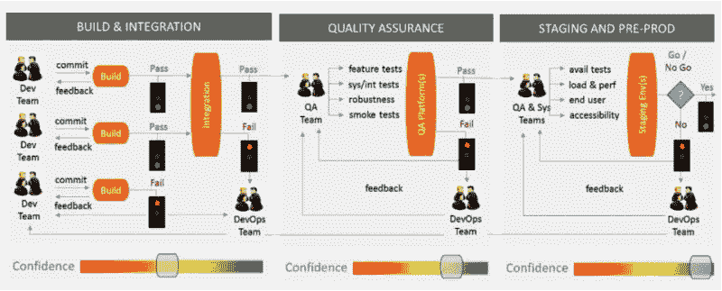

# VCS 的分支战略

> 原文：<https://blog.devgenius.io/branching-strategies-in-vcs-f50caec2603?source=collection_archive---------14----------------------->

罗曼·布尔基在 [Unsplash](https://unsplash.com?utm_source=medium&utm_medium=referral) 上的照片

“选择正确的分支合并策略…”

无论您使用什么版本控制工具，正确的分支策略都有助于开发团队轻松协作，同时不允许一个开发人员的破坏性或代码破坏影响另一个开发人员。

以下是可以探索的策略。

## 基于主干的开发(无分支)

顾名思义，只有一个主干，所有开发都在这里进行。这意味着所有开发人员都在同一个分支上工作，当变更被测试并准备好时，开发人员将他们的代码推送到中央存储库。

***对小型组织*** 有效，或者那些具有强大内部测试实践的组织发现这种策略是有用的，因为它降低了复杂性并鼓励开发组织集中解决问题。

它有自己的风险，比如一个被推的缺陷可能会停止所有的进展，直到主干被修复，导致不必要的变动或延迟。

## 释放分支

发布分支是指一个发布包含在一个分支中的想法。每个版本都会创建一个分支(例如，“1.1 开发分支”或“2.1 版本”类型)，并且在下一个版本发布之前完成的所有工作都将在这个分支中进行。

这种策略 ***大多用在落水和混战*** 过程中。如果有更多的人在同一个发布上工作，发布分支可能会变得笨拙，难以管理。除非你有非常小的发布周期，比如说少于两周:发布分支保持后期开发，发布延迟，长测试周期，和集成多个特性的挑战。

## 特征分支

特性分支通常与特性标志相结合来启用/禁用产品中的向后兼容特性，用于收集一系列用户故事，这些故事可以合并到一个主特性中，并作为一个完整的特性进行部署。这使得向连续交付过程的转移变得更加容易，并且，如果与 toggles 一起使用，也很容易决定何时向最终用户公开新的特性。

这种方法减少了交付和测试周期时间。由于对小型快速发布的需求，需要一个 ***成熟的软件开发生命周期*** 来实现特性分支。因此，为了有效地使用这种策略，您的组织必须拥有最少的可行功能集。如果没有小版本的规则和经验，趋势将是构建大的、复杂的特性，类似于版本分支。

## 故事或任务分支

这种策略直接将用户故事与源代码的变化联系起来。这是最低级别的分支，执行的每个问题都有自己的分支，通常与某个 userStoryId 相关联。

因为敏捷主要围绕用户故事工作，这种类型的模型 ***对于拥有成熟敏捷开发过程*** 的组织来说是理想的，它清楚地将故事分解成足够小的可发布的功能集。这给了发布经理完全的灵活性和可见性，关于什么样的故事可以和什么样的发布一起进行，对发布进入生产的频率没有限制。

# 合并策略

分支是短暂的分组，这使得它们易于在开发中协作。频繁地(和自动地)合并代码的能力对于避免长时间的/繁重的、昂贵的合并冲突是至关重要的。

从您的分支中合并代码有三种常见的策略。

## 手动代码审查和合并

最简单的合并策略之一。在合并到主分支之前，手动编码审查和测试。这可能是构建功能 的 ***初始阶段，但它可能会受到人为错误和延迟的困扰。***

## 最小连续积分

最常见的 ***用于小型开发项目*** ，这种策略涉及到使用一个构建编排工具，比如 Jenkins，来编译和测试源代码。通常这包括实现一系列的质量检查，或者不需要人工干预的机制来定量地执行质量，以防止没有通过测试的代码被合并到 master 中。通过所有质量检查的代码被自动合并到主分支。

如果你的组织有复杂的或者长时间运行的测试套件，这个策略可能不适合你。大的反馈周期会导致瓶颈，并引入更高频率的合并冲突。

## 具有质量关口的持续集成管道

这种策略利用集成分支——或者映射到开发生命周期管道中的阶段的分支——质量检查，以及来自构建流程编排工具的自动合并，以确保在管道中的特定阶段容易识别错误和缺陷，并且不会合并到主流程中。

这个策略对于使用各种测试类型 来确保质量的 ***组织很有帮助，比如单元测试、功能测试、回归测试、性能测试和安全测试。这有利于尽早清除容易发现的问题，使手工测试更加高效和有效。***

在实践中，我们可以使用与管道阶段相对应的开发、测试、试运行/预生产等分支。随着代码通过所需的测试并进入管道中的下一阶段，每个分支都会进行相应的合并。这使我们能够识别任何极限情况、多个特性集成之间的竞争条件，并在它们被部署到生产中之前隔离它们。

# 关闭

正如我们所见，这里没有放之四海而皆准的方法，领先的最佳实践是利用故事分支，在您的持续集成管道中自动合并您的质量检查门。

VCS Git 的推荐做法

上面是示例 Git-flow 和推荐的测试实践，分为三个阶段:构建和集成、质量保证以及阶段化和预生产。每一个阶段都有一系列的质量检查关口，以允许进行定性决策。例如，QA 阶段要求特性、系统、集成和冒烟测试全部通过，以便进入下一阶段。

为开发组织创建分支-合并策略有两个主要的好处:

1.  您有一个策略，允许快速变更的集成，同时仍然执行机制来确保质量，这消除了快速移动的混乱，并为您的开发团队提供了方向
2.  将变更分成小的、离散的单元有助于鼓励独立地测试变更，增加在软件开发生命周期的早期识别错误和缺陷的机会

团队应该采用最合适的分支-合并策略，依靠现有的资源和来自他们构建编排工具的插件。随着时间的推移，团队可以迭代地增加质量关口，采用更小范围的分支，减少发布规模和周期时间，从而更快地将特性投入生产。

第一步是决定哪种分支合并策略在文化和技术上适合你的组织。