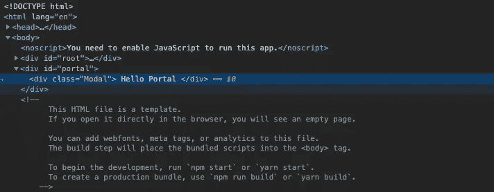

# 挣脱束缚:反应门户

> 原文：<https://blog.devgenius.io/break-free-react-portals-6e7f37069d59?source=collection_archive---------12----------------------->


Artem Sapegin 在 [Unsplash](https://unsplash.com?utm_source=medium&utm_medium=referral) 上拍摄的照片

在过去的 5-10 年里，单页应用程序(SPA)已经成为一种常见的 web 开发技术。由于它们的速度、交互性、多功能性和丰富的开发者社区；spa 是快速部署现代 web 应用程序的绝佳选择。此外，它们减少了对持续的、昂贵的和冗长的网络调用的需求，这是多页面应用程序的特征。

然而，水疗也有局限性。对异步 Javascript (AJAX)调用的依赖使得搜索引擎优化(SEO)变得困难，因为搜索引擎依赖于页面中结构化的稳定内容进行索引。spa 更容易受到跨站点脚本(XSS)的攻击，并且过度依赖 Javascript 来提供用户体验，这可能会在客户端被无意地停用。最后，使用状态而不是页面来处理数据的变化，限制了多菜单和复杂分层体验的丰富性。或者更糟的是，状态会变得如此纠缠不清，以至于错误令人沮丧地隐藏在代码库的深处。

在一个快速营销和不断变化的消费者口味的时代，成功是通过抓住我们客户的注意力来衡量的。因此，赋予熟悉的用户界面/UX 模式一定的重要性是合理的，但是平衡这种熟悉性和新鲜感也同样重要。由于 spa 对于多页面应用有几个相当大的限制，让我们来探讨如何处理其中一个问题:有限的多菜单和复杂的分层体验。JS 通过实现门户。

背景

DOM 通过提供一个连接性的“树状”框架来存放信息，并在文档中产生锚点(通常称为节点),从而为网页或 Web 应用程序提供结构。由于这种结构的等级性质，任何特定站点的元素都倾向于遵循可预测的“流程”。从这个意义上说，flow 用于描述元素在网页或 webapp 上呈现的顺序，通常是父子或兄弟姐妹关系。在父子关系的情况下，子元素通常包含在父元素中。同样，这种关系的普遍性和可预测性既有益又无聊；有用而失去的机会。

父母就是不理解

门户网站

虽然这些关系形成了 React.js 应用程序(以及一般的 web)的基本结构，但 React 通过实现门户提供了一种摆脱单调的方法。门户为子组件提供了打破父子关系的能力。通过避开受约束的关系并有效地摆脱其在 DOM 树中的预期位置，程序员可以决定将子元素附加到网页上的任何其他位置。门户甚至能够在最重要的根节点之外添加元素，根节点是 react 应用程序中呈现的所有元素和组件的祖先节点。

React 开发人员可能会发现通过以下步骤在他们的项目中实现门户很容易:

1.  在 react 应用程序用来呈现 UI 的< div id=‘root’ >结构之外创建一个 HTML 元素。这个文件通常可以在 react 应用程序的公共文件夹中找到，作为一个 index.html 文件。

```
// index.html<body>
   <noscript>
   </noscript><div id='root'> </div>
<div id='portal'> </div></body> 
```

2.在 react 应用程序中的任何位置创建将利用门户功能的组件，作为子组件。

```
// Modal.jsimport React from 'react';class Modal extends React.Component { render(){ return ( // leave this empty for now ) }}export default Modal;
```

3.通过导入 ReactDOM 向该组件添加额外的功能。在基本的 react 应用中，ReactDOM 一般只能在 index.js 文件中看到。

```
// Modal.jsimport React from 'react';
import ReactDOM from 'react-dom';class Modal extends React.Component { render(){ return ( // leave this empty for now ) }}export default Modal;
```

4.返回 ReactDOM 的 createPortal 方法作为子组件的返回值。与 ReactDOM 提供的 render 方法类似，createPortal 方法接受两个参数:将被呈现的 JSX 和将接收 JSX 的节点。

```
//Modal.jsclass Modal extends React.Component { render(){ return ReactDOM.createPortal(<div className='Modal'> Hello Portal </div>,  document.getElementById('portal')) }}export default Modal;
```

5.包括 App.js 文件中的模态组件，或者您希望调用门户并启动 react 应用程序的任何地方。

```
//App.jsimport React from 'react';
import Modal from './Modal';class App extends React.Component { render(){ return (<div>         < Modal /> </div>) }}export default App;
```

尽管在 App 组件中呈现模态组件，React 还是将模态组件附加到 createPortal 方法中选择的节点。



追加到的模态

有趣的是，模态组件作为

节点的子节点呈现在 DOM 上，它仍然是 App 组件的子节点。这样，尽管它在 DOM 树中的位置不同，它仍然是 React 树的一部分。

那么为什么要使用门户呢？

门户通常与模态、弹出窗口、工具提示或任何其他应该放弃其父位置和/或样式的元素一起使用。由于 DOM 的层次结构和 CSS 的级联性质，子元素继承了在它们的父元素上定义的位置和样式。例如，如果父组件有大小限制，如最大高度或最大宽度，子组件也将有这些相同的样式规则。门户的另一个典型用例是当父元素具有*溢出:隐藏*或 *z-index* 样式，但程序员希望子元素从父容器中脱离出来。想要提供特殊体验或在特定交互上突出某些信息的开发人员可能会发现门户提供了完美的实现解决方案。

挣脱

另一个考虑是门户不会改变事件传播。从门户内部触发的事件将传播或冒泡到 *React 树中的祖先。*捕获或阻止事件气泡必须由开发人员根据具体情况来处理。

结论

Web 开发是不断变化的。新技术可能来来去去，但它们总是旨在解决同一个挑战:对于开发人员来说，实现他们想要的体验的最佳方式是什么。在 SPAs 时代，React 的门户方法带来了许多开发人员可能不知道的额外灵活性。当然，CSS 可以用来颠覆用户的期望，并提供一些独特性。例如，position 属性可用于重新排列元素的流向。但是 React 为开发人员提供了打破 DOM 的一流方法——让我们使用它。

奖金

说到“使用它”，我已经创建了一个 [Github Repo](https://github.com/epittab/modal_example) ，在 react 中有一个工作模态组件。请随意使用、重用、复制或签出代码。快乐编码。

参考

[](https://reactjs.org/docs/portals.html) [## 门户-反应

### 门户提供了一种一流的方法来将子节点呈现到一个 DOM 节点中，该节点存在于…

reactjs.org](https://reactjs.org/docs/portals.html)  [## 网络开发技术博客| OZiTAG 网络专家

### 软件世界一直在不断发展。就在几年前，台式机和笔记本电脑还是主要的…

ozitag.com](https://ozitag.com/blog/spa-advantages)  [## 将多页面 Web 应用程序迁移到单页面 AJAX 界面

### 最近，出现了一种新的用于创建交互式 web 应用程序的 web 开发技术，称为 AJAX。在这个…

arxiv.org](https://arxiv.org/abs/cs/0610094) [](https://www.webfx.com/blog/web-design/website-statistics-2020/) [## 2020 年网站统计:网页设计需要知道的 10 个关键数据

### 你是否希望在 2020 年为你的企业设计一个全新的网页？如果是这样，你必须知道你需要做什么…

www.webfx.com](https://www.webfx.com/blog/web-design/website-statistics-2020/)