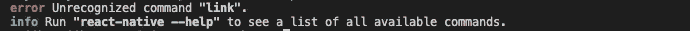
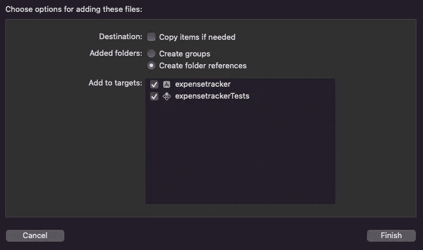
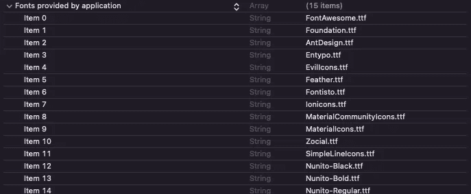

# React native 0.69 上的重大变更

> 原文：<https://blog.devgenius.io/breaking-changes-on-react-native-0-69-fc3dfaddbe61?source=collection_archive---------3----------------------->

大家好，我想出了一个关于 React Native 最新版本(即 0.69)突破性变化的新故事。尤其是自定义字体的链接和取消链接。

也有一些突破性的变化:

React Native CLI 已升级到新的主要版本 [8.0](https://github.com/react-native-community/cli/releases/tag/v8.0.0) :

*   `link`和`unlink`命令已被删除，有利于自动链接
*   弃用的`initCompat`已被删除，使用`init`命令代替
*   删除了不推荐使用的`run-android`属性
*   删除了`install`和`uninstall`命令
*   从`react-native.config.js`中移除资产和挂钩——你需要从你的配置中移除这些属性
*   `podspecPath`已从 iOS 依赖配置中删除
*   从`run-ios`中删除了`--project-path`选项
*   将 iOS 源目录检测从查找 Xcode 项目更改为查找 Podfile
*   对`console.disableYellowBox`和[的支持已经取消](https://github.com/facebook/react-native/commit/b633cc130533f0731b2577123282c4530e4f0abe)
*   已经废弃的道具类型被移除( [cdfddb4dad](https://github.com/facebook/react-native/commit/cdfddb4dad7c69904850d7e5f089a32a1d3445d1) ， [3e229f27bc](https://github.com/facebook/react-native/commit/3e229f27bc9c7556876ff776abf70147289d544b) ， [10199b1581](https://github.com/facebook/react-native/commit/10199b158138b8645550b5579df87e654213fe42) )
*   `removeListener`，RN 0.65 后已弃用，[已从外观中删除](https://github.com/facebook/react-native/commit/8dfbed786b40082a7a222e00dc0a621c0695697d)
*   如果您使用的是`SegmentedComponentIOS`，您现在需要用第三方库替换它，例如[分段控制](https://github.com/react-native-segmented-control/segmented-control) ( [235f168574](https://github.com/facebook/react-native/commit/235f1685748442553e53f8ec6d904bc0314a8ae6) )

我们大多数人都试图使用自定义字体来使设计看起来更好更流畅。但是因为链接和解除链接命令已经被完全移除，而有利于自动链接。

所以在这个故事中，我将分享我在添加自定义字体和图标时遇到的一些问题。



当我尝试 npx react-native link 或 react-native link 时

解决它的步骤:

1.  在 Xcode 中打开 React 原生项目的`ios`目录。您应该打开`.xcworkspace`文件。
2.  右键单击你的目标并添加一个新的组。我们将把它命名为`Resources`。右键单击新创建的目录并选择`Add files to "<your target name>"`选项。您将从`assets/fonts`目录中选择 4 个文件。确保您的目标在`Add to targets`部分打勾。这将允许您的项目识别这些文件。



3.打开`info.plist`文件。这里我们将添加一个新的类型为`Fonts provided by the application`的数组。对于数组的每个值，我们将添加每个字体的确切文件名。重要提示:您必须包括`.ttf`扩展名。



如果您切换`info.plist`文件的视图，您的数组将如下所示:

```
<key>UIAppFonts</key><array><string>FontAwesome.ttf</string><string>Foundation.ttf</string><string>AntDesign.ttf</string><string>Entypo.ttf</string><string>EvilIcons.ttf</string><string>Feather.ttf</string><string>Fontisto.ttf</string><string>Ionicons.ttf</string><string>MaterialCommunityIcons.ttf</string><string>MaterialIcons.ttf</string><string>Zocial.ttf</string><string>SimpleLineIcons.ttf</string><string>Nunito-Black.ttf</string><string>Nunito-Bold.ttf</string><string>Nunito-Regular.ttf</string></array>
```

你要做的就是这些。重建项目，你可以使用自定义字体和矢量图标作为图标。

## **结论**

希望以上提到的步骤对你有所帮助。如果你有任何问题，请留下你的笔记，我会尽力让你明白。

非常感谢您的阅读！！