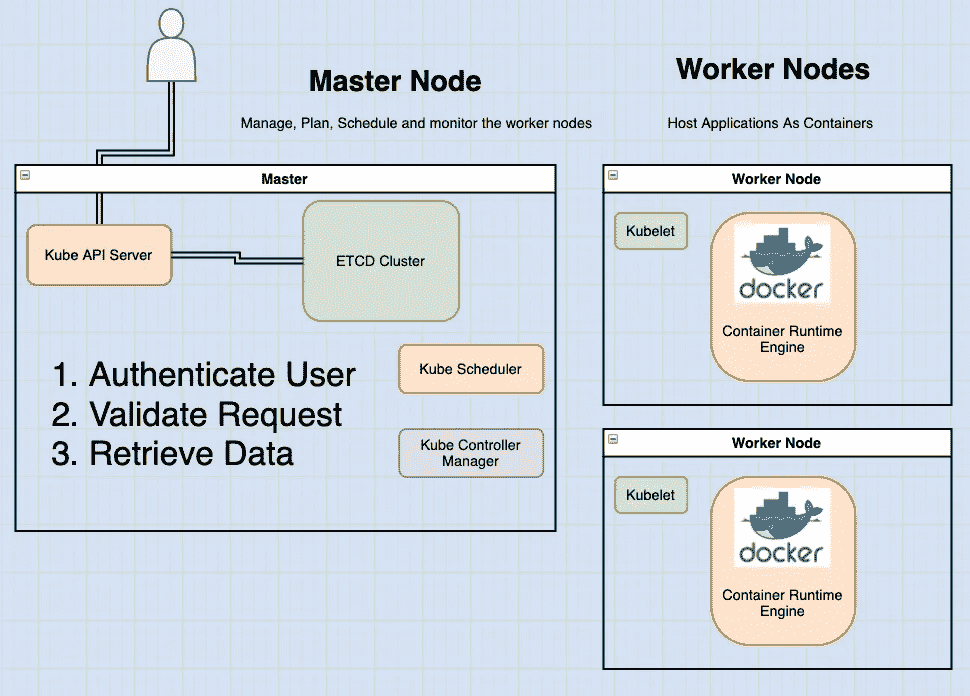
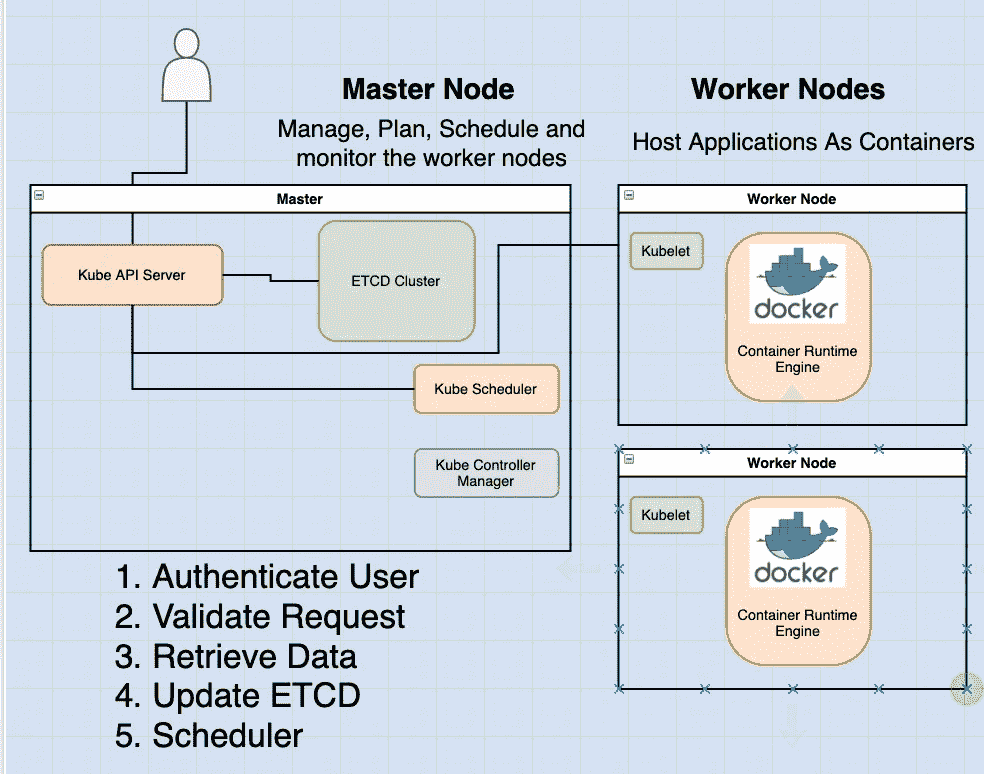

# 在 Kubernetes 中分解 Kube-API 服务器

> 原文：<https://blog.devgenius.io/breaking-down-the-kube-api-server-in-kubernetes-fe66ec62c7ee?source=collection_archive---------13----------------------->

读完这篇文章后，你会有:

*   了解 kube-API 服务器的职责。

如果你想从这篇文章中得到最大的收获，我强烈推荐我的文章，这篇文章简要概述了 kubernetes 架构。[链接此处](https://medium.com/dev-genius/the-kubernetes-cluster-architecture-simplified-3c4a5fb41449)

在本系列的前面，我们讨论了 Kube-API 服务器是 kubernetes 中的主要管理组件。

**当您运行一个 ku ectl 命令时，ku ectl 实用程序会到达 kube-API 服务器。**

# 在后台

kube-API 服务器首先对请求进行认证和验证。之后，它继续从 ETCD 集群中检索数据，并使用请求的信息进行响应。



使用 kubectl 命令行访问 kube-API 并不是强制性的。相反，您也可以通过发送 POST 请求直接与 API 通信。但是，这不如使用 CLI 常见。

# 常见的场景

让我们看一个创建 pod 的例子。和以前一样，首先对请求进行身份验证，然后进行验证。

在这种情况下，kube-API 服务器做几件事情:

1.  它创建一个 POD 对象，而不将其指定给节点。
2.  更新 ETCD 服务器中的信息。
3.  通知用户 POD 已创建。

此后，调度程序持续监视 API 服务器，并意识到存在没有分配节点的新 pod。调度器识别放置新 POD 的正确节点，并将其传送回 kube-API 服务器。


API 服务器继续更新 ETCD 集群中的信息。然后，API 服务器将该信息传递给适当的 worker 节点中的 kubelet。

kubelet 然后在节点上创建 POD，并指示容器运行时引擎部署应用程序映像。

完成后，kubelet 将状态更新回 API 服务器，然后 API 服务器将数据更新回 ETCD 集群。



每次请求更改时，都会遵循类似的模式。

**kube-API 服务器是在集群中做出改变所需执行的所有不同任务的中心。**

# 摘要

总而言之，kube-API 服务器负责认证和验证请求，检索和更新 ETCD 数据存储中的数据。事实上，kube-API 服务器是唯一与 ETCD 数据存储直接交互的组件。

以下是在集群中创建 POD 时 kube-API 服务器采取的步骤:

1.  验证用户
2.  验证请求
3.  检索数据
4.  更新 ETCD
5.  调度程序
6.  库伯莱

其他组件，比如调度器、kube-controller-manager 和 kubelet，使用 API 服务器在集群中各自的区域执行更新。

在这个系列中，我们将会看到如何安装和配置 kubernetes 架构的这些组件。

现在，有一个高层次的理解将使我们以后从头开始配置整个集群及其所有组件变得更加容易。

kubernetes 架构由许多不同的组件组成，这些组件以许多不同的方式相互协作，因此它们都需要知道其他组件在哪里。

# 证明

认证、授权、加密和安全有不同的模式。这就是为什么你有这么多的选择。

我们来看几个重要的。

其中许多是用于保护不同组件之间连接的证书。

在本系列后面的 SSL/TLS 证书一节中，我们将更详细地研究这些证书。所以我们暂时不会关注它们。

但是请记住，我们将在本节中看到的所有组件都有相关的证书。

# 那么，如何看待现有集群中的 kube-api 服务器选项呢？

这取决于您如何设置集群。

**如果使用 kubeadm 工具**进行设置，kubeadm 会将 kube-API 服务器作为一个 pod 部署在主节点上的 kube- system 名称空间中。

通过运行以下命令，可以看到位于 pod 定义文件中的选项:

```
cat /etc/kubernetes/manifests/kube-apiserver.yaml
```

在非 kubeadm 设置中:

```
cat /etc/systemd/system/kube-apiserver.service
```

您还可以通过在主节点上列出流程并搜索 kube-API server 来查看正在运行的流程和有效选项。

```
ps -aux | grep kube-apiserver
```

*原载于* [*我的博客*](https://static-blog-gamma.vercel.app/posts/kubernetes/core-concepts/kube-api)