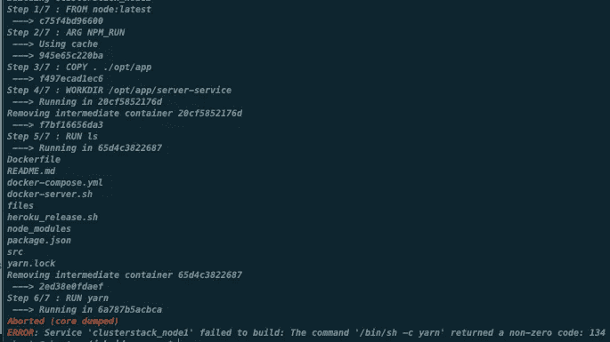
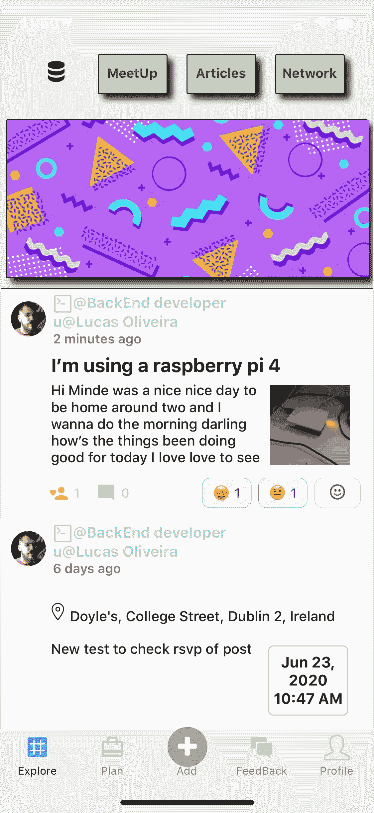
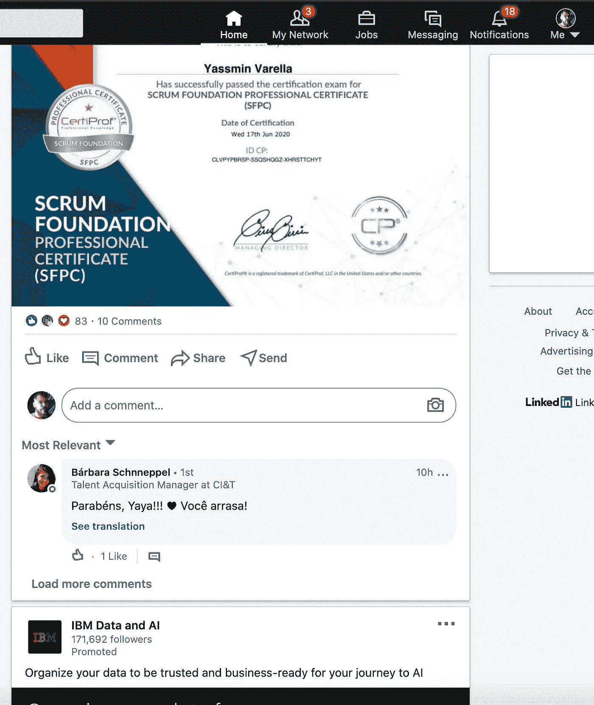
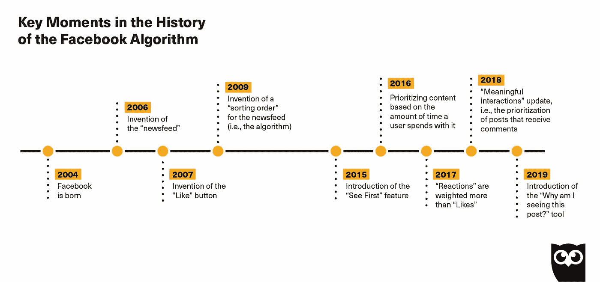
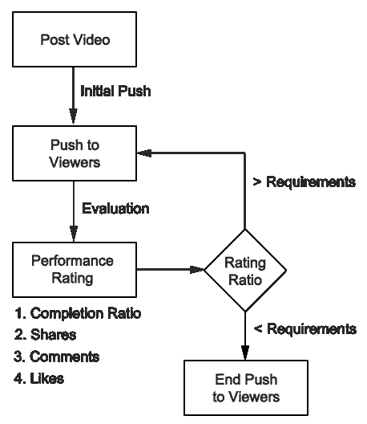

# 打碎东西，但动作不快

> 原文：<https://blog.devgenius.io/breaking-things-but-not-moving-fast-72a564d8d6e4?source=collection_archive---------44----------------------->

> 如果你想看我做的关于这个 a 的视频，现在[出来了吗](https://youtu.be/YR6YClZXeUI)

我已经在我的树莓派上设置好了一切，并花了我每天一半的时间来开发这个应用程序。当我终于拥有了运行我的容器的一切…我在磁盘上没有足够的空间…哈哈。

总结一下。我在一个不适合做服务器的操作系统上运行我的 Raspberry pi，所以我把它改成了 headless Ubuntu 20。我不需要 GUI/KDE 来操作我的服务器，这允许我释放卡上的空间，但是发生了一些事情。

我的码头集装箱还在破裂..我不知道发生了什么。我可以看到这是我的 TensorFlow 库的一个问题，所以我不得不挖掘一些研究。

我在这里发现了这个问题[，这是我发现的类似问题。是的，现在我发现我的`@tensorflow/tfjs-node`库不支持 ARM64 或 ARM32 架构。因此，我的应用程序无法在我的 raspberry pi 上运行，但幸运的是，我找到了一个](https://github.com/tensorflow/tfjs/issues/3052)[解决方法](https://github.com/yhwang/node-red-contrib-tf-model)。

你还记得马克·扎克伯格的座右铭是什么吗:“快速行动，打破常规。”？是啊… **我一直在打破东西…但进展不快**，我相信是时候停止做多余的事情，向前迈进了，那么让我们做一次冲刺吧

## S 打印会话

由于您一直在关注我关于构建产品的这个系列，我想带您参加我的 sprint 会议，在会上，我与自己谈论我正在做什么、我已经完成了什么，以及应用程序的未来步骤是什么。如果你喜欢我用这种方式向你展示我是如何努力完成申请的，请告诉我。

今天的主题是**时间线**。

当你打开你的脸书、推特、YouTube……我们都会进入内容的时间线。这是任何社交媒体用来让你呆在他们平台上的捕鼠器…我也开发了一个。这不是最先进的，没有什么新的，但是嘿！我在上面放了表情符号。

好吧，为什么我要为我的申请制定一个时间表？两个简单的原因:

1.  收集有关移民社区的其他数据
2.  让用户参与到应用中，并从广告中获得收入。

这是我打开应用程序时喜欢看到的功能之一，我知道它并不完美，但它花了一些时间来开发设计并以我想要的方式显示内容。但我确实知道这种时间线的方法现在有点过时了，我想做的是创建并试图保持人们参与社区…创建和推广与应用程序的目的相关的内容。是时候重建它还是保留它？

## 保持我的时间表不变(有一些变化)

我的时间线是…还可以，不算太寒酸也不算太差。这是我渴望改变的许多设计选择，尤其是在主题上。例如:我希望用户能够添加多个主题，所以这是我在应用程序发布前要做的一个主要改变。因为我的应用程序与国家有很强的联系，所以你创建一个内容时间表是没有意义的，在这个时间表中，用户不能发布特定国家的特定主题

下面是我的应用程序主体是如何拆分的:

*   开发技术
*   国家
*   工作类型

因此，我在 other 中要做的改变是允许用户添加(或标记)一个以上的主题，不管他们有什么类型的主题。

这就是我本周的任务，改进时间表，现在我必须意识到这一变化的影响。由于我独自在这个项目上工作，我将不得不在前端和后端都做出改变…并且打碎更多的东西…

在前端，它将主要影响两个屏幕，时间线本身和用户生成内容的后屏幕。这些屏幕从服务器接收信息，我必须处理和改进屏幕的设计。在这些屏幕下，我使用 Redux 来维护它们所使用的变量的状态，所以我也必须改变它。

在后端，当我使用 Graphql 时，我必须改变这些屏幕需要的查询/变化，以便发送/接收数据。

而且对其他服务也不会有什么影响，比如我的机器学习引擎，谢天谢地。

## 重建时间线

如果你滚动一个小众的社交媒体，比如 Linkedin，它与工作有关，你可以看到时间线变成了公司广告和员工自吹自擂成就的混合体。

这里要明确的是:分享自我成就没有问题，如果你在做，我不会评判你。在你能完成的任务上被认可是很好的，这对我们继续前进是有好处的。

所以，我真的不知道这个功能是不是真的能让用户健康持续的回到 LinkedIn。它们有着惊人的功能，比如求职和简历表，对我来说，这仍然是无与伦比的。我们必须认识到，这个求职/社交媒体平台找到了改进自己产品的方法，今天它甚至是脸书在“广告平台”市场上的一个相当大的竞争对手。

求职市场上有很多不同的参与者，他们都试图分享 Linkedin 的成功。我的应用程序与此有点关联……不知何故，它们都被 Linkedin 这个强大的平台所吸引。

无论如何…我必须对你说实话， ***我讨厌这种时间线！*** 因为:

**——首先:**没人关心你的成就或在 LinkedIn 上的自吹自擂/广告，这种方法只是创造了一个“虚假”的环境，让用户感到被迫做出贡献，因为这是一种网络。

**—第二**:你参与这种内容是在浪费时间。我们比以往任何时候都有一种紧迫感，现在就快速地发现和学习新事物。就像创建一个帖子，几乎每个人都会在 5 秒钟内忘记它…这只是在数据上制造噪音，但你仍然在提供数据。

如果这样对 Linkedin 有好处？当然是啦！更多的参与意味着更多的人使用你的应用，因此更多的收入来自广告。我很天真地说，我不想要像 Linkedin 那样的参与度，但我希望它有所不同，在某种程度上，你可以滚动并为你找到相关内容。

对不起，如果觉得我在这里有点自大，但有时这并不是更好的方式来告诉你我觉得这是错误的。由于我只能为自己说话，所以不要把这些话当作最终的真理。我不是大师，好吗？

因此，我觉得这不是时间表上的最佳方法，为了给我的应用程序生成一个更好的时间表，我必须了解其他平台是如何生成参与度的。所以我们去——研究一下其他平台是怎么做的。

我将瞄准这里的顶级平台，Youtube、脸书、Twitter 和 TickTock …但也包括非社交媒体平台，如网飞。

## Youtube:

在 2016 年发表的一篇研究论文[中，一群谷歌工程师分享了他们关于如何通过 YouTube 的推荐引擎将视频呈现出来以获得更好的用户体验的计划。](https://static.googleusercontent.com/media/research.google.com/en//pubs/archive/45530.pdf)

虽然它在当时并没有获得太多的关注，但它与今天的 YouTube 有很大的相关性，因为根据 YouTube 的首席产品官的说法， [70%的 YouTube 浏览量](https://www.cnet.com/news/youtube-ces-2018-neal-mohan/)现在都来自这个推荐引擎。

在谷歌工程师 Paul Covington、Jay Adams 和 Emre Sargin 发表的这篇研究论文[中，他们分解了用于 YouTube 推荐的视频排名信号:](https://static.googleusercontent.com/media/research.google.com/en//pubs/archive/45530.pdf)

1.  点击率(观看视频后有人点击你的视频的可能性)
2.  观看时间(观众观看视频的总时间)
3.  用户从您的频道观看了多少视频
4.  用户最近观看了关于该主题的视频
5.  用户过去搜索过的内容
6.  用户以前观看的视频
7.  用户的人口统计信息和位置

这些谷歌工程师甚至表示，他们最终的排名目标“通常是每次印象预期观看时间的简单函数”。通过点击率进行排名通常会促进用户未完成的欺骗性视频(“点击诱饵”)，而观看时间则更好地捕捉参与度。”

有些人可能会认为这意味着优化点击率会让你受到 YouTube 的惩罚，但这是一个巨大的误解。

YouTube 只是在惩罚诱饵调包策略——点击前过度承诺，点击后发布令人失望的内容。点击率还是一如既往的重要。毕竟，在没有获得点击量的情况下，你不可能为 YouTube 创造大量的观看时间。

你甚至可以在 [YouTube 工作室](https://studio.youtube.com/?csr=analytics)中看到这些优先事项的反映:YouTube 的新分析仪表板。

在 Reach Viewers 选项卡下，您可以看到以下指标，它们共同说明了 YouTube 对点击率*和*观看时间的新重视:

*   **印象:**你的视频缩略图作为推荐视频在主页或搜索结果中显示给观众的次数。
*   **浏览量的流量来源:**你的视频缩略图在 YouTube 上向潜在观众展示的位置。
*   **印象点击率(CTR):** 用户在看到你的缩略图后观看视频的频率(基于登录的印象)。
*   **浏览量:**这衡量的是观看者在 YouTube 上看过你的视频后观看的频率。
*   **从印象中观看时间:**观看时间起源于在 YouTube 上看到你的视频并点击它们的人。

## 脸书:

**脸书的新闻内容排名算法基于四个因素:**

1.  可显示的所有帖子的**库存**:**库存表示可以在脸书的新闻订阅源上向用户显示的所有内容的库存。**这包括朋友和出版商发布的所有内容。
2.  **信号**告诉脸书每个帖子是什么:**信号代表脸书可以收集到的关于某个内容的信息。信号是你可以控制的唯一因素。**
3.  **预测**关于你将如何对每个帖子做出反应:**预测代表用户的行为，以及他们被预测与内容片段进行积极互动的可能性。**
4.  基于所有考虑的因素分配给内容的**最终分数**:分数是基于用户将积极响应它的可能性分配给一条内容的最终数字。

[https://blog.hootsuite.com/facebook-algorithm/](https://blog.hootsuite.com/facebook-algorithm/)

作为广告客户，我们唯一能控制的部分是我们内容的信号。

这些信号可以分为两类:**无源**和**有源**。

**被动信号**包括观看时间、故事类型、发布时间和其他非主动指标。

**活跃信号**包括喜欢、分享、评论和其他促进参与的活跃事件。

你应该调整你的内容来促进积极的参与，或者脸书定义的“有意义的互动”

**主动信号**推动有意义的互动:

*   **评论**
*   **回复**
*   **喜欢**
*   **股票**

除了在人民新闻订阅中对帖子进行排名，脸书在 2019 年 6 月开始[让公众评论更有意义](https://about.fb.com/news/2019/06/making-public-comments-more-meaningful/)，这可以帮助向人们展示相关和高质量的评论。

## 推特:

Twitter 时间轴由三个主要部分组成:

1.  排名推文
2.  "以防你错过"
3.  剩余的推文按时间倒序排列

每当你打开 Twitter 应用程序或访问 twitter.com 时，该算法都会研究你关注的账户的所有推文，并根据几个因素给每条推文打分。根据 Twitter 和 Rao 的说法，以下是一些因素:

*   **推文本身:**推文的新近性、媒体卡(图片或视频)的存在以及整体参与度(包括转发、点击、收藏和阅读时间)
*   **推文作者:**你过去与这位作者的互动，你与他们的联系强度，以及你们关系的起源
*   **你:**你发现过去参与过的推特，你使用推特的频率和频繁程度

然后，Twitter 会将它认为会吸引你的推文放在前两个部分——排名推文和“以防你错过”。

## -排名推文

这一部分将出现在时间线的顶部，乍看之下与常规时间线没有明显区别。但是它只包含 Twitter 认为与你相关的推文。根据 Twitter 的说法，被选中的推文仍然应该按时间顺序倒序排列

*   它计算了我最可能感兴趣的推文，
*   把它们从我时间线上的所有推文中抽出来，然后
*   把它们放在我时间线的顶端。

## -以防你错过了

这部分顾名思义。

。与排名推文部分类似，**这个部分包含 Twitter 认为与你相关的推文**。B *ut* 所选的推文根据其相关性分数排序，可能是几个小时或几天前的。

例如，正如你在上面的例子中看到的，tweets 没有按时间倒序排列。它们也是 10 多个小时前的——如果我只是按时间倒序滚动的话，我可能不会看到。

## -排名推文

在这两个部分之后，你会看到**你所关注的账户的其余推文，按照最初的时间倒序排列**。就像旧的 Twitter 时间轴一样。

在这一部分(有时在上面两部分)，你还会发现转发、推广的推文和建议关注的账户。你甚至可能会看到你没有关注的账户的推文。这些通常是 Twitter 认为会让你的时间线更相关、更有趣的推文。

根据 Twitter 的说法，你可能还会在移动应用程序中看到“在你的时间线顶部标记为正在发生的事件”。

## 抖音:

有着惊人的能力将一个视频迅速推向病毒状态。

**“*For You*”页面是一个展示热门视频和趋势视频的页面。它就像一个主页，人们一打开应用程序就可以浏览抖音最热门的文章。在很大程度上基于你过去在“喜欢历史”和“过去观看”上的互动,“为了你”页面利用抖音的算法来推荐你可能喜欢的永无止境的视频流。**

抖音使用一些分类来定义如何向其他用户显示视频。

视频分类由两个关键特征定义:

1.  音乐/音频
2.  文本描述/标签

用户的偏好是通过跟踪他们在以前看过的视频上的动作来确定的:

1.  喜欢
2.  分享
3.  评论
4.  观看百分比:用户观看的次数越多，观看百分比越高；也称为完成率，将在下一节中解释。

为了了解视频是如何分类的，以及用户的行为是如何影响到*匹配引擎*的，我们来看一个场景。

## 批量测试理论

*   当一个视频被上传到平台上时，抖音会在热门视频中向一些用户展示。这是为了保证用户不会感到厌烦。
*   接下来，该算法会测量有多少人观看你的视频，以及它收到的下载、分享、评论和喜欢的数量。[参与比例](https://www.yrcharisma.com/2017/07/04/determining-your-instagram-engagement-rate/)告知抖音算法，他们是否应该向更多人展示视频。通常情况下，该比率是根据视频上每十次观看一个赞来计算的。
*   此外，视频的参与度也会触发抖音算法。换句话说，一个视频在一天内获得 40%以上的喜欢，就会被推送给更多的人。许多用户甚至报告说，他们的观点似乎是突然出现的。
*   毫无疑问，抖音拥有超过 10 亿的用户，这反映了这个平台的受欢迎程度。去年，抖音的下载量超过了 Instagram。所以，很高兴知道你的[抖音视频更有可能在网上疯传，被很多人看到。因此，增加了成功的可能性。](https://www.yrcharisma.com/2019/12/18/how-to-go-viral-on-tiktok/)

[https://medium . com/@ henryhienton/how-to-破解-tiktok-算法-创建-病毒-视频-d8a00e38e5ae](https://medium.com/@henryhienton/how-to-crack-the-tiktok-algorithm-to-create-viral-videos-d8a00e38e5ae)

## 网飞:

有时候这些推荐是显而易见的:“因为[你的朋友]看过这个，”或者你可能会在屏幕上方看到一整排动作片，因为那是你最喜欢的类型。但是其他的推荐就有点偏左了:“女主角很强的电影”，或者当你看的都是浪漫喜剧时，一部恐怖片就出现在最前面。

“兔子洞问题”——内容太多，用户会迷路。就像脸书新闻一样，在网飞，用户意识到一些内容被排除在外，因为他们不可能全部吸收。

但是也有过度个性化的问题，所以网飞不得不引入变体。

Jaffe 说他真的很喜欢黑色电视剧。这种算法知道这一点，所以它通常会将他指向该类型的更多节目。

但时不时地，它会抛出一个恐怖来衡量 Jaffe 的兴趣。Jaffe 已经四年没看恐怖电影了，所以算法很快就知道他不感兴趣。所以它会尝试其他东西——也许是纪录片或喜剧——让他知道网飞不仅仅是黑暗电视剧。

好了，现在我已经完成了这项研究，我需要看看我有什么，并设计一种方法来完成一个更好的时间表，我可以提高参与度，但这需要更多的时间。

如你所见，这里收集的信息量还不够，没有一些思考的时间我无法继续。如果我现在做出决定，不会有什么好的决定，因为我有太多的选择供我选择，这很有趣。

但是这将会有第二部分，我希望你能在这个旅程中跟随我。

谢谢你。

主要参考文献:

[脸书 1](https://blog.hootsuite.com/facebook-algorithm/) ，[脸书 2](https://tinuiti.com/blog/paid-social/facebook-algorithm/)

[Youtube1](https://www.shopify.com/blog/youtube-algorithm) ， [Youtube2](https://static.googleusercontent.com/media/research.google.com/en//pubs/archive/45530.pdf)

[TikTok1](https://www.yrcharisma.com/2020/01/06/tiktok-fyp-algorithm/) ， [TikTok2](https://medium.com/@henryhienton/how-to-crack-the-tiktok-algorithm-to-create-viral-videos-d8a00e38e5ae)

[网飞](https://www.businessinsider.com/how-the-netflix-recommendation-algorithm-works-2016-2?op=1&r=US&IR=T)， [Netflix2](https://www.businessinsider.com/how-long-netflix-thinks-it-takes-to-choose-content-2016-2?r=UK)