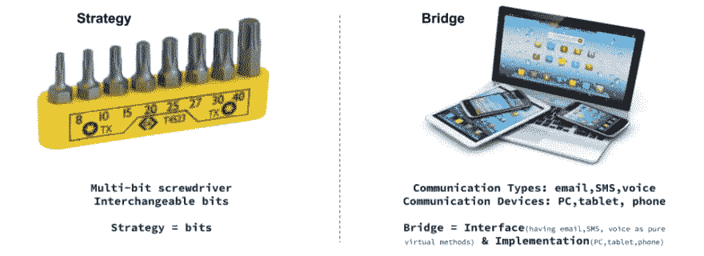

# 现代 C++中的桥设计模式

> 原文：<https://blog.devgenius.io/bridge-design-pattern-in-modern-c-8512c3693b58?source=collection_archive---------9----------------------->


桥设计模式是一种结构设计模式，使用 ***将一个类解耦为两个部分——抽象和它的实现***——这样两者都可以独立开发。这促进了类抽象与其实现之间的松散耦合。你可以通过增加一个间接层来实现这种解耦，即一个接口作为你的原始类&功能之间的桥梁。绝缘是 C++世界中桥设计模式的别称。

> **“计算机科学中的所有问题都可以通过另一种间接方式来解决。” *—大卫·惠勒***

顺便说一句，如果你还没有看过我关于结构设计模式的其他文章，下面是列表:

1.  [**适配器**](http://www.vishalchovatiya.com/adapter-design-pattern-in-modern-cpp/)
2.  [桥**桥**桥](http://www.vishalchovatiya.com/bridge-design-pattern-in-modern-cpp/)
3.  [**复合**](http://www.vishalchovatiya.com/composite-design-pattern-in-modern-cpp/)
4.  [**装潢师**](http://www.vishalchovatiya.com/decorator-design-pattern-in-modern-cpp/)
5.  [**立面**](http://www.vishalchovatiya.com/facade-design-pattern-in-modern-cpp/)
6.  [**飞锤**](http://www.vishalchovatiya.com/flyweight-design-pattern-in-modern-cpp/)
7.  [**代理**](http://www.vishalchovatiya.com/proxy-design-pattern-in-modern-cpp/)

您在这一系列文章中看到的代码片段是简化的，而不是复杂的。所以你经常看到我不使用像`override`、`final`、`public`(同时继承)这样的关键字，只是为了让代码紧凑&(大部分时间)在单一标准屏幕尺寸下可消耗。我也更喜欢`struct`而不是`class`，只是为了节省代码行，有时不写`public:`，还会故意忽略[虚拟析构函数](http://www.vishalchovatiya.com/part-3-all-about-virtual-keyword-in-c-how-virtual-destructor-works/)，构造函数[，复制构造函数](http://www.vishalchovatiya.com/all-about-copy-constructor-in-cpp-with-example/)，前缀`std::`，删除动态内存。我也认为自己是一个务实的人，希望用尽可能简单的方式，而不是标准的方式或使用术语来传达一个想法。

***注:***

*   如果你是在这里被直接绊倒的，那么我建议你浏览一下[什么是设计模式？](http://www.vishalchovatiya.com/what-is-design-pattern/)一、哪怕是鸡毛蒜皮的小事。相信会鼓励你对这个话题进行更多的探索。
*   您在本系列文章中遇到的所有这些代码都是使用 C++20 编译的(尽管我在大多数情况下使用了 C++17 之前的现代 C++特性)。因此，如果你无法获得最新的编译器，你可以使用已经预装了 boost 库的[https://wandbox.org/](https://wandbox.org/)。

> */！\:本文已原创发表于我的* [*博客*](http://www.vishalchovatiya.com/adapter-design-pattern-in-modern-cpp/) *。如果你有兴趣接收我的最新文章，* [*请报名我的简讯*](http://eepurl.com/gDNybv) *。*

# 目的

> **将接口与其实现*分离。***

*   换句话说，这就是通过使用聚合/组合而不是继承/泛化的灵活抽象将组件连接在一起。
*   这种模式包含一个充当桥梁的接口。这使得具体类的功能独立于接口实现类。这两种类型的类都可以在结构上改变，而不会相互影响。

# 桥梁设计模式的动机

*   桥设计模式防止 ***笛卡尔积*** 复杂性爆炸。不要被这个数学术语吓到，我用下面的例子简化了一下。
*   例如，假设你有一个叫做`Shape`的基类，那么`Shape`可以是`Circle`或`Square`，它也可以由 API 1 或 API 2 绘制。

```
struct DrawingAPI_1 { };
struct DrawingAPI_2 { };struct Shape { virtual void draw() = 0; };/* 2 x 2 scenario */
struct Circle : Shape, DrawingAPI_1 { };
struct Circle : Shape, DrawingAPI_2 { };struct Square : Shape, DrawingAPI_1 { };
struct Square : Shape, DrawingAPI_2 { };
```

*   这样你就有了一个**二乘二(2×2)的场景**。所以如果你决定实现它，你必须实现四个类。一个你知道的`Circle`带`API_1`，`Circle`带`API_2`等等。
*   桥设计模式恰恰是实际上避免整个实体爆炸的模式。
*   因此，我们可以做的是设计 DrawingAPI 接口(后来用于派生 API 1 & 2)并将其聚合在`Circle` & `Square`中，而不是像上面那样。

# 桥梁设计模式 C++示例

*   下面是桥设计模式的典型实现。我们在这里不打算看任何非常复杂的东西。但是从本质上来说， ***桥是一种将接口或层次结构与实现*** 分离的机制。

```
struct DrawingAPI {
    virtual void drawCircle() = 0;
};struct DrawingAPI_1 : DrawingAPI {
    void drawCircle() { cout << "Drawn by API 1"<< endl; }
};struct DrawingAPI_2 : DrawingAPI {
    void drawCircle() { cout << "Drawn by API 2"<< endl; }
};struct Shape {
    Shape(DrawingAPI &drawingAPI) : m_drawingAPI{drawingAPI} {}
    virtual void draw() = 0;
protected:
    DrawingAPI &m_drawingAPI;   // Now Shapes does not need to worry about drawing APIs
};struct Circle : Shape {
    Circle(DrawingAPI &drawingAPI) : Shape{drawingAPI} {}
    void draw() { m_drawingAPI.drawCircle(); }
};int main() {
    DrawingAPI_1 API_1;
    DrawingAPI_2 API_2;
    Circle(API_1).draw();
    Circle(API_2).draw();
    return EXIT_SUCCESS;
}
```

*   这样你就不那么依赖继承和聚合了。相反，你依赖于接口。

# 使用 C++的桥梁设计模式习语:实现指针(PIMPL)

*   我们在讨论桥梁设计模式的时候，怎么能忘记习语这个疙瘩呢！PIMPLE 是桥梁设计模式的表现形式，尽管略有不同。
*   顾名思义，PIMPL 习语就是通过将一个特定类粘贴到指针所指向的独立实现中来隐藏其实现细节。让我向你展示这是如何工作的:

**Person.h**

```
#pragma once
#include <string>
#include <memory>struct Person {
    /* PIMPL ------------------------------------ */
    class PersonImpl;
    unique_ptr<PersonImpl>  m_impl; // bridge - not necessarily inner class, can vary
    /* ------------------------------------------ */
    string                  m_name; Person();
    ~Person(); void greet();
private:
    // secret data members or methods are in `PersonImpl` not here
    // as we are going to expose this class to client
};
```

**Person.cpp** ←会变成共享库(。所以/。dll)，以隐藏业务逻辑

```
#include "Person.h"/* PIMPL Implementation ------------------------------------ */
struct Person::PersonImpl {
    void greet(Person *p) {
        cout << "hello "<< p->name.c_str() << endl;
    }
};
/* --------------------------------------------------------- */Person::Person() : m_impl(new PersonImpl) { }
Person::~Person() { delete m_impl; }
void Person::greet() { m_impl->greet(this); }
```

*   好，这就是习语的粉刺，我们可以说它是一种简洁的形式。问题是，你为什么要这样做呢？
*   出于安全目的，您可能会问，无论如何，我们都要向客户端公开包含某个类的 API 的头文件，那么我们如何获得安全性呢？好吧，想想数据成员&私有方法。如果你有商业秘密&拥有一个包含关键信息的数据成员。为什么你甚至让客户知道[对象](http://www.vishalchovatiya.com/inside-the-cpp-object-model/)的名字？
*   PIMPL 的另一个好处是编译时间，这对 C++来说很关键，因为它广受批评。但是随着编译器变得越来越增量，这变得越来越不相关。现在它们真的很棒。

# 安全且更快的 PIMPL

*   因为我们必须使用由 [std::unique_ptr](http://www.vishalchovatiya.com/understanding-unique-ptr-with-example-in-cpp11/) 提供的所有间接 API，这导致了一些运行时开销，因为我们必须在每次访问时取消引用指针。
*   此外，我们还有构造和销毁开销 [std::unique_ptr](http://www.vishalchovatiya.com/understanding-unique-ptr-with-example-in-cpp11/) ，因为它在一个堆中创建了一个内存，这涉及到许多其他函数调用和系统调用。
*   此外，如果我们想访问`PersonImpl`中`Person`的数据成员，比如传递`this`指针之类的，我们还必须进行一些间接访问。

**Person.h**

```
#pragma once
#include <string>
#include <cstddef>
#include <type_traits>struct Person {
    Person();
    ~Person();
    void greet();private:
    static constexpr size_t     m_size = 1024;
    using pimpl_storage_t = aligned_storage<m_size, alignment_of_v<max_align_t>>::type; string                      m_name;
    pimpl_storage_t             m_impl;
};
```

**Person.cpp** ←会变成共享库(。所以/。dll)，以隐藏业务逻辑

```
#include "Person.h"
#include <iostream>struct PersonImpl {
    void greet(string &name) {
        cout << "hello "<< name << endl;
    }
};Person::Person() {
  static_assert(sizeof(impl) >= sizeof(PersonImpl)); // Compile time safety
  new(&impl) PersonImpl;
}
Person::~Person() { reinterpret_cast<PersonImpl*>(&impl)->~PersonImpl(); }
void Person::greet() { reinterpret_cast<PersonImpl*>(&impl)->greet(name);  }
```

*   因此，让我们通过放置新操作符&预分配对齐内存缓冲区来解决这个问题。 [reinterpret_cast](http://www.vishalchovatiya.com/cpp-type-casting-with-example-for-c-developers/) 只是编译时的替代，所以不会有任何其他的间接方式。

# 桥梁设计模式的好处

1.  桥接设计模式提供了独立开发抽象(即接口)和实现的灵活性。客户端/API 用户代码可以只访问抽象部分，而不关心实现部分。
2.  它保留了[开闭原则](http://www.vishalchovatiya.com/open-closed-principle-in-cpp-solid-as-a-rock/)，换句话说，提高了可扩展性，因为客户端/API 用户代码只依赖于抽象，所以实现可以随时修改或扩充。
3.  通过使用桥梁设计模式的形式 [PIMPL](https://docs.microsoft.com/en-us/cpp/cpp/pimpl-for-compile-time-encapsulation-modern-cpp) 。我们可以对客户端隐藏实现细节，就像上面在 [PIMPL](https://docs.microsoft.com/en-us/cpp/cpp/pimpl-for-compile-time-encapsulation-modern-cpp) 习语的例子中所做的那样。
4.  桥设计模式是旧建议的应用，“更喜欢组合而不是继承”，但是以一种更聪明的方式。当您必须以相互正交的方式划分不同时间的子类时(比如前面讨论的 2×2 问题)，这很方便。
5.  应该避免抽象和它的实现之间的编译时绑定。以便实现可以在运行时进行选择。

# 常见问题汇总

**桥梁设计模式的实际用例是什么？**

任何互联网浏览器中的插件都直接利用这种模式，其中浏览器只指定抽象&实现因不同类型的插件而异。

**什么时候使用桥接设计模式？**

—当您不确定实现或其变化时，您仍然希望继续开发。
—在行为置换问题的情况下，即笛卡尔乘积复杂度爆炸。

**适配器&桥设计模式有什么区别？**

—适配器通常与现有的应用程序一起使用，以使一些原本不兼容的类很好地协同工作。
— Bridge 通常是预先设计的，允许您独立开发应用程序的各个部分。

**策略&桥梁设计模式有什么不同？**

— [策略](http://www.vishalchovatiya.com/strategy-design-pattern-in-modern-cpp/)是类似一字螺丝刀的一维问题。
—桥接像通信类型&设备一样是一个多维度的问题。

