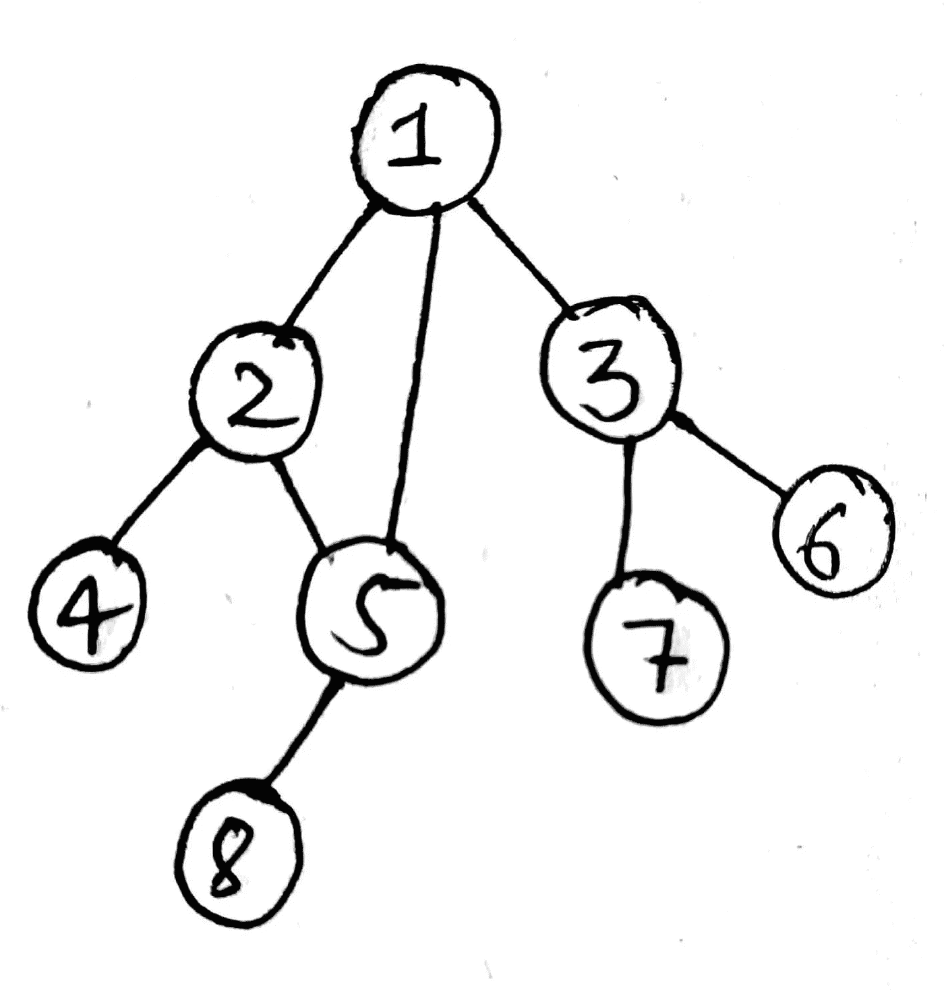
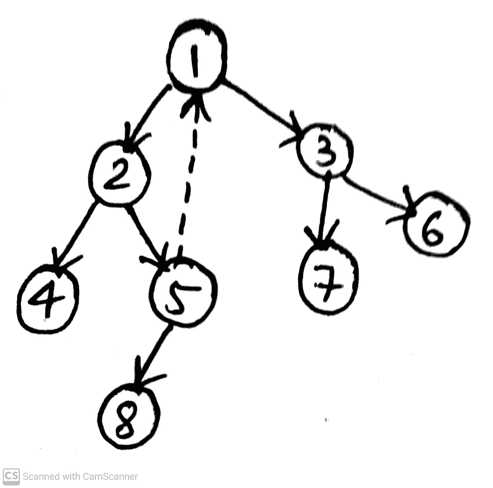
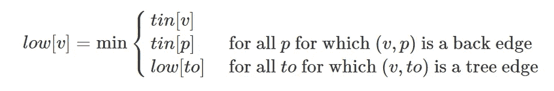
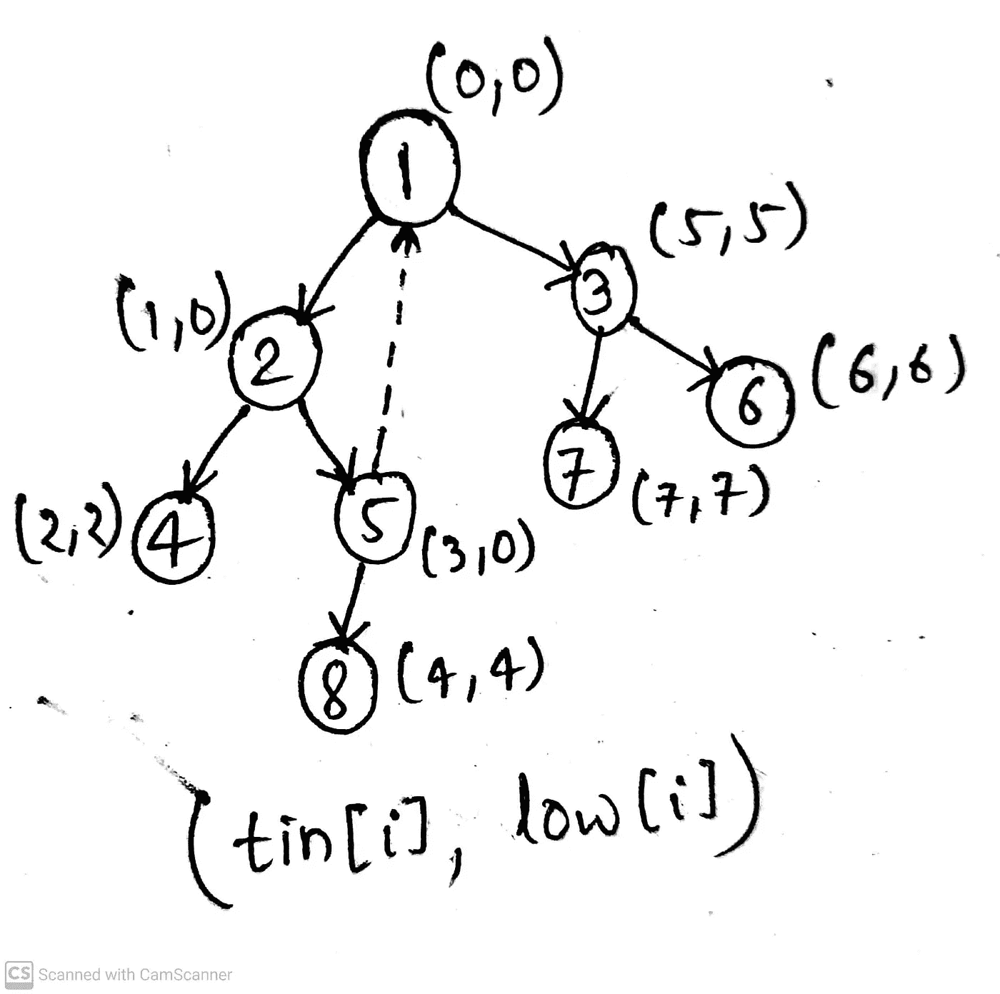

# 无向图中的桥和接合点

> 原文：<https://blog.devgenius.io/bridges-and-articulation-points-in-an-undirected-graph-fe79347f0745?source=collection_archive---------4----------------------->

来源:新华社

由于术语“桥”听起来像两个岛之间的连接，这在两个岛之间的运输和通信中起着关键作用，类似地，无向图中的桥 **G(U，V)** 是当从图中移除时会增加连接组件的数量的边。换句话说，如果我们移除作为桥的边，那么图将不再保持连通。那么如何在无向图中找到桥呢？

# **寻找桥梁**

在无向图中寻找桥的强力方法是检查每条边是否是桥。这可以通过首先移除边，然后检查由该边连接的顶点是否仍然连接来实现。但是就需要执行的操作数量而言，这种方法的成本非常高。这种方法的时间复杂度是 **O(E*(V+E))** (其中 E 和 V 是图 G 中边和顶点的数量)。我们能做得更好吗？

这个问题的答案是肯定的，但是怎么才能做到呢？

让我们借助我们著名的 DFS 算法，它的时间复杂度为 **O(V+E)** ，但在此之前，让我们先了解一下寻找桥梁的主要思想是什么。对于 DFS 树(当我们使用 DFS 遍历一个图时会得到它)，后边缘是连接顶点 **V** 和顶点 **U** 的边缘，其中 **U** 在顶点 **V** 的父顶点之前被发现。

图 1 无向图

# **DFS 树**

让我们通过图 1 中给出的示例图来理解后沿的概念。这里我们可以看到边(2，4)、(5，8)、(1，3)、(3，6)和(3，7)是桥。这是因为通过移除这些边，我们增加了连接组件的数量。让我们看一下 DFS 树:

图 2 DFS 树

我们可以看到，edge (5，1)是一个后边缘，因为如果我们从节点 1 启动 DFS，我们将遍历并访问节点 5，节点 2 是节点 5 的父节点。后沿是从 5 到 1，其中节点 1 在节点 2(节点 5 的父节点)之前被访问，因此它是后沿。为什么后边缘受到如此多的关注？这是因为，**后边缘提供了替代路径**。在这个例子中，如果我们移除边(2，5)，那么边(1，5)将是备选路径，因此该图将仍然保持连接。

**假设在 DFS 中，当我们寻找与顶点 V 相邻的顶点时，那么(V，U)将是一个桥，当且仅当在 DFS 遍历树中，顶点 U 或它的任何后代都没有到顶点 V 或它的任何祖先的后边缘。**我们可以通过维护 **tin[]数组来检查 **O(V+E)** 时间中后沿的存在，该数组将记录节点首次被访问的时间，**我们还将维护数组 **low[]，对于每个顶点 V，该数组记录最早被访问的顶点的发现时间，当前顶点** **V 或以 V 为根的子树中任何具有后沿的顶点，**我们将把 low[]初始化为-1。我们还需要一个变量**计时器**来跟踪当前的发现时间。

对于更新 low[]我们有 3 种情况:

来源:CP 算法

现在，当且仅当 low[u]≤ tin[v]时，存在从 **U 或它的一个后代到 V (V 是 U 的父代)**的祖先的后沿。你可以想一想，也许会得到解释。这是因为如果有后沿，则 low[u]的值必须小于 tin[v]。如果 low[u]=tin[v]，则后沿直接从 **V** 到 U 。**因此，DFS 树中的边(v，u)是桥当且仅当 low[u] > tin[v]。**

使用此技术查找桥梁的代码如下:

在代码中，low[s]=min(low[s]，low[x])(在递归 dfs 调用之后)对于在回溯时找到到父顶点的后边缘之后传播更新的值非常重要。注意，我们正在跳过已经访问过的父节点**(如果(x==p)继续；).**

# 寻找关节点

最后，在大量讨论了桥之后，让我们来讨论一下什么是关节点，以及如何在无向图中找到它们。**关节点是无向图中的顶点，当与它们相关联的边一起被移除时，它们倾向于增加图中连通分量的数量。**例如，你可以把一个计算机网络看作一个图，那么连接点就是当从网络中移除时，网络将被断开或者以其他方式，网络中连接的组件的数量增加的计算机。现在，我们可以像寻找桥梁一样找到关节点，只需对寻找桥梁的算法做很小的改动。在图 1 中，你可以看到顶点 3，5，2 和 1 是关节点。

在寻找关节点的算法中有两种情况:

1.  对于 DFS 树中除根之外的所有**顶点，如果当前边是 **(V，U)** 使得**没有顶点 **U** 的**或其后代具有到 V 或 V 的任何祖先的后边缘，则 **V 是铰接点。否则，V 不是关节点。****
2.  如果我们正在寻找的顶点是 DFS 树的根，并且**如果根至少有 2 个子节点**，那么通过移除根和它的相关边，我们正在断开它的子节点，因此**根是一个铰接点**。**否则根不是一个关节点。**

为此，我们需要稍微改变一下算法，我们将在遍历 DFS 树时跟踪顶点的父顶点，如果顶点的父顶点= -1，那么我们可以说这是我们的 DFS 树的根，因此进行相应的处理。我们需要改变的第二件事是在图中寻找桥的条件(low[u]>tin[v]，其中 v 是 u 的父节点)。在检查顶点是否是铰接点而不是根的情况下，我们有条件 low[u]≥tin[v]。

**这是因为如果 low[u]=tin[v]，那么后沿直接到 v，否则到 v 的祖先**。在这种情况下，如果我们移除顶点 v，那么连接的组件的数量会增加，因此它是一个关节点，但是在桥的情况下，如果我们有 low[u]=tin[v]，那么如果我们移除边(v，u ),如果后边来自 u 的中心，那么图仍将保持连接，因此边(v，u)不是桥。

下面是相同的代码:

如果我们使用图 1 中给出的输入图来跟踪代码，我们将在代码末尾得到以下输出:

图 3 输出

寻找桥梁和关节点有许多应用。它们代表了网络的脆弱性，因为通过移除桥和接合点，网络将被断开，更准确地说，网络中连接的组件的数量增加。其他应用可以在社交网络图中，其中一些用户就像接合点，移除它们将断开社交网络。

所以，文章到此结束。我希望你喜欢它。这是我在 Medium 的第一篇文章。所以，如果你觉得有什么需要改进的地方，你可以给我建议，我会很乐意提高自己。谢了。