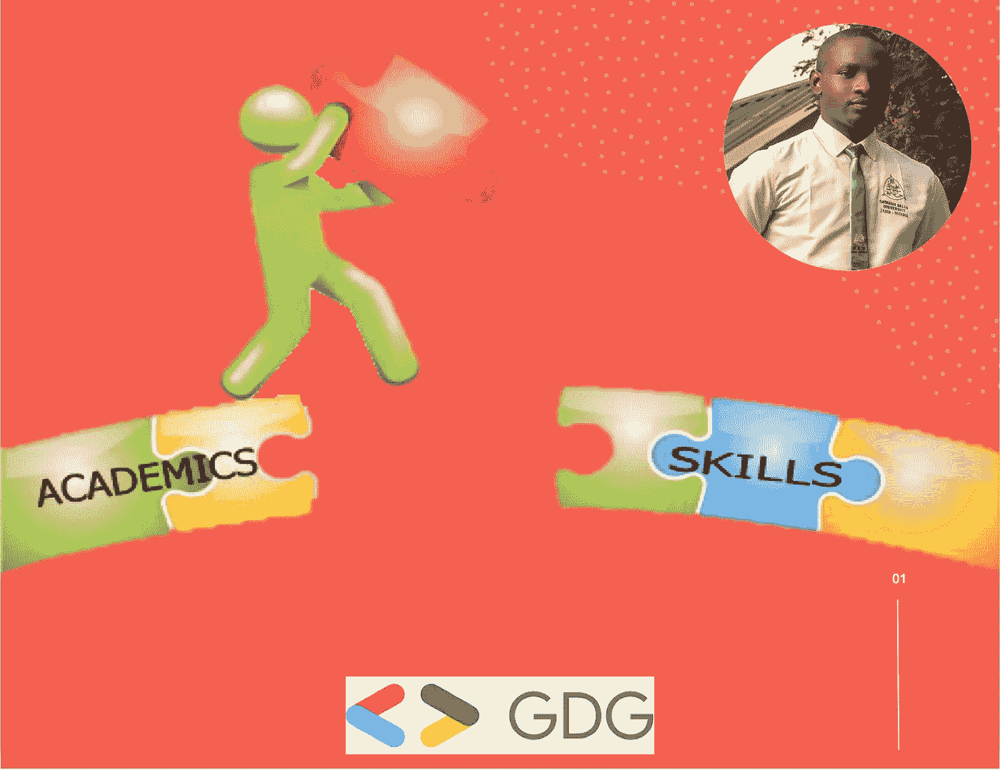
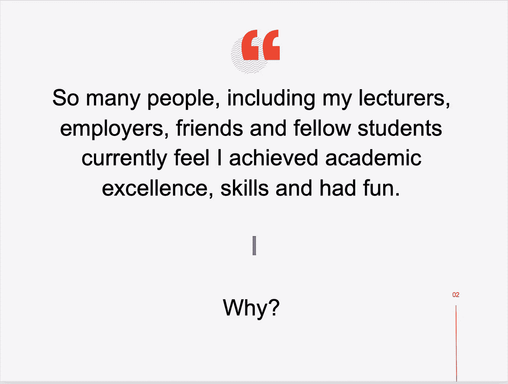
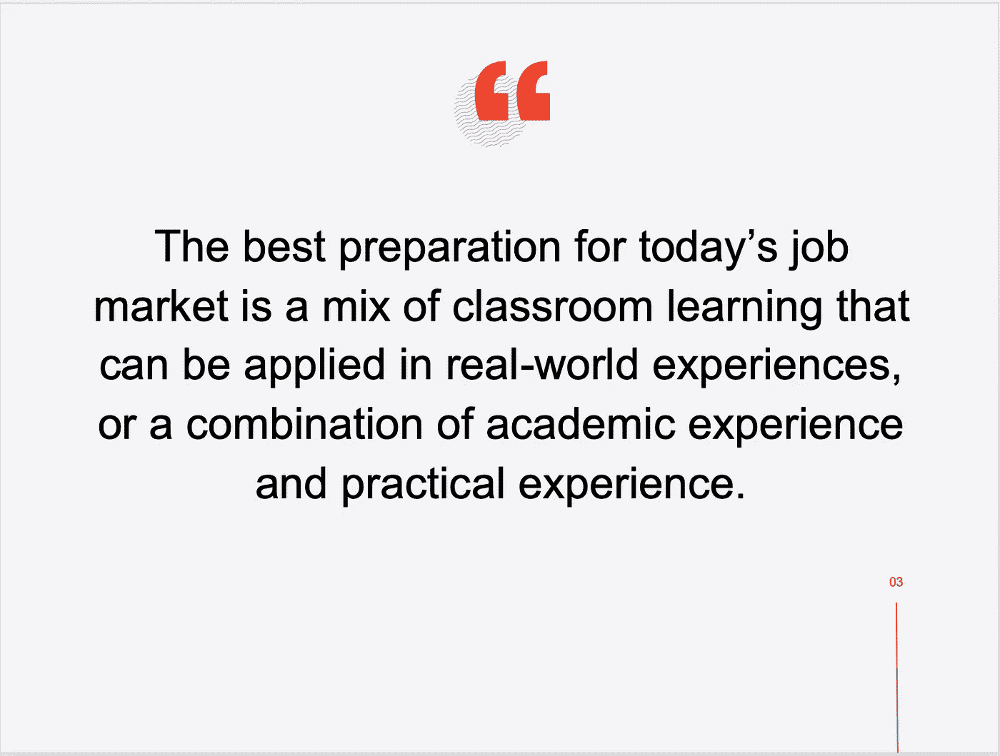
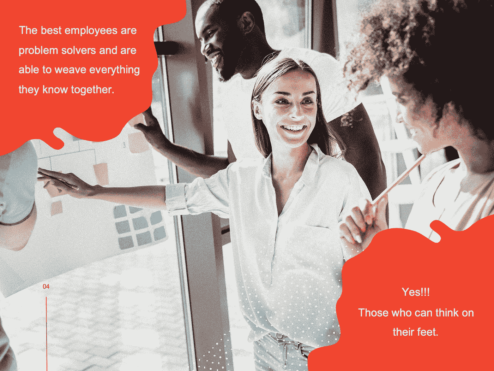
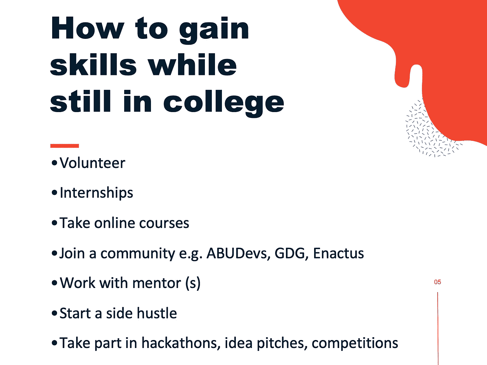
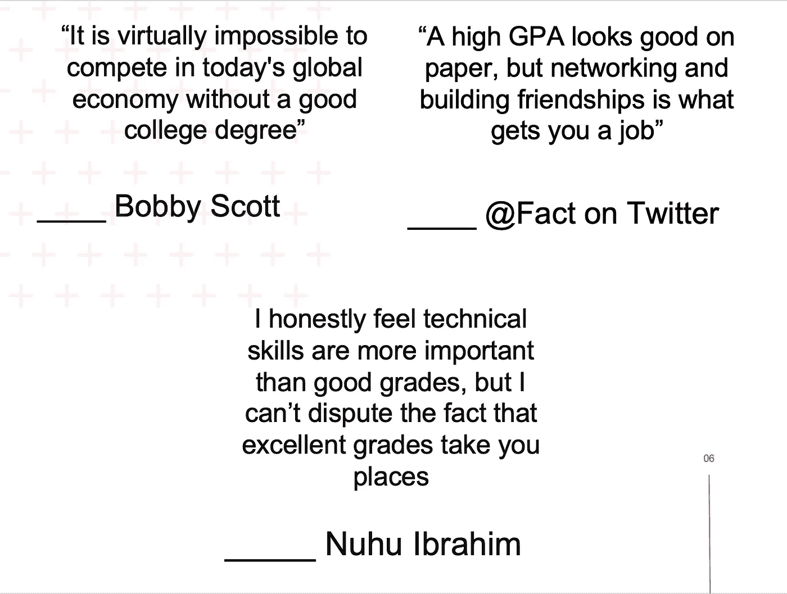
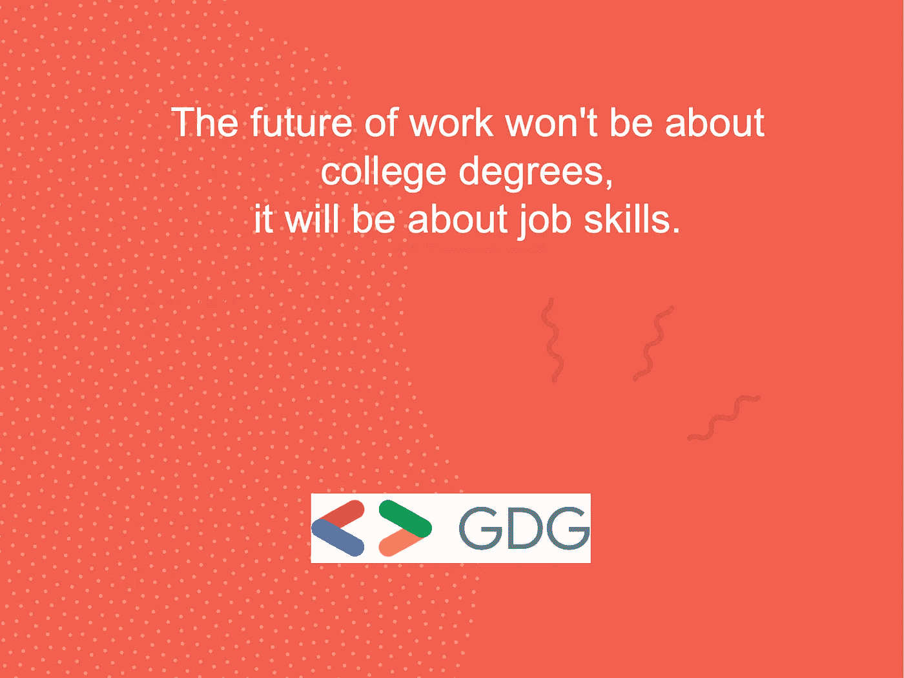

# 弥合学生学业成绩和技能获得之间的差距

> 原文：<https://blog.devgenius.io/bridging-the-gap-between-academic-performance-and-technical-skill-s-acquisition-for-students-bc696bd241ce?source=collection_archive---------35----------------------->

克里斯蒂娜@ wocintechchat.com 在 [Unsplash](https://unsplash.com?utm_source=medium&utm_medium=referral) 上的照片

在不发达或发展中国家，也许是尼日利亚，许多学习计算机科学和其他紧密相关技术课程的学生都有这样一个信条:成绩优异的学生不会获得技术技能，反之亦然。

然而，从 ABU 毕业后，Zaria 成为自 1962 年该大学成立以来有史以来最优秀的毕业生，并带领三(3)名学生赢得了第七届尼日利亚大学计算机编程比赛，尼日利亚有 16 所公立和私立知名大学参加了比赛，这成为了我和其他人的故事。 解释为什么我可以取得这些成就，同时保持对计算机科学家获得就业资格或在现实世界中与其他程序员或编码员竞争所需的大部分(如果不是全部)技术技能的强烈理解和密切实践。

在收到如此多的请求后，我在由谷歌开发者集团 Zaria 组织的 2019 年 DevFest 活动上做了一场题为“弥合学生学术表现和技术技能习得之间的差距”的演讲。幻灯片的内容和简要理由可在下面找到；

幻灯片— 2

在尼日利亚，遇到大量计算机科学和其他密切相关的技术专业的学生已经成为一种趋势(几乎是正常的),他们成绩优异，令人印象深刻，但缺乏雇主要求的基本技能，或者根本无法就业。

幻灯片— 2

我的学业优秀可能是最容易证明的。我以 3.51/4.00 的 CGPA 成绩获得了卡杜纳理工学院计算机科学专业的国家文凭，并以 4.94/5.00 的 CGPA 成绩毕业于扎里亚阿布的计算机科学系，这是该校自 1962 年建校以来的最高分。

我的编程技能可能也不会太难证明，因为我曾经参加过 2018 年超过 16 所尼日利亚顶尖大学的第七届尼日利亚大学计算机编程竞赛(NUCPC ),并获得了第一名。此外，在大学期间，我曾在 Dixre Enterprise 和 Bitsense Limited 分别担任首席技术官和开发人员，监督并参与了 14 家不同客户的应用软件开发，客户满意度得分非常高。

幻灯片— 3

为了确保我的实践经验与时俱进，当我还是大学生的时候，我会经常思考社会上的问题，我可以把已经获得的课堂技能运用到工作中去解决。一个这样的例子是，我利用我在面向对象编程(OOP)课程中学到的技能，以及 HTML、CSS、JavaScript、OOP PHP 和 Laravel PHP MVC 框架的使用，开发了一个电子投票系统，该系统将大大减少选举的不一致性，并提高领导层的透明度和效率。

意识到尼日利亚良好治理的下一阶段将在很大程度上取决于对数据的正确解释，以改善政策制定、法律法规的通过和法律解释，我有动力开发一个名为“NaijaPeopleRep”的软件，该软件专注于弥合公民和他们在参议院的代表之间的沟通差距。

幻灯片— 4

幻灯片— 5

> 为了证明这些活动如何帮助学生在学校获得技能，我将讲述我参加的不同活动，它们对我生活的影响以及它们如何帮助塑造了我。

就在我读本科的时候，我参加了 2017 年由 Ahmadu Bello 大学开发者(ABUDevs)组织的黑客马拉松和 idea pitch 比赛，在那里我分别获得了第三和第二名。我还参加了在 Lagos 举行的通用服务提供基金(USPF)变革者挑战赛，在那里，我的想法没有进入收到的 10 个最佳想法的前 10 名。在 2018 年由尼日利亚总统在卡诺举办的学生创新挑战赛期间，我向其他学生创新者发出了挑战。后来，我带领一个团队参加了第七届尼日利亚大学计算机编程比赛，并获得了第一名。这些比赛帮助我建立了信心，帮助我承受风险和压力，并为成功而坚持不懈。

为了一睹开发有用和现实生活中的项目的感觉，我自愿为科技初创公司工作(无偿服务),并为一些需要在线业务但预算不足的初创公司和非营利组织开发官方网站。从某种意义上说，辅导大一、大二甚至我的同学一些数学和编程相关的课程变得很有必要。这些活动有助于我的沟通技巧、人际交往技巧、项目管理和及时交付技巧，并增强了我的人际网络。

参加所有这些活动意味着更多的责任，也意味着减少我可用的学习时间。尽管如此，当最终的领导召唤到来时，我无法拒绝。我被邀请领导扎里亚阿布最著名的技术团队，也就是(ABUDevs ),并最终被恳求成为全国计算机科学学生协会(NACOSS)的软件主管，这是我所在系的学生协会。我最终还是忍不住想加入扎里亚的谷歌开发者小组(GDG ),因为它可以让成员们认识对技术有相似兴趣的当地开发者。这些活动最终改善了我在大学内外的人际网络，并提高了我的领导和管理技能。

在某些时候，应付如此多的活动变得越来越困难，因为我还需要跟上我的副业，以确保我仍然有足够的储蓄(我自己赞助了我的本科项目)。我有一个未注册的小副业，我给予学生(大学内外)更多的个人关注(不同于辅导课)，指导他们完成乏味的作业和项目，并获得带薪津贴(足够支付学费、住宿费和伙食费)。

毫无疑问，在确保不与私人朋友失去联系、在社交活动中被排除在外并保持优异成绩的同时做所有这些事情会很累、很乏味并且几乎不可能；但是，这是可能的，也是值得的，因为这是为竞争激烈的就业市场做准备所必需的。

幻灯片— 6

幻灯片— 7

幻灯片— 8

*最初发表于*[*【https://nuhuibrahim.com】*](https://nuhuibrahim.com/blog/bridging-the-gap-between-academic-performance-and-technical-skills-acquisition-for-students)*。*