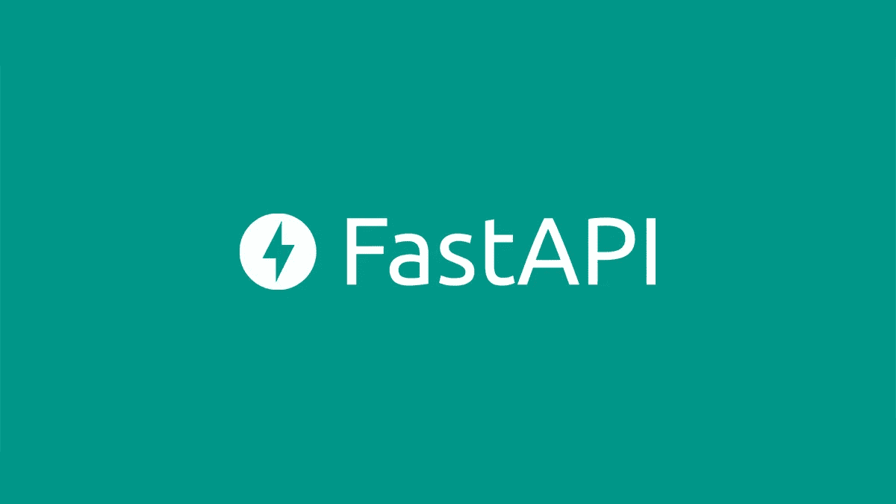
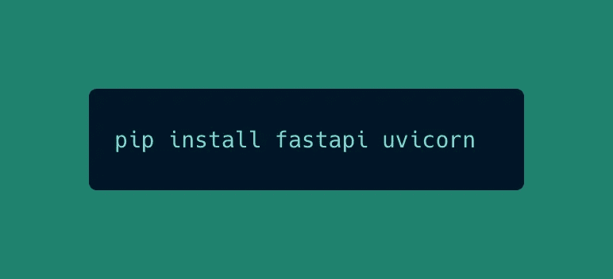
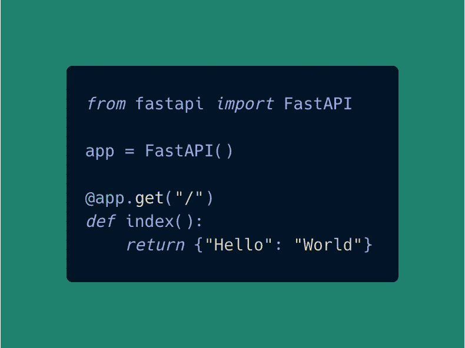
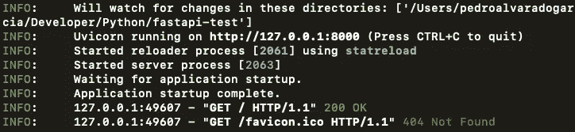
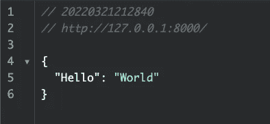
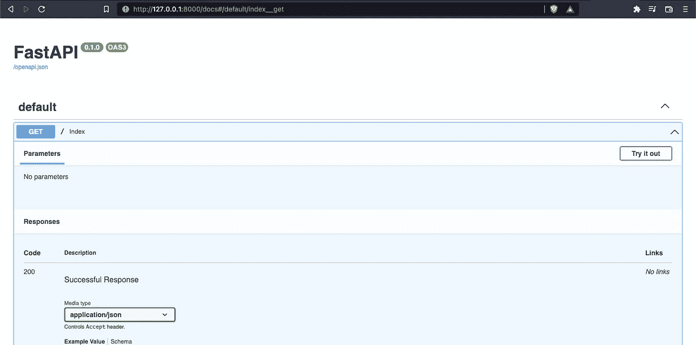
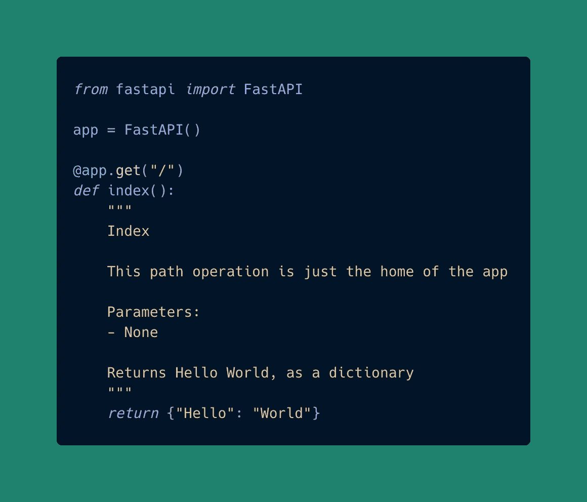
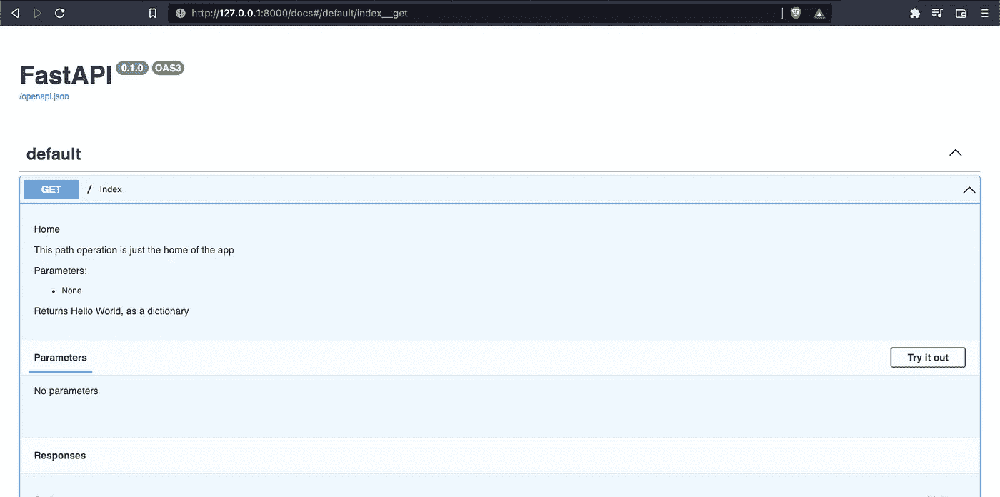

# FastAPI 简介

> 原文：<https://blog.devgenius.io/brief-introduction-to-fastapi-d6f25793b11a?source=collection_archive---------8----------------------->

## 构建 API 的快速 python 框架

Python 是一种通用的编程语言，其广阔的应用领域令人惊叹，你可以用 python 来进行网页和游戏开发，来制作 ML、AI 和 ds。今天，我将向您展示如何使用 python 框架进行 web 开发，特别是构建 API。

FastAPI 是用于后端的 python 框架。它最显著的特点之一是速度快(因为名字中包含了某些东西)。该框架的速度与其他竞争对手如 NodeJS 或 Go 进行了比较。编码也很快(你马上就会看到)，容易理解，直观和健壮。

FastAPI 的惊人性能是因为它构建在其他 python 库和框架的基础上:

1.  紫玉米。一个作为服务器工作的 python 库。
2.  斯塔莱特。web 开发的底层 python 框架。
3.  pydantic。处理数据的 python 框架。允许您构建模型。

## FastAPI 的安装

最初，你需要设置你的虚拟 env，然后安装 *fastapi* 和*uvicon*，我上面提到的另一个库。这就是我们需要安装的所有东西。现在，我们可以开始构建我们的 API 了。

## 您的第一个带有 FastAPI 的 API

这是 FastAPI 的 hello world。首先我们从 *fastapi* 导入 *FastAPI* 。然后我们创建了一个名为 app 的变量，它是 *FastAPI* 的一个实例。然后我们可以创建函数，这些函数在 FastAPI 中称为“*路径操作函数”*，并对它们进行修饰，称为“*路径操作修饰器*”。

路径操作装饰器包括 FastAPI 实例的变量名和一个 REST 方法。在 REST 方法的括号中，我们指定了路径。在路径操作功能中，我们包括了该路径将执行的所有操作。在这个例子中，路径只返回一个带有关键字“hello”和值“world”的字典。仔细想想，python 字典很容易被视为 JSON 对象，这就是为什么我们使用字典返回信息。在内部，FastAPI 将 python 字典转化为 JSON。

现在，为了看到我们的 API 工作，我们需要运行:

我们的 API 正在运行！

## FastAPI 交互式文档

我喜欢 API 的一个特性是它的交互式文档。FastAPI 基于 OpenAPI，open API 是一组定义如何描述、创建和可视化 API 的规则。OpenAPI 需要一个软件，这是 Swagger，这是一个允许我们显示 API 文档的软件。要访问此交互式文档，您只需进入“/docs”。

在这里，我们将看到我们的 API 的所有信息，所有路径，它们做什么，以及更多信息。我们还可以从我们的代码中添加文档，我们用 *docstring* 创建了它。

docstring 的结构如下:

1.  路径操作的名称
2.  路径操作做什么
3.  它工作所需的参数
4.  以及它返回的内容

如果我们回到交互文档，我们会看到:

## 结论

我们学习了如何在 FastAPI 中创建 hello world，如何运行 API，以及如何查看交互式文档。这只是对 FastAPI 的简单介绍，我认为学习它是值得的，因为它有很多优点(我们刚刚体验了其中一个)。像微软、优步和网飞这样的公司开始使用 FastAPI。

谢谢你阅读我，下次见。