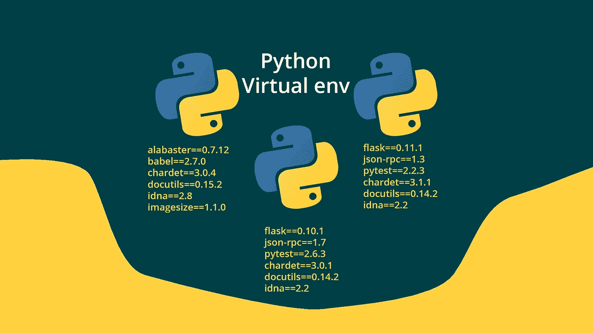
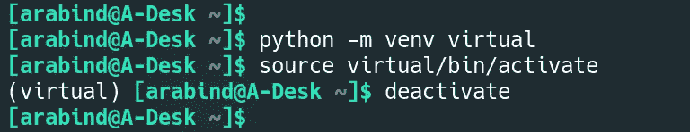
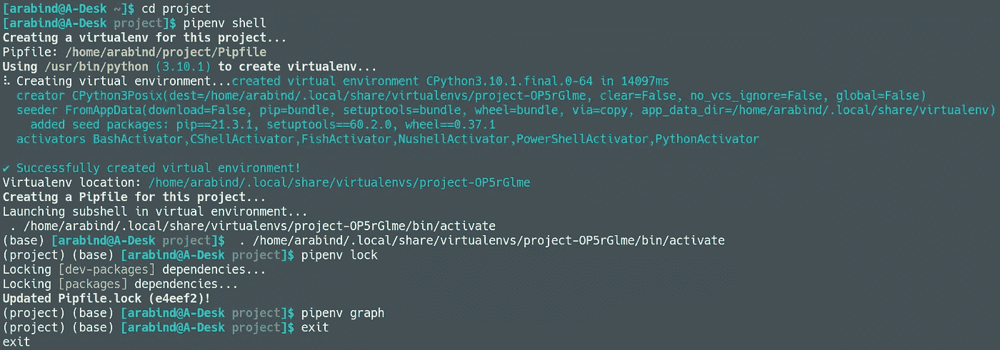
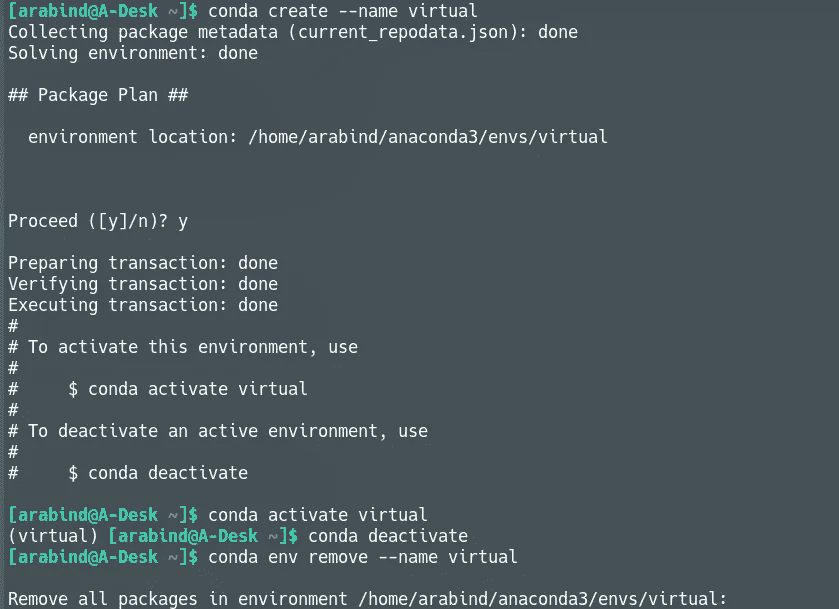

# Python 虚拟环境简介

> 原文：<https://blog.devgenius.io/brief-introduction-to-python-virtual-environments-5eb0ad5e8921?source=collection_archive---------15----------------------->



虚拟环境背后的主要思想是为不同的项目创建单独的环境。这意味着每个项目现在都有自己的依赖关系，而不管其他项目。此外，python 有许多由世界各地的开发人员构建的包。将它们安装在 python 的基础环境中并不是一个理想的选择。这样做可能会导致系统中安装的 python 崩溃或变慢。为了克服这些问题，python 使用了虚拟环境。Python 有各种各样的虚拟环境。我们将讨论其中的三个。

# 虚拟

它是 python 中最简单的虚拟环境。它很容易操作，使用这个虚拟环境不需要特殊的命令。

## 安装 Virtualenv

```
$ pip install virtualenv  # install virtualenv
$ virtualenv --version    # check virtualenv version
$ virtualenv --help       # check usage of virtualenv
```

## 使用 Virtualenv

```
# python -m venv <env-name>
$ python -m venv virtual       # create virtual environment
$ source virtual/bin/activate  # activate virtual environment
$ deactivate                   # deactivate virtual environment
$ rmvirtualenv virtual         # delete virtual environment
```



## 在 Virtualenv 中安装软件包

```
# pip install <package-name>
$ pip install requests             # install single package
$ pip install numpy pandas         # install multiple packages$ pip freeze > requirements.txt
$ pip install -r requirements.txt
```

# Pipenv

Pipenv 比 virtualenv 难一点，但是功能很多。它也有自己的命令来完成大部分工作。

## 安装管道

```
$ pip install pipenv  # install pipenv
$ pipenv --version    # check pipenv version
$ pipenv --help       # check usage of pipenv
```

## 使用 Pipenv

```
$ cd <project-folder>
$ pipenv shell  # start pipenv
$ pipenv lock   # create/update your Pipfile.lock
$ pipenv graph  # display packages with dependencies (if installed)
$ exit          # exit pipenv
```



## 在管道中安装软件包

```
# pipenv install <package-name>
$ pipenv install requests      # install single packages
$ pipenv install numpy pandas  # install multiple packages$ pipenv lock -r > requirements.txt
$ pipenv install -r requirements.txt
```

# 康达

Conda 是 [Anaconda](https://www.anaconda.com/) 的包装和环境管理系统。它的安装有点冗长(anaconda 需要使用 conda)，但是很容易使用。

## 安装 Conda

它预装在 Anaconda 中。Conda 管理 Anaconda 中的所有命令。anaconda 中不需要 Pip，但它可以用于安装包。

## 用 Conda 创建虚拟环境

```
# conda create --name <package>
$ conda create --name virtual      # create virtual environment
$ conda activate virtual           # activate virtual environment
$ conda deactivate                 # deactivate virtual environment
$ conda env remove --name virtual  # delete virtual environment# create virtual environment using requirement file
$ conda create --name <env-name> --file requirements.txt
```



## 在 Conda 中安装包

```
# conda install <package-name>
$ conda install requests      # install single package
$ conda install numpy pandas  # install multiple packages$ conda list --export > requirements.txt
$ conda install --file requirements.txt
```

# 结论

Python 中还有其他虚拟环境，但这三个是最流行的虚拟环境。对于初学者，我建议从 virtualenv 开始，因为它易于使用。Pipenv 是我个人最喜欢的，仅次于 conda，因为它比 virtualenv 有更多的功能。Conda 是为那些使用 anaconda 平台的人准备的。