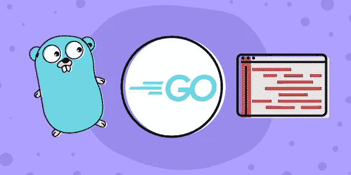

# bright Future(Java Future 接口的 Golang 实现)

> 原文：<https://blog.devgenius.io/brightfuture-golang-implementation-of-java-future-interface-b6e4ed55037c?source=collection_archive---------12----------------------->

***声明:*** *这是我第一篇关于 medium.com 的文章。我试图让它变得非常简单，处于任何学习阶段的人都可以从这篇文章中获得最大收益。我希望你喜欢这个，快乐阅读！*

在本文中，我将介绍如何从 Golang 中的包 *java.util.concurrent* 、 **Future、**中复制非常著名的 JAVA 接口的行为。未来表示一个*异步*计算的结果。在创建一个异步任务后，我们返回一个 Future 对象来处理这个任务的结果。因此，我们的代码可以继续进一步执行，而不是等待任务完成。一旦任务完成，我们就可以访问计算的结果。

我们将了解什么是异步计算，以及我们为什么需要它。接下来，我们将定义一个 **Future** 接口和一个 **FutureTask** 接口的结构，这两个接口实现了 Golang 中接口的主要方法。我们还会讲围棋套路和通道的妙处。**那么……我们开始吧！**

## 什么是异步计算？

异步计算是并行计算的一种形式，它允许任务独立于主线程运行。为了形象化，让我们看看这个案例:

Lovish 编写了一个单线程数字加法引擎，它将用户输入的整数流相加，并在每五秒钟后显示更新后的总和。由于该应用程序是单线程的，用户输入数字，每隔五秒钟，引擎就会接收所有输入的数字，并将它们添加到当前总和中，并显示结果“

那么你能发现这台发动机的缺陷吗？ ***思考两分钟！***

我们可以看到，当我们等待用户输入时，单线程的加法引擎不能进行上下文切换。现在，如果我们的引擎在一个单独的线程中运行，它可以在服务器等待用户输入( **I/O 调用**)时异步计算 sum*，这样我们就可以优化时间使用。这就是所谓的异步计算。*

## *定义未来的界面*

*   ***get()** 方法将完成后的**结果**对象返回给异步任务。*
*   ***getWithTimeout(持续时间。Duration )** 行为方式与 get()方法相同，只是如果任务执行时间超过指定时间，调用会返回超时错误。*
*   ***isComplete()** 返回一个指示任务状态的*布尔值*。*
*   ***isCancelled()** 返回一个*布尔值*，表明任务是否在完成前被取消*
*   ***cancel()** 试图取消任务的执行*

**(* ***注*** *:如果在任务完成之前调用 get()或 getWithTimeout()方法，则该方法被阻塞)**

## *构建未来的任务*

*现在我们已经定义了我们的**未来**接口的行为，我们将定义一个未来任务，帮助我们模仿一个未来**；)***

*   ***成功:**适用于异步任务的成功*
*   ***完成:**如果异步任务执行完成，则为真*
*   ***错误**:保存执行过程中遇到的错误(如果有)*
*   ***结果**:保存结果对象*
*   ***interfaceChannel** :保存一个 ***只接收*** 的通道，等待**结果***

## *结果对象的结构*

*你们中的一些人可能会想，这个我们在这篇文章中提到过六次的**结果**对象是什么？这就是:*

*它将我们任务的完整结果保存在两个变量中: **resultValue** 和 **error。**我们将继续定义自定义错误，敬请关注 **:)***

## *履行*

*接下来，既然我们已经构建了代码来定义行为，现在是时候为该行为提供实现了。所以这将是一个有点重的代码段 **:'D** 。我们将从实现我们的**未来**接口的两个最重要的方法开始。**是的！**我们说的是 **get()** 和 **getWithTimeout()。我们来看看:***

*我们函数的大部分实现都在一个方法中，这个方法就是 **getWithContext()** 所以让我们看看它是关于什么的。我们使用来自***【golang.org/x/net/context***的 ***上下文*** 包来传递我们请求的上下文，并据此进行处理。*

*包上下文定义了上下文类型，其中**携带截止日期**、**取消信号**，以及其他跨 API 边界和进程间的请求范围值。我们正在利用这个包来定义一个在特定时间限制后自动超时的上下文(根据我们的 **getWithTimeout()** 传递的参数值 **timeout** )。*

**(* ***注*** *:要了解 go 中上下文的更多信息，* [*请参考此处*](https://godoc.org/golang.org/x/net/context) *)**

***了解选择块:***

*   ***案例← ctx。Done() :** 这个代码块在请求的上下文过期时执行。在这种情况下，我们将抛出一个超时错误，我们的 resultValue 将为零。*
*   ***Case←future task . interfaceChannel():**当我们的任务完成执行并在 interface channel 上发送结果对象时，就会执行这段代码。*

*现在我们来看看我们的 **FutureTask** 实现的其余方法:*

***isComplete()、isCancelled()和 cancel()** 方法的实现很容易理解。*

## *让我们创造未来！*

*现在是时候创造未来，利用**围棋套路的力量了！***

***return future()**返回对 FutureTask 对象的引用。那么，这个函数是如何工作的呢？让我们仔细看看。*

*该函数以任务为函数参数，分配一个通道 **channelForExecution** 用于接收我们的 *async* 任务的结果，然后创建一个 FutureTask 对象。然后，我们启动一个 go 例程，该例程运行我们的任务并将结果返回给通道。*

*我们知道 ***go 例程*** 是 go 运行时管理的轻量级线程。因此，当我们启动 go 例程时，它与我们的代码并发运行，没有任何阻塞，因此我们的任务将并发执行。这就是围棋套路的美妙之处！！*

*下面是我们的 **main** 方法，其中我们创建了两个 FutureTask(s ),并使用 **get()** 和 **getWithTimeout()** 方法检索它们的结果:*

*在结束本文之前，让我们看一下我们为这个实现创建的自定义错误:*

*我们创建了两个错误 **TimeoutError** 和 **InterruptError** ，我们已经在方法的实现过程中使用了它们。注意，这两个错误都通过提供 **Error()** 方法的实现来实现错误接口。*

## *结论*

*所以，如果你已经做到了，祝贺你！现在你知道如何使用 Golang 从 JAVA 模仿未来接口了。这就是并发编程在 Golang 中最基本的样子，现在我们准备在此基础上进行构建。*

*希望你喜欢这篇文章。请提供您的意见和评论。*

*要查看完整的代码，请查看我的 github 库[这里](https://github.com/dart-vinay/BrightFuture)。*

*感谢阅读！*

****干杯！****