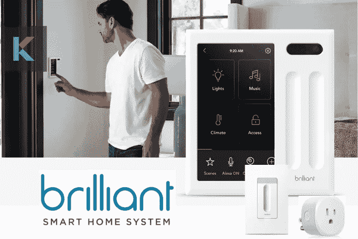
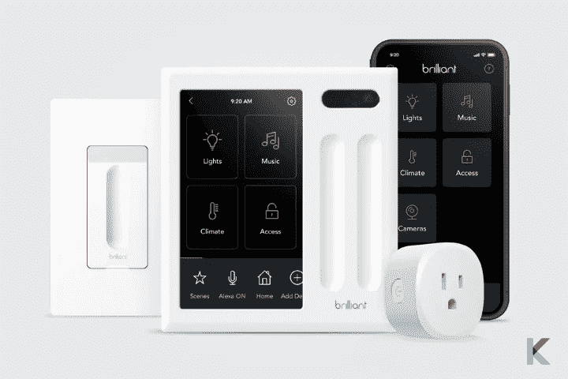
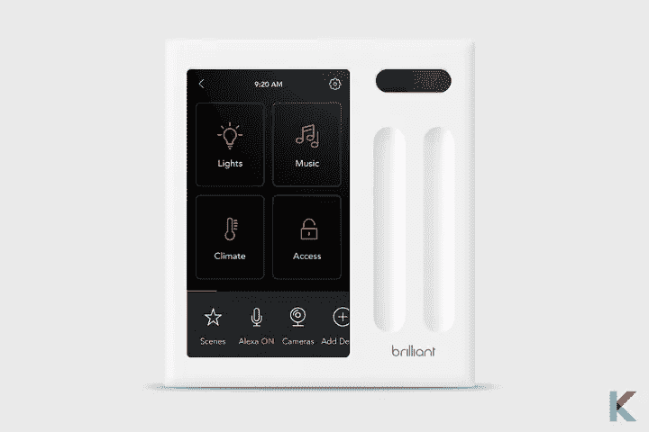
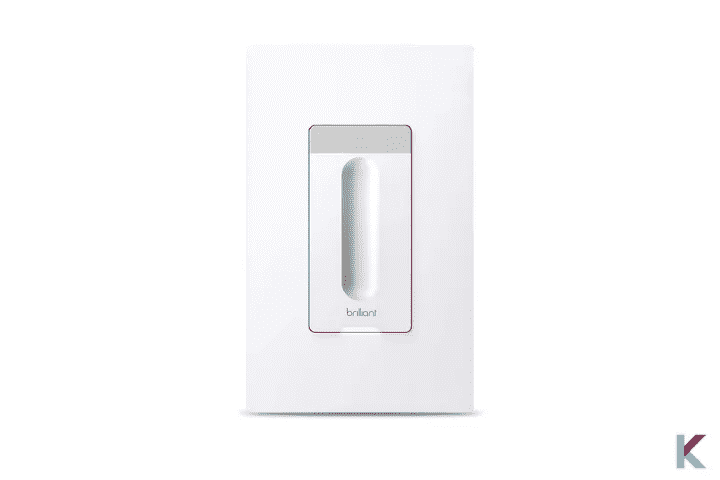
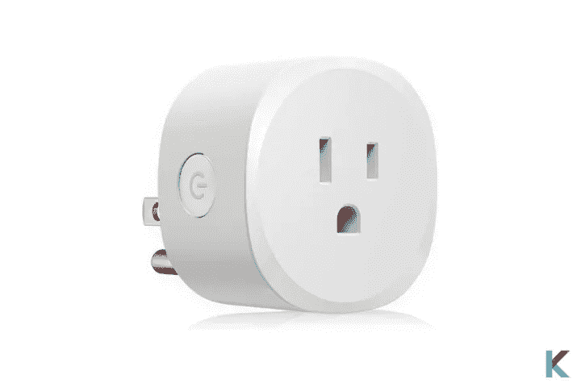
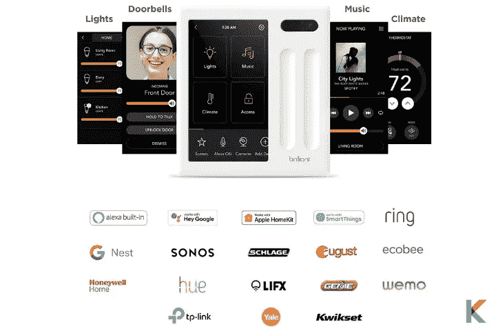
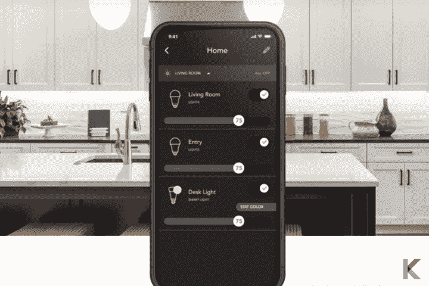
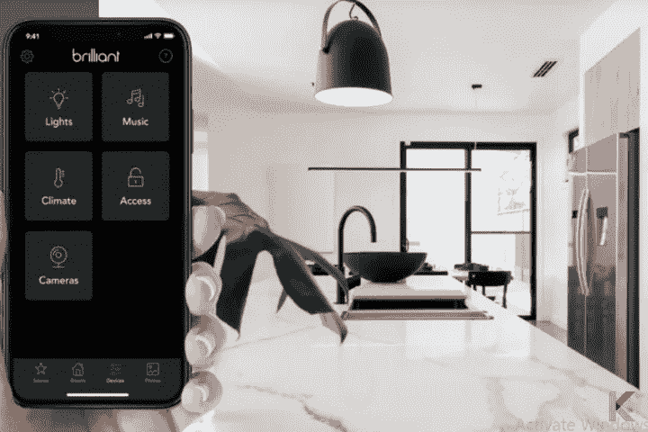

# 辉煌的智能家居自动化系统

> 原文：<https://blog.devgenius.io/brilliant-smart-home-9e12c36f79d5?source=collection_archive---------3----------------------->

如果你厌倦了用手机控制智能家居设备，这款出色的智能家居系统正适合你。您可以使用嵌入式控制器面板控制所有设备。现在，每个家庭都可以通过智能家居系统实现智能化。所以，你可以让你的生活更轻松。此外，它可以与飞利浦、Ring、Sonos、Nest 等公司的许多最著名的智能家居设备配合使用。让我们了解更多关于智能家居系统的精彩信息。

卓越的智能家居系统

***你将从这篇文章中学到什么:***

什么是辉煌智能家居系统？

*   卓越的智能家居控制
*   出色的智能调光开关
*   出色的智能家居插头

智能家居控制

照明控制

一体化应用程序

智能家居系统的利与弊

辉煌 App 怎么设置？

# 什么是辉煌智能家居系统？

卓越的智能家居系统

[智能家居系统](https://kodmy.com/brilliant-smart-home/)是一个室内照明和控制系统。它是房主、客人和家庭控制[智能照明](https://kodmy.com/the-best-smart-lighting-2021/)、[智能锁](https://kodmy.com/smart-lock-for-smart-life/)、[智能门铃](https://kodmy.com/ring-video-doorbell-3-plus/)、气候、[智能摄像头](https://kodmy.com/best-home-security-cameras/)、音乐、场景等的绝佳解决方案。此外，它很容易与每个智能家居设备类别中的顶级品牌集成和安装。是的。它可以将任何房子改造成易于使用的智能家居。

**检查智能家居设备的兼容平台**

现在，你可以用你的谷歌助手、亚马逊 Alexa 或 Siri 语音助手选择兼容[的智能家居设备](https://play.google.com/store/apps/details?id=com.knovik.canda)。如果您想检查智能设备的 Siri 兼容性，请单击下面的按钮下载 Canda——智能兼容性检查器。

[从 Play Store 下载](https://play.google.com/store/apps/details?id=com.knovik.canda)

[从应用商店下载](https://apps.apple.com/us/app/canda-compatibility-checker/id1630339464)

否则，您可以扫描二维码下载 Canda —兼容性检查器应用程序。

出色的智能家居控制就像一个数码相框。因此，您可以与家人分享回忆，并将手机中的照片发送到 Brilliant。它配有出色的控制面板、出色的开关调光器、出色的智能插头和出色的应用程序。此外，智能插头、[智能开关调光器](https://kodmy.com/smart-light-switch-dimmer/)和控制面板与 iPhone 和 Android 手机兼容。

让我们[检查智能家居设备的兼容性](https://kodmy.com/brilliant-smart-home/#compatibility-platform)。

## 卓越的智能家居控制

卓越的智能家居控制

辉煌的智能家居控制是一个触摸屏控制面板，内置 Alexa 语音控制。此外，它还将智能家居转变为卓越的智能家居。它有四种型号和六种颜色。您可以通过触摸屏或一体化应用程序即时控制您的智能家居设备。所有你需要的是一个辉煌的控制面板添加辉煌的控制或开始自动化在任何房间。它可以控制常规和智能灯，调节智能恒温器，激活家庭自动化场景，带隐私快门和运动传感器的摄像头，播放[最佳智能扬声器](https://kodmy.com/google-nest-mini-setup-and-reviews/)，调暗灯光或轻触开关灯，用智能锁锁上门，等等。

**品牌:**辉煌

**颜色:**白色、象牙色、浅杏色、银色、灰色和黑色

**控制器类型:**苹果 HomeKit，Ring，WeMo，SmartThing，亚马逊 Alexa

**控制方式:**语音，App

**开关类型:**按钮

**安装类型:**壁挂式

## 出色的智能调光开关

出色的智能调光开关

智能调光开关取决于您家中至少有一个智能控制面板。它拥有迷人的工业设计和自然的触摸感应控制。它还可以触发整个智能家居场景，并为出色的系统添加智能照明。还有，它依赖于蓝牙 mesh 技术。

**品牌:**辉煌

**颜色:**黑色、灰色、浅杏色、白色

**控制器类型:** WeMo，SmartThings，Google Assistant

**连接:**无线网络

**控制器方式:** App，语音

**要求:**亮度控制

## 出色的智能家居插头

出色的智能插头

您可以使用智能插头控制咖啡机、灯具、风扇等。它通过 HomeKit、Alexa 和谷歌助手将语音控制带到任何出口。它非常容易设置和使用。你只是想插入并下载精彩的应用程序。出色的应用程序一步一步地向您展示如何设置。此外，你可以用语音、应用程序和动作来控制这个插头。

**品牌:**辉煌

**颜色:**白色

**要求:**辉煌控制

# 智能家居控制

卓越的智能家居系统

如果你对一体化智能家居系统感兴趣，这款出色的智能家居系统配有显示器、触摸、语音、动作和应用程序。这对每个人来说都很容易。借助一体化智能家居触摸屏控制器，您可以从墙上的触摸屏面板控制著名的智能家居设备和体验。共有 4 种型号，6 种颜色，包括 1 开关面板、2 开关面板、3 开关面板和 4 开关面板。

*   **语音控制**

这款出色的智能家居控制器内置了[亚马逊 Alexa](https://kodmy.com/the-best-alexa-compatible-devices-in-2021/) 语音控制。因此，现在您可以享受内置语音控制的便利，通过墙上的触摸屏面板进行视觉和音频响应。此外，它还可以与[苹果 HomeKit](https://kodmy.com/homekit/) 和谷歌助手配合使用。

*   **音乐**

你可以从墙上控制你的 Sonos 扬声器。因此，您可以使用内置 Sonos 控件轻松浏览和播放音乐，而无需手机或应用程序。它还显示音乐、电台和播放列表。但是他们之前想把我的 Sonos 账户加到你的账户里。

*   **家庭访问**

你想知道谁在门口吗？现在，你可以用你的环形视频门铃看到谁在门口，而不需要电话或应用程序。此外，你可以用耶鲁、西勒奇、奥古斯特、Kwikset 等公司的智能锁在任何房间开门开门。

*   **完美的灯光**

你喜欢通过语音、动作、触摸、场景或一体化应用程序来控制智能灯吗？那么聪明的智能控制器非常适合你。您可以控制 Lifx、Philips Hue、TP-Link 和其他智能灯泡，而无需打开开关。如果您喜欢在进出房间时自动打开和关闭智能灯，您可以使用运动控制来实现。如果你喜欢从任何地方控制你的智能灯，你可以使用出色的应用程序控制。否则，你可以使用 Alexa、苹果 HomeKit 或谷歌助手来免提控制你的智能灯。

*   **气候+阴影**

如果你已经有了 Google Nest、Honeywell 和其他智能恒温器，你可以通过 Brilliant 使用触摸、Brilliant 移动应用程序和语音控制来改变你家的温度。你也可以通过在夏天遮挡光线，在冬天最大限度地吸收阳光来实现遮阳自动化，从而节省能源成本。Brilliant 支持 Nest、Honeywell Home、Ecobee 和 Connect with Somfy 设备。不仅可以控制恒温器的温度，还可以创建包括气候控制的场景。当检测到泄漏、异常湿度水平或异常温度时，它可以使用霍尼韦尔泄漏和冻结检测器进行监控并接收警报。

*   **音频&可视对讲**

您可以共享双向视频聊天，并通过出色的音频和视频对讲系统发布房间通知。你在家还是不在家并不重要。你可以随时和客人、孩子、保姆、管家聊天。

有两个选项可以使用一体化的卓越控制应用程序或从卓越的控制面板检查家中的任何房间。

*   **场景和套路**

你有没有想过结合音乐、灯光、温度和其他设置来同时快速控制不同的智能设备？是的，你可以通过一个预定的动作或点击你聪明的控制来自动化你的家。此外，您可以创建或编辑场景，并从任何地方激活/停用场景。

# 照明控制

来自 Brilliant 应用程序的照明控制

你可以将普通灯转换成智能灯，利用智能调光开关让智能灯变得更加智能。它与您出色的智能家居控制相结合，打造出一个家居控制系统和集成智能照明系统。它能让你的智能照明遍布家中。此外，它很容易控制和使用，因为它内置在你家的墙上。你可以通过你的声音、动作或出色的应用程序来访问它。

它每时每刻都能提供完美的照明。您可以将多个智能灯光组合到场景中。因此，你可以为用餐、看电视、烹饪等创造无缝照明。此外，当睡觉的时候，你可以创建一个场景来关闭所有的灯。

**运动控制** —当你进入房间或离开房间时，它会自动打开和关闭你的智能灯

**应用程序控制** -您可以在家或外出时使用这款出色的应用程序控制您的智能灯。

**语音控制** —如果你喜欢免提控制你的智能灯，那么你可以使用谷歌助手、亚马逊 Alexa 和苹果 HomeKit 来控制你的灯。

# 一体化应用程序

出色的应用程序

你不需要为每台智能家居设备使用多个智能家居应用。您可以使用出色的移动应用程序从任何地方控制您的智能家居设备。你也可以通过观看实时视频，从 Brilliant 的内置摄像头查看你的家。

您可以将所有智能家居设备结合在一起，并通过出色的应用程序对其进行控制。此外，Brilliant 应用程序提供安装说明，帮助您安装 Brilliant 控件。

# 智能家居系统的利与弊

**优点**

*   可以通过 Wi-Fi 和蓝牙在本地工作
*   多个面板选项
*   对色调、Sonos、LIFX 等的物理控制
*   使用方便
*   明亮的高分辨率屏幕

**缺点**

*   一些主要品牌不支持
*   更贵

# 辉煌 App 怎么设置？

首先，打开[辉煌智能手机 app](https://kodmy.com/brilliant-smart-home/#How-to-set-up-the-Brilliant-App) ，点击注册按钮。你要看催收通知，然后按同意。接下来，您可以通过电子邮件或您的电话号码进行注册。现在输入您的详细信息，然后按“继续”进行设置。之后，我们会向您发送一个验证码。您希望打开您的手机信息或电子邮件来检索此验证码，然后将其输入。最后，您需要输入六到二十个字符的密码。这可以包括字母、数字或符号。然后按完成。之后，您可能会在安装过程中的不同时间收到此请求。然后，新闻界允许或不允许它继续下去。

接下来，您可以按 home 键并给出您的家庭名称。之后，您可以添加您的位置，并通过点击勾选来删除或添加房间。如果您想要额外的房间，您可以按“添加另一个房间”按钮，键入新的房间名称，然后按“完成”。您可以随时回来编辑主页名称，添加更改或删除房间。要完成设置，您需要按 done。

***雄霸天下***

没有争论。卓越的[智能家居系统](https://kodmy.com/best-home-automation-systems/)是最好的智能家居系统，为每个人提供更强大的智能家居自动化体验。你可以控制任何东西，比如气候、音乐、前门、灯光等等。此外，您还可以通过安全摄像头查看您的孩子、宠物或管家。这是真正令人难以置信的功能数量发现辉煌。当然，这比你想象的要简单。这会让你变得更聪明。所以，是时候开始使用 Brilliant 了。

如果你对另一个智能家居系统感兴趣，可以找我们的 [KNX 智能家居](https://kodmy.com/knx-smart-home/)文章。