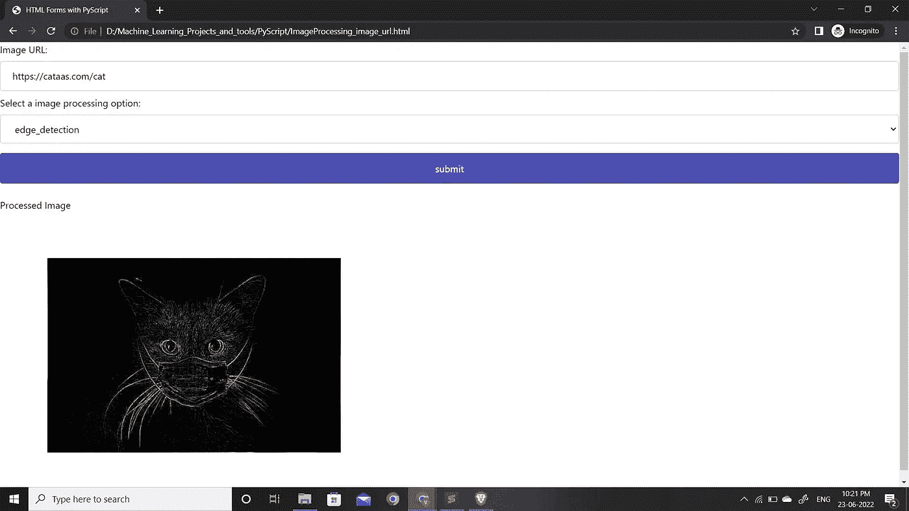

# 将 Python 引入浏览器进行图像处理

> 原文：<https://blog.devgenius.io/bringing-python-to-browser-for-doing-image-processing-c34f5bba9c1d?source=collection_archive---------12----------------------->


在 [Unsplash](https://unsplash.com?utm_source=medium&utm_medium=referral) 上 [Remotar Jobs](https://unsplash.com/@remotarjobs?utm_source=medium&utm_medium=referral) 拍摄的照片

如今，应用程序或网络应用程序比桌面应用程序更受欢迎。你几乎可以在你的浏览器里做任何事情，不需要安装任何东西。任何用 Javascript 编写的网络应用程序都不需要安装任何额外的软件，这都要归功于 chrome 等应用程序强大的 V8 引擎。但是直到几个月前，只有 JavaScript 是可以用来编写 web 应用程序的语言。在机器学习或图像处理等用例的情况下，单独的服务器用于进行后端处理。在某些情况下，开发人员确实使用 TensorFlow JS 这样的框架来开发这样的应用程序，但 TensorFlow python 版本仍然更成熟，在社区中更受欢迎，因为 python 在该领域很受欢迎。在大多数情况下，API 通常部署在云中，这比完全的本地服务器成本更高，安全性更低。因此，如果我们有一种方法可以在浏览器中运行 python，那就太好了。

本文解释了如何解决上述问题，我们可以在 Pyscript 的帮助下在浏览器中运行 python。在本文结束时，您将了解如何使用 pyscript 在浏览器中进行图像处理。

# PyScript

PySript 是 anaconda 团队开发的一项技术，旨在 web 浏览器中运行 python。它利用 web 程序集来运行 python。我们用 python 写的代码被编译成 web 汇编，由我们的浏览器执行。PyScript 基于 py 碘化物，py 碘化物提供了 Python 的 web 程序集端口。Pyscript 以单个 JS 文件的形式出现，可以添加到网页中，从而加载整个 python 运行时。因为 pyscript 是基于 py 碘化物的，所以可以使用 py 碘化物中的大多数库。目前 pyscript 仍处于开发阶段，因此一些功能可能在未来的版本中无法工作，或者可能以不同的方式工作。

# PyScript 的基础知识

在开发实际的应用程序之前，让我们学习一些 PyScript 的基础知识。PyScript 可以被认为是一个包含 python 的 HTML 页面，由浏览器运行时环境执行。它是在 HTML 标签的帮助下实现的。

**<py-script>标签**

pyscript 标签就像任何 HTML 标签一样，以<py-script>开始，以</py-script>结束。在这两者之间，我们编写所有希望在页面打开时执行的 python 代码。

**<py-env>标签**

pyscript 标签就像任何 HTML 标签一样，以<py-env>开始，以</py-env>结束。这个标签用于导入我们源代码中使用的外部库。它告诉 py 碘化物环境从源代码中加载列出的库。下面是一个例子，我们想导入外部库 *matplotlib，numpy，imageio 和 scipy。*

```
<py-env>
    - matplotlib
    - imageio
    - numpy
    - scipy
</py-env>
```

**PyScript 中的 DOM 操作**

PyScript 可以操作 HTML 文档/网页中的不同对象。python 解释器可以访问页面上的所有对象，如输入按钮、文本区域等。借助 PyScript 的 js 模块中的*元素和文档类，可以访问页面中的对象/元素。下面是一个使用 PyScript 的 DOM 操作功能的例子。*

```
<py-script>
from js import documentdef say_hello(*args,**kwargs): name_txt=Element('Name').value
  message_field = document.getElementById("message_txt")
  message_field.value="Hello "+name_txt</py-script>
```

在上面的函数中，我们得到了名为*“Name”和*的文本字段中包含的值，然后用它附加 hello。最后，我们在 *getElementById* 的帮助下访问 id 为 *message_txt* 的文本字段，并将其值设置为新文本。

# PyScript 中的图像处理

让我们先看看代码，然后再一点一点理解它。

学分:这段代码中使用的 HTML-CSS 部分受到了 youtube 上 1littlecoder pyscript 教程的启发。

## 代码说明

*   在第 11-12 行，我们分别使用*链接*和*脚本*标签导入 pyscript CSS 和 pyscript 运行时环境。
*   在第 13-18 行，我们借助于 *< py-env >* 标记，在 PyScript 环境中导入外部库。
*   在第 22-53 行，我们编写了 CSS 代码，用于在 HTML 部分设置输入文本字段和下拉列表对象的样式。
*   在第 57-74 行，我们使用基本的 HTML 来创建一个 HTML 标签。请注意，在表单标签中，我们将 onsubmit 属性设置为 false，这意味着我们不想通过单击提交按钮来切换页面。在 HTML 表单中，有三个对象，其中一个是用于输入要处理的图像的 URL 的文本字段，另一个对象是用于选择要执行的图像处理操作类型的下拉列表。最后一个对象是一个 submit 按钮，它调用我们的 python 函数来完成所有的处理。 *pys-onClick* 属性是 pyscript 特有的属性，用于调用 pyscript 内部的 python 函数*子定义的*。在表单标签之外，我们可以注意到另外两个 div 标签，一个用于标签，另一个 div 元素包含一个 *img* 标签，我们最终将操纵它来显示我们的图像。
*   从第 76–84 行，我们正在导入执行图像处理所需的库。可以观察到，我们也在导入异步模块和 py 碘化物模块，但在<py-env>标签中没有提到。原因是这些库是内部 python/pyscript 库。</py-env>
*   在第 86–110 行，我们用 numpy 和 scipy 编写了一些图像处理函数，因为 opencv 在 py 碘化物中还不可用。
*   在第 114 行，我们定义了一个名为 sub 的*异步*函数。
*   在第 115 和 116 行，我们正在访问图像 URL 文本字段和图像处理选择下拉列表的值。
*   在第 117–119 行，我们使用 py 碘化物的 pyfetch 函数从 URL 获取图像，然后我们在 *BytesIO* 的帮助下将响应中获得的字节转换为缓冲区，并在 *imread* 函数的帮助下将其读取为图像。最后，我们将图像转换成 numpy 格式。
*   从第 120–137 行，我们根据我们在下拉列表中的选择调用函数。
*   在第 141 行，我们正在初始化一个*字节缓冲区。在第 142 行，我们将我们的绘图保存到这个缓冲区。在第 143 行，我们指向缓冲区的开始。*
*   在第 144–146 行，我们将图像编码为 *base64* 字符串。然后我们访问 img 标签，并用这个字符串设置它的 *src* 属性。设置此项会将图像数据放置在 img 标签中，该标签由浏览器呈现，就像任何 img 标签一样。

以上代码可以保存为 HTML 文档，在 chrome 中打开。

# 应用程序的输出



以上是我们构建的 pyscript 应用程序的工作原理。imageurl 文本字段中的 url 是随机返回猫的图像的 URL。这里还有一点需要注意的是，浏览器中的 URL 直接指向我磁盘中的 HTML 文件，因为我已经将该文件保存为 html doc 并在 chrome 中打开了它。在一些教程中，他们首先创建一个前端服务器，然后运行应用程序。在这种情况下，我们可能能够直接访问系统的文件系统。但是创建一个服务器会涉及一些安装，这会损害 PyScript 的可移植性，因此我决定用不同的方式从 URL 读取图像。

# 参考资料和进一步阅读

[](https://github.com/pyscript/pyscript) [## GitHub - pyscript/pyscript:主页:https://pyscript.net 示例:https://pyscript.net/examples

### PyScript 是 Scratch、JSFiddle 和其他“易于使用”的编程框架的 Pythonic 替代品，其目标是…

github.com](https://github.com/pyscript/pyscript) 

如果你到达这里，那么恭喜你刚刚学到了一个惊人的概念。如果你喜欢它，请考虑为这篇文章鼓掌，并点击关注按钮，以获得更多这样的博客。这样做会激励我继续研究和写博客。欢迎在评论区提出任何问题或疑问，我很乐意帮助你。