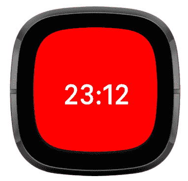
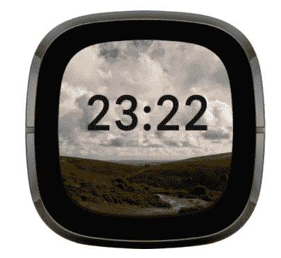
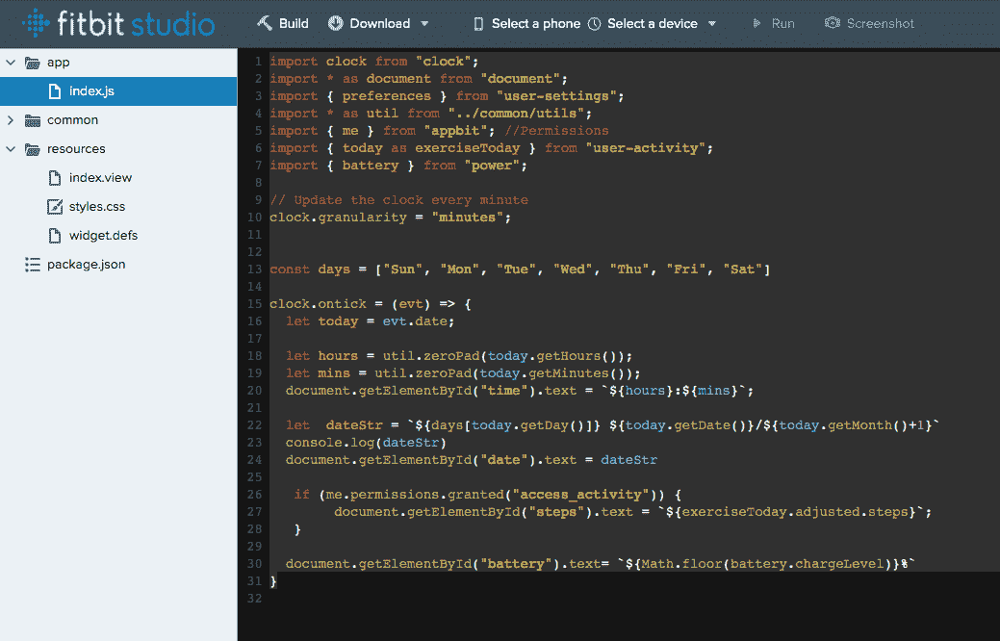
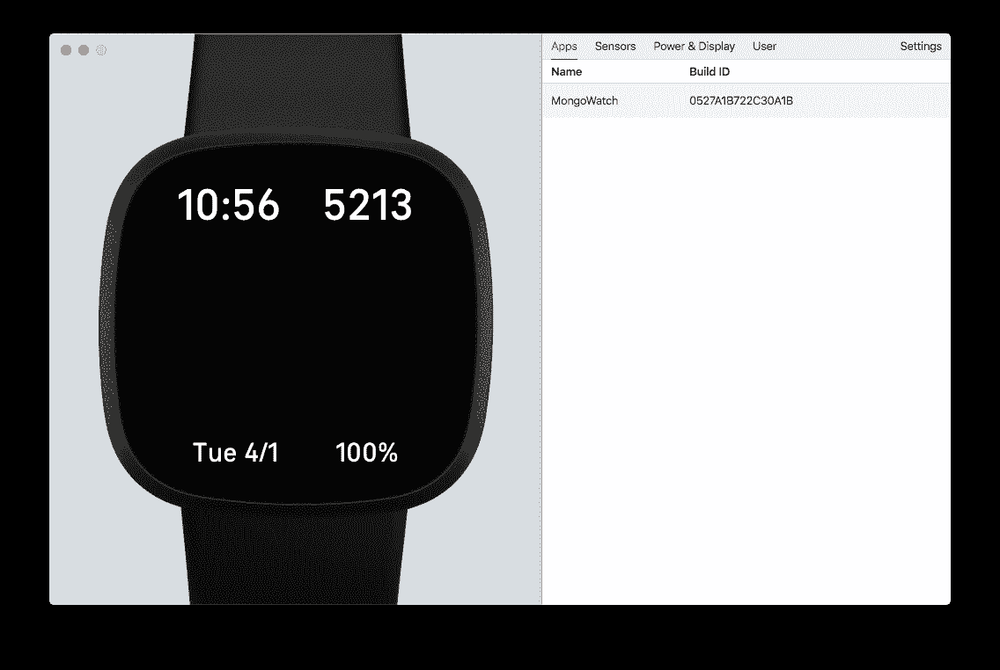
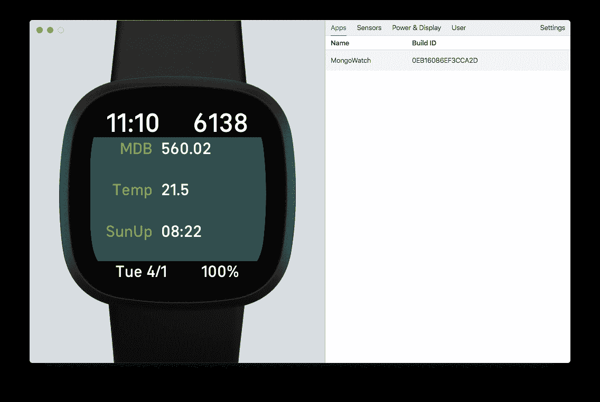
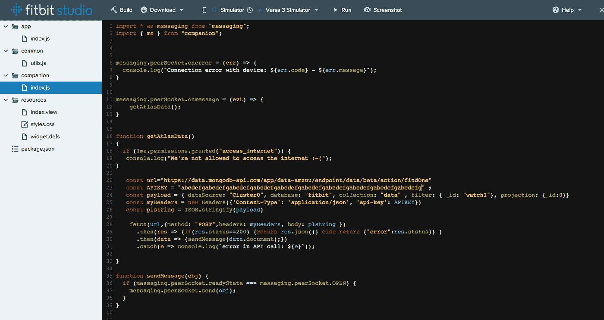
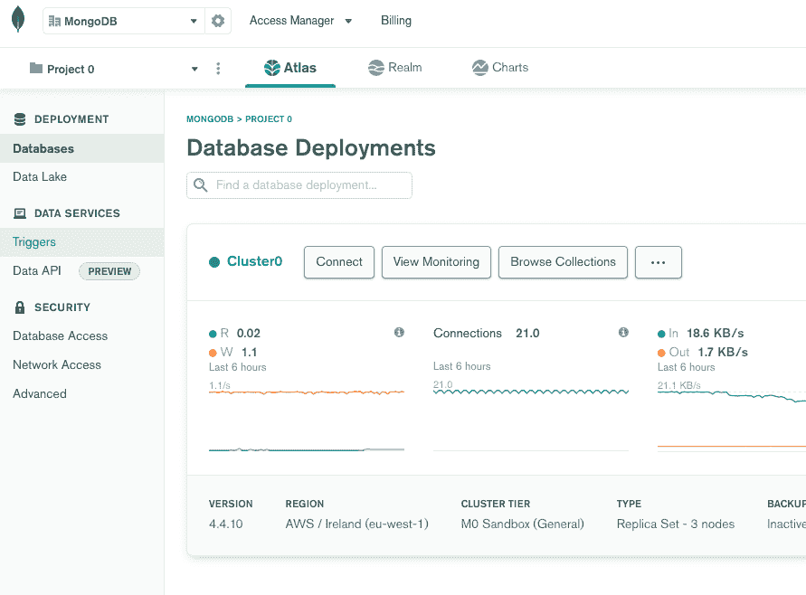
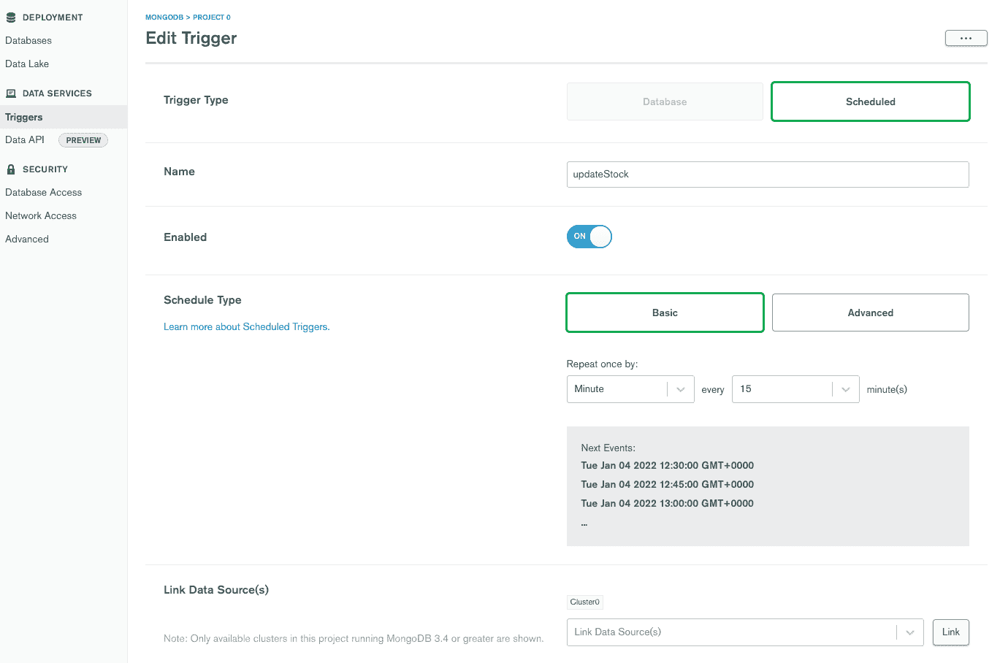
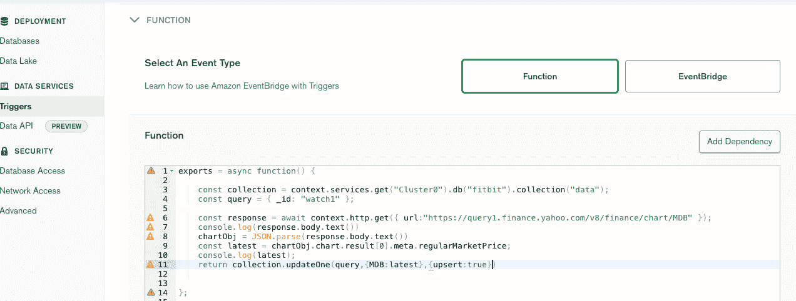

# 使用 MongoDB 数据 API 和 Fitbit 将您的数据带到我的手腕上

> 原文：<https://blog.devgenius.io/bringing-your-data-to-my-wrist-with-the-mongodb-data-api-and-fitbit-e73ad3db7dec?source=collection_archive---------7----------------------->

我经常使用我的 Fitbit Versa 智能手表，不仅可以显示时间和计算步数，还可以将我可能想要查看的其他信息带到我的手腕上。几年前，我制作了一个定制的表盘来实现这个功能，但是随着我的信息偏好的改变，我需要修改表盘。这一次，我决定尝试一种能够根据 MongoDB Atlas 中文档的内容动态调整显示内容的手表界面。这样，我可以使用触发器和整个 MongoDB Realm 环境来收集和过滤显示数据，而不是修改观察器代码。

*可能有些人读到这里会想，“我有苹果手表？这会涵盖苹果手表吗？”严格来说，答案是否定的。我喜欢 Fitbit 手表六天的电池续航时间和超级简单的基于 Javascript 的在线开发环境，你不能在我的 Android 手机上使用 Apple watch。Fitbit 对两者都适用。但是，我敢肯定，如果你确实想为你的 Apple Watch 编写一个自定义界面，那么 Data API 也会帮助你做到这一点。*

[MongoDB Atlas 数据 API](https://docs.atlas.mongodb.com/api/data-api/) 是一个基于 HTTPS 的 API，它允许我们在 Atlas 中读写数据，而 MongoDB 驱动程序库要么不可用，要么不可取。在本文中，我们将了解如何从智能手表应用程序调用数据 API 来检索包含要显示的数据的文档。我们还将使用 Atlas 中的预定触发器动态更新该文档。

# 先决条件

这不是一个完整的循序渐进的教程，但是如果你想按照我自己的步骤操作，你需要在 studio.fitbit.com[创建一个账户。您不需要拥有 Fitbit 设备，因为您可以使用模拟器。如果你确实想要一款设备，那么 Fitbit 将在 2022 年 1 月以 130 美元至 199 美元的价格出售它们，这对于一款可以打电话和运行 Alexa 或谷歌助手的成熟智能手表来说是一件好事。我个人有一个 Versa 3，但对于这一点，任何 Fitbit 智能手表都可以。](https://studio.fitbit.com)

您还需要一个已经启用了数据 API 的 Atlas 集群，以及我们的端点 URL 和 API 键。如果你还没有的话，你可以在这篇[文章](https://www.mongodb.com/developer/quickstart/atlas_data_api_introduction)或这段[视频](https://www.youtube.com/watch?v=46I0wZiTFi4)中学习如何获得这些。

# Fitbit 开发入门

正规的 Fitbit 开发者对[命令行界面](https://dev.fitbit.com/build/guides/command-line-interface/)信誓旦旦，使用 Visual Studio 代码开发。我想如果我有规律地或专业地发展，我也会走这条路。不过，我的职业发展并不顺利。我正在创建一个供自己使用的个人手表界面，并明确地试图制作一个我可以修改的界面，而不必对手表本身做任何进一步的开发。

Fitbit 在 studio.fitbit.com 的[提供了一个优秀的基于浏览器的开发体验。这允许你创建手表表面(出于某种原因，被称为时钟表面)以及手表的应用程序，而不需要安装任何本地工具。还有一个 Fitbit 模拟器，你可以用它来代替物理手表，你需要在本地安装，但这很容易做到。](http://studio.fitbit.com)

重复或改写 Fitbit 本身提供的优秀入门教程是没有意义的。因此，如果你想通过自己的 Fitbit 或模拟器来解决这个问题，你应该从阅读 Fitbit 自己的“[入门](https://dev.fitbit.com/getting-started/)”页面开始。这将带你在 20 分钟或更少的时间里看到你的第一个表盘。

*截至 2022 年 1 月，Fitbit 有一个小问题，模拟器不会作为设备出现在 IDE 中。这是因为本地二进制文件中的证书颁发机构证书已过期。您可以通过* [*按照 Fitbit 论坛*](https://community.fitbit.com/t5/SDK-Development/Simulator-SSL-Problem/m-p/5003032/highlight/true#M16148) *中的说明将新证书复制到 Windows 或 Mac app 目录中来修复此问题。*

在这一点上，你应该有一张观察脸，或者是一张相当难看的、像这样的红脸



或者像这样更吸引人的东西



# 显示 Fitbit 的核心统计数据

这是我开始开发的地方，我需要的第一件事是我想在我的书写中随时看到的四个本地值:时间、日期、每日步数和手表电池电量。为此，我将 IDE 中同一个钟面的基于 SVG 的布局、样式 CSS 和 Javascript index.html 更改如下。

索引.视图

```
<svg class=”background”>
   <text class="fixed" id="time" />
   <text class="fixed" id="date" />
   <text class="fixed" id="steps" />
   <text class="fixed" id="battery" />
</svg>
```

> style.css

```
.background { viewport-fill: black; }.fixed { font-size: 52; font-family: System-Bold; fill: white; }#steps { text-length: 6; x: 90%; y: 15%; text-anchor: end; }#time { text-length: 5; x: 10%; y: 15%; text-anchor: start; }#date { font-size: 32; text-length: 9; x: 15%; y: 97%; text-anchor: start;}#battery { font-size: 32; text-length: 4; x: 85%; y: 97%; text-anchor: end;}
```

> 索引. js

```
import clock from “clock”;
import * as document from “document”;
import { preferences } from “user-settings”;
import * as util from “../common/utils”;
import { me } from “appbit”; //Permissions
import { today as exerciseToday } from “user-activity”;
import { battery } from “power”; // Update the clock every minute
clock.granularity = “minutes”;
const days = [“Sun”, “Mon”, “Tue”, “Wed”, “Thu”, “Fri”, “Sat”]clock.ontick = (evt) => {
   let today = evt.date;
   let hours = util.zeroPad(today.getHours());
   let mins = util.zeroPad(today.getMinutes());

   document.getElementById(“time”).text = `${hours}:${mins}`; let dateStr = `${days[today.getDay()]}    ${today.getDate()}/${today.getMonth()+1}`

   document.getElementById(“date”).text = dateStr
   if (me.permissions.granted(“access_activity”)) {
      document.getElementById(“steps”).text =  `${exerciseToday.adjusted.steps}`;
   }

 document.getElementById(“battery”).text=`${Math.floor(battery.chargeLevel)}%`
}
```

*index.view* 文件定义了 face 的元素，当在 Fitbit 应用程序中使用时，SVG 相当于 HTML div，因为一切都被绘制为可缩放的矢量图形。 *style.css* 文件设置元素的样式和位置，每个角一个——顶部使用较大的字体。

上面的 *index.js* 文件定义了在 *ontick* 事件上做什么，并将其配置为每分钟调用一次。然后设置日期、时间、步骤和各种元素的电池电量。即使您以前从未编写过 Fitbit，如果您使用过任何 Javascript 和 HTML，这也应该是熟悉的语法。

为了测试这一点，我需要从顶部的下拉列表中选择手机*模拟器*和设备 *Fitbit Versa 3 模拟器*，并单击*运行*以查看我简单但准确的手表界面。



# 动态更改 Fitbit 上的布局

我希望能够从服务器获取一个 Javascript 文档，并在我的 watch face 上呈现其中的任何键和值。我可以简单地在文本框中显示一个 JSON 文档，但即使对我来说，这也太怪了。因此，我的计划是动态地向 SVG 中添加键和值的元素。

事实证明，您不能动态构造布局 SVG。(Fitbits 有很小的 CPU 和 RAM，并为面部元素预分配 RAM。当你试图建造一些耗电的东西时，这是有意义的。Javascript 也被编译成机器代码，而不是在手表上解释。)因此，诀窍是预先创建一些空元素，然后按照我想要的方式移动和填充它们来呈现面部。为此，我将 index.view 更改如下。手表的体积很小，所以我假设一次最多能有八项数据，而不会小到无法读取。

索引.视图

```
<svg class=”background”>
   <text class=”fixed” id=”time” />
   <text class=”fixed” id=”date” />
   <text class=”fixed” id=”steps” />
   <text class=”fixed” id=”battery” />
   <svg id=”dynamic”>
      <rect id=”dynamicbg”/>
      <text class=”dynamickey” id=”dk0"/>
      <text class=”dynamickey” id=”dk1"/>
      <text class=”dynamickey” id=”dk2"/>
      <text class=”dynamickey” id=”dk3"/>
      <text class=”dynamickey” id=”dk4"/>
      <text class=”dynamickey” id=”dk5"/>
      <text class=”dynamickey” id=”dk6"/>
      <text class=”dynamickey” id=”dk7"/>
      <text class=”dynamicvalue” id=”dv0"/>
      <text class=”dynamicvalue” id=”dv1"/>
      <text class=”dynamicvalue” id=”dv2"/>
      <text class=”dynamicvalue” id=”dv3"/>
      <text class=”dynamicvalue” id=”dv4"/>
      <text class=”dynamicvalue” id=”dv5"/>
      <text class=”dynamicvalue” id=”dv6"/>
      <text class=”dynamicvalue” id=”dv7"/>
   </svg>
</svg>
```

style.css

```
.dynamickey { font-size: 32; font-family: System-Bold; fill: fb-lime; width: 50%; text-length: 20; text-anchor: end; }.dynamicvalue { font-size: 32; font-family: System-Bold; fill: white; width: 50%; text-length: 20; }#dynamic { x: 1%; y: 18%; width: 100%; height: 70%; 
text-length: 30; }#dynamicbg { width: 100%; height: 100%; fill: darkslategrey; }
```

然后，我向 index.js 添加了一个额外的函数，通过根据我显示的数据量设置和移动这些文本元素来呈现一个 Javascript 对象。

索引. js

```
function renderData(obj) {
   //Dynamically update The Watch face to show what’s in the Mongo Document
   //We cannot add elements but we can move and hide them.
   let keys = Object.keys(obj)
   let sw = device.screen.width
   let sh = device.screen.height
   let idx=0;
   for(idx=0;idx<keys.length &&idx<8;idx++)
   {
      let keyElement = document.getElementById(`dk${idx}`);
      let valueElement = document.getElementById(`dv${idx}`);
      keyElement[‘text-length’] = 20;
      keyElement.text = keys[idx]
      keyElement.x = sw * 0.35;
      keyElement.y = 32 + ((sh * 0.7) / keys.length)*idx;
      valueElement.text = obj[keys[idx]]
      valueElement.x = sw* 0.4;
      valueElement.y = 32 + ((sh * 0.7) / keys.length)*idx;
   }
   for(;idx<8;idx++) {
      let keyElement = document.getElementById(`dk${idx}`).text=””
      let valueElement = document.getElementById(`dv${idx}`).text=””
   }
}
```

将这个固定的 Javascript 对象传递给我进行测试，我得到了下面的结果。



# 用数据 API 从 Atlas 中提取文档

下一步是从 MongoDB Atlas 中获取所需的信息，告诉我们要显示什么。

Fitbit 手表不运行 TCP 堆栈，也不直接连接到互联网，因为这样会消耗太多电力。相反，它们允许您定义一个“伴侣”应用程序的代码，该应用程序在手机的 Javascript 沙盒中运行，并为伴侣或手表提供一种简单的轻量级方式来发送信息。

为了从 Atlas 中检索数据，我们将让手表每分钟或每当我们看脸时向同伴请求更新(Fitbit 检测到这一点)。配套应用程序一旦从 Atlas 接收到更新，就会将更新发送到面部。

配套应用程序可以包括一些简单的 node.js 模块，但它是一个相当受限制的沙箱，因此，不可能使用 MongoDB node.js 驱动程序。幸运的是，我们现在有了 MongoBD Atlas 数据 API，它允许我们使用 HTTPS 调用和 API 键与 MongoDB Atlas 中的数据进行交互。使用 Fitbit companion API 时，调用 HTTPS 服务非常简单。

您可以通过在其中添加一个名为“companion”的目录和一个名为“index.js”的文件来创建一个伴随应用程序。我的配套应用程序的代码如下。



同伴/索引. js

```
import * as messaging from “messaging”;
import { me } from “companion”;messaging.peerSocket.onerror = (err) => {
   console.log(`Connection error with device: ${err.code} —    ${err.message}`);
}messaging.peerSocket.onmessage = (evt) => {
   getAtlasData();
}function getAtlasData(){
   if (!me.permissions.granted(“access_internet”)) {
      console.log(“We’re not allowed to access the internet :-(“);
      return; } const url=”[https://data.mongodb-api.com/app/data-amzuu/endpoint/data/beta/action/findOne](https://data.mongodb-api.com/app/data-amzuu/endpoint/data/beta/action/findOne)" const APIKEY = “abcdefgabcdefgabcdefgabcdefgabcdefgabcdefgabcdefgabcdefgabcdefgabcdefg” ; const payload = { dataSource: “Cluster0”, database: “Fitbit”,
collection: “data” , filter: { _id: “watch1”},
projection: {_id:0}}; const myHeaders = new Headers({‘Content-Type’: ‘application/json’,
‘api-key’: APIKEY}) const plstring = JSON.stringify(payload)
   fetch(url,{method: “POST”,headers: myHeaders, body: plstring })
   .then(res => {if(res.status==200) { return res.json()}
   else return {“error”:res.status}} )
   .then(data => {sendMessage(data.document);})
   .catch(e => console.log(`error in API call: ${e}`));
   } function sendMessage(obj) {
      if (messaging.peerSocket.readyState === messaging.peerSocket.OPEN) {
      messaging.peerSocket.send(obj);
   }
}
```

由于这是我个人的手表表面，我不会发布到 Fitbit 商店，为了简单起见，我硬编码了我的 API 键和端点。如果这是通用的，您将需要查看应用程序配置/首选项选项，以允许用户在安装 face 后提供 API 键和 URL。

为了让面部连接到配套的应用程序，我们需要将下面几行添加到手表面部的 index.js 中。这只是增加了错误处理和收到消息时要做的事情。当我们向它发送消息时，连接将被打开。

```
import * as messaging from “messaging”;messaging.peerSocket.onopen = () => {
   companion_available = true;
   messaging.peerSocket.send(true);
}
// Listen for the onerror event
messaging.peerSocket.onerror = (err) => {
   console.log(“Connection error: “ + err.code + “ — “ + err.message);
}
// Listen for the onmessage event, set any elements
messaging.peerSocket.onmessage = (evt) => { renderData(evt.data); }
```

我们还想修改 ontick 函数，以便向 companion 请求更新。在我的例子中，我可以发送一个空字符串，因为伴侣只有一项工作要做。

```
clock.ontick = (evt) => {
   let today = evt.date;
   let hours = util.zeroPad(today.getHours());
   let mins = util.zeroPad(today.getMinutes()); document.getElementById(“time”).text = `${hours}:${mins}`;
   let dateStr = `${days[today.getDay()]} ${today.getDate()}/${today.getMonth()+1}` document.getElementById(“date”).text = dateStr
   if (appbit.permissions.granted(“access_activity”)) {
      document.getElementById(“steps”).text = `${exerciseToday.adjusted.steps}`;
   } document.getElementById(“battery”).text= `${Math.floor(battery.chargeLevel)}%` //Request update
   if(companion_available) { messaging.peerSocket.send(“”); }
}
```

# 使用 Atlas 触发器更新 Fitbit 表盘文档

这一切都很好——除了我们要求同伴为我们获取一个尚不存在的文档，因此表盘上不会显示任何数据。我们需要一种方法来填充我们的动态数据。对我来说，最好的方法是使用 MongoDB Atlas 中的[预定触发器](https://docs.mongodb.com/realm/triggers/scheduled-triggers/)来更新我们在表盘上显示的文档。

预定触发器将在 MongoDB 领域的托管服务器上运行，并允许您编写包含大多数 NPM 库的 Javascript 代码。这里有一个非常简单的例子，我用来获取 MongoBD 股票价格并存储它，以便它显示在我的 Fitbit 上。

您可以从 Atlas 左侧的菜单中访问触发器。



创建一个新的触发器并按如下方式完成表单，选择一个计划的触发器。



现在选择 function，并填写要按计划运行的代码。这段代码检索 MongoDB 股票价格，并将其写入一个名为“fitbit.data”的集合中的一个文档中，它更新一个现有的记录，或者由于{upsert:true}，创建一个新文档。这意味着我们不需要预先创建包含手表数据的文档。



```
exports = async function() {
   const collection = context.services.get(“Cluster0”).db(“Fitbit”).collection(“data”); const query = { _id: “watch1” };
   const response = await context.http.get({ url:”[https://query1.finance.yahoo.com/v8/finance/chart/MDB](https://query1.finance.yahoo.com/v8/finance/chart/MDB)" }); chartObj = JSON.parse(response.body.text())
   const latest = chartObj.chart.result[0].meta.regularMarketPrice;
   return collection.updateOne(query,{MDB:latest},{upsert:true})
};
```

运行该函数以验证它是否成功，并观察手表表面的更新。(可能需要一分钟。)现在，您有了一个由服务器端进程更新的观察面。

# 结论

它不是世界上最漂亮的表盘，我肯定我会花一些时间来修补它，使它更有吸引力，但这应该只是改变 CSS，我相信我的大多数读者在这方面比我更好。我还可以花时间找出对我来说重要的东西来显示在上面，但添加它们现在就像编写 MongoDB 触发器一样简单，我不需要改变手表表面本身。

玩得开心点。下一次，它将是 MongoDB 数据 API 的一些企业级用途。